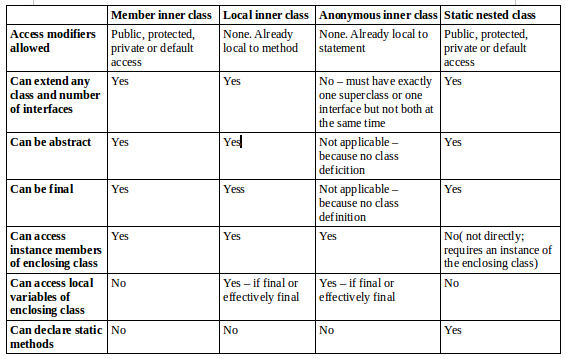
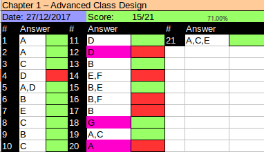

# Reviewing OCA Concepts
- The OCP questions are a lot tougher than the OCA questions. Really need to know the fundamentals covered in the next 5 sections. After that the book moves onto the new topics such as instanceOf, implement equals/hashCode/toString, Enums and nested classes.

## Access Modifiers
These are ```private```, no modifier(the default or aka package-private), ```protected``` and ```public```:
- **private**: Only accessible within the class.
- **no-modifier**: Is the **default** and used if any other access modifier keyword is missing. Only code in the same package can access code with default access.
- **protected**: It allows subclasses and code in the same package to access members. If in a different package, the member is only accessible through inheritance otherwise it errors.
- **public**: Any code can access public members.


:yin_yang: Remember that there is a ```default``` keyword introduced in Java 8 for interfaces. The keyword is not an access modifier.


## Overloading and Overriding 
- *Overloading* and *overriding* happen only when the method name is the same (watch out for case sensitiveness in that case it is just a different method entirely). 
- *Overriding* occurs only when method signature is the same. *Method signature* is the method name and the parameter list. 
- *Overloading* occurs when the method parameters vary by type and/or number.
- When mutiple overloaded methods are present, Java looks for the closest match first. It tries to find the following:

  - Exact match by type.
  - Matching a superclass type.
  - Converting to a large primitive type.
  - Converting to an autoboxed type.
  - Varargs
- For overriding, the overridden method has a few rules
  - The access modifiers must be the same or more accessible.
  - The return type must be the same or a more restricted type AKA *covariant return type*.
  - If any check exceptions are thrown, only the same exception or subclasses of those are allowed to be thrown.
  - The methods must not be static. If they are the method is hidden and not overriden

## Abstract Classes
For example, check the snippet below. What are three ways that you can fill in the blank to make this code compile? Try to think of ways that use the clean() method rather than just putting a comment there:

```java
abstract class Cat{
  -------------------
}

class Lios extends Cat{
  void clean();
}
```
One of them is tricky and that is that you can leave it blank. An abstract class is not required to have any methods in it. A second answer is ``` abstract void clean(); ``` this one is the actual abstract method. It has the abstract keyword and a semicolon instead of a method body. A third answer is the default implementation ``` void clean(){} ``` notice that this time there is no abstract keyword in the method and the body is implemented even though it is empty. Furthermore, there are plenty of other ways. For example, ``` void clean() throw RuntimeException {} ```

Things to remember about abstract classes are:
- An *abstract class* may contain any number of methods including zero. 
- The methods can be abstract or concrete.
- Abstract methods may not appear in a class that is not abstract.
- The first concrete subclass of an abstract class is required to implement all abstract methods that are not implemented by a superclass.


## Static and Final
- ```final``` prevents a variable from changing or a method from beign overriden.
- ```static``` makes a variable shared at the class level and uses the class name to refer to a method.
- ```static``` and ```final``` are allowed to be added on the class level too.
- You will see ```static``` classes in the section about nested classes.
- Using ```final``` on a class means that it cannot be subclassed.
- As with methods, a class cannot be both ```abstract``` and ```final```.
- In the Java core classes, String is ```final``` which means that it cannot be sub-typed 

## Imports

Oracle no longer list imports and packages in the objectives for OCP 8 exam. They include visibility modifiers, which means you still need to understand packages and imports.
Remeber that you can add static in the imports section if referencing a static method such as sort() from the Collections framework library.

For example, in the following code which imports do we need to include in order to compile the code below?
```java
public class ListHelper{
  public List <String> copyAndSortList(List <String> original){
    List<String> list = new ArrayList<String>(original);
    sort(list);
    return list;
  }
}
```
By looking at the code, we don't need to worry about the String class because that is included by default as part of the ```java.lang.*;``` import. Although we need to import libraries for List, ArrayList and sort() method. There are several ways to achieve this. For adding the sort() method either of these two will do:

```import static java.utils.Collections.sort; ```

```import static java.utils.Collections.*; ```

For the other part, that is List and ArrayList classes. There are two ways, either using the wildcard or importing each class individually.

```import java.util.*;```

The other way is to list them individually:

```import java.util.List;```

```import java.util.ArrayList;```

# Using instanceof
- The ```instanceof``` operator is used to test whether the object is an instance of the specified type (class or subclass or interface). The instanceof is also known as type comparison operator because it compares the instance with type. It returns either true or false.

Let's see a few examples:
```java
class HeavyAnimal { }
class Hippo extends HeaveAnimal{ }
class Elephant extends HeavyAnimal { }

HeavyAnimal hippo = new Hippo();
booelan b1 = hippo instanceof Hippo;          //true
boolean b2 = hippo instanceof HeavyAnimal;    //true
boolean b3 = hippo instanceof Elephant;       //false
```
- All Java classes inherit from Object, which means that ``` x instanceof Object``` is usually ```true```, except for one case where is ```false```. It the literal ```null``` or a variable reference pointing to ```null``` is used to check instanceof, the result is ```false``` because ```null``` is not an Object. See below:

```java
HeavyAnimal hippo = new Hippo();
boolean b4 = hippo intanceof Object;        //true
Hippo nullHippo = null;
boolean b5 = nullHippo instanceof Object;   //false 
```

- Sometimes the comparison might not even compile if the compiler knows that there is no possible way for a Hippo variable reference to be an Elephant for example, since Hippo doesn't extend Elephant directly or indirectly. See below:

```java 
Hippo anotherHippo = new Hippo();
boolean b5 = anotherHippo instanceof Elephant;    //DOES NOT COMPILE
boolean b6 = anotherHippo instanceof Cat;         //DOES NOT COMPILE
```

- The compilation check above only applies when instanceof is called on a class. When checking whether an object is an instanceof an interface, Java waits until runtime to do the check. Subclass could implement that interface and the compiler wouldn't know it. There is no way for Hippo to be subclass of Elephant in our hierarchy by now.

- When the class type is an interface, the compiler allows the statement because there could later be a class that implements it. 

```java
public interface Mother{}
class Hippo extends HeavyAnimal
```

This code below compiles even though hippo is not a sub type or implement the Mother interface

```java 
HeavyAnimal hippo = new Hippo();
boolean b6 = hippo instanceof Mother;
```

# Understanding Virtual Method Invocation
Consider the following example:
```java 
class A{
  public String getName(){
    return "A";
  } 
}

class B extends A{
  public String getName(){
    return "B"
  }
}

class Driver{
  public static void main(String[] args){
    A foo = new B();
    System.out.println(foo.getName());
  }
}
```
We get the result ``` B ``` 

- If Java didn't have virtual method invocation, it would determine at compile time that the getName() to be called is the one that belongs to the A class. Since it doesn't, but determines this at runtime depending on the actual class that foo points to, we get the result above, ```B```.

- Notice that instance variables don't work the same way. In this example, the Animal class refers to name. It uses the one in the super class and not the subclass. That is because these type of Animals 

```java
class Animal{
  String name = "unknown";
  public void printName(){
    System.out.println(name);
  }
}

class Lion extends Animal{
  String name = "Leo";
}

class Driver{
  public static void main(String[] args){
    Animal foo = new Lion();
    foo.printName();
  }
}
```
And the output is ```unknown```. The name declared in Lion would only be used if name was referred to from Lion (or a subclass of Lion). 

- One more example to make sure that the exam is not going to trick you. What does the following print?
```java
abstract class Animal{
  public void careFor(){
    play();
  }
  
  public void play(){
    System.out.println("pet animal");
  }
}

class Lion extends Animal{
  public void play(){
    System.out.println("toss in meat");
  }
}

public class PlayWithAnimal{
  public static void main(String[] args){
    Animal animal = new Lion();
    animal.careFor();
  }
}
```

The correct answer is ```toss in meat```. 

# Annotating Overridden Methods
- When you see code that begins with @ symbol, it is an annotation. 
- Annotation is extra information about the program, and it is a type of *metadata*.
- When you see ```@Override``` in the exam, you must check carefully that the method is doing one of three things:
  - Implementing a method for an interface
  - Overriding a superclass method of a class
  - Overriding a method declared in Object, such as ```hashCode, equals``` or ```toString```

# Coding equals, hashCode, and toString
- All classes in java inherit from ```java.lang.Object```
- Three of these methods are common for subclasses to override with a custom implemetation

## toString 
- Java automatically calls the toString() method when you try to print out the object.

Following lines show how to do it

```java
public class Hippo{
  private String name;
  private double weight;

  public Hippo(String name, double weight){
    this.name = name;
    this.weight = weight;
  }
  
  @Override
  public String toString(){
    return "Name: " + name + ", Weight: " + weight; 
  }
}
```
## equals
- Java uses == to compare primitives and for checking if two variables refer to the same object. 
- Checking if two objects are equivalent uses the ```equals()``` method.
- String has an ```equals()``` method and it checks the values are the same.
- StringBuilder uses the implementation of ```equals()``` provided by ```Object```, which check if the objects are the same location ==


The exam expects you to recognize the correct and incorrect usage of the equals() method. The contract for equals() method is:
- It is *reflexive*: For any non-null reference value x, x.equals(x) should return ```true```.
- It is *symmetric*: For any non-null reference values x and y, x.equals(y) should return ```true``` iff y.equals(x) returns ```true```.
- It is *transitive*: For any non-null reference values x, y and z, if x.equals(y) returns ```true``` and y.equals(z) returns ```true```, then x.equals(z) should return ```true```.
- It is *consistent*:  multiple invocations of x.equals(y) consistenly returns ```true``` or consistenly returns ```false```.
- For any non-null reference value x, x.equals(null) should return ```false```.

For practice, can you see what's wrong with the following equals() method?

```java 
public boolean equals(Lion obj){
  if(obj == null) return false;
  return this.idNumber == obj.idNumber;
}
```
Actually, there is nothing wrong, but it does not override but overload the equals method because the method signature of the Object's equals method takes an Object as parameter.

## hashCode
- Whenever you override equals() method you also need to override the hashCode() method.
- A *hash code* is a number that puts instances of a class into a finite number of categories.
- The hash code is just a number.
- On the exam, you can use a primitive number as is or divide to get a smaller int.
- Not all the instance variable need to be used in the hashCode() method. In fact, it is common not to include boolean and chars.
- The hashCode contract boils down to the following:
  - Within the same program, the result of hashCode must not change.For example, including a weight of our hippo example is not correct because the weight changes.
  - If equals() return true for two objects, calling hashCode() on each of those objects must return the same result.
  - If equals() returns false when called with two objects, calling hashCode() on each of those objects does not have to return a different result. This means that hash code does not need to be unique when called on unequal objects.
- The signature of the method is the following ```public int hashCode()```
- Deck of cards example is very useful to understand the concept of hash codes.
### Deck of cards example
Imagine I gave you a deck of cards and told you that I am going to ask you for a specific set of cards and I want to get the right card as quick as possible. You have as long as you want to prepare, you might make 13 piles of cards: All of the aces in one pile, twos in another pile and so forth. That way when I ask for a particular card, 5 of hearts, you go to the fives pile and pull out the right card out of the four rather than going through the 52 cards.

# Working With Enums
- An *enumeration* is like a fixed set of constants.
- It is better than a bunch of constants because it provides type-safe checking.
- Any finite set of items would be a valid example, ie: Days of the week, months ...

```java
public enum Season{
  WINTER, SPRING, SUMMER, FALL
}
```
- Use uppercase to list the elements that are part of the enum by convention.
- It contains mainly static members.

```java
Season s = Season.SUMMER;
System.out.println(Season.SUMMER);        //SUMMEWR
System.out.println(s == Season.SUMMER);   //true
```
- When toString() method is called it displayes the value of the enum.
- Enums are comparable using == because they are like ``` static final``` constants.
- It provides a method to get an array of all of the values.
```java
for(Season season : Season.values()){
  System.out.println(season.name + " " + season.ordinal());
}
```
- You cannot compare an int and enum value directly. Enum is a type and not an int

```if(Season.SUMMER == 2){}```    //DOES NOT COMPILE
- You can create an enum from a String. see below
```java
Season s1 = Season.valueOf("SUMMER");     //SUMMER
Season s2 = Season.valueOf("summer");     //Throws IllegalArgumentException
```
- You cannot extend and Enum
``` public enum ExtededSeason extends Season{ }```  // DOES NOT COMPILE

## Using Enums in Switch Statements
- Enums may be used in switch statements. See the case statements below
```java
Season summer = Season.SUMMER;
switch(summer){
  case WINTER:
    System.out.println("Get out the sled");
    break;
    
  case SUMMER:
    System.out.println("Time for the pool!");
    break;
    
  default;
    System.out.println("Is it summer yet!");
}
```
The code above prints "Time for the pool!" since it matches SUMMER. Notice that we just typed the value of the enum rather than writing Season.WINTER and that it because Java knows that the only possible values are enums. Java treats the enum type as implied in fact if you were to type Season.WINTER it would not compile.

- You cannot compare an int with an enum. Keep in mind that the enum type is not an int. See below 
```java
switch(summer){
  case 0:   // DOES NOT COMPILE
    System.out.println("Get ot the sled!");
    break;
}
```

- Pay especial attention when working with enums that they are used only as enums
## Adding Constructors, Fields and Methods
- *Enums* can have constructors, fields and methods. It is common to give state to each enum by using a constructor. To do that we also need to have a member variable. See below the code snippet:
```java
public enum Season{
  WINTER("Low"), SPRING("Medium"), SUMMER("High"), FALL("Medium");
  private String visitors;
  private Season(String visitors){
    this.visitors = visitors;
  }
  
  public void printVisitors(){
    System.out.println(visitors);
  }

}
```
- In the code above notice that line two finishes with a semicolon. This is required if there is anything in the *enum* besides the values. On the other hand, the semicolon is optional only if the only thing in the *enum* is that list of values.

- The rest of the lines in the snippet are regular Java code. There is a instance variable, a constructor, and a method. The constructor is **private** because it can only be called from within the *enum*. The code will not compile with a public constructor. 

- Calling the method is like the following: Season.SUMMER.printVisitors();

- In the method calling above notice that we don't seem to call the constructor. We just say that we want the *enum* value. The first time we call the method Java constructs all of the *enum* values. Given that explanation, you can see why the code below calls constructor only once:

```java 
  public enum OnlyOnce{
    ONCE(true);
    private OnlyOnce(boolean value){
      System.out.println("constructing");
    }
    
    public static void main(String[] args){
      OnlyOnce firstCall = OnlyOnce.ONCE      //prints constructing
      OnlyOnce secondCall = OnlyOnce.ONCE     //doesn't print anything
    }
  }
```

- This technique of a constructor and a state apart from beign a pain for the exam, allows you to combine logic with the benefit of a list of values. Sometimes, you want to do more. For example, our zoo example has different seasonal hours. It is cold and gets dark early in the winter. We could keep track of the opening hours through instance variables, or we could let each enum value manage hours itself.

```java
  public enum Season2{
    WINTER{
      public void printHours{ System.out.println("9am-3pm");}
      
    },SPRING{
      public void printHours{ System.out.println("9am-5pm");}
    
    },SUMMER{
      public void printHours(){ System.out.println("9am-7pm"); }
    
    },FALL{ 
      public void printHours(){ System.out.println("9am-5pm");}
    };
    
    public abstract void printHours();
    
  }
```

- In the code above it seems that we have created an abstract class abd a bunch of tiny subclasses. The enum class itself has an abstract method and this means that each of the enum values are required to implement this method. If we forget one, we get a compiler error. If we don't want each and every compiler to have a method, we can create a default implementation and override it only for the especial cases:

```java
public enum Season3{
  WINTER{
    public void printHours(){ System.out.println("short hours"); }
  
  }, SUMMER{
    public void printHours(){ System.out.println("long hours"); }
  
  },SPRING, FALL;
  
  public void printHours(){ System.out.println("default hours"); }

}
```

- In the code above, we only coded the especial cases and let the others use the enum provided implementation. Notice how we still have the semicolon after FALL. This is needed when we have other than just the values and in this case we have the default method implementation.

# Creating Nested Classes
A *nested class* is a class that is defined within another class. A nested class that is not static is called *inner class*. There are 4 types of nested classes:
- A *member inner class* is a class defined at the same level as the instance variables. It is not static and often referred as just inner class.
- A *local inner class* is defined within a method.
- An *anonymous inner class* is a special type of a local inner class that does not have a name.
- A *static nested class* is a static class that is defined at the same level as static variables
## Member Inner Classes
This classe are defined at the same level as the instance variables, methods and constructors. These are its properties:
- Can be declared public, private or protected or use default access (no-modifier)
- Can extend any class or implements any interface.
- Can be abstract of final.
- Cannot declare static fields or methods.
- Can access members of the outer class inlcuding private members.

The last property is pretty cool, see an example to illustrate:
```java 
public class Outer{
  private String greeting = "Hi";
  
  protected class Inner{
    public int repeat = 3;
    pulic void go(){
      for(int i = 0; i < repeat; i++){
        System.out.println(greeting);
      }
    }
  }
  
  public void callInner(){
    Inner inner = new Inner();
    inner.go();
  }
  
  public static void main(String[] args){
    Outer outer = new Outer();
    outer.callInner()
  }
  
}
```
The inner class looks just another class declarion expect that it is located inside another class. It can also use the instance variables declared in the outer class even though they are private. Since the class is not static it has to be used with an instance of a class as per ```Inner inner = new Inner(); inner.go()``` this works because *callInner();* is an instance method of Outer. Both Inner and callInner() are members of Outer.

There is another way to instantiate Inner that looks odd. The syntax isn't used very often but that's the way it is:
```
public static void main(String[] args){
  Outer outer = new Outer();
  Inner inner = outer.new Inner();   //create the inner class
  inner.go();
}
```
In the code above we need an instace of Outer in order to create Inner. We can't just call new Inner() because Java does not know with which instance of Outer it is associated and Java solves this by caling new as if it were a method on the outer variable.

Another thing to remember is that inner classes can have the same variable names as the outer classes. Since you can nest multiple inner classes and create multiple variables of the same name within the class, although it is not recommended to do so, you must know it for the exam. In addition, there is a special way of calling ```this``` to say which class you want to access. See the code below:

```java
public class A{
  private int x = 10;
  
  class B{
    private int x = 20;
    
    class C{
      private int x = 30;
      
      public void allTheX(){
        System.out.println(x);          //30
        System.out.println(this.x);     //30
        System.out.println(B.this.x);   //20
        System.out.println(A.this.x);   //10
      }
    }
  }is 
  
  public static void main(String[] args){
    A a = new A();
    A.B b = a.new B();
    A.B.C c = b.new C();
    c.allTheX();
  }
}

```
This code is a fuck head. Not recommed to do it this way but you must know how it works for the exam. Note C class is too deep for Java to know where to look. On the other hand the type for class B is A.B, we could have used only B but the code in this example is A.B. Java knows where to look either way because B is available at the member level of A but it is not the case for C. ```this``` keyword refers to the instance variable in the current class. In this case is class C because the method is within class C. The other two references of ```this``` are a special case to the instance of classes B and A respectively.

### Private interface
The following code looks weird but is legal for inner classes:
```java
  public class CaseOfThePrivateInterface{
    private interface Secret{
      public void Shh();
    }
    
    class Anything implements Secret{
      public void Shh(){
        System.out.println("Shhh");
      }
    }
  }
```
In the code above, the rule that all interface methods must be public still applies. The interface itself does not need to be public though. Just like any inner class the inner interface can be private. This means that the interface can only be referred from within the current outer class.

## Local Inner Classes
A local inner class is a nested classes defined inside a method. Like the local variables, the local inner class declaration does not exist until the method is invoked, and it goes out of scope when the method returns, **which means that you can only create instances from within the method** Local inner classes has the following properties:
- They do not have access modifier (public, protected or private).
- They cannot be declared ```static``` and cannot declare ```static``` fields or methods.
- They have access to all fields and methods of the enclosing class.
- They do not have access to local variables of a method unless those variables are final or effectively final. 

See example below:

```java
public class Outer{
  
  private int length = 5;
  
  public void calculate(){
    final int width 20;
  
    class Inner{
      public void multiply(){
        System.out.println(length * width);
      }
    }   
    Inner inner = new Inner();
    inner.multiply();
  }
  
  public static void main(String[] args){
    Outer outer = new Outer();
    outer.calculate();
  }
}

```

Notice in the code above, the inner class is accessing the final variable of the method (width variable) as long as the variable once assign does not change (effective final concept introduced in Java 8) it can be accessed from within the local inner class.

For example, in the code below which variables do you think are effectively final in this code?

```java
public void isItFinal(){
  int one = 20;
  int two = one;
  two++;
  int three;
  
  if(one == 4) three = 3;
  else three = 4;
 
  int four = 4;
  class Inner{ }
  
  four = 5;
}

```

So you probably guessed it. *one* is effectively final because its value does not change once assigned. *two* is not effectively final because its value increments after it has been declared. *three* hovewer, it is effectively final because there is an if condition which is going to be assign the value of either 3 or 4 but not both. And once assigned it is not reassigned any more. *four* however, it is not final because eventhough the assignment happens after the inner class, it is not allowed.  

## Anonymous Inner Classes
An anonymous inner class is a local inner class that does not have a name. It is declared and instantiated all in one statement using the new keyword. They are useful when you have a short implementation that will not be used anywhere else. See example:

```java
public class AnonymousInner{
  abstratc class SaleTodayOnly{
    abstract int dollarsOff();
  }
  
  public int admission(int basePrice){
    SaleTodayOnly sale = new SaleTodayOnly(){
      int dollarsOff(){ return 3;}
    };
    return basePrice - sale.dolarsOff();
  }
}
```

In admission method the code says to instantiate a new  SaleTodayOnly object. But SaleTodayOnly is abstract. This is OK because we provide the class body right there anonymously. Pay attention to the semicolon inside admission() method. We are declaring a local variable on these lines (local variables in Java are required to end with semicolon, just like any other Java statement)

Now, we convert the example above to implement an ```interface``` instead of extending an ```abstract``` class:

```java
public class AnonymousInner{
  interface SaleTodayOnly{
    int dollarsOff();
  }

  public int admission(int basePrice){
    SaleTodayOnly sale = new SaleTodayOnly(){
      public int dollarsOff(){ return 3;}
    };
    return basePrice - sale.dollarsOff();
  }
}

```
As you can see it doesn't change much other than declaring an interface instead of an abstract class. The anonymous inner class is the same, regarless you are declaring an interface or an abstract class. 

But, what happens if we want to extend an abstract class and implement an interface? You cannot do that with an anonymous inner class, unless the class to extend is ```java.lang.Object``` What you can do is to write a local inner class and give it a name if you have this problem.

There is one more thing that you can do with anonymous inner classes. Define them right where they are needed, even if there is an argument to another method. See below:
```java
  public class AnonymousInner{
    interface SaleTodayOnly{
      int dollarsOff();
    }
    
    public int pay(){
      return admission(5, new SaleTodayOnly(){
        public int dollarOff(){
          return 3;
        }
      });
    }
    
    public int admission(int basePrice, SaleTodayOnly sale){
      return basePrice - sale.dollarsOff();
    }
  }
```
As you may see we don't store the anonymous inner class in a local variable, we pass it directly to the methood that needs it. This is a concise way to create a class that you will use only once. 

:yin_yang: Functional programming uses a shorter way of coding them, more in Chapter 4

## Static Nested Classes
This final type is not an inner class. A statoc nested class is a static class defined at the memeber level. It can instantiated without an object of the enclosing class, so it cannot access the instance variables without an explicit object of the enclosing class. For example, new OuterClass().var allows access to the instance variable var.

In other words, is like a regular class except for the following:
- The nesting creates a namespace because the enclosing class name must be used to refer to it.
- It can be made private or use one of the other access modifiers to encapsulate it.
- The enclosing class can refer to the fields and methods of the static nested class.

```java
public class Enclosing{
  static class Nested{
    private int price = 6;
  }
  
  public static void main(String[] args){
    Nested nested = new Nested();
    System.out.println(nested.price);
  }
}
```

In the code above, since the class is static, you do not need an instance of Enclosing in order to use it. You are allowed to access private instance variables as shown in the main mathod.

Another intersting thing is importing static nested classes. You can import using a regular import or since it is static you can use a static import. See example code:

```java
  package mamal;
  public class Panda{
    public static class EyeBag{}
  }
  
  package zoo;
  import mamal.Panda.EyeBag;          //regular import
  or
  import static mamal.Panda.EyeBag;   //static import
  
  public class LondonZoo{
    EyeBag eyeBag;
  }
```
To review the 4 types of nested classes, make sure you know the info in the table below



# Review Questions
Overall the questions where not hard to go through. Completed them in about 30 minutes. Some of the questions I failed was because the sentence specified "Chose all that apply..." but there was just a single correct answer.  



## Points to remember:
- Virtual method invokation is determined at runtime by the actual object type that is pointing to in memory not the reference type. On the other hand however, an instance variable is determined by the reference type.
- It is important to know about abstract mehods within enums. Abstract enum methods require each enum type to implement the method, otherwise it will not compile.
