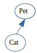
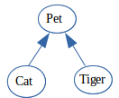
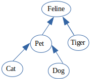
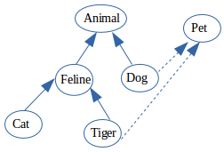
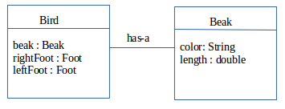
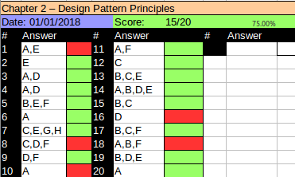

# Desining an Interface
There are numerous rules associated with interfaces so you may want to refer to OCA book for a more detailed explanation about interfaces. An interface defines a list of public abstract methods that any class inplementing the interface must provide. An interface may also include constant ```public static final``` variables, default methods and ```static``` methods.

An interface may inherit another interface and in doing so it inherits all of the abstract methods. See example:
```java
public interface Walk{
  boolean isQuadruped();
  abstract double getMaxSpeed();
}

public interface Run extends Walk{
  public abstract boolean canHuntWhileRunning();
  abstract double getMaxSpeed();
}

public class Lion implements Run{
  public boolean isQuadrupped(){
    return true;
  }
  
  public boolean canHuntWhileRunning(){
    return true;
  }
  
  public double getMaxSpeed(){
    return 100;
  }
}
```

In the code above, the compiler automatically adds ```public``` and ```abstract``` keywords to all ```non-static``` and ```non-default``` methods. By contrast, the contrete class implementing the interface must provide the proper modifiers otherwise it would not compile.

Remember that an interface cannot extend a class, nor can a class extend an interface.

```java 
public interface Sleep extends Lion{}       // DOES NOT COMPILE

public class Tiger extends Walk{}           // DOES NOT COMPILE

```
In the code above, the interface Sleep cannot extend Lion, since Lion is a class. Likewise, the class Tiger cannot extend the interface Walk.

Some rules about interfaces:
- Interfaces cannot extend a class nor classes can extend an interface.
- Interfaces may not be marked final or instantiated directly.
- There are additional rules about default methods, such as Java failing to compile if a class or interface inherits two default methods with the same signature and doesn't provide its own implementation.
- Refer back to the OCA study material for full explanation of rules regarding interfaces and method overriding.

# Introducing Functional Programming
A ```functional interface``` is an interface that contains a single abstract method. Funtional interfaces are the basis for lambda expressions in funtional programming. A ```lambda expression``` is block of code that gets passed around, like an anonymous method. In this chapter we will revise the basics from the OCA exam. In Chapter 3 we will apply lambda expressions to ```Collections``` classes. In Chapter 4 we will include numerous funtional inetrface classes and show you streams. As you read through the chapters you will see support for numerous APIs in Java 8.

## Defining a Functional Interface

Let's take a look at an example of a functional interface and a class that implements it:

```java
  @FunctionalInterface
  public interface Sprint{
    public void sprint(Animla animal);
  }
  
  public class Tiger implements Sprint{
    public void sprint(Animal animal){
      System.out.println("Animal is sprinting fast! " + animal.toString());
    }
  }
```
In this example, the String class is a functional interface, because it contains exactly one abstract method, and the Tiger class is a valid class that implements te interface.

:yin_yang: Applying the @FunctionalInterface annotation while it is good pratice to do so for clarity, it is not required with functional programming. Java compiler implicitly assumes that any interface that contains only one abstract method is a functional interface. Hovewer, if a class is marked with the annotation and contains more than one abstract method, or no abstract methods at all, it is not going to compile. It is a good approach to mark the interface with the annotation because it tells other developers to treat it as a functional interface

For example see the code below:

```java
  @FunctionalInterface
  public interface Sprint{
    public void sprint(Animla animal);
  }
  
  public interface Run extends Sprint{}
  
  public interface SprintFaster extends Sprint{
    public void sprint(Animal animal);
  }
  
  public interface Skip extends Sprint{
    public default int getHopCount(Kangaroo kanagaroo){ return 10;}
    public static void skip(int speed);
  }

```
Suprisingly enough, all of the interfaces above are functional interfaces. First one, Run, defines no new methods but since extends Sprint it is also a funtional intreface. The second interface, SprintFaster, extends Sprint and defines an abstract  method, but this is an override of the parent therefore the resulting interface only has a single abstract method. The third interface, Skip, extends Sprint and defines a static method and a default method, each with implementation. Since neither of these are abstract, the resulting interface has only one abstract method and is a funtional interface. 

Now look at some invalid functional interfaces:

```java
public interface Walk{}

public interface Dance extends Sprint{
  public void dance(Animal animal);
}

public interface Crawl{
  public void crawl();
  public int getCount();
}

```

Although all of this will compile none of these is a funtional interface. In this example, applying the @funtionalInterface annotation to any of these interfaces will result in a compiler error, same as trying to make use of it in a lambda expression.

## Implementing Functional Interfaces with Lambdas
In this section we are going to see how to implement lambda expressions. A lambda expression is a block of code that gets passed around, like an anonymous method. Let's start with a simple CheckTrait functional interface, which has a single method test(). Definion of the class and the functional interface as follows:

```java
public class Animal{
  private String species;
  private boolean canHop;
  private boolean canSwim;
  
  public Animal(String speciesName, boolean hopper, boolean swimmer){
    species = speciesName;
    canHop = hopper;
    canSwim = swimmer;
  }
  
  public boolean canHop(){
    return canHop;
  }
  
  public boolean canSwim(){
    return canSwim;
  }
  
  public String toString(){
    return species;
  }
}

public interface CheckTrait{
  public boolean test(Animal animal);
}
```
Now that we have a structure let's do something with it. The code below uses a lambda expression to determine if some sample animal match the specific criteria:

```java
public class FindMatchingAnimals{
  private static void print(Animal animal, CheckTrait trait){
    if(trait.test(animal)){
      System.out.println(animal)
    }
  }
  
  public static void main(String[] args){
    print(new Animal("fish", false, true), a -> a.canHop());
    print(new Animal("kangaroo", true, false), a -> a.canHop());
  }
}
```
The lambda expression ``` a -> a.canHop() ``` means that Java should call a method with an Animal parameter that returns a boolean value that's the result a.canHop(). We know all this because we wrote the code. But how does Java know? Java relies on context when figuring out what lambda expressions mean. We are passing this lambda as the second parameter of the print() method. That method expects a CheckTrait as second parameter. Since we are passing a lambda instead, Java treats CheckTrait as a funtional interface and tries to map it the the single abstract method.

```boolean test(Animal animal);```

Since this interface's method takes an Animal, it means the lambda parameter has to be an Animal. And since that interface's method returns a boolean, we know that the lambda returns a boolean.

:yin_yang: *Deferred execution* means that code is specified now but runs later. In this case, later is when print() method calls it. Even though the execution is deferred, the compiler will still validate that the code synytax is properly formed

## Understanding Lambda Syntax
The syntax of lambda expression is tricky because many ooptions are optional. For example the following two lines are equivalent:
```a -> a.canHop()``` and ```(Animal a) -> {return a.canHop();}```.
Let's see. Left side of the arrow operator -> indicates the input parameter for the lambda expression. It can be comsumed by the functional interface whose abstract method has the same number of parameters and compatible data types. The right side is referred to as body of the lambda expression. It can be consumed by the functional interface whose abstract method returns a compatible data type.

The differences between these two is that the second example uses parentheses (), while the first one does not. The () parentheses can be omitted in a lambda expression if there is exactly one input parameter and the type is not explicitly stated in the expression. this means that expressions that have zero or more than one input parameter will still require parentheses. For example, the following are all valid lambda expressions, assuming that are valid functional interfaces:

```java
() -> new Duck()

d -> {return d.quack();}

(Duck d) -> d.quack()

(Animal a, Duck d) -> d.quack()

```

## Spotting Invalid Lambdas
Can you figure out why each of the following lambda expressions is invalid and will not compile when used as an argument to a method?

```java
Duck d -> d.quack()                     // DOES NOT COMPILE

a,d -> d.quack()                        // DOES NOT COMPILE 

Animal a, Duck d -> d.quack()           // DOES NOT COMPILE

```

They all require parentheses ()! Parentheses can only be omitted if there is exactly one parameter and the data type is not specified. Next the {} allows you to write multiple lines of code in the body of the lambda. What's tricky here is that when you add {} you must terminate each statement in the body with a semicolon ; In the examples earlier we were able to omitt the braces {}, the semicolon ; and return keyword becaus there was a single-line lambda body.
When using {} you must also include the return keyword if that functional interface returns a value. Alternatively, the return keyword is optional when the return type of the method is void. See some examples:

```java
() -> true                                      // 0 parameters
  
a -> {return a.startsWith("test");}             // 1 parameter

(String a) -> a.startsWith()                    // 1 parameter

(int x) -> {}                                   // 1 parameter

(int y) -> {return;}                            // 1 parameter

```
The first example takes no arguments and always returns true. The second and third examples both takes single String value, using different syntax to accomplish the same thing. 

Now let's look at some lambda that take more than one argument:

```java
(a,b) -> a.startsWith("test")                             // 2 parameters

(String a, String b) -> a.startsWith("test")              // 2 parameters

```
These examples both take two params and ignore one of them, but there is no rule that says it must use all of the input parameters.

More examples:

```java
a,b -> a.startsWith("test")                 //DOES NOT COMPILE

c -> return 10;                             //DOES NOT COMPILE

a -> {return a.startsWith("test") }         //DOES NOT COMPILE

```
 
 The first lambda needs parentheses () around the paremeter list. Remember that the parentheses are optional only when there is one parameter and it doesn't have a type declared. The second uses return without using braces {}. The last line is missing the semicolon after the return statement. The following rewritten lambda expressions are each valid:

```java
(a,b) -> a.startsWith("test")                 

c -> {return 10;}                            

a -> {return a.startsWith("test"); }        

```

As mentioned, the data types for the input parameters of a lambda expression are optional. When one parameter has a data type listed, though, all parameters must provide a data type. The following lamda expressions are each invalid for this reason:

```java
(int y, z) -> { int x = 1; return y + 10; }        //DOES NOT COMPILE

(String s, z) -> { return s.length() + z; }        //DOES NOT COMPILE

(a, Animal b, c) -> a.getName()                    //DOES NOT COMPILE

```

If we add or remove all the data types then this lambda expressions do compile. 

There is one more issue you might see with lambdas. We've been defining an argument list in our lambda expressions. Since Java doesn't allow us to re-declare a local variable, the following is an issue:

```java
(a,b) -> {int a = 0; return 5;}                     //DOES NOT COMPILE
```
We tries to redeclare a, which is not allowed. By contrast the following line is permitted because it uses a different vaiable name:

```java
(a,b) -> {int c = 0; return 5;}

```

## Applying the Predicate Interface
In the earlier example we created a simple functional interface to test Animal trait:

```java
public interface CheckTrait{
  public boolean test(Animal animal);
}
```

You can imagine that we'd have to create lots of functional interfaces like this to use lambdas. Luckily, Java sees that as common problem and provides such an interface for us. It's in the package ```java.util.function``` and the gist of it is as follows:

```java
public interface Predicate<T>{
  public boolean test(T t);
}
```

it is very similar to CheckTrait interface apart from the the type T instead of Animal. This is a generic type. The result of using ```Predicate``` is that we longer need our own functional interface. The following is rewrite of our program:

```java
import java.util.function.Predicate;

public class FindMatchingAnimals{
  private static void print(Animal animal, Predicate<Animal> trait){
    if(trait.test(animal)){
      System.out.println(animal)
    }
  }
  
  public static void main(String[] args){
    print(new Animal("fish", false, true), a -> a.canHop());
    print(new Animal("kangaroo", true, false), a -> a.canHop());
  }
}
```

# Implementing Polymorphism
*Polymorphism* is the ability of a single interface to support multiple underlying forms. In Java this allows multiple types  pof objects to be passed to a single method or class. It also allows one object to take on many different forms. **A Java object may be accessed using a reference with the same type as the object, a reference that is a superclass of the object or a reference that defines an interface that the object implements, either directly or through a superclass. Furthermore, a cast is not required if the object is beign reassigned to a supertype or interface of the object.**

If you use a variable to refer to an object, then only the mehods or variables that are part of the variable's reference type can be called without explicit cast.

## Distinguishing between an Object and a Reference
In Java, all objects are accessed by reference, so as a developer ypou never have direct access to the memory of the object itself. Conceptually, you should think of an object as the entity that exists in memory.

All objects can be reassigned to ```java.lang.Object```

```java
Lemur lemur = new Lemur();

Object lemurAsObject = lemur;

```
Eventhough the Lemur object has been assigned a reference with a different type, the object itself has not changed and still exists a Lemur object in memory. What has changed is our ability to access methods within the Lemur class with the lemurAsObject reference. Unless we do an explicit cast back to Lemur (you see more about this in the next section), we no longer have access to the Lemur properties of the object.

We can summarize this principle with the following two rules:
1- The type of the object determines which properties exist within the object in memory
2- The type of the reference to the object determines which methods and variables are accessible to the Java program.

## Casting Object References
As mentioned earlier, once changed the reference type we lost access to more specific methods defined in the subclass that still exists within the object. But we can reclaim those references by casting the object back to the specific subclass it came from:
```java
Primate primate = lemur;

Lemur lemur2 = primate;       // DOES NOT COMPILE

Lemur lemur3 = (Lemur) primate;
System.out.println(lemur3.age);
```

In the example of the book, primate is a class on its own with a single method hasHair(). There is also an interface HasTail with the abstract method isTailStripped() and then the Lemur class that extends the Primate class and implements the HasTail interface. In addition, the lemur class also has a int member variable age = 10;

So, in this example above when we try to convert the primate reference back to lemur reference, lemur2, without explicit cast. The result will not compile. In the second example, though, we explicitly cast the object toa subclass of the object Primate, and we gain access to all the methods availoable to the Lemur class.

Here are some basic rules to keep in mind when casting variables:
1 - Casting an object from a subclass to a superclass doesn't require explicit cast.
2 - Casting an object from a superclass to a subclass requires an explicit cast.
3 - The compiler will not allow cast to unrelated types.
4 - Even when the code compiles without issue, an exception may be thrown at runtime if the object beign cast is not actually an instance of that class.

One example for point 4 will be. Casting is not without limitations. Even though two classes share related hierarchy, that doesn't mean an instance of one can automatically be cast to another. The example is:

```java
public class Rodent{}

public class Capybara extends Rodent{
  public static void main(String[] args){
    Rodent rodent = new Rodent();
    Capybara capybara = (Capybara) rodent;   // Throws ClassCastException at Runtime
  }
}
```
The code above creates an instance of Rodent and then tries to cast it to a subclass of Rodent, Capybara. Although this code compiles without issue, it will throw a ClassCastException at runtime since the object beign referenced is not an instance Capybara class. You can use ```instanceof``` operator to avoid throwing ClassCastException at runtime:

```java
if(rodent instanceof Capybara){
  Capybara capybara = (Capybara) rodent;
}
```
# Understanding Design Principles
A *design principle* is an established idea or best practice that facilitates the software design process.

## Encapsulating Data
One fundamental principle of object-oriented design is the concept of encapsulating data. In software development, *encapsulation* is the idea of combining fields and methods in a class such that methods operate on the data, as opposed to the users of the class accessing the fields directly. In Java, is common to have private variables and public methods to access or modify the variable commonly referred as setters and getters.

The underlying idea of encapsulation is that no actor other than the class itself should have direct access to its data. The class is said to encapsulate the data it contains and prevent anyone from directly accessing it.

## Creating JavaBeans
Encapsulation is so prevalent in Java that there is a standard for creating classes that store data, called JavaBeans. A *JavaBean* is a design principle for encapsulating data in an object in Java. It boils down to variables are marked private. A mutation method begin with set, non-boolean properties begin with get to retrieve the data. Getter for boolean property may begin with is or get. So the nethod name nust have a prefix of set/get/is followed by the first letter of the property in uppercase and followed by the rest of the property name. 

## Applying the Is-a Relationship
In object-oriented design, we describe the property of an object being an instance of a data type as having an *is-a relationship*. The is a relationship is also known as the inheritance test. For example, imagine that we have a class Cat that extends a class Pet, as shown below. So a Cat is-a Pet, because Cat extends Pet. 



The parent class, Pet, has commonly used fields such as ```name``` and ```age```. As a developer, you might also design a class Tiger, and since tigers also have a name and age, you might be inclined to reuse the parent Pet class for the purposes of saving time and lines of code, as below:



Unfortunately, Pet also has a cuddle() method, with the result being that you are ecouraging people to cuddle tigers. You are conceptually stating that Tiger is-a Pet and that is not true. A tiger is a wild animal. Although the example is funtionally correct, you have created a relationship that violates the is-a relationship.



Our class structure now works and is consisten. however if we add the child Dog to Pet we encounter a problem with the is-a test. A Dog is a Pet but is not a Feline. As you saw in this example, the is-a relationship test helps avoid creating objects models that contain contradictions. On solution in this example is to not combine Tiger and Pet in the same model preferring to write duplicate code rather than create incosistent data. Another solution is to use multi-inheritance properties of interfaces and declare Pet an interface rather than a parent class. 



Now, the object model is now correct using the is-a test. For example, Cat is-a Animal, Tiger is-a Feline, Dog is-a Animal and so forth. Pet is now separate from the class inheritance model, but by using interfaces, we preserve the relationship that Cat is-a Pet and Dog is-a Pet. 

## Applying the Has-a Relationship
We refer *has-a relationship* as the property of an object having a named data object or primitive as a memeber. The *has-a* relationship is also known as the object composition test. 

For example in the picture below the diagram shows that the Bird has-a Beak:



In the example above, the Bird and Beak are both classes with different attributes and values. They do pass the has-a test, as a Bird has-a Beak. 

inheritance goes one step further by allowing us to say that any child of Bird must also have a Beak.Generally, if a parent has-a object as a protected or public member then any child of the parent must also have that object member. Note that this does not hold true for ```private``` members defined in parent classes, because ```private``` members are not inherited in Java.  

## Composing Objects
In software design, we refer to ```object composition``` as the proterty of constructing a class using references to other classes in order to reuse the functionality of the other classes. One of the benefit of using composition over inheritance is that it tends to promote greater code reuse. By using composition, you gain access to other classes and methods that would be difficult to obtein via Java's single inheritance model. Composition might seem more attractive than inheritance because of its reusable neture.

# Working with Design Patterns
A *desing pattern* is a established general solution to a commonly occurring software development problem. My suggestion is to stop what you are doing and go and learn them all. It will take you to the next level. 

For the OCP exam you are only required to know Singleton and Inmutable Object patterns. The other two are not required for the exam.

## Applying the Singleton Pattern
**Problem:** How do we create an object in memory only once in an application and have it shared by multiple classes?
**Motivation:** There are times when we want only one instance of a particular type of objects in memory. For example, we might want to manage the amount of hay available for food to the zoo animals across all classes that use it. We could pass the same HayManager to every class and methods that uses it. This will create a lot of pointers and extra costs and could be dificult to manage if the object is used throughout the application. By creating a singleton HayManager object, we centralize the data and remove the need to pass it around the application.
**Solution:** The ```singleton pattern``` is a creational pattern focused on creating only one instance of an object in memory within an application sharable by all classes and threads within the application. 

The represeantation of a implementation of HayManager class as a singleton as follows:

```java
public class HayStorage{
   
   private int quantity = 0;
   
   private HayStorage(){}
   
   private static final HayStorage instance = new HayStorage();
   
   public static HayStorage getInstance(){
      return instance;
   }
   
   public synchronized void addHay(int amount){
     quantity += amount;
   }
   
   public synchronized boolean removeHay(int amount){
      if(quantity < amount) return false;
      quantity -= amount;
      return true;
   }
   
   public synchronized int getHayQuantity(){
      return quantity;
   }

}

```
As shown in the example singletons are created in Java as private static variables within the class, often with the name instance. They are accessed via a single public static method, often named getInstance(), which returns the reference to the singleton object. Finally, all constructor in the singleton class are marked as private, which ensures that ensures that no other class is capable of instantiating another version of the class. Marking the constructor private we have implicitly marked the class final. Recall that if we dont add a constructor Java automatically adds the default no-argument constructor if none are provided. Also the first implicit line in a constructor is a call to super() and when all constructors are declared private it is impossible to create a subclass with a valid constructor; therefore the singleton class is effectively final. The synchonized keyword in the methods prevent two processes from running the same method at the exact same time.

Now, let's expand the example further:

```java
public class ElephantTrainer{
  public boolean feedElephants(int numberOfElephants){
      int amountNeeded = 5 * numberOfElephats;
      HayStorage hayStorage = HayStorage.getInstance();
      if(hayStorage.gethayQuantity() < amountNeeded){
        hayStorage.addHay(amountNeeded + 10);
      }
      boolean fed = hayStorage.removeHay(amountNeeded);
      
      if(fed){
        System.out.println("Elephants have been fed");
      }
      
      return fed;
  }
}

```

Keep in mind that there might be multiple elephant trainers in the zoo but only one food storage. In the HaySorage example we instantiated the singleton object directly in the definition of the instance reference. We can instantiate in two other ways. The following example creates a singleton using a static initialization block when the class is loaded. See below:

```java
public class StaffRegister{
  private static final StaffRegister instance;
  
  static{
    instance = new StaffRegister();
  }
  
  private StaffRegister(){}
  
  public static StaffRegister getInstance(){
    return instance;
  }

}

```

Both of our singleton classes, HayStorage and StaffRegister classes instantiate the singleton at the time the class is loaded. Conceptually, these two implementations are equivalent since both create the singleton when the class is loaded.

Singletons are used in situations where we need access to a single set of data throughout an application. Foe example, application configuration data and reusable data caches are commonly implemented using singletons.

## Applying Lazy Instantiation to Singletons
Another technique is to delay creation of the singleton until the first time the getInstance() method is called.

```java
public class VisitorTicketTracker{
  private static VisitorTicketTracker instance;
  
  private VisitorTicketTracker(){}
  
  public static VisitorTicketTracker getInstance(){
    if(instance == null){
      instance = new VisitorTicketTracker();    //NOT THREAD-SAFE
    }
    return instance;
  }
  
  // Data access methods ...
}

```
The VisitorTicketTracker, like our Singleton classes, declares only private constructors, creates singleton instance, and returns the singleton with a getInstance() method. The VisitorTicketTracker class though does not create the singleton object when the class is loaded but rather the first time it is requested by a client.

Creating a reusable object the first time it is requested is known as ```lazy instantiation``` . Lazy instantiation reduces memory usage and improves peformance when an application starts up. The downside is that users may see a noticeable delay the first time a particular type of resources is needed. 

## Creating Unique Singletons
We must ensure that only one singleton instance is ever created. 
- Marking the constructor private as if prevents the singleton from being created by other classes
- We must ensure that the singleton is only created once within the singleton class itself by making the instance static
- Because we used lazy initialization the compiler will not let us assign the final modifier to the static reference.
- The implementation of VisitorTicketTracker is not thread-safe because two threads could call getInstance() at the same time resulting in two objects beign created.
- *Thread safety* is the property of an object that guarantees safe execution by multiple threads at the same time. For now we present a simple solution to this and more to come in Chapter 7.
- The code below shows the lazy instantiation using synchronized modifier:
```java
public static synchronized VisitorTicketTracker getInstance(){
  if(instance == null){
    return new VisitorTicketTracker();
  }
  
  return instance;
}
```
The getInstance() method is now synchronized with means only one thread will be allowed in the method at a time, ensuring that only one object is created.

## Real World Scenario: Singleton with Double-Checked Locking
The problem with adding synchronized keyword to getInstance() method has lots of downsides. Although sucessfully preventing multiple singleton objects beign created, has the problem that every single call to this method will required synchronization. In practice this can be very constly and can impact performance. Synchronization is only needed the first time that the object is created.

The solution is to use double-checked locking, a design pattern in which we first test if synchronization is needed before actually acquiring any locks. The following is an example rewrite of this method using double-check locking:

```java
private static volatile VisitorTicketTracker instance;

public static VisitorTicketTracker getInstance(){
  if(instance == null){
    synchronized(VisitorTicketTracker.class){
      if(instance == null){
        instance = new VisitorTicketTracker();
      }
    }
  }
}

```

We added ```volatile``` modifier to our singleton object. This keyword prevents a subtle case where the compiler tries to optimize the code such that the objcet is accessed before it is finished beign constructed.

This solutions is better, it performs the synchronization step only when the singleton does not exist

## Creating Inmutable Objectse
The next creational pattern we will discuss is the inmutablw object pattern.

**Problem:** How do we create read-only objects that can be shared and used by multiple classes?
**Motivation:** Sometimes we want to create simple objects that can be shared across multiple classes, but for security reason we don't want their value to be modified.
**Solution** The *inmutable object pattern* is a creational pattern based on the idea of creating objects whose state does not change after they are created and can be easily shared across multiple classes. Inmutable objects go hand and hand with encapsulation, except that no setter method exists that modify the object. Since the state of an inmutable object never changes, they are inherently thread-safe.

:yin_yang: You may remember that the String class was called *inmmutable*. In this section, we will show you how to define your own inmmutable classes.

## Applying an Innmutable Strategy
Here you can find the steps for making the objects inmmutable:
1 - Use a constructor to set all properties of the object.
2 - Mark all of the interface variables ```private``` and ```final```.
3 - Don't define any setter methods.
4 - Don't allow referenced mutable objects to be modified or accessed directly.
5 - Prevent methods from beign overriden.

The forth rules requires a little bit more explanation. Let's say that you have an inmmutable Animal object, which contains a reference to a List of animal's favourite foods, as shown in the following example:

```java
import java.util.*;

public final class Animal{
  private final List<String> favouriteFoods;
  
  public Animal(List<String> favouriteFoods){
    if(favouriteFoods == null){
        throw new RuntimeException("favourite food is required");
    }
    this.favouriteFoods = new ArrayList<String>(favouriteFoods);
  }
  
  public List<String> getFavouriteFoods(){        // MAKES CLASS MUTABLE!
    return favouriteFoods;
  }
}

```
In order to ensure that the favouriteFoods List is not null, we validate it in the constructor and throw an exception if it is not provided. The problem in this example is that the user can alter the list even though there is no setter method by deleteing all items in the list getFavouriteFoods().clear() or could also replace, remove or even sort the List.

The solution then is never to return that List reference to the user. If the user needs access to the data in the List, either create wrapper methods to iterate over the data or create a one-time copy of the data that is returned to the user and never stored as part of the object. Collections API includes Collections.unmodifiableList() method, which does exactly this. The key point here is that none of the methods that you create should modify the mutable object.

The fifth rule, is important because it prevents someone from creating a subclass of your class in which previosuly immutable value now appear mutable. The simplest solution is to mark the class or methods as final. Another option is to make the constructor private and apply the factory pattern.

Here is an example of what it shold be:

```java
import java.util.*;

public final class Animal{
  private final String soecies;
  private final int age;
  private final List<String> favouriteFoods;
  
  public Animal(String species, int age, List<String> favouriteFoods){
    this.species = species;
    this.age - age;
    
    if(favouriteFoods == null){
      throw new RuntimeException("favourite foods is required");
    }
    this.favouriteFoods = new ArrayList<String>(favouriteFoods);
  }

  public String getSpecies(){
    return species;
  }
  
  public int getAge(){
    return age;
  }
  
  public int getFavouriteFoodsCount(){
    return this.favouriteFoods.size();
  }
  
  public String getFavouriteFood(int index){
    return favouriteFoods.get(index)
  }
}

```

The code above follows all five rules. Sets all the variables private and final, and the constructor sets them uponobject creation. Next, there are no setter methods and the class itself is marked final so that the methods cannot be overriden by a subclass. The class does contain a mutable object, List, but no references to the object are publically available. We provide two methods for retrieving the total number of favourite foods as well as a method to retrieve a food based on an index value. String is inmmutable, therefore we don't need to worry aboout any of the String object beign modified.

Notice that we created a new ArrayList in the Animal constructor. This is important to prevent the class that initially creates the object from maintaining a reference to the mutable List used by Animal. If we just did ```this.favouriteFoods = favouriteFoods;``` the caller that is using the same reference as the immutable object, which means that it has the ability to change the List! It is important when creating immutable objects that any mutable input arguments are copied to the instance instead of beign used directly.

## "Modifying" an Immutable Object
How do we modity immutable objects if they are inheritably unmodifiable? the abswer is we can't. What we can do thouh is to create new immutable objects that contain all the same info as the original object plus whatever we wanted to change. What is the principle with String objects underneed the hood.

For example in the Animal class example, imagine that we want to increase the age of an Animal by one. The following creates two Animal instances, the second using a copy of the data from the first instance.

```java
// create a new Animal instance
Animal lion = new Animal("lion",5,Arrays.asList("meat","more meat"));

// create a new Animal instance using data from the first instance
List<String> favouriteFoods = new ArrayList<String>();
for(int = 0; i < lion.getFavouriteFoodsCount(); i++){
  favouriteFoods.add(lion.getFavouriteFood(i));
}
Animal updatedAnimal = new Animal(lion.getSpecies(), lion.getAge() + 1, favouriteFoods);

```
Since we did not have access to the favouriteFoods mutable list, we had to copy it using a for loop. We could simplify this by defining a method in Animal that returns a copy of favouriteFoods List.

The next two design patterns are not required for the OCP exam.

## Using a Builder Pattern
**Problem:** How do we create an object that requires numerous values to be set at the time the object is instantiated?
**Motivation:** As our data, fields, of our objects grow in size, the constructor may grow to contain mny attributes. For example in the previous Animal object we had three input parameters: species, age and favouriteFoods. If we need to add five more attributes to the object, we need to add 5 more attributes to the constructor. Everytime we add a field, the constructor grows. Alternatively, we could create a new constructor every time we add a new field but this can be quite difficult to manage in practice. 
**Solution:** The *builder pattern* is a creational pattern in which parameters are passed to a builder object, often through method chaining, and an object is generated with a final build call. It is often used with immutable objects, since immutable objects do not have setter methods and must be created with all of their parameter set, although it can be used with mutable objects as well. 

The following is an AnimalBuilder class, which uses our immutable Animal class:

```java
import java.util.*;

public class AnimalBuilder{
  private String species;
  private int age;
  private List<String> favouiteFoods;
  
  public AnimalBuilder setAge(int age){
    this.age = age;
    return this;
  }
  
  public AnimalBuiler setSpecies(String species){
    this.species = species;
    return this;
  }
  
  public AnimalBuilder setFavouriteFoods(List<String> favouriteFoods){
    this.favouriteFoods = favouriteFoods;
    return this;
  }
  
  public Animal build(){
    return new Animal(species,age,favouriteFoods);
  }
}

```
First, the class is mutable, whereas the Animal class is immutable. We can modify this class as we built it, and the result of the build method will be an immutable object. In some ways, using the builder pattern is like taking a mutable object and making it read-only. Next thing, is that all the setter methods return an instance of the builder object this. Builder methods are commonly chained together, often callable in any order. For example, the following two code snippets are both valid uses of the builder:

```java
AnimalBuilder duckBuilder = new AnimalBuiler();
duckBuilder.setAge(4).setFavouriteFoods(Arrays.asList("grass","fish")).setSpecies("duck");
Animal duck = duckBuilder.build();

Animal flamingo = new AnimalBuilder() .setFavouriteFoods(Arrays.asList("algae","insects")).setSpecies(flamingo").setAge(4).build();
```

The primary advantage of the builder pattern is that, over time, this approach leads to far more mantainable code. If a new optional field is added to the Animal class, then our code that creates objects using the AnimalBuilder class will not need to be changed. In practice, a builder object supports dozens of parameters. When using the builder pattern the class is considered tightly coupled. 

*Tight coupling* is the practice of developing coupled classes that are highly dependent, such that a minor change in one class may greatly impact the other class.

*Loose coupling* is the practice of developing coupled classes with minimum dependencies on one another.


## Creating Objects with the Factory Pattern
**Problem** How do we write code that creates objects in which the precise type of the object may not be known until runtime.
**Motivation** We would like some way of encapsulating objects creation to deal with the complexity pf object creation, including selecting which subclasses to use, as well as loosely coupling the underlying creation implementation.
**Solution** The *factory pattern* sometimes referred to as factory method is a creational pattern based on the idea of using a factory class to produce instances of objects based on a set of input parameters. 

Factory patterns are often, implemented using static methods that returns objects and do not require a pointer to an instance of the factory class. It is also good coding practice to postfix the class name with the word ```Factory``` such as in ```AnimalFactory, ZooFactory``` and so forth.

For example, imagine the case that a zoo keeper needs to feed a variety of animals in the zoo different types of foods. Some animals eat specialized food, while others share the same type of food. Furthermore, a quantity value is associated with each distribution of food to an animal. See the code below:

```java
public abstract class Food{
  private int quantity;
  
  public Food(int quantity){
    this.quantity = quantity;
  }
  
  public int getQuantity(){
    return quantity;
  }
  
  public abstract void consumed(); 
}

public class Hay extends Food{
  public Hay(int quantity){
    super(quantity)
  }
  
  public void consumed(){
    System.out.println("Hay eaten: " + getQuantity());
  }
}

public class Balls extends Food{
  public Balls(int quantity){
    super(quentity);
  }
  
  public void consumed(){
    System.out.println("Balls eaten: " + getQuantity());
  }
}

public class Fish extends Food{
  public Fish(int quantity){
    super(quantity);
  }
  
  public void consumed(){
    System.out.println("Fish eaten: " + getQuantity());
  }
}

```

Now, lets define a FoodFactory class. See code below:

```java
public class FoodFactory{

  public static Food getFood(String animalName){
    switch(animalName){
      case "zebra": 
        return new Hay(100);
      case "rabbit": 
        return new Balls(5);
      case "goat": 
        return new Balls(30);
      case "polar bear": 
        return new Fish(10); 
    }
  }
  // Good practice to throw an exception if no matching if no matching subclass could be found
  throw new UnsupportedOperationException("Unsupported animal: " + animalName);

}

public class ZooKeeper{
  public static void main(String[] args){
    final Food food = FoodFactory.getFood("polar bear");
    food.consumed();
  }
}
```

Depending a value of animalName, we return different types of food for use in our factory. Different animals can share the same food, such as goat and rabbit both eating balls but with varying quantities. Next, notice in our ZooKeeper method that we don't care about a particular type of food that we get, as long as it implements the Food interface.

# Review Questions
Completed the questions within 30 minutes. I aim to complete 20 questions within 30 min which is an avarage of one question per one minute and a half.



## Points to remember:
- Bear in mind that interfaces can contain more than abstract methods. In fact they can contain constant variables static final and also static and defaul methods.
- When two interfaces implement the same default method. Another interface that extend these two interfaces is going to throw a compile time error unless it implements the default method as well.
