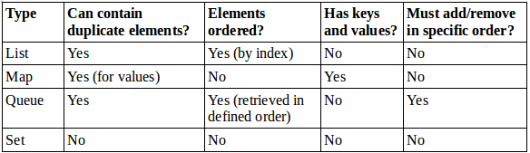
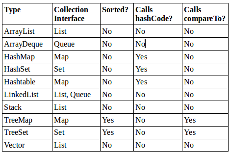
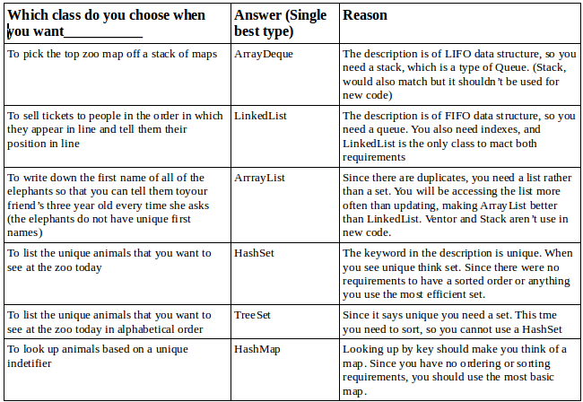
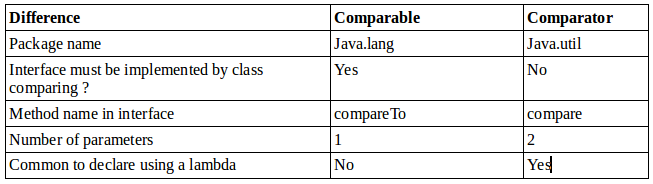
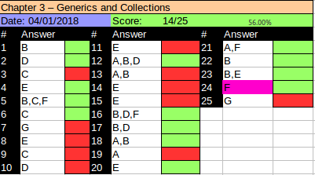

# Reviewing OCA Collections
The *Java Collection Framework* includes classes that implement List, Map, Queue, and Set. On the OCA, we saw ArrayList.  We also saw arrays in the OCA as in ```int[]```. An array is not part of the Collection Framework. Since sorting and searching are similar these are covered in the exam. OCP is cumulative and that means that you are expected to know how to work with arrays from the OCA. In the following we are going to revise arrays, ArrayLists, wrapper classes, autoboxing, the diamond operator, searching and sorting.

## Array and ArrayList
An arrayList is an object that contains other objects. An ArrayList cannot contain primitives. An array is a built-in data structure that contains other objects or primitives. See examples of both below:

```java
List<String> list = new ArrayList<>();      //empty list
list.add("Fluffy");                         //[Fluffy]
list.add("Webby");                          //[fluffy,Webby]

String[] array = new String[list.size()];   // empty array
array[0] = list.get(1);                     // [Webby]
array[1] = list.get(0);                     // [Webby, Fluffy]
```

Now, review the link created when converting between an array and ArrayList:

```java
String[] array = {"gerbil","mouse"};            // [gerbil,mouse]
List<String> list = Arrays.asList(array)        // returns a fixed size list
list.set(1,"test")                              // [gerbil,test]
array[0] = "new";                               // [new,test]
String[] array2 = (String[]) list.toArray();    // [new, test]
list.remove(1);                                 // Throws UnsupportedOperationException
```

Line 2 converts an array to a List. Since we used asList() to make the convertion the created list is not resizable. Line 5 converts the List back to an array. Finally, the last line shows that list is not resizable because it is backed by the underlying array. 

## Searching and Sorting
```java
int[] numbers = {6,9,1,8};  
Arrays.sort(numbers);                                         //[1,6,8,9]
System.out.println(Arrays.binarySearch(numbers,6));  //1
System.out.println(Arrays.binarySearch(numbers,3));  //-2
```

Line 2 sorts the array because Binary Search assumes the input is sorted. Line 3 prints the index at which match is found. Line 4 prints one less than the negated  of where the requested value would need to be inserted. The number 3 would need to inserted at index 1 (after the number 1 but before the number 6) so index 1. Negating that index give us -1 and substracting 1 gives us -2. 

## Wrapper Classes and Autoboxing 
As shown in the table below each primitive has a correspoding wrapper class. *Autoboxing* automatically converts a primitive  to the corresponding wrapper classes when needed. On the other hand, *Unboxing* converts a wrapper class back to a primitive.


Let's see some code:

```java 
List<Integer> numnbers = new ArrayList<Integer>();
numbers.add(1);
numbers.add(3);
numbers.add(5);
numbers.remove(1);
numbers.remove(new Integer(5));
System.out.println(numbers)
```

The answer is it leaves just ```[1]```. on lines 2 to 4 we add three integer objects to numbers. The one on line 2 relies on autoboxing. Line 5 is tricky, the remove() method is overloaded. One signature takes an int as the index of the element to remove. The other takes as Object that should be removed. On line 5 Java sees a matching signature for int, so it doesn't need autobox the call to the method. Now numbers contain ```[1,5]```. Line 6 calls the other remove() method, but this time it removes the matching object, which leaves us with just ```[1]```. 

Java also converts the wrapper classes to primitives via unboxing:

```java
int num = numbers.get(0);
```

## The Diamond Operator
It is called that because <> looks like a diamond. See an example usage:

```java
import java.util.*;
class Doggies{
  List<String> names;
  Doggies(){
    names = new ArrayList<>();      
  }
  
  public void copyNames(){
    ArrayList<String> copyNames;
    copyNames = new ArrayList<>();
  }
}
```

# Working with Generics
Using generics is type-safe. So that the call doesn't put in the list that we didn't expect. The following does just that:

```java
static void printNames(List list){
  for(int i = 0; i < list.size(); i++){
    String name = (String) list.get(i);   //class cast exception here
    System.out.println(name);
  }
}

public static void main(String[] args){
  List names = new ArrayList();
  names.add(new StringBuilder("Webby"));
  printNames(names);
}

```
The code above throws ClassCastException. Line 10 adds a StringBuilder to list. This is legal because a non generic list can contain anything. However, line 3 is coded to expect a specific class. It casts to String, reflecting this assumption. Since the assumtion is not always correct, it throws a ClassCastException because StringBuilder cannot be cast to java.lang.String.

Generics fixes this by allowing parametrized types. You specify that you want an ArrayList of String objects. Now the compiler has enough information to prevent from causing a runtime exception. So:

```java
List<String> names = new ArrayList<String>;
names.add(new StringBuilder("Webby"));            //DOES NOT COMPILE
```

## Generic Classes
You can introduce generics to your own classes. The syntax for introducing a generic is to declare a formal type parameter in angle brackets. For example:

```java
public class Crate<T>{
  private T contents;
  
  public T emptyCrate(){
    return contents;
  }
  
  public void packCrate(T contents){
    this.content = contents;
  }
}

```

The generic type is available anywhere within the Crate class. When you instantiate the class you tell the compiler what T should be for that particular instance.

:yin_yang: **Naming convetions for Generics** It can be named anything you want but by convention is to use a single uppercased letter to make it obvious that they arent real class names. The most common uses are:
- E for element.
- K for map key.
- V for map value.
- N for number.
- T for generic data type.
- S,U,V and so forth for mutiple generic types.

For example, suppose an Elephant class, and we are moving it to a much larger zoo.

```java
Elephant elephant = new Elephant();
Crate<Elephant> crateForElephant = new Crate<>();
crateForElephant.packCrate(elephant);
Elephant newHome = crateForElephant.emptyCrate();
```

The Crate class can deal with the Elephant object without knowing anything about it. We could have had type in Elephant instead of T when coding Crate. But, what if we wanted to create a Crate for another animal ?

```java
Crate<Zebra> crateForZebra = new Crate<>();
```

Now, we couldn't have simply hard-coded Elephant in Crate because a Zebra is not an Elephant. However, we could have created an Animal superclass or an interface and use that in Crate.

Generics became useful when the classes used as the type param have absolutely nothing to do with each other. For example, we need to ship our 120-pound robot to another city.

```java
Robot joeRobot = new Robot();
Crate<Robot> robotCrate = new Crate();
robotCrate.packCrate(joeRobot);

//ship to St. Louis
Robot atDestination = robotCrate.emptyCrate();

```
As you can see the Crate class works with any type of classes. Before generics, we would have needed Crate to use the Object class for its instance variable, which would have put the burden on the caller of needing to cast the object it receives on emptying the crate. In addition, the Crate class does not need to know the object that goes into it, and those object don't need to know about Crate neither. We aren't needed to implement an interface Crateable or anything like that. 

Geberic classes aren't limited to having a single type parameter. See code below how it uses two generic parameters:

```java
public class SizeLimitedCrate<T,U>{
  private T contents;
  private U sizeLimits;
  
  public SizeLimitedCrate(T contents, U sizeLimit){
    this.contents = contents;
    this.sizeLimits = sizeLimit;
  }
}
```
T represents the type that we are putting in the crate. U represents the unit that we are using to measure the max size for the crate. To use this generic class we can do the following:

```java
Elephant elephant = new Elephant();
Integer maxWeight = 15_000;
SizeLimitedCrate<Elephant, Integer> c1 = new SizeLimitedCrate<>(elephant,maxWeight);
```

:yin_yang: **Type Erasure** Specifying a generic type allows the compiler to enforce proper use of the generic type. For example, specifying the generic type of Crate as Robot is like replacing the T in the Crate class with Robot. Behind the scenes the compiler replaces all references of T in Crate to Object. The process of removing the generic syntax from our code is called *Type Erasure*. Type erasure allows your code to be compatible with older versions of Java that do not contain generics. And then the compiler adds the relevant casts for your code, like below:

```java
Robot r = crate.emptyCrate();

and comiler turns it into

Robot r = (Robot) crate.emptyCrate();
```

## Generic Interfaces
Just like a class, an interface can declare a formal type parameter. For example the interface below uses a generic type as the argument to its ship() method:

```java
public interface Shippable<T>{
  void ship(T t);
}
```
There are three ways a class  can approach implementing this interface. The first is to specify the generic type in the class. The following concrete class says it deals only with robots. 

```java
class ShippableRobotCrate implements Shippable<Robot>{
  public void ship(Robot r){ }
}

```

The next way is to create a generic class. The following concrete class allows the caller to specify the type of the generic:

```java
class ShippableAbstractCrate<U> implements Shippable<U>{
  public void ship(U t)
}
```

The final way, is to not use generics at all. This is the old way of writing code. It generates a compiler warning about Shippable beign a *raw type*, but it does compile. Here the ship() method has an Object parameter since the generic type is not defined:

```java
class ShippableCrate implements Shippable{
  public void ship(Object t){ }
}

```

:yin_yang: **What you can't do with Generic Types** These aren't in the exam.
- *Call the constructor* new T() is not allowed because at runtime it would be an Object.
- *Create an array of that static type* this one is the most annoying, but it makes sense because you'd be creating an array of Objects.
- *Call instanceof*. This is not allowed because at runtime List<Integer> and List<String> look the same to Java thanks to type erasure.
- *Use a primitive type as a generic type parameter*. This isn't a big deal because you can use the wrapper class instead. If you want a type int, just use Integer
- *Create a static variables as generic type parameter*. This is not allowed because the type is linked to the instance of the class.
  
## Generic Methods
Up until now you have seen generic types declared in classes and interfaces. It is also possible to declare them at method level. This is often useful for static methods since they aren't part of the instance . However, they are also allowed on non-static methods as well.

```java
public static <T> Crate<T> ship(T t){
    System.out.println("Preparing " + t);
    return new Crate<T>();
}

```
The method parameter is the generic type T. The return type is a Crate<T>. Before the return type, we declare the formal type parameter of <T>. Unless a method is obtaining the generic formal type parameter from the class/interface, it is specified immediately before the return type of the method. Observe code below:
  
```java
public static <T> void sink(T t){ }
public static <T> T indentity(T t){ return t;}
public static T noGood(T t){ return t; }          //DOES NOT COMPILE        
```

Line 1 shows the formal param type immediately before the return type of void. Line 2 shows the return the type beign the formal param type. It looks weird, but it is correct. Line 3 ommits the formal param type, and therefore it does not compile.

## Interacting with Legacy Code
*Legacy code* is older code. It is usually code that is in a different code that you would normally write today. In this section we are referring to code that was written in version 1.4 and therefore does not use generics. Collections written without generics are also known as *raw collection*. Remember using collections gives us compile time safety. 

```java
class Dragon{}

class Unicorn{}

public class LegacyDragons{
  public static void main(String[] args){
    List unicorns = new ArrayList();
    unicorns.add(new Unicorn());
    printDragons(unicorns);
  }
  
  private static void printDragons(List<Dragon> dragons){
    for(Dragon dragon : dragons){       //ClassCastException
      System.out.println(dragon);
    }
  }
}
```

Now, look at the problem with autoboxing:
```java
public class LegacyAutoboxing{
  public static void main(Stirng[] args){
    List numbers = new ArrayList();
    numbers.add(5);
    int result = numbers.get(0);        //DOES NOT COMPILE
  }
}
```

The good news is that unboxing fails with a compiler error rather than a runtime error. On line 3 we create a raw list. Onm line 4 we try to add an int to the list. This works because Java automatically autoboxes to an Integer. On line 5, we have a problem. Since we are not using generics Java does not know the list contains Integers. It just knows about Objcts and an object cannot be unboxed in a primitive int. To review, the lesson is to be careful when you see code that doesn't use generics.

## Bounds
You might have noticed that generics don't seem useful since they are treated as Object and therefore don't have many methods available. Bounded wildcards solve this by restricting what types can be used in that wildcard position.

A *bounded parameter type* is a generic type that specifies a bound for the generic. Be warned that this is the hardest section in the chapter.

A *wildcard generic type* is an unknown generic type represented with a question mark (?). You can use generic wildcards in three ways. See table below 


## Unbounded Wildcards
An unbounded wildcard represents any data type you use. You use ? when you want to specify that any type is OK with you. For example:
```java
public static void printList(List<Object> list){
  for(Object o: list) System.out.println(o);
}

public static void main(String[] args){
  List<String> keywords = new ArrayList<>();
  kaywords.add("java");
  printList(keywords);                // DOES NOT COMPILE
}
```
Why if String is a subtype of Object? However, List<String> cannot be assigned to List<Object>. I know it doesn't sound logical. But imagine if we could write code like this:
  
```java
List<Integer> numbers = new ArrayList<>();
number.add(new Integer(42));
List<Object> objects = numbers;           
objects.add("forty two");
System.out.println(numbers.get(1));
```

On line 1, the compiler promises that only Integer objects will appear in numbers. If line 3 were to have compiled, line 4 would break that promise by putting a String in there since numbers and objects are references to the same object. Good thing that the compiler prevents this.

:yin_yang: **Storing wrong Objects - Arrays vs ArrayLists**
We can't write ```List<Object> l = new ArrayList<String>();``` so you might think that Java is protecting us from doing  
```java
Integer[] numbers = { new Integer(42)};
Object[] objects = numbers;
objects[0] = "forty two";               //throws ArrayStoreException
```
Although the code above comiles, it throws an expection at runtime. With arrays Java knows the type allowed in the array. Just because we've assigned an ```Integer[]``` to an ```Object[]``` doesn't change the fact that Java knows it is really an ```Integer[]```. Due to type erasure there is no such protection for an ArrayList. At runtime the ArrayList does not know what is allowed in it. Therefore Java uses the compiler to prevent this situation from happening. So whay Java doesn't allow this knowledge to ArrayList? the reason is backwards compalibility.

Going back to the example, we cannot assign List<String> to List<Object>. Fine. What we need is a List of "Whatever" that's what List<?> is. The following does what we expect:

```java
public static void printList(List<?> list){
  for(Object x: list) System.out.println(x);
}

public static void main(String[] args){
  List<String> keywords = new ArrayList<>();
  keywords.add("java");
  printList(keywords);
}

```

printList() takes any type of list as a parameter. keywords is of type List<String>. We have a match! List<String> is a list of anything. "Anything" just happens to be a String here
  
## Upper-Bounded Wildcards
Let's try to write a method that adds up the total of a list of numbers. We've established that a generc type cannot use a subclass.

ArrayList<Number> list = new ArrayList<Integer>();        //DOES NOT COMPILE
  
Instead, we need to use a wild card:

List<? extends Number> list = new ArrayList<Integer>();
  
The upper-bounded wildcard says that any class that extends Numnber of Number itself can be used as the formal parameter type:

```java
public static long total(List<? extends Number> list){
  long count = 0;
  for(Number number : list){
    count += number.longValue();
  }
  return count;
}

```
Remember how we kept saying that type erasure makes Java think that a generic type is an Object ? That is still happening here. Java converst the code to something like this:

```java
public static long total(List list){
  long count = 0;
  for(Object obj : list){
    Number number = (Number) obj;
    count += number.longValue();
  }
  return count;
}

```

Something interesting happens when we work with upper bounds and unbounded wildcards. The list becomes immutable.

```java
static class Sparrow extends Bird{ }
static class Bird{ }

public static void main(String[] args){
  List<? extends Bird> birds = new ArrayList<Bird>();
  birds.add(new Sparrow());                 // DOES NOT COMPILE
  bords.add(new Bird());                    // DOES NOT COMPILE
}
```
The problem comes from the fact that Java does not know what type List<? extends Bird> really is. It could be List<Bird> or List<Sparrow>. Line 6, doesn't compile because we can't add a Sparrow to Lis<Bird> and line 7 doesn't compile because we can't add a Bird to List<Sparrow>. From Java point of view both scenarios are equally possible so netither is allowed.  
  
Now let's try an example with an interface. We have an interface and two classes that implement it:

```java
interface Flyer{ void fly();}

class HangGlider implements Flyer { public void fly(){ }}

class Goose implements Flyer { public void fly(){ }}

```
We also have two methods that use it. 

```java
private void anyFlier(List<Flyer> flyer){ }

private void groupOfFlyers(List<? extends Flyer> flyer){}
```
Notice that we used keyword extends rather than implements. **Upper bounds are like anonymous classes in that they use extends regardless of whether we are working with a class or an interface.** 

## Lower-Bounded Wildcards
Let's try to write code that adds a stirng "quack" to two lists:

```java
List<String> strings = new ArrayList<String>();
strings.add("tweet");
List<Object> objects = new ArrayList<Object>(strings);
addSound(strings);
addSound(objects);
```

The problem is that we want to pass a List<String> and a List<Object> to the same method.First, make sure that you understand why the first 3 options don't work.
  


To solve this problem, we need to use lower bounds:

public static void addSound(List<? super String> list){   // lower bound
  list.add("quack");
}

witha lower bound, we are telling Java that the list will be a list of String objects or a list of some objects that are  superclass of String. Either way, it is safe to add a String to that list.

### Understanding Generic Supertypes
when you have subclasses and superclasses, lower bounds can get tricky:

```java
List<? super IOException > exceptions = new ArrayList<Exception>();
exceptions.add(new Exception());      //DOES NOT COMPILE
exceptions.add(new IOException());
exceptions.add(new FileNotFoundException());

```
Line 1 reference a List that can be List<IOException> or List<Exception> or List<Object>. Line 2 does not compile because we could have a list<IOException> and and Exception object wouldn't fit in there.

Line 3 and 4 are fine. IOException and FileNotFoundException can be added to any of those types. 
  
## Putting It All Together
Let's see some examples to put what we learnt into practice.

```java
class A{}

class B extends A{}

class C extends B{}
```

Can you figure out why the following do or don't compile?

```java
6:  List<?> list1 = new ArrayList<A>();

7:  List<? extends A> list2 = new ArrayList<A>();

8:  List<? super A> list3 = new ArrayList<A>();

9:  List<? extends B> list4 = new ArrayList<A>();         //DOES NOT COMPILE

10: List<? super A> list5 = new ArrayList<A>();

11: List<?> list6 = new ArrayList<? extends A>();         //DOES NOT COMPILE

```
Line 6 creates creates an ArrayList that can hold instances of class A. It uses an unbounded wildcard. Any generic can be referenced from an unbounded wildcard, making this OK. 

Line 7 is OK it uses a upper-bounded wildcard. You could have ```List<A>, List<B>, List<C>```.
  
Line 8 is also OK. This time is a lower-bounded wildcard. The lowest to can reference is A.

Line 9 has upper bounded wildcard that allows ```List<B>``` and ```List<C>```. Since you have ```List<A>``` it does not compile.
  
Line 10, has a lower-bounded wildcard, which allows a reference to ```List<A>, List<B> or ArrayList<Object>```

Finally, line 11 allows a reference to any generic type since it is unbounded wildcard. The problem is that you need to know what that wildcard will be when instantiating the ArrayList. 

Now, same questions for the following method:

```java
<T> T method1(List<? extends T> list){
  return list.get(0);
}

```

method1() is a normal use of generics. For example you could call it with List<String> param and have it return a String. Or you could call it with a List<Number> param and have it return a Number. 
  
Now, what is wring with this code?

```java
<T> <? extends T> method2(List<? extends T> list){  //DOES NOT COMPILE
  return list.get(0)
}

```

method2() does not compile because the return type isn't actually a type. Since you are the one writting the method you should know what method is suppose to return. You don't get to specify this as a wild card

Now this is extra tricky:

```java
<B extends A> B method3(List<B> list){
  return new B();             // DOES NOT COMPILE  
}

```

method3() does not compile ```<B extends A>``` says that you want to use B as type param for this method and that it has to extend A. The trick is that B is also the name of a class. Within the scope of the method, B can represent classes A, B or C because all extend A class. Since B no longer refers to B class in the method, you cannot instantiate it.
  
Generics bounds are very tricky. Come back tomorrow when you have a fresh mind and re-read.
  
# Using Lists, Sets, Maps, and Queues
A *collection* is a set of objects contained is an single object. The *java collections framework* is a set of subclasses in java.util for storing collections. There are four main interfaces in the Java Collections Framework

- **List**: A list is an ordered collection of elements that allows duplicate entries. Elements in a list can be accessed by an int index.
- **Set**: A set is a collection that does not allow duplicate entries.
- **Queue**: A queue is a collection that orders its elements in a specific order for processing. A typical queue process in FIFO order. First-in First-out but other orderings are possible
- **Map**: A map is a collection that maps keys to values, with no duplicate keys allowed. The elements in a map are key/value pairs.


In the figure below, notice that Map does not implement the Collection interface. It is considered part of the Java Collections Framework even though it doen't implement the Collection interface.


## Common Collections Methods
The Collection interface contains useful methods for working with list, sets and queues. We will also cover maps. In the following sections. 

### add()
The add() method inserts a new element into the Collection and returns whether it was successful. The method signature is

```java boolean add(E element)```

Example of usage:

```java

List<String> list = new ArrayList<>();
System.out.println(list.add("Sparrow"));    //true
System.out.println(list.add("Sparrow"));    //true

Set<String> set = new HashSet<>();          //true
System.out.println(set.add("Sparrow"));    //true
System.out.println(set.add("Sparrow"));    //false

```

A list allows duplicates, making the return value true each time. A Set does not allow duplicates. In the last line, we tried to add a duplicate and it returned false.

### remove()
The remove() method removes a single matching value in the Collection and returns whether it was successful. The method signature is:

```java
boolean remove(Object object)
```

This time, the boolean return value tells us whether a match was removed. The following shows how to use this method

```java
List<String> birds = new ArrayList<>();     // 
birds.add("hawk");                          //[hawk]
birds.add("hawk");                          //[hawk, hawk]

System.out.println(birds.remove("panda"))   //prints false
System.out.println(birds.remove("hawk"))    //prints true
System.out.println(birds)                    //[hawk]
```

The first remove tries to remove an element that is not in birds. It returns false because no such element is found. The next remove removes hawk and returns true because there is a match. Notice that it only removes a single match.

Since calling remove() with an int uses an index, an index that doesn't exist will throw an exception. For example birds.remove(5); throws an IndexOutOfBoundsException. Remenber there are overloaded remove methods. One takes the element to remove. The other takes the index of the element to remove.

### isEmpty() and size()
The isEmpty() and size() methods look at how many elements are in the Collection. The method signature is:

```java
boolean isEmpty()

int size()
```

The following shows how to use these methods:

```java
System.out.println(birds.isEmpty());      //true
System.out.println(birds.size());         //0
birds.add("hawk");                        //[hawk]
birds.add("hawk");                        //[hawk,hawk]
System.out.println(birds.isEmpty());      //false
System.out.println(birds.size());         //2
```
At the beggining, birds has a size of 0 and is empty. After we add elements, the size becomes positive and it is no longer empty.

### clear()
The clear() method provides an easy way to discard all elements of the Collection. The method singature is:

```java
void clear();
```

The following shows how to use the method:

```java
List<String> birds = new ArrayList<>();
birds.add("hawk");                            //[hawk]
birds.add("hawk");                            //[hawk,hawk]
System.out.println(birds.isEmpty());          //false
System.out.println(birds.size());             //2
birds.clear();                                //[]
System.out.println(birds.isEmpty());          //true
System.out.println(birds.size());             //0
```

After calling clear(), birds is back to beign an empty ArrayList of size 0.

### contains()
The contains() method checks if a certain value is in the Collection. The method signature is:

```java
boolean contains(Object object)
```

The following shows how to use this method:

```java
List<String> birds = new ArrayList<>();
birds.add("hawk");                               //[hawk]
System.out.println(birds.contains("hawk"));      //true
System.out.println(birds.contains("panda"));     //false
```
This method calls equals() on each element of the ArrayList to see if there are any matches.

## Using the List Interface
You use a list when you want an ordered collection that can contain duplicate entries. Items can be retrieved and inserted at specific position based  on an int index much like an array. List is like the go to data type. The main point about lists is that they are odered and allow duplicates.

### Comparing List Implementations
An **ArrayList** is like a resizeable array. When elements are added, the ArrayList automatically grows. The main benefit is that it can look up any elements at constant time. Adding or removing an element is slower than accessing an element.

:yin_yang: **Big O Notation** This is an order of magnitude and it measures the performance of an algorithm. The following are the most common big O notation values:
- *O(1) - constant time*: It doens't matter how large the collection is, the answer will always take the same time to return. 
- *O(log n) - logarithmic time*: A logarithm is a mathematical function that grows much more slowly that the data size. Binary Search runs in logarithmic time.
-*O(n) - Linear time*: The performance will grow linearly with respect to the size of the collection. 
- *O(n^2) - n square time*: Code that has nested loops where each loop goes through the data takes n square time.

A **LinkedList** is special because it implements both List and Queue. It has all of the methods of List. It also has additional methods to facilitate addding or removing from beginning and/or end of list. The main benefits are that you can access, add or remove from the beginning and end of the list in constant time. 

A **Stack** is a data structure where you add and remove elements from the top of the stack. Stack hasn't been used for ages. If you need a stack, use an **ArrayDeque** instead.

### Working with List Methods
The methods in the List interface are for working with indexes.


The following statements demonstrate these basic methods:

```java
List<String> list = new ArrayList<>();
list.add("SD");                         //[SD]
list.add(0,"NY");                       //[NY,SD]
list.set(1,"FL");                       //[NY,FL]
list.remove("NY");                      //[FL]
list.remove(0);                         //[]
```

Let's look at one more example that queries the list:

```java
lis.add("OH");                    //[OH]  
list.add("CO");                   //[OH,CO]
list.add("NJ");                   //[OH,CO,NJ]
String state = list.get(0);       //OH
int index = list.indexOf("NJ");   //2  
```
The output would be the same if you tried these examples with LinkedList, Vector or Stack. Although the code would be less efficient, it wouldn't be noticeable until you have very large lists.

## Using the Set Interface
You use a set when you don't want to allow duplicate entries. For example, you might want to keep track of the unique animals that you want to see in the zoo. You are not concerned in the order you want to see the animals but there isn't time to see them more than once.

The main thing that all set have in common is that they do not allow duplicates.

### Comparing Set Implementations
A **HashSet** stores its elements in a has table. This means that it uses the hashCode() method to retrieve them more efficiently. The benefit is that adding elements and checking if an element is in the set both have constant time. The trade off is that you lose the order in which they are inserted.

A **TreeSet** stores its elements in a sorted tree structure. The main benefit is that the tree is always in sorted order. The tradeoff is that adding and checking if an element is present are both *O(log n)*. TreeSet implements special interface called NavigableMap.


### Working with Set Methods
The Set interface doesn't add any extra methods that you need to know for the exam. You need to know how sets behave with respect to the traditional Collection methods. You akso need to know the difference between the types of sets. 

Let's start with HashSet:

```java
Set<Integer> set = new HashSet<>();
boolean b1 = set.add(66);                   //true
boolean b2 = set.add(10);                   //true
boolean b3 = set.add(66);                   //false
boolean b4 = set.add(8);                    //true
for(Integer i: set) System.out.println(i)   //66,8,10

```

The add method should be straight forward. They return true unless the Integer is already in the set. Line 4, returns false because the number is already in the set, it must preserve uniqueness. Notice that when we print the elements they are not in the same order as we inserted them programatically. Remember the equals() method is used to determine equality and the hashCOde() is used to determine which bucket to look inso that Java doesn't need to look through the whole set to find out if an object is there.

If we run the same code as before with a TreeSet the boolean values are the same the only difference is that TreeSet print the values in the natural sorted order.

:yin_yang: **The NavigableSet Interface**  TreeSet implements the NavigableSet interface. This interface provides some interesting methods. Their signature is as follows:


These java methods were added in Java 6, so you are more than likely to come across them
```java
NavigableSet<Integer> set = new TreeSet<>();
for(int i = 1; i <= 20; i++) set.add(i);
System.out.println(set.lower(10));        //9
System.out.println(set.floor(10));        //10
System.out.println(set.ceiling(20));      //20          
System.out.println(set.higher(20));       //null
```

## Using the Queue Interface
You use a queue when elements are added and removed in a specific order. Queues are typically used for sorting elements prior to processing them. Unless stated otherwise, a queueu is assumed to be FIFO (First-in First-out). Implementation may change and you can envision LIFO as well (Last-in First-out ).

### Comparing Queue Implementations
A double-ended queue is different from a regular queue in that you can insert and remove elements from both the front and back of the queue. The main benefit of using LinkedList is that it implements both List and Queue interfaces. The tradeoff is that it isnet as efficient as a "pure" queue .

An ArrayDeque is a "pure" double-ended queue. It was introduce in Java 6, and stores its elements in a resizable array. The main benefit of ArrayDeque is that it is more efficient than a LinkedList 

### Working with Queue Methods
The ArrayDeque contains many methods. Luckily, they are only seven methods that you need to know in addition to the inherited Collection ones. See the table below


Except for push, all are in the Queue interface as well. push is what makes it a double-ended queue. As you can see there two sets of methods. One set throw an exception when something goes wrong and another set uses a different return value when something goes wrong. The offer/poll/peek methods are more common. This is the standard language people use when working with queues. Let's see some examples:

```java
Queue<Integer> queue = new ArrayDeque<>();
System.out.println(queue.offer(10));        //true        [10]
System.out.println(queue.offer(4));         //true        [10,4]
System.out.println(queue.peek());           //10          [10,4]
System.out.println(queue.poll());           //10          [4]
System.out.println(queue.poll());           //4           []
System.out.println(queue.peek());           //null        because list is empty
```

Forst two methods successfyllu add an element to the end of the queue. Some queues are limited in size, which would cause offering an element to the queue to fail. Line 4 looks at the first element in the queue, but it does not remove it. The following two methods actually remove elements from the queue, which result in an empty queue. Last line tries to look at the first element in the queue but since this is emty returns null.

As we said earlier, ArrayDeque is a double ended queue. What if we want to insert an element at the other end? No problem. we just call push() method. It works just like offer() except at the other end of the queue. When talking about LIFO (stack), people say push/poll/peek. When talking about FIFO (single-ended queue) people say offer/poll/peek.

Now let's re-write that example using the stack functionality:

```java
ArrayDeque<Integer> stack = new ArrayDeque();
stack.push(10);                                           [10]
stack.push(4);                                            [4,10]
System.out.println(stack.peek());         //4             [4,10]
System.out.println(stack.poll());         //4             [10]
System.out.println(stack.poll());         //10            []
System.out.println(queue.peek());         //null          because list is empty

```
The difference between whether an ArrayDeque is being used as a stack or a queue is really important. To review, a queue is like a line of people or FIFO. A stack is like a stack of plates or LIFO.

A LinkedList works exactly the same way as ArrayDeque, so we will skip this one.

## Map
You use a map when you want to indetify values by key. For example, when you use the contanct list in your phone, you look up "Geroge" rather than looking his number. You can envision a Map to achieve this. You also need to know that a TreeMap is sorted and navigable.

### Comparing Map Implementations
A **HashMap** stores the keys in a hash table. This means that it uses the hashCode() method of the keys to retrieve their values more efficiently. The main benefit is that adding elements and retrieving element by key both have constant time. The trade off is that you lose the order in which you inserted the elements.Most of the time you are not concerned about the order when using a map but if you were you would use **LinkedHashMap**.

A **TreeMap** stores the keys in a sorted tree structure. The main benefit is that the keys are always in sorted order. The tradeoff is that adding and checking if a key is present are both O(log n).

A **Hashtable** is like Vector in that it is really old and thread-safe and you will not be expected to use it. It contains a lower 't' as a mistake from the olden days. An analogy would be. ArrayList is to Vector as HashMap is to Hashtable.
 
### Working with Map Methods
Remeber a Map does not extends the Collection Interface. There are more emthod specified in the Map interface. There are generics, the class use K for key and V for value. See table below:


Let's see some examples:

```java
Map<String, String> map = new HashMap<>();
map.put("koala","bamboo");
map.put("lion","meat");
map.put("giraffe","leaf");
String food = map.get("koala");      //bamboo
for(String key: map.keySet()){
  System.out.println(key + ", ");    //koala, giraffe, lion,
}

```
Notice it dodn't print the map in the order they were inserted. Now look at the TreeMap.

TreeMap sorts the keys as we would expect. If we were to have called values() instead of keySet(), the order of the values would correspond to the order of the keys. See below:

```java
System.out.println(map.contains("lion"));               //DOES NOT COMPILE
System.out.println(map.containsKey("lion"));            //true
System.out.println(map.containsValue("lion"));          // false  
System.out.println(map.size());                         // 3
```
The first line is a bit tricky, contains() is a method of the Collection interface but not of the Map interface.

## Comparing Collection Types
Let's start off with a review of the characteristics of the different types. Make sure you know these two tables from memory





Next, the exam expects you to know which data structures allow nulls. Most do allow nulls, so we discuss only the exceptions. The data structures that involve sorting do not allow nulls. Makes sence because we cannot compare null to String. This means that TreeSet cannot contain null elements. It also means that TreeMap cannot contain null keys. Null values are OK.
Next comes ArrayDeque. You can't put null in an ArrayDeque because methods like poll() use null as a special return value to indicate that the collection is empty. Finally, Hashtable doen't allow null keys or values. There is no particular reason for this. It's just old and was written that way. In handy list form, all data structures allow nulls except these:
- TreeMap: no null keys
- Hashtable: no null keys or values
- TreeSet: no null elements
- ArrayDeque: no null elements

Finally, the exam expects you to be able to choose the right collection type given a problem description of a problem. See table below to give you practice. Pay attention to the Reason column 



First figure out whether you are looking for a List, Map, Queue or Set. This allows you to eliminate a few answers. Then you can figure out which is the best answer


# Comparator vs. Comparable
For numbers, order is obvious - it is numerical order. For string objects order is in alphabetical order. As far as for the exam is concerned, numbers sort before letters and uppercase letters sort before lowercase letters.
You can also sort objects that you create. Java provides an interface called *Comparable*. If your class implements Comparable, it can be used in the places that requires comparison. There is also a class called Comparator, which is used to specify that you want to use a different order than the object itself provides.

Comparable and Comparator are similar enough to be tricky. The exam tries to confuse you by mixing them up.  

## Comparable
The Comparable interface has only one method. In fact, this is the entire interface:
```java
public interface Comparable<T>{
  public int compareTo(T o);
}
```

For example we have a buch of Duck objects and we want to be able to sort them somehow. Let say by name:

```java
import java.util.*;

public class Duck implements Comparable<Duck>{
  private String name;
  
  public Duck(String name){
    this.name = name;
  }
  
  public String toString(){
    return this.name;
  }

  public int compareTo(Duck d){
    return name.comapreTo(d.name);
  }
  
  public static void main(String[] args){
    List<Duck> ducks = new ArrayList<>();
    ducks.add(new Duck("Quack"));
    ducks.add(new Duck("Puddles"));
    Collections.sort(ducks);                //sort by name
    System.out.println(ducks);              //[Puddles, Quack]
  }
}

```
The Duck class implements Comparable interface by implemeting compareTo() method. The Duck object also override toString() method os that we can see useful information when printing the ducks. As mentioned the Duck implements compareTo() object. Since Duck class is comparing objects of type String and String class already has a compareTo() method, it can just delegate. These are the three rules to know:
- The number zero is returned when the current object is equal to the argument to compareTo().
- A number less than zero when the current object is smaller than the argument compareTo().
- A number greater than zero when the current object is larger than the argument compareTo().

Let's look at an implementation of compareTo() that compares numbers instead of string objects:

```java
public class Animal implements Comaprable<Animal>{
  private int id;
  
  public int compareTo(Animal a){
    return id - a.id;
  }
  
  public static void main(String[] args){
    Animal a1 = new Animal();
    Animal a2 = new Animal();
    
    a1.id = 5;
    a2.id = 7;
    
    System.out.println(a1.compareTo(a2));     // -2
    System.out.println(a1.compareTo(a1));     // 0
    System.out.println(a2.compareTo(a1));     // 2
  }

}

```

The class implements the compareTo() method. Since an int is a primitive, we can't call a method on it. We could create the Integer wrapper class and delegate comapreTo() on that. But it is not neccesary since it is so easy to implement the method on your own. The print methods confirm that we have implemented the methods correctly.

Note that when dealing with legacy code before generics were introduced the compareTo() requires a cast since it is passed an Object. See below:

```java
public class LegacyDuck implements Comparable{
  private String name;
  
  public int compareTo(Object obj){
    LegacyDuck d = (LegacyDuck) obj;      //cast because no generics used.
    return name.compareTo(d.name);
  }
}
```

Since we don't specify the generic type for Comparable Java assumes that we want an Object

:yin_yang: You are strongly encouraged to make your Comparable classes consistent with equals because not all collection classes behave predictanbly if the compareTo() and equals() methods are not consistent. 

For example the following Product class defines a comapreTo() method that is not consistent with equals():

```java
public class Product implements Comparable<Product>{
  int id;
  String name;
  
  public boolean equals(Object obj){
    if(! (obj instanceof Product)){
      return false;
    }
    Product other = (Product) obj;
    return this.id == other.id;
  }
  
  public int compareTo(Product obj){
    return this.name.compareTo(obj.name);
  }
}

```
This compareTo() method is not consistent with equals. One way to fix that is to use a Comparator to define the sort elsewhere. Let's see how its done with Comparator in the next section.

## Comparator
Sometimes you want to sort an object that did not implement Comparable, or you want to sort object in different ways at different times.

Suppose we add weight to our Duck class. The Duck class itself can define comapreTo() in only one way. In this case, name was chose. It we want to sort by something else, we have to define that sort order outside the compareTo() method:

```java
public static void main(String[] args){
  Comparator<Duck> byWeight = new Comparator<Duck>(){
    public int compare(Duck d1, Duck 2){
      return d1.getWeight() - d2.getWeight();
    }
  };
  
  List<Duck> ducks = new ArrayList<>();
  ducks.add(new Duck("Quack", 7));
  ducks.add(new Duck("Puddles", 10));
  Collections.sort(ducks);
  System.out.println(ducks);            //[Puddles, Quack]
  Colections.sort(ducks, byWeight);
  System.out.println(ducks);            //[Quack, Puddles]
}
```
First we define an inner class with the comparator. Then we sorted without the comparator and with the comparator to see different output. Comparator is a functional interface since there is one abstract methods to implement. That means that we can rewrite it using funtional programming, as any of the following:

```java
Comparator<Duck> byWeight = (d1,d2) ->  d1.getWeight() - d2.getWeight();
Comparator<Duck> byWeight = (Duck d1, Duck d2) ->  d1.getWeight() - d2.getWeight();
Comparator<Duck> byWeight = (d1,d2) ->  { return d1.getWeight() - d2.getWeight(); };
Comparator<Duck> byWeight = (Duck d1, Duck d2) ->  { return d1.getWeight() - d2.getWeight();};

```

There are a number of differences between Comparable and Comparator, see table below:



Memororize this table - really because the exam will try to trick you mixing up the both. 


# Searching and Sorting 
The sort method uses compareTo() method to sort. It expects the object to be sorted to be Comparable, in other words to implements Comparable interface.

```java
import java.util.*;

public class SortRabbits{
  static class Rabbit{ int id; }
  
  public static void main(String[] args){
    List<Rabbit> rabbits = new ArrayList<>();
    rabbits.add(new Rabbit());
    Collection.sort(rabbits);                     // DOES NOT COMPILE
  }
}

```

Java knows that Rabbit class is not Comaprable. It knows Sorting will fail, so it doesn't even let you compile. You can fix this by passign Comparator to sort(). Remember Comparator is useful when you dont want to specify sort order without using a compareTo() mehod:

```java
import java.util.*;

public class SortRabbits{
  static class Rabbit{ int id; }
  
  public static void main(String[] args){
    List<Rabbit> rabbits = new ArrayList<>();
    rabbits.add(new Rabbit());
    Comparator<Rabbit> c = (r1, r2) -> r1.id - r2.id;
    Collection.sort(rabbits, c);                     
  }
}

```

sort() and binarySearch() allow you to pass in a Comparator object when you don't want to use the natural order. 

Going back to our Duck example that implements a Comparable interface. See the code below where we try to add Duck and Rabbit to a different TreeSet:

```java
public class UseTreeSet{
  static class Rabbit{ int id; }
  
  public static void main(String[] args){
    Set<Duck> ducks = new TreeSet<>();
    ducks.add(new Duck("Puddles"));
    Set<Rabbit> rabbit = new TreeSet<>();
    rabbit.add(new Rabbit();                    // throws an exception                    
  }
}
```

Duck is fine because it implements Comparable in the previous examples, so the TreeSet knows how to sort it. The last line is a problem thouh because when TreeSet tries to sort it, Java discovers that Rabbit does not implement Comparable. And therefore Java throws a ClassCastException. It seems weid the exception to be thrown when the first object is added to the set because there is nothing to compare against. But Java does it this way for consistency.

One way to fix this problem, if you don't want to implement Comparable what you can to is to use Cmparator on the go. See below:

```java
Set<Rabbit> rabbits = new TreeSet<>(new Comparator<Rabbit>(){
  public int compare(Rabbit r1, Rabbit r2){
      return r1.id - r2.id;
  }
});
rabbits.add(new Rabbit());
```

# Additions in Java 8

In this section we are going to revise some of the new things added in Java 8 like method references to show how to make the code compact. Method references and lambdas are more compact so you should expect to see them in questions about other topics. We will show you how to use ```removeIf(), forEach(), merge(), computeIfPresent(), and computeIfAbsent()``` methods.

## Using Method References
*Method reference* are a way to make the code shorter by reducing some of the code that can be inferred and simply mentioning the name of the method. Like lambdas, it takes time to get used to the new syntax.

Suppose that we have a Duck class with name and weight attributes along with this heloer class:

```java
public class DuckHelper{
  public static int compareByWeight(Duck d1, Duck d2){
    return d1.getWeight() - d2.getWeight();
  }
  
  public static int compareByName(Duck d1, Duck d2){
    return d1.getName().compareTo(d2.getName());
  }
}
```
Now, using lambdas we will implement Comparator in the following way to sort by weight:

```java
Comparator<Duck> byWeight = (d1,d2) -> DuckHelper.compareByWeight(d1, d2);
```

Not bad, although there is a bit of redundancy. The lamda takes two params and does nothing but pass those params to another method. Java 8 lets us remove that redundancy and simply write:

```java
Comparator<Duck> byWeight = DuckHelper::compareByWeight;
```

The :: operator tells Java to pass the parameters automatically into compareByWeight.

There are four formats for method references:
- Static methods
- Instance methods on a particular instance
- Instance methods on an instance to be determined at runtime
- Constructors

Remeber that **Predicate** is a functional interface that takes a single parameter of any type and returns a boolean. Another funtional interface is **Consumer** which takes a single parameter fo any type and has a void return type. Finally **Supplier** doesn't take any parameter and returns any type.

Let's see some examples from the Java API. On each example we also show the lambda equivalent.  Let's start fro static method:

```java
Consumer<List<Integer>> methodRef1 = Collection::sort;
Consumer<List<Integer>> lambda1 = l ->  Collection::sort(l);
```

The first line, we call the method with one param and Java knows it should create a lambda with one param and pass it tothe method. 

Next, is calling an instance method on a specific instance:

```java
String str = "abc";
Predicate<String> methodRef2 = str::startsWith;
Predicate<String> lambda2 = s -> str.startWith(s);
```

The second line shows that we want to call string.startsWith() and pass a single param tombe supplied at runtime. This is a nice way of filtering data in a list. 

Next we call an instance method without knowing the instance in advance:

```java
Predicate<String> methodRef3 = String::isEmpty;
Predicate<String> lambda3 = s -> s.isEmpty(); 
```
Line 1, says that the method we want to call is declared in String. It looks, like a static method, but it isn't. Instead, Java knows that isEmpty is an instance method that does not take any param. Java uses the params supplied at runtime as the instance on with the method is called. 

Finally, we have a constructor reference:

```java
Supplier<ArrayList> methodRef4 = ArrayList::new;
Supplier<ArrayList> lambda4 = () -> new ArrayList();
```
A *construcor reference* is a special type of method reference that uses new instead of a method, and it creates a new object. It expands like the method references you have seen so far. 

## Removing Conditionally 
Java 8 introduces a new method called removeIf. See method signature:

```java
boolean removeIf(Predicate<? super E> filter)
```
It uses a predicate which is a lambda that takes on a param and returns a boolean. Since lambdas use deferred execution, this allows specifying logic to run when that point in the code is reached. 

```java
List<String> list = new ArrayList<>();
list.add("Magician");
list.add("Assistant");
System.out.println(list);                  //[Magician, Assistant]
list.removeIf(s -> s.startsWith("A"));
System.out.println(list);                  //[Magician]
```
Question here is how to remove line 5 with a method reference? Trick question because you can't. Since startsWith() takes a param that isnt s, it needs to be specified the long way. The most important to remeber about this method is that it is one of the two method that is on a collection and it takes a lambda parameter.

## Updating All Elements
Another new method introduced on List is replaceAll. Java 8 lets you pass a lambda expression and have it applied eo each element in the list. The method signature looks like:

```java
void replaceAll(UnaryOperator<E> o)
```

It uses Unary operator which takes one param and returns a value of the same type. Let's take a look at an example:

```java
List<Integer> list = Arrays.asList(1,2,3);
list.replaceAll(x -> x*2);
System.out.println(list);             //[2,4,6]
```

## Looping through a Collection
This one is very common. Often we want to print out the values. There a few ways to do this. Using a interator, enhanced for loop, while loop or we could use Java 8 lambda. The way to do it is as follows:

```java
List<String> cats = Arrays.asList("Annie","Ripley");
cats.forEach(c -> System.out.println(c));
```

This time we used a Consumer, which takes a single param and doesn't return anything. You don't see this approach because it is common to use a method reference instead:

```java
cats.forEach(System.out::println);
```
This is a very efficient way of printing names. In the next chapter you will be using stream() method to do much more powerful things with lambdas.

# Using New Java 8 Map APIs
Java 8 added a number of new methods on the map interface. Only merge() is listed in the OCP ojectives. Two others, computeIfPresent() and computeIfAbsent() are added in the upgrade exam objectives. 

Sometimes you need to update the value for a specific key in the map. There are few ways to do this. The first is to replace the exisisting value unconditionally:

```java
Map<String, String> favourites = new HashMap<>();
favourites.put("Jenny", "Bus Tour");

favourites.put("Jenny", "Tram");
System.out.println(favourites);    //{Jenny=Tram}
```

There is another method, called putIfAbsent() that you can call if you want to set a value in the map, but this method skips it if the value is already set to a non-null value:


```java
Map<String, String> favourites = new HashMap<>();
favourites.put("Jenny","Bus Tour");
favourites.put("Tom", null);

favourites.putIfAbsent("Jenny","Tram");
favourites.putIfAbsent("Sam","Tram");
favourites.putIfAbsent("Tom","Tram");
System.out.println(favourites);           //{Tom=Tram, Jenny=Bus Tour, Sam=Tram}
 ```
 AS you can see, Jenny's value is not updated because one was already present. Sam wasn't there at all so he was added. Tom was present as a key but had a null value. Therefore, he was added as well. These two methods handle simple replacements. Sometimes you need more logic to determine which value should be used. The following sections show three approaches. 

## merge
The merge() method allows adding logic to the problem of what to choose. Suppose our guests agree that the ride with the longest name must be the most fun. We can write code to express this by passing mapping function to merge() method: 

```java

BiFunction<String,String,String> mapper = (v1,v2) -> v1.length() > v2.length() ? v1 : v2;

Map<String,String> favourites = new HashMap<>();
favourites.put("Jenny","Bus Tour");
favourites.put("Tom","Tram");

String jenny = favourites.merge("Jenny","Skyride", mapper);
String tom = favourites.merge("Tom","Skyride", mapper);

System.out.println(favourites);     // {Tom=Skyride, Jenny=Bus Tour}
System.out.println(jenny);          // Bus Tour
System.out.println(tom);            // Skyrides

```
The first line uses a funtional interface called BiFunction. In this case, it takes two param of th same type and returns a value of that type. Our implementation returns the one with the longest name.  Line 7 calls this mapping function, and it sees that "Bus Tour" is longer than "Skyride" so it leaves the value as "Bus Tour". Line 8 calls this mapping function again. This time "Tram" is not longer than "Skyride" so the map is updated. Line 10 prints the new map content. Line 11 and 12 show that the result gets returned from merge(). Merge() method also has logic for what happens if null or missing keys are involved. 

```java

BiFunction<String,String,String> mapper = (v1,v2) -> v1.length() > v2.length() ? v1 : v2;

Map<String,String> favourites = new HashMap<>();
favourites.put("Sam", null);

favourites.merge("Tom","Skyride", mapper);
favourites.merge("Sam","Skyride", mapper);

System.out.println(favourites);     // {Tom=Skyride, Sam=Skyride}
```

Notice that the mapping function isn't called. If it were, we'd have a NullPointerException. The mapping function is used only when there are two actual values to decide between. The final thing to know about merge() is what happens when the mapping function is called and returns null. The key is removed from the map when this happens:
```java

BiFunction<String,String,String> mapper = (v1,v2) -> null;

Map<String,String> favourites = new HashMap<>();
favourites.put("Jenny", "Bus Tour");
favourites.put("Tom", "Bus Tour");

favourites.merge("Jenny", "Skyride", mapper);
favourites.merge("Sam", "Skyride", mapper);

System.out.println(favourites);     // {Tom=Bus Tour, Sam=Skyride}
```
Tom was left alone since there was no merge() call for that key. Sam was added since that key was not in the original list. Jenny was removed because the mapping function returned null.

## computeIfPresent and computeIfAbsent
These two method are on the upgrade exam but not on the OCP. In a nutshell, computeIfPresent() calls BiFuntion if the requested key is found.

# Review Questions

I struggled quite a bit to diggest all the information. It took me over an hour to complete the questions. I going to have to read this chapter again. There are a lot of methods, classes, properties, rules and ways of doing things that take time to get used to.



# Points to Remember
- Need to know about celing() floor() high() and lower().
- Remember when adding into a map we use put() and when adding into t a list we use add(). These are not interchangable to one another.
- When using both a class an a type parameter. Cannot mention the class because it is beign used by a type parameter.
- ForEach() requires a consumer and takes one parameter. Remember local variables cannot be redifined in a lambda.
