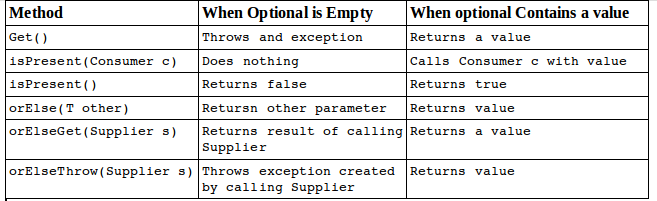
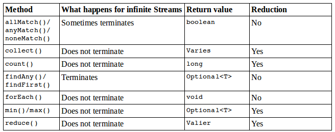

# Using Variables in Lambda
In Chapter one we covered the ide of "effectively final". This means that if you could add the final modifier to a local variable, it is "effectively final".
Lambda expressions can access static variables, instance variables, effectively final method parameters and effectively final local variables. Let's see how many of those we can find in the example below:
```java
interface Gorilla{ String move();}
class GorillaFamily{
  String walk = "walk";
  void everyonePlay(boolean baby){
    String aproach = "amble";
    //aproach = "run";
    
    play(() -> walk);
    play(() -> baby ? "hitch a ride" : "run");
    play(() -> approach);
  }
  
  void play(Gorilla g){
    System.out.println(g.move());
  }

}

```
The first play lambda uses an instance variable in the lambda. The secon play lambda uses a method parameter and we know it is effectively final because there are no reassignments to that variable. The last play lambda uses an effectively final local variable. However if we try uncommenting line 6 will no longer be effectively final. This will cause a compile error on line 10 which is the last play() method. Bear in mind that a normal rules for access control still apply. For example, a lambda can't access private variables in another class. Remember that lambdas can access a subset of variables that are accessible, but never more tha that.

# Working with Built-In Functional Interfaces
As you remember, a functional interface has only one abstract method. All of the funtional interfaces in the table below were introduced in Java 8 and are provided in the ``` java.util.function ``` package. The convention here is to use generic type T for type param. If a second type param is needed, the next letter U, is used. If a distinct return type is needed, R for return is used for generic type.


There are many other functional interfaces defined in ```java.util.function``` for working with primitives. You do need to memorize the table above.

Now let's see how these functional interfaces are implemented.

## Implementing Supplier
A ```Supplier``` is used when you want to generate or supply values without taking any input. The interface is defined as:

```java
@FunctionalInterface
public interface Supplier<T>{
  public T get();
}
```
You can use the Supplier in the following manner:

```java
Supplier<LocalDate> s1 = LocalDate::now;
Supplier<LocalDate> s2 = () -> LocalDate.now();

LocalDate d1 = s1.get();
LocalDate d2 = s2.get();

System.out.println(d1);
System.out.println(d2);
```


This example prints a data suck as 2018-01-05 twice. It is also a good opportunity to review static method references. The ```LocalDate::now``` reference is used to create a Supplier to assign to an intermidiate variable s1. A Supplier is often used when constructing new objects. For example, we can print two empty StringBuilders:

```java
Supplier<StringBuilder> s1 = StringBuilder::new;
Supplier<StringBuilder> s2 = () -> new StringBuilder();

System.out.println(s1.get());
System.out.println(s2.get());
```

This time, we use a constructor reference to create the object. We've been using generics to declare what type of Suppliers we are using. 

Another example of Supplier is as follows:

```java 
 final AtomicInteger count = new AtomicInteger(10);
 Supplier<Integer> supplier = () -> count.incrementAndGet();
 System.out.println(supplier.get());
```

As you can see in the code above the first line creates an object of AnotmicInteger with value of 10. In the second line we pass a lambda expression that takes no argument, as per Supplier interface takes no arguments, and increment the number. This expression is stored into the Supplier variable called supplier. In order to execute this expression we need to call the get() method of the Supplier Interface. This number then gets printed. 

## Implementing Consumer and BiConsumer
You use ```Consumer``` when you want to do something with a parameter but not return anything. ```BiConsumer``` does the same thing except that it takes two parameters. Ommitting the default methods, the interfaces are defined as follow:

```java
@FunctionalInterface
public interface Consumer<T>{
  void accept(T t);
}

@FunctionalInterface
public interface Consumer<T, U>{
  void accept(T t, U u);
}
```

Now see how to make use of it:

```java
Consumer<String> c1 = System.out::println;
Consumer<String> c2 = x -> System.out.println(x);

c1.accept("Annie");
c2.accept("Annie");

```
This example prints Annie twice. 

Another example is to use a forEach() method that takes a Consumer as parameter, so it is perfect to show as example.

```java
List<Integer> list = Arrays.asList(2,5,3,7,1);
//list.forEach((x) -> System.out.println(x));

Consumer<Integer> consumer = new Consumer<Integer>() {
    @Override
    public void accept(Integer i) {
      System.out.println(i.intValue());
    }
};
list.forEach(consumer);

```
In the example above, we can either pass a lambda expression into the forEach() method as per the line that is commented out. Or we can also pass a consumer. Passing a consumer is the long way of doing it but it kind of demostrate the use of the Consumer Interface. 

Now, ```BiConsumer``` is called with two parameters. They don't have to be the same type. For example, we can put a key and a value in a map using this interface.

```java
Map<String, Integer> map = new HashMap<>();
BiConsumer<String, Integer> b1 = map::out;
BiConsumer<String, Integer> b2 = (k,v) -> map.put(k,v);

b1.accept("chicken", 7);
b2.accept("pollo", 1);

System.out.println(map);
```
The output is {chicken = 7, pollo = 1} which shows that both BiConsumer implementations did get called. The code to instantiate b1 is a bit shorter that b2. This might be why the exam is so fond of method references. 

As another example, we use the same type for both generic parameters:
```java
Map<String,String> map = new HashMap<>();
BiConsumer<String,String> b1 = map::put;
BiConsumer<String,String> b2 = (k,v) -> map.put(k,v) ;

b1.accept("chicken","Cluck");

```

## Implementing Predicate and BiPredicate
```Predicate``` is often used when filtering or matching. A ```BiPredicate``` is just like a ```Predicate``` except that it takes two parameters instead of one. 

```java
@FunctionalInterface
public interface Predicate<T>{
  boolean test(T t);
}

@FunctionalInterface
public interface BiPredicate<T, U>{
  boolean test(T t, U u);
}
```

It should be old news by now that you can use a ```Predicate``` to test a condition. See below:

```java
Predicate<String> p1 = String::isEmpty;
Predicate<String> p2 = x -> x.isEmpty();

System.out.println(p1.test(""));
System.out.println(p2.test(""));

```
This prints true twice. More interesting is a BiPredicate. This example also prints true twice:

```java
BiPredicate<String, String> b1 = String::startsWith;
BiPredicate<String, String> b2 = str,word -> str.startsWith(word);

System.out.println(b1.test("chicken","chick"));
System.out.println(b2.test("chicken","chick"));
```

The method refernce conbines two techniques that you have seen. StartsWith() is an instance method. This means that the first parameter in the lambda is used as the instance on which to call the method. The second parameter in the lambda is passed to the startsWith() method itself. This is another example of how method references save a bit of typing. The downside is that are less explicit, and you really have to understand what is going on.

## Implementing Function and BiFunction
A ```Function``` is responsible for turning one parameter into a value of a potentially different type and returning it. Similarly, a ```BiFunction``` is resposible for turning two parameters into a value and returning it. Omitting anu default or static methods, the interface are defined as the following:

```java
@FunctionalInterface
public interface Function<T, R>{
  R apply(T t);
}

@FunctionalInterface
public interface BiFunction<T, U, R>{
  R apply(T t, U u);
}

```
For example, this function converts a String to the length of the String:

```java
Function<String, Integer> f1 = String::length;
Function<String, Integer> f2 = s -> s.length();

System.out.println(f1.apply("aloha"));       //5
System.out.println(f2.apply("panda"));       //5

```

This function turns a String into an Integer. Well, it turns String into an int, which is autoboxed into an Integer. The following example combines two string objects and produces another one.

```java
BiFunction<String, String, String> b1 = String::concat;
BiFunction<String, String, String> b2 = (str,toAdd) -> str.contact(toAdd);

System.out.println(b1.apply("baby ","panda"));
System.out.println(b2.apply("baby ", "panda"));
```

The first two types in the BiFunction are the input types. The third is the return type. For the method reference, the first parameter is the instance that contact() is called on and the second is the param passed to contact();

:yin_yang: **Creating Your Own Functional Intrefaces** Java provides a built-in interface for functions with one or two params. What of you need more? Suppose you want to create a functional interface for the wheel spped of each wheel in a tricycle. The it would look like:
```java
@FunctionalInterface
public interface TriFunction<T,U,V,R>{
    R apply(T t, U u, V v);
}
```
Now suppose that you want to create for the same but for your quad. Then:

```java
@FunctionalInterface
public interface QuadFunction<T,U,V,W,R>{
    R apply(T t, U u, V v, W w);
}
```

Java built in interface are meant to facilitate the most common functional interfaces. But you can add any functional interface you'd like and Java matches them when you use lambdas or method references.

## Implementing UnaryOperator and BinaryOperator
Unary and binary operator are special case of a function. They require all parameters to be of the same type. A ```UnaryOperator``` transforms its value into one of the same type. For example incrementing by one is a UnaryOperator. In fact extends ```Function```. A ```BinaryOperator``` merges two values into one of the same type. Adding two numbers is a binary operation. Similarly, ```BinaryOperator``` extends ```BiFunction```. 

```java
@FunctionalInterface
public interface UnaryOperator<T> extends Function<T,T>{
  T apply(T t);
}

@FunctionalInterface
public interface BinaryOperator<T,T> extends BiFunction<T,T,T>{
  T apply(T t1,T t2);
}

```

Below you can find an example of usage:

```java
UnaryOperator<String> u1 = Stirng::toUpperCase;
UnaryOperator<String> u2 = s -> s.toUpperCase();

System.out.println(u1.apply("chirp"));
System.out.println(u2.apply("chirp"));
```

This prints CHIRP twice. We don't have to specify the return type in the generics because ```UnaryOperator``` requires it to be the same type as the parameter. And now for the binary example:

```java
BinaryOperator<String> b1 = String::concat;
BinaryOperator<String> b2 = (string, toAdd) -> string.concat(toAdd); 

System.out.println(b1.apply("baby ", "panda"));   //baby panda
System.out.println(b2.apply("baby ", "panda"));   //baby panda 
```


## Checking Functional Interfaces
Now would be a good time to memorize table above on functional interfaces. Let's see a few examples to put it into practice. What functional interface would you use in these situations?

- Returns String without taking any parameter?
- Returns a Boolean and takes a String.
- Returns an Integer an takes two Integers.

Ready? OK, the first one is a ```Supplier``` because it generates an Object and takes zero params. The second is a ```Function``` because it takes one parameter and returns another type. Its a little tricky because you might thing it returns a boolean and therefore is a predicate but it returns a Boolean Object. Finally the third one is either a ```BiFunction``` or a ```BinaryOperator``` but ```BinaryOperator``` is a bettern answer because it is more specific.

Now, let's do another exercise but with code:

```java
6:  _____<List> ex1 = x -> "".equals(x.get(0));
7:  _____<Long> ex2 = (Long l) -> System.out.println(l);
8:  _____<String, String> ex3 = (s1, s2) -> false;
```

Ready? OK, line 6 is a ```Predicate``` because it takes one parameter and returns a boolean value. Line 7 is ```Consumer``` because it takes one param and does not return anything. Line 8 is a ```BiFunction``` because it takes two parans and returns a boolean value.

Now, let's do some tricky examples to identify the error:

```java
6: Function<List<String>> ex1 = x -> x.get(0);  //DOES NOT COMPILE
7: UnaryOperator<Long> ex2 = (Long l) -> 3.14;  //DOES NOT COMPILE
8: Predicate ex4 = String::isEmpty;             //DOES NOT COMPILE

```

Line 6 is wrong because a function has to specify two generics - the input and the return value type. The return value type is missing from line 6 causing the code not to compile. Line 7 is a ```UnaryOperator``` which returns the same type as the parameter it is passed in. Line 8 is missing the generic of the parameter for ```Predicate```. This makes the parameter that was passed an Object rather than a String. The lambda expects a String because it calls a method that only exists in the String object rather than an Object. Therefore, it does not compile.


# Returning an Optional
How do we express the idea that a variable's value is not set yet if we don't want to use ```null``` ? In java 8, we use the ```Optional``` type. An Optional is created using a factory. Yoyu can either request an empty Optional or pass a value for the Optional to wrap. Think of an Optional as a box that might have something in it or might instead be empty.

Let's see how it looks in the code:

```java
public static Optional<Double> average(int... scores){
  if(scores.length == 0) return Optional.empty();
  
  int sum = 0;
  for(int score : scores) sum += score;
  return Optional.of((double) sum / scores.length);
  
}
```

As you can see the code returns an empty optional when we can't calculate the average. The next lines add the scores. The last line creates an Optional to wrap the average. See below to see what's the value in the Optional box:

```java
System.out.println(average(90,100));      //Optional[95.0]
System.out.println(average());            //Optional.empty
```
You can see that one optional contains a value and the other is empty. Normally, we want to check if a value is there and/or get it out the box. Here is one way to do that:

```java
Optional<Double> opt = average(90,100);
if(opt.isPresent()){
  System.out.println(opt.get());      //95.0
}
```

The secod line checks whether it contains a value and the next line prints it out. What if we didn't do the check and the Optional was empty? 

```java
Optional<Double> opt = average();
System.out.println(opt.get());      //bad

```

We'd get an exception since there is no value inside the Optional:

``` java.util.NoSuchElementExcetion: No value present ```

When creating an Optinal it is common to want to use empty when the value is null. You can do this with an if or ternary operation. 

```java
Optional o = (value == null) ? Optional.empty() : Optional.of(value);
```

If value is null, o is assigned the empty Optional. Otherwise, we wrap the value. Since this is such a common pattern, Java provides a factory method to do the same thing. The code below and above achieve the same thing.

```java
Optional o = Optional.ofNullable(value);
```

The following table covers what I need to know for the exam.



You've already seen get() and isPresent(). The other methods allow you to write code that uses an Optional in one line without having to the ternay operator. This makes the code easier to read. Instead of using an if statement we can specify a ```Consumer```  to be run when there is a value inside the Optional. When there isn't the method simply skips running the ```Consumer```: 

```java
Optional<Double> opt = average(90,100);
opt.ifPresent(System.out::print);
```

Using ifPresent() better expresses our intent. We want something done if a value is present. The other methods allow you to specify what to do if a value isn't present. There are three choices:

```java
30: Optional<Double> opt = average();
31: System.out.println(opt.orElse(Double.NaN));
32: System.out.println(opt.orElseGet(() -> Math.random()));
33: System.out.println(opt.orElseThrow(() -> new IllegalStateException()));

```
and this prints something like this:

```
NaN
0.445566787878712
Exception in  thread "main" java.lang.IllegalStateException
  at optional.Average.lambda$3(Average.java:56)
  at optional.Average$$lambda .......
  at java.util.optional.orElseThrow(Optional.java:290)
```
Line 31 shows that you can return a specific value or variable. In our case we print "Not a Number". Line 32 shows using a Supplier to generate a value at runtime. Line 33 shows using a different Supplier to create a exception that should be thrown. 

Notice that the two methods that takes Supplier have different names. Do you see why this code does not compile? 

```
System.out.println(opt.orElseGet(() -> new IllegalStateException()));   //DOES NOT COMPILE
```

opt is an Optional<Double>. This means the Supplier must return a Double. Since this supplier returns a exception , the type does not match. The last example with Optional is really easy. What do you think this does?
  
  ```java
  Optional<Double> opt = average(90,100);
  System.out.println(opt.orElse(Double.NaN));
  System.out.println(opt.orElseGet(() -> Math.random()));
  System.out.println(opt.orElseThrow(() -> new IllegalStateException()));
 ```
 
 In this case it prints out 95 three time. Since the value does exist, there is no need to use the or else logic. 
 
 :yin_yang:  **Is Optional the same as null?** before Java 8 programmers would return null instead of Optional. There were a few  shortcomings with these approach. One is that there was a clear way to express that null might be a special case. By contrast, returning an Optional is a clear statement in the API that there might be a value in there. Another advantage of Optional is that you can use functional programming style with isPresent() and the other methods rather than needing an if statement. Finally, you can chain Optional calls.
 
# Using Streams
A ```stream``` in Java is a sequence of data. A ```stream pipeline```  is the opearations that run on a stream to produce a result. Think of a stream pipeline like a assembly line in a factory. In assembly production the second person cannot do anything until the first person has done his task and so on and so forth. There are three parts to a stream pipeline:
- ```Source```: Where the stream comes from
- ```Intermediate Operations```: Transform the stream into another one. There can be as few or as many intermidiate operations as you'd like. Since stream use lazy evaluation, the intermidiate operations do not run until the terminal operation runs.
- ```Terminal operations```: Actually produces a result. Since streams can be used only once, the stream is no longer valid after a terminal operation completes. 

## Creating Stream Sources
in Java the Stram interface is in java.util.stream package. There are a few ways to create a finite stream:
```java
1:  Stream<String> empty = Stream.empty();            // count = 0
2:  Stream<Integer> singleElement = Stream.of(1);     // count = 1
3:  Stream<Integer> fromArray = Stream.of(1,2,3)      // count = 2
```

Line 1 shows how to create an empty array. Line 2 shows how to create a stream with a single element. Line 3 shows how to create a stream from an array. 

Since streams are new in Java 8, most code that is already written uses lists. Java provides a convenient way to convert from a list to a stream:

```java
4:  List<String> list = Arrays.asList("a","b","c");
5:  Stream<String> fromList = list.stream();
6:  Stream<String> fromListParallel = list.parallelStream();
```

Line 5 shows that is a simple method to create a stream from a list. Line 6 does the same except that it creates a stream that is allowed to process elements in parallel. Just keep in mind that it isn't worth working in parallel for small streams. There is an overhead cost in coordinating the work among all of the workers operating in parallel. For small amounts of work is faster to do it sequentially.

```java
7:  Stream<Double>  randoms = Stream.generate(Math::random);
8:  Stream<Integer> oddNumbers = Stream.iterate(1, n -> n + 2); 
```
Line 7 generates a stream of random numbers. As meny as you need. Line 8 takes a starting value as first parameter. The other param is the lambda expression that gets passed the previous value and generates the next value. As with the random numbers example, it will keep producing odd numbers as long as you need them.


## Using Common Terminal Operations
You can perfom terminal operations without any intermidiate operations but not the other way around. ```Reductions``` are a special type of terminal operations where all of the contents of the stream are combined into a single primitive or Objects.For example you might have an int or a Collection. The table below summarizes this section. 



### count()
The count() method determines the number of elements in a finite stream. For a infinite stream it hangs. Count() is a reduction because it looks at each of the element in the stream and returns a single value. Method signature is this:
```java
long count()
```
The example below shoes calling count() on a finite stream:

```java
Stream<String> s = Stream.of("monkey","gorilla","panda");
System.out.println(s.count());  //3
```
### min() and max()
The min() and max() methods allow you to pass a custome comparator and find the smallest or largest value in a finite stream according to that sort order. Like count(), max() and min() also hang for infinite streams. Both methods are reductions because they return a single value after looking at the entire stream. The method signature as follows:

```java
Optional<T> min(<? super T> comparator);

Optional<T> max(<? super T> comparator);
```
This example finds the animal with the fewest letters in its name:

```java
Stream<String> s = Stream.of("monkey","ape","panda");
Optional<String> min = s.min((s1,s2) -> s1.length() - s2.length());
min.ifPresent(System.out::println);   //ape
```

Notice that the code returns Optional rather than the value. This allows the method to specify that no minimum or maximum was found. We use the Optional method and a method reference to print out the minimum only if one is found. 

As an example of where there isn't a minimum, let's look at an empty stream:

```java
Optional<?> minEmpty = Stream.empty().min((s1,s2) -> 0);
System.out.println(minEmpty.isPresent());         //false
```

Since the stream is empty, the comparator is never called and no value is present in the Optional. 

### findAny() and findFirst()
These two methods return an element of the stream unless the stream is empty. If the stream is empty they return an empty Optional. FindAny() is useful when you are working with parallel stream. It gives java the flexibility to return to you the first element it comes by rather than the one that needs to be first in the stream based on the intermidiate operations. These are terminal operations but not reductions. They return a value based on the stream but do not reduce the entire stream into one value.

The method signatures are this:

```java
Optional<T> findAny();
Optional<T> findFirst();

```
This example finds an animal:

```java
Stream<String> s = Stream.of("monkey","gorilla","panda");
Stream<String> infinite = Stream.generate(() -> "chimp");
s.findAny().ifPresent(System.out::println);             // monkey
infinite.findAny().ifPresent(System.out::println);      // chimp

```
Finding any match is more useful than it sounds. Sometimes we just want to sample the result and get a representative element.

### allMatch(), anyMatch() and noneMatch()
These methods search a stream and return information about how the stream pertains to the predicate. These may or may not terminate for infinite streams. It depends on the data. They are not reductions because they do not necessarily look at all of the elements. 

The method signature is as follow:

```java
boolean anyMatch(Predicate <? super T > predicate )
boolean allMatch(Predicate <? super T > predicate )
boolean noneMatch(Predicate <? super T > predicate )
```

This example checks whether animal names begin with letters:

```java
List<String> list = Arrays.asList("monkey","2","chimp");
Stream<Stream> infinite = Stream.generate(() -> chimp");

Predicate<String> pred = x -> Character.isLetter(x.charAt(0));
System.out.println(list.stream().anyMatch(pred));       //true
System.out.println(list.stream().allMatch(pred));       //false
System.out.println(list.stream().noneMatch(pred));      //false 
System.out.println(infinite.anyMatch(pred));            //true
```

This shows that we can reuse the same predicate, but we need a different stream each time. anyMatch() returns true because two of the three elements match. allMatch() returns false because one doesn't match. noneMatch() also returns false because one matches. On the infinite list, one match is found so the call terminates. If we called noneMatch() or allMatch(), they would run until we killed the program.

:yin_yang: remember that allMatch(), anyMatch() and noneMatch() return a boolean. By contrast, the find methods return an Optional because they return an element in the stream.
### forEach()
A looping construct is available. Calling forEach() on a inifinite construct does not terminate. Since there is no a return value it is not a reduction. 

The method signature as follows:

```java
void forEach(Consumer<? super T> action)
```

Notice that this is the only terminal operation with a return type of void. If you want something to happen you have to make it happen in the loop. Here is one way to print the elements in the stream. There are no other ways, which we cover later in the chapter.

```java
Stream<String> s = Stream.of("Monkey","Gorilla","Bonobo");
s.forEach(System.out::print);        // MonkeyGorillaBonobo
```
Notice that you cannot use the traditional for loop on a stream:

```java
Stream s = Stream.of(1);
for(Integer i : s){}      //DOES NOT COMPILE
```
While forEach() sounds like a loop, it is really a terminal operator for streams.Streams cannot use a traditional for loop to run because they don't implement the iterable interface.

### reduce()
The reduce() method conbines a stream into a single object. As you can tell from the name, it is a reduction. The method signatues are these:

```java
T reduce(T identity, BinatyOperator<T> accumulator);

Optional<T> reduce(BinatyOperator<T> accumulator);

<U> U reduce(U identity, BiFunction<U, ? super T, U> accumulator, BinatyOperator<U> conbiner);
```

The most common way of doing a reduction is to start with an initial value and keep merging it with the next value. Think how would you concatenate an array of String into a single String without functional programming. It might look something like this:

```java
String[] array = new String[] {"w","o","l","f"};
String result = "";
for(String s: array) result = result + s;
System.out.println(result);
```

The initial value of an empty String is the indentity. The accumulator combines the current result with the current String. With lambdas, we can do the same thing with a stream and reductions:

```java
Stream<String> stream = Stream.of("w","o","l","f");
String word = stream.reduce("", (s,c) -> s + c);
System.out.print(word);           //wolf  

```

Notice how we still have the empty String as the identity. We also still concatenate the String to get the next value. We can also rewrite this with a method reference:

```java
Stream<String> stream = Stream.of("w","o","l","f");
String word = stream.reduce("", String::concat);
System.out.println(word);         //wolf
```

Another example, we can try reduction to multiply all of the Integers in a Stream.

```java
Stream<Integer> stream = Stream.of(3,5,6);
System.out.println(stream.reduce(1, (a, b) -> a*b));

```
We set the identity to 1 and the accumulator to multiplication. In many case the identity isn't really neccesary, So Java lets us omit it. When you don't specify the identity an Optional is returned because there might not be any data. There are three choices for what is in the Optional:
- If the stream is empty, an empty Optional is returned 
- If the stream has one element, it is returned.
- It the stream has multiple elements, the accumulator is applied to combine them.

The following illustrate each of the scenarios:

```java
BinaryOperator<Integer> op = (a,b) -> a*b;
Stream<Integer> empty = Stream.empty();
Stream<Integer> oneElement = Stream.of(3);
Stream<Integer> threeElements = Stream.empty(3, 5, 6);

empty.reduce(op).ifPresent(System.out::print);          //NO OUTPUT
oneElement.reduce(op).ifPresent(System.out::print);     //3
threeElements.reduce(op).ifPresents(System.out::print)  //90
```

Why are there two similar methods? Sometimes it is nice to differentiate the case where stream is empty rather than the case where there is a value that happens to match the identity beign returned from calculation. The signature returning an optional let us differentiate these cases. For example, we might return Optional.empty() when the stream is empty and Optional.of(3) when there is a value.

The third method signature is used when we are processing collections in parallel. Java assumes that the stream might be parallel. This is handy because it lets us switch to a parallel stream easily in the future:

```java
BinaryOperator<Integer> op = (a, b) -> a * b;
Stream<Integer> stream = Stream.of(3, 5, 6);
System.out.println(stream.reduce(1, op, op));   //90

```
### collect()
The collect method is a special type of reduction called *mutable reduction*. It is more efficient than a regular reduction because we use the same mutable object while accumulating. Common mutable objects include ```StringBuilder``` and ```ArrayList```. This method lets you get data out of streams and into another form. The method signatures are as follows:

```java
<R> R collect(Supplier<R>, BiConsumer<R, ? super T> accumulator, BiConsumer<R, R> combiner)

<R, A> R collect(Collector<? super T, A, R> collector)
```
Let's see the first signature, which is used when we want to code specifically how collecting should work. Our wolf example from reduce can be converted to use collect():

```java
Stream<String> stream = Stream.of("w","o","l","f");
StringBuilder word = Stream.collect(StringBuilder::new, StringBuilder::append, StringBuilder::append);
```

The first param is a Supplier that creates the object that will store the results as we collect data. Remeber that a Supplier does not take any param and returns a value. In this case, it constructs a new StringBuilder.

The second param is a BiConsumer, which takes two params and doesn't return anything. It is resposible for adding one more element to the data collection. In this example it appends the next String to the StringBuilder.

The final param is another BiConsumer. It is responsible for taking two data collections and merging them. This is useful when we are processing in parallel. Two smaller collections are formed and then merged into one. This would work with StringBuilder only if we didn't care about the order of the letters. In this example the accumulator and the combiner had the same logic.

Now, let's look at an example where the logic is different in the accumulator and combiner:

```java
Stream<String> stream = Stream.of("w","o","l","f");
TreeSet<String> set = stream.collect(TreeSet::new, TreeSet::add, TreeSet::addAll);
System.out.println(set);      //[f,l,o,w]
```

The collector has three part as before. The Supplier creates an empty TreeSet. The accumulator adds a single Styring from Stream to the TreeSet. The combiner adds all of the elements of one TreeSet to another in case the operations were done in parallel and need to be merged.  This collector() method is very importart to know how it works because it is going to appear in the exam. Rather than making developers keep implementing the same ones , Java provides an interface with common collectors. For example, we could rewrite the previous example as follows:

```java
Stream<String> stream = Stream.of("w","o","l","f");
TreeSet<String> set = stream.collect(Collectors.toCollection(TreeSet::new));
System.out.println(set);      //[f, l, o, w]
```

If we didn't need the set to be sorted, we could make the code even shorter:

```java
Stream<String> stream = Stream.of("w","o","l","f");
TreeSet<String> set = stream.collect(Collectors.toSet());
System.out.println(set);      //[f,w,l,o]
```

The exam expects you to know about common predifined collectors in addition to beign able to write your own by passing a supplier, accumulator and a combiner.

To recap, collect() method is a terminal operation to transform the elements of the stream into a different king of result, ie List, set or map. Collect accepts a Collector which conssists of four different operations: a supplier, an accumulator, a combiner and a finisher. Java 8 supports various built-in collectors via the collector class. So for most common operations you dont have to implement a collector yourself. 

```java
class Person {
    String name;
    int age;

    Person(String name, int age) {
        this.name = name;
        this.age = age;
    }

    @Override
    public String toString() {
        return name;
    }
}

List<Person> persons =
    Arrays.asList(
        new Person("Max", 18),
        new Person("Peter", 23),
        new Person("Pamela", 23),
        new Person("David", 12));
```
Let see a very common use case:
```java
List<Person> filtered = persons
                                .stream()
                                .filter(p -> p.name.startsWith("P"))
                                .collect(Collectors.toList());
System.out.println(filtered);   //[Peter. Pamela]
```
As you can see is very simple to constructs a list from the elements of a stream. If you need a set instead of a list - just use ```Collectors.toSet()```

The next example groups all person by age:

```java
Map<Integer, List<Person>> personsByAge = persons
    .stream()
    .collect(Collectors.groupingBy(p -> p.age));

personsByAge.forEach((age, p) -> System.out.format("age %s: %s\n", age, p));

//age 18: [Max]
//age 23: [Peter, Pamela]
//age 12: [David]
```

Collectors are extremely versatile. You can also create a aggregation on the element of the stream, for example determining the average age of all persons.

```java
Double avergaeAge = persons
    .stream()
    .collect(Collectors.averageingInt(p -> p.age));
System.out.println(avergaeAge);    

```

The next example joins all persons into a single string:

```java
String phrase = persons
  .stream()
  .filter(p -> p.age >= 18)
  .map(p -> p.name)
  .collect(Collectors.joining(" and", "In Germany", " are of legal age"));
System.out.println(phrase);
// In Germany Max and Peter and Pamela are of legal age
```
The join collector accepts a delimiter as well as an optional prefix and suffix.

In order to transform trhe stream elements into a map, we have to specify how both the keys and the values should be mapped. Keep in mind that the mapped keys must be unique, otherwise an ```IllegalStateException```:

```java
Map<Integer, String> map = persons
  .stream()
  .collect(Collectors.toMap(
    p -> p.age,
    p -> p.name,
    (name1, name2) -> name1 + ";" + name2));

System.out.println(map);    
// {18=Max, 23=Pamela, 12=David}
```

Now that we have seen the built-in collectors, we can also build our own special collector. We want to transform all persons of the stream into a single string consisiting of all names in upper case separated by the pipe ¦ character. In order to achieve this we create a new collector via ```Collector.of()```. We have to pass the four ingredients of a collector: a supplier, an accumulator, a combiner and a finisher:

```java
Collector<Person, StriungJoiner,String> personNameCollector = 
    Collector.of(
        () -> new StringJoiner("  |  "),            //supplier
        (j, p) -> j.add(p.name.toUpperCase()),      //accumulator
        (m, n) -> m.merge(n),                       //combiner
        StringJoiner::toString);                    //finisher
String names = persons
  .stream()
  .collect(personNameCollector);
  
System.out.println(names);        // MAX | PETER  |  PAMELA  |  DAVID  
```

Since strings in Java are immutable, we need a helper class like StringJoiner to let the collector constructs our string. The suppliuer initially coinstructs such a StringJoiner with the appropriate delimiter. The accumulator is used to add each persons upper-cased name to the StringJoiner. The combiner knows how to merge two StringJoiners into one. In the last step the finisher constructs the desired String from the StringJoiner.

## Using Common Intermediate Operations
Unlike a terminal operation, intermidiate operations deail with infinite streams simply by returning an infinite stream. Since elements are produced only as needed, this works fine. 

### filter()
The fileter method returns a Stream with elements that match a given expression. Here is the method signature:

```java
Stream<T> filter(Predicate<? super T> predicate)
```

This operation is easy to remeber and very powerful because we can pass any Predicate to it. For example, this filters all elements that begin with the letter m:

```java
Stream<string> s = Stream.of("monkey","gorilla","bonobo");
s.filter(x -> x.startsWith("m")).forEach(System.out::print);    //monkey
```
### distict()
The distinct method returns a stream with duplicate values removed. The duplicates do not need to be adjacent to be removed. As you might imagine, Java calls equals() top determine whther the object are the same. The method signature is as follows:

```java
Stream<T> disitinct()
```

Here is an example:

```java
Stream<String> s = Stream.of("duck","duck","duck","goose");
s,distinct().forEach(System.out::print);        //duckgoose

```
### limit() and skip()
The limit and skip methods make a Stream smaller. They could make a finite stream smaller, or they could make a finite stream out of an infinite stream. The method signature are shown here

```java
Stream<T> limit(int maxSize)
Stream<T> skip(int n)
```

The following code creates an infinite stream of numbers counting from 1. The skip() operation returns an infinite stream starting with the number counting from 6, since it skips the first five elements. The limit() call takes the first two of those. Now we have a finite stream with two elements:

```java
Stream<Integer> s = Stream.iterate(1, n -> n + 1);
s.skip(5).limit(2).forEach(System.out::print);    //67

```
### map()
The map() method creates a one-to-one mapping from the elements in the stream to the elements of the next step in the stream. The method signature is as follows:

```java
<R> Stream<R> map(Function<? super T, ? extends R> mapper)
```

This one looks more complicated the the others you've seen. It uses the lambda expressions to figure out the type passed to that function and the one returned . The return type is the stream that gets returned. The map() method on stream is for transforming data. Don't copnfuse with the Map interface, which maps keys to values.

As an example, this code copnverts a list of String objects to a list of integers representing their lengths:
```java
Stream<String> s = Stream.of("monkey","gorilla","bonobo");
s.map(String::length).forEach(System.out::print);     //676
```
Remember that String::length is shorthand for the lambda x -> x.length() which clearly showes it is a function that turns into an integer
### flatMap() 
top-level element in a single stream. This is useful when you want to remove empty elements from a stream or you want ot combine a stream of lists. The method signature is a gibberish that you are not expeted to remember. Just know that it returns a Stream of the type that the function contains at the lower level. Don't worry about the signature is just headaches. What you should understand is the example below. It gets all of the animals into the same level along with getting rid of the empty list:

```java
List<String> zero = Arrays.asList();
List<String> one = Arrays.asList("Bonobo");
List<String> two = Arrays.asList("Mama gorilla", "Baby gorilla");
Stream<List<String>> animals = Stream.of(zero, one, two);

animals.flatMap(l -> l.stream()).forEach(System.out::println);
```

Here is the output:

```
Bonobo
Mama gorilla
Baby gorilla
```

As you can see it removed the empty list completely and changed all elements of each list to be at the top level of the stream.

### sorted()
This method returns a Stream with the elements sorted. just like sorting arrays, Java uses natural ordering unless we specify a comparator. The method signature are these:

```java
Stream<T> sorted()
Stream<T> sorted(Comparator<? super T> comparator)
```
Calling the first signature uses the default sort order:
```java
Stream<String> s = Stream.of("brown-", "bear-");
a.sorted().forEach(Syste.out::print);       //bear-brown
```

Remember that we can pass a lambda expression as the comparator. For example, we can pass a Comparator implementation:

```java
Stream<String> s = Stream.of("brown bear-", "grizzly-");
s.sorted(Comparator.reverseOrder()).forEach(System.out::print);   //grizzly-brown bear-
```
Here we passed a comparator to specify that we want to sort it in reverse of natural sort order. Ready for a tricky one? Do you see why this doen't compile?

```java
a.sorted(Comparator::reverseOrder);   //DOES NOT COMPILE
```

Take a look at the method signature again. Comparator is a functional Interface. This means that we can use method reference or lambdas to implement it. The Comparator interface implements one method that takes two string parameters and returns an int. However, Comparator::reverseOrder doesn't do that. It is a reference to a function that takes zero parameters and returns a comparator. This is not compatible with the interface. This means that we have to use a method and not a method reference. we bring this up to remind you that you really need to know method references well.

### peek()
The peek method is useful for debbugging because it allows us to perform a stream operations without actually changing the stream. The method signature is as follows:

```java
Stream<T> peek(Consumer<? super T> action)
```

The most common use for peek() is to output the content of the stream as it goes by. Suppose the we made a typo and counted bears beginning with tyhe letter g instead of b. We are puzzled why the count is 1 instead of 2. We can add a peek() to find out why:

```java
Stream<String> stream = Stream.of("black bear", "brown bear", "grizzly");
long count = stream.filters(s -> s.startsWith("g"))
         .peek(System.out::println).count();            //grizzly
System.out.println(count);
```

When working with a Queue peek() looks only at the first element. In a stream, peek() looks at each element that goes through that part of the stream pipeline. It's like having a worker take notes on how a particular step of the process is doing.

Remeber that peek is intended to perform an operation without changing the result. 
## Putting Together the Pipeline
Streams allow you to use chaining and express what you want to accomplish rather than how to do so. Let's say we wanted to get the first two names alphabetically that are four character long. In Java 7 we had to write something like the following:

```java
List<String> list = Arrays.asList("Toby","Anna","Leroy","Alex");
List<String> filtered = new ArrayList<>();
for(String name: list){
  if(name.length() == 4) filtered.add(name);
}
Collections.sort(filtered);
Iterator<String> iter = filtered.iterator();

if(iter.hasNext()) System.out.println(iter.next());
```

This works. It takes sometime to figure out what it does but it works. The problem we are trying to solve gets lost in the implementation. It is also very focused on the how rather than on the what. In Java 8, the equivalent code is as follows:

```java
List<String> list = Arrays.asList("Toby","Anna","Leroy","Alex");
list.stream()
  .filter(n -> n.length() == 4)
  .sorted()
  .limit(2).
  .forEach(System.out::print);
```

The difference is that we express what is going on. We care about String objects of length 4. Then we want them to be sorted. Then we want the first two and then we want to print them out. It maps better to the problem that we are trying to solve, and it si simpler because we dont have to deal with counters and such. Once you start using streams in your code, you might find yourself using them in many places. In this example you have seen all three parts of the pipeline. 


## Printing a Stream

# Working with Primitives
## Creating Primitive Streams
## Using Optional with Primitive Streams
## Summararizing Statistics
## Learning the Functional Interfaces for Primitives
### Functional Interfaces for boolean
### Functional Interfaces for double, int and long

# Working with Advanced Stream Pipeline Concepts
## Linking Streams to the Underlying Data
## Chaining Optional 
## Collecting Results
### Collecting Using Basic Collectors 
### Collecting into Maps
### Collecting Using Grouping, Partitioning and Mapping 
