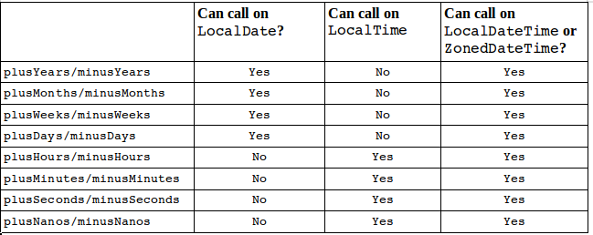
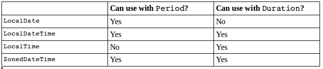
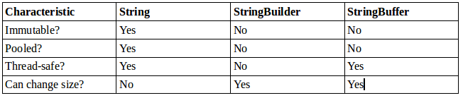
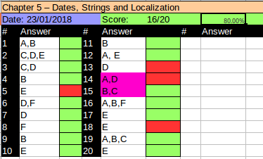

# Working with Dates and Times
In Java 8, Oracle revamped how we work with dates and times. You can still write code the old way but those classes aren't in the exam. You need to import ```import java.time.*;``` package.

## Creating Dates and Times
When working with dates and times the first thing you do is to decide how much information you need. The exam gives you four choices:
- **LocalDate**: Contains just a date - no time and no time zone. A good example of LocalDate is your birthday this year.

- **LocalTime**: Contains just time - no date and no time zone. A good example of LocalTime is midnight.

- **LocalDateTime**: Contains both a date and time but no time zone.

- **ZonedDateTime**: Contains a date, time and time zone.

Oracle recommends avoiding time zones unless you really need them. Try to act as if everyone is in the same time zone when you can. You obtain date and time instances suing a static method:

```java
System.out.println(LocalDate.now());              //2018-01-21
System.out.println(LocalTime.now());              //11:39:40.456
System.out.println(LocalDateTime.now());          //2018-01-21T11:39:40.456
System.out.println(ZonedDateTime.now());          //2018-01-21T11:39:40.456-04:00[America/New_York]
```

The key in this of information is the output. Java use T to separate date and time when convertine LocalDateTime to string. Finally the forth line adds the time zone offset and time zone. New York is four time zones awayfrom Greenwich Mean Time(GMT). Greenwich Mean Time is a time zone in Europe that is used as time zone zero when discussing offsets. You might have also heard of Coordinated Universal Time, which is a time zone standard. It is abbreviated as a UTC, as a compromise between the English and French names. UTC uses the same time zone zero as GMT. Let's make sure you understand how UTC works. We include names of the time zones in the example to make them easier to picture. The exam will give you the UTC offset. You are not expected to memrize any time zones.
First lets try to figure out how far apart these moments are in time. Notice how India has half-hour offset, not a full hour. To approach a problem like this, you substract the time zone from the time. This gives you the GMT equivalent of this time.

```
2018-01-21T07:50+02:00[Europe/Paris]      //GMT 2018-01-21  05:50
2018-01-21T06:50+05:30[Europe/Paris]      //GMT 2018-01-21  01:20
```

After converting to GMT, you can see that the Paris time is four ahd a half hours behind the Kolkata time

:yin_yang: The time zone offset can be listed in different ways: +02:00, GMT+2 and UTC+2 all eman the same thing. You might see any of them on the exam.

Lets ty another example, this time with GMT. Remember that you need to add when sunstracting a negative number.

```java
2018-01-21T07:50 GMT-04:00  //GMT 2018-01-21 11:50
2018-01-21T04:50 GMT-07:00  //GMT 2018-01-21 11:50  
```

For this example, both moments in time are the same. The eastern US time zone is three hours ahead of the pacific US time zone. 

Try the example below. You need to be able to perform this math on the exam:

```
2018-01-21T07:50-07:00[US/Pacific]
2018-01-21T07:50+05:30[Asia/Kolkata]
```
The answer is 12 and a half hours. The first instance in time is GMT 14:50. The second is GMT 02:20. The way I figure this one out by doing the opposite operati0on of what is shown in the offset. That is, when you see a minus sign you add into the time and when you see a plus sign you substract into the time.

Moving on, let's create just a date with no time. Both of these examples create the same date.

```java
LocalDate date1 = LocalDate.of(2018, Month.JANUARY, 21);
LOcalDate date2 = LocalDate.of(2018, 1, 21);
```

Both pass in the year, month and date. Although it is good to use the Month constant you can pass the int number of the month directly. Just use the natural number of the month. Month is an Enum, remember that an Enum is not an int and cannot be compared to one, for example:

```java
Month month = Month.JANUARY;
boolean b1 = month == 1;              // DOES NOT COMPILE
boolean b2 = month == Month.APRIL;    // false
```
In the similar way as with Date, when creating a time you can choose how detailed you want to be. You can specify just the hour and minute, or you can include the number of seconds. You can even include nanoseconds if you want to be very precise. 

```java
LocalTime time1 = LocalTime.of(6, 15);                  // hour and minute
LocalTime time2 = LocalTime.of(6, 15, 30);              // + second
LocalTime time3 = LocalTime.of(6, 15, 30, 200);         // + nanosecond
```

you can also combine dates and times into one object:

```java
LocalDateTime dateTime1 = LocalDateTime.of(2018, Month.JANUARY, 20, 6, 15, 30);
LocalDateTime dateTime2 = LocalDateTime.of(date1, time1)
```
The first line shows how to specify all of the information about the LocalDateTime right in the same line. The second line shows how you can create LocalDate and LocalTime objects separately first asnd then conbine them to create a LocalDateTime object. 

In order to create a ZonedDateTime, we first need to get the desired time zone. We will use US/Eastern in our example:

```java
ZoneId zone = ZoneId.of("US/Eastern");
ZonedDateTime zoned1 = ZonedDateTime.of(2018, 1, 21, 6, 15, 30, 200, zone);
ZonedDateTime zoned2 = ZonedDateTime.of(date1, time1, zone);
ZonedDateTime zoned3 = ZonedDateTime.of(dateTime1, zone);
```

We start by getting the time zone object. Then we use of the three approaches to create the ZonedDateTime. The first passes all of the fields individually. We dont recoomend this approach - there are too many numbers and is hard to read. A better approach is to pass a LocalDate object and a LocalTime object or a LocalDateTime object.Although there are other ways of creating a ZonedDateTime, you only need to know these three. Notice that there isn't a way to pass in the Month enum. This seems like an oversight from the API designers and something that will be fixed in future versions of Java.

Did you totice that we did not use a constructor in any of the examples? The date and time cl;asses have private constructors to force you use the factory static methods. The examcreates might throw you somethig like this:

```java
LocaDate date = new LocalDate();      //DOES NOT COMPILE
```

Don't fall for this. You are not allowed to cosntruct a date or time object directly. Another trick is what happens when you pass invalid numbers to of(), For example:

```java
LocalDate.of(2018, Month.JANUARY, 32);    //throws DateTimeException
```

## Manipulating Dates and Times
Adding to a date is easy. The date and time classes are immutable .As you learned in Chapter 2 this means that we need to remember to assign the results of these methods to a reference variable so that they are not lost.
```java
LocalDate date = LocalDate.of(2018, Month.JANUART, 21);
System.out.println(date);                     // 2018-01-21
date = date.plusDays(2);                      
System.out.println(date);                     // 2018-01-23
date = date.plustWeeks(1);                  
System.out.println(date);                     // 2018-01-30
date = date.plusMonth(1);
System.out.println(date);                     // 2018-03-02
date = date.plusYears(2);
System.out.println(date);                     // 2020-03-02
```

The code is nice because it does just what it looks like. There are also nice and easy methods to go back in time. Such as minusDays(1), minustHours(10), minusSeconds(30) and so on... It is common for date and time methods to be chained.For example:

```java

LocalDate date = LocalDate.of(2020. Month.JANUARY, 20);
LocalTime time = LocalTime.of(5, 15);
LocalDateTime datetime = LocalDateTime.of(date, time).minusDays(1).minusHours(10).minusSeconds(30);
```

When you have a lot of manipulation to make, this chaining comes in handy. There are two ways that the exam creators can try to trick you. What do you think this prints?

```java
LocalDate date = LocalDate.of(2020, Month.JANURY, 20);
date.plusDays(10);
System.out.println(date);
```

It prints Janruary 20, 2020. Adding 10 days was useless because the program ignored the result. Whenever you see immutable objects types pay attention to make sure that the reurn value of a method call isn't ignored. The exam might also trick to see if you remeber that each of the date and time objects include.

```java
LocalDate date = LocalDAte.of(2020, Month.JANUARY, 20);
date = date.plusMinutes(10);              // DOES NOT COMPILE
```

LocalDate does not contain time. This means that you cannot add minutes. The following table shows the methods of LocalDate, LocalTime, LocalDateTime and ZOnedDateTime.



## Working with Periods
Now you know enough to do something fun with dates! Java has a Period class that we can pass in. This code below uses the Period class:

```java
public static void main(String[] args){
  LocalDate start = LocalDate.of(2015, Month.JANRUARY, 1);
  LocalDate end = LocalDate.of(2015, Month.MACRH, 15);
  Period period = Period.ofMonths(1);                 // create a period
  performAnimalEnrichment(start, end, period);
}

private static void performAnimalEnrichment(LocalDate start, LocalDate end, Period period){
  LocalDate upTo = start;
  while(upTo.isBefore(end)){
    SYstem.out.println("give new toy: " + upTo);
    upTo = upTo.plus(period);             // adds a period
  }
}
```

The method can add an arbitrary period of time that gets passed in. This allows us to reuse the same method for different periods of time as out zookeeper changes her mind.

There are four ways to create a Period class:

```java
Period anually = Period.ofYears(1);               //every 1 year
Period quarterly = Period.ofMonths(3);            //every 3 months
Period everyThreeWeeks = Period.ofWeeks(3);       //every 3 weeks
Period everyOtherDay = Period.ofDays(2);          //every 2 days
Period everyYearAndAWeek = Period.of(1, 0, 7);    //every year and 7 days
```
There is one catch. Yopu cannot chain methods when creating a Period. The following code looks like it is equivalent to the everyYearAndAWeek example, but it's not. Only the last method is used because the Period of______ method are static methods.

```java
Period wrong = Period.ofYears(1).ofWeeks(1);          // every week
```

This tricky code is like writting the following:

```java
Period wrong = Period.ofYears(1);
wrong = Period.ofWeeks(1);
```

This is clearly not what you intended ! what is why of() method allows you to pass oin the numnber of years months and days. They are all included in the same period. You will get a compiler warning about this. The of() method takes only years, months and days. The ability to use another factory method to pass weeks is merely a convinience. When you print out the value of a Period, Oracel displays any non-zero parts using the formater shown below:

```
System.out.println(Period.of) 1,2,3);

P1Y2M3D
```

As you can see the P always starts out the String to show it is a period measure. Then come the number of years, number of months and number of days. In any of these are zero they are omitted.

Can you figure out what is this output?

```
System.out.println(Period.ofMonths(3));
```
The output is P3M. Remeber that Java omits any measures that are zero. Let's try another example:

```
System.out.println(Period.of(0,20,47));
```

The output is P20M47D. There are no years so that part is skipped. Its ok to have more days than are in a month. Also is ok to have more months than are in a year. Java uses the measures provided for each. Now, let's see a tricky one:

```
System.out.println(Period.ofWeeks(3));
```

This one outputs P21D. Remember that week is not one of the units a Period stores. Therforem a week converted to 7 days. Since we have 3 weeks , that's 21 days. The last thing to know about Period is what objects it can be used with. Let's look at some code:

```java
LocalDate date = LocalDate.of(2015, 1, 20);
LocalTime time = LocalTime.of(6, 15);
LocalDateTime dateTime = LocalDateTime.of(date, time);
Period period = Period.ofMonths(1);
System.out.println(date.plus(period));              // 2015-2-20
System.out.println(datetime.plus(period));    `     // 2015-2-20T06:15  
Syste.out.println(time.plus(period));               // UnsupportedTemporalTypeException 
```

The last line attempts to add a month to an object that has only a time. This will not work Java throws an exception anmd complains the we attempted to use an Unsupported unit:Months. As you can see you will have to pay attention to the type of date and time objects every place you see them.

## Working with Durations
Period is to deal with dates and Duration is for smaller units of time. For Duration you can specify the number of days, hours, minutes, seconds and nanoseconds. And yes you could pass 365 days to make up a year, but you really shouldn't - that's what period is for. 
Conveniently Duration roughly works the same ways as Period, except it is used with objects that have time. Remember, that a period is output beginning with P. Duration is output beginning with PT, which you can thinks of a period of time. A Duration is stored in hours, minutes and seconds. The number of seconds includes fractional seconds.

We can create a Duration using a number of different granularities:

```java
Duration daily = Duaration.ofDays(1);                 // PT24H
Duration hourly = Duration.ofHours(1);                // PT1H
Duration everyMinute = Duration.ofMinutes(1);         // PT1M
Duration everyTenSeconds = Duration.ofSeconds(10);    // PT10S
Duration everyMilli = Duration.ofMillis(1);           // PT0.001S
Duration everyNano = Duration.ofNanos(1);             // PT0.000000001S
```

This is similar to Period. We pass a nmumner of methods. We also try to make the code readable. We could say Duration.ofSeconds(3600) to mean one hour. That's just confusing but the exam praise to be confusing. Duration doesnt have a constructor that takes multiple units like Period does. If you want something to happen evry hour and a half, you would specify 90 minutes. Duration includes another more generic factory method. It takes a number and a TemporalUnit. The idea is, say, somethigng like "5 seconds". However, TemporalUnit is an interface. At the moment, there is only one implementation named ChronoUnit. The previous example could be re-written as this:

```java
Duration daily = Duration.of(1, ChronoUnit.DAYS);
Duration hourly = Duration.of(1, ChronoUnit.HOURS);
Duration everyMinute = Duration.of(1, ChronoUnit.MINUTES);
Duration everyTenSeconds = Duration.of(10, ChronoUnit.SECONDS);
Duration everyMilli = Duration.of(1, ChronoUnit.MILLIS);
Duration everyNano = Duration.of(1, ChronoUnit.NANOS);
```

ChronoUnit also includes some convenient units such as ChronoUnit.HALF_DAYS to represent 12 hours.

ChronoUnit is a freat way to determine how far apart from two Temporal values are. Temporal includes LocalDate, LocalTime and so on.

```java
LocalTime one = LocalTime.of(5, 15);
LocalTime two = LocalTime.of(6, 30);
LocalDate date = LocalTime.of(2016, 1, 20);

System.out.println(ChronoUnit.HOURS.between(one, two));           //1
System.out.println(ChronoUnit.MINUTES.between(one, two));         //75  
System.out.println(ChronoUnit.MINUTES.between(one, date));         //DateTimeException
```

The first statement shows that between truncates rather than rounds. The seconds shows how easy it is to count in different units. Just change the ChronoUnit type. The last reminds us that Java will throw an exception if we mix up what can be done on date vs time objects.

Using a duration works the same way as using a Period, for example:

```java
LocalDate date = LocalDate.of(2015, 1, 20);
LocalTime time = LocalTime.of(6, 15);
LocalDateTime dateTime = LocalDAteTime.of(date, time);
Duration duration = DUration.ofHours(6);

System.out.println(dateTime.plus(duration));      // 2015-01-20T12:15
System.out.println(time.plus(duration));          // 12:15
System.out.println(date.plus(duration));          // UnsupportedTemporalException
```

The first print statement shows that we can add hours to LocalDateTime, since it contains a time. Second print also works, since all we have is a time. Third line fails because we cannot add hours to an object that does not contain time.

If we do the same but adding 23 hours this time ``` Duration duration = Duration.ofHours(23)``` we see that Java moves forward past the end of the day. The first print goes to the next day since we pass midnight. Second print doesn't have a day so the time just wrapps aroud to show ```05:15``` just like a real clock. Remeber that Period and Duration are not equivalent. This example shows a Period and Duration of the same length:

```java
LocalDate date = LocalDate.of(2015, 5, 25);
Period period = Period.ofDays(1);
Duration days = Duration.ofDays(1);

System.out.println(date.plus(period));        // 2015-05-26
System.out.println(date.plus(days));          // Unsupported unit: seconds
```

Since we are working with LocalDate, we are required to use Period. Duration has time units in it. Even if we don't see them and they are meant only for objects with time. Make sure that you know the following table and indetify which objects can use Period and Duration.




## Working with Instants
The Instant class represents a specific moment in time in the GMT time zone. Suppose that they want to run a timer:

```java
Instant instant = Instant.now();
//do something time consuming 
Instant later = Instant.now();

Duration duration = Duration.between(now, later);
System.out.println(duration.toMillis());
```
In our case, the "something time consuming" was just over a second, and the program printed out 1025. If you have a ZonedDateTime, you can turn it into an Instant.

```java
LocalDate date = LocalDate.of(2015, 5, 25);
LocalTime time = LocalTime.of(11, 55, 00);
ZoneId zone = ZoneId.of("US/Eastern");
ZonedDateTime zonedDateTime = ZonedDateTime.of(date, time, zone);
Instant instant = zonedDateTime.toInstant();      //2015-05-25T15:55:00Z
System.out.println(zonedDateTime);          //2015-05-25T11:55-04:00[US/Eastern]
System.out.println(instant);           //2015-05-25T15:55:00Z  
```

The last two line represent the same moment in time, The ZOnedDateTime includes a time zone. The Instant gets rid of the time zone and turns it into an Instant of time in GMT. You cannot convert a LocalDateTime to an Instant. Remeber that an Instant is a point in time. A LocalDAteTime does not contain time zone, and it is therefore not universally recognized around the world as the same moment in time. 

If you have the number of seocnds since 1970 you can also create an Instant that way:

```java
Instant instant = Instant.ofEpochSeocnds(epochSeconds);
System.out.println(instant);         //2015-05-25T15:55:00Z
```

Using Instant, you can do math. INstant allows you to add any unit day or smaller, for example:

```java
Instant nextDay = instant.plus(1, ChronoUnit.DAYS);
System.out.println(nextDay);      //2015-05-26T15:55:00Z
Instant nextHour = instant.plus(1, ChronoUnit.HOURS);
System.out.println(nextHour);     //2015-05-25T16:55:00Z
Instant nextWeek = instant.plus(1, ChronoUnit.WEEKS);   //exception
```
It is weird that an Instant displays a year and a month while preventing you from doing math with those fields. Unfortunately, you need to memorize this fact.

## Accounting for Daylight Savings Time
Some countries observe Daylight Saving Time. This is where the clocks are adjusted by an hour twice a day to make better use of the sunlight. Children learn this as spring forward in the sptring and falls back in the fall/autum. IN programming we call this edge case but Oracel has decided that it is important enough to be on the exam. This means that you have to learn about it. 

For example, on March 13, 2016, we move the clock forward an hour and jump from 2:00am to 3:00am this means that there is no 2:30am that day. If we wanted to know the time an hour later than 1:30, it would be 3:30

```java
LocalDate date = LocalDate.of(2016, Month.MARCH, 13);
LocalTime time = LocalTime.of(1, 30);
ZoneId zone = ZoneId.of("US/Eastern");
ZonedDateTime dateTime = ZonedDateTime.of(date, time, zone);

System.out.println(dateTime);     // 2016-03-13T01:30-05:00[US/Eastern]

dateTime = dateTime.plusHours(1);

System.out.println(dateTime);    // 2016-03-13T03:30-04:00[US/Eastern]
```

Notice that two things in this example. This time jusmps from 1:30 to 3:30. The UTC offset also changes. Remeber whan we calculated GMT time substrating the time zone from the times? You can see that we went from 6:30 GMT (1:30 minus -5:00) to 7:30 GMT (3:30 minus -4:00) this shows that the time really did change by one hour from GMT's point of view. Similarly in november happens the same but the other way around the times falls back. Java is smart enough to know that there is no 2:30am that night and switches over to the appropriate GMT offset. Yes it is annoying that Oracle expects you to know this even if you aren't in the USA. The exam creators decided it is important to know.

# Reviewing The String class
You might noticed that String class is not listed in the objectives of the OCP. However it is used in most of the questions for output. Since there are too many String objects in a program, the String class is final and are immutable. What Java does is to store string literals in the string pool. This also means that you can compare string litreals with ==. However, it is still a good idea to comapre with equals() because String objects created via a constructor to a method call will not always match when using comparison with ==. Here is an example:

```java
String s1 = "bunny";
String s2 = "bunny";
String s3 = new String("bunny");
System.out.println(s1 == s2);         // true
System.out.println(s1 == s3);         // false
System.out.println(s1.equals(s3));    // true

```
s1 and s2 referenmces point to the same literal in the string pool. Second print shows false because creates a new object in memeory by calling the constructor. The last print shows true because the values are the same, even though the location in memory is not.

Java allows concatenation of string by using +. Concatenation just means creating a new String with the valus from both original strings. Remember that Java processes these operations from left to right. Also remember that a String concatenanted with anythiong else is a String

Do you see what makes these to examples different?

```java
String s4 = "1" + 2 + 3;
String s5 = 1 + 2 + "3";
System.out.println(s4);   //123
System.out.println(s5);   //33
```

Finally, here is an example that uses common String methods:

```java
String s = "abcde ";
System.out.println(s.trim().length());                  //5
System.out.println(s.charAt(4));                        //e
System.out.println(s.indexOf('e'));                     //4
System.out.println(s.indexOf("de"));                    //3
System.out.println(s.substring(2,4).toUpperCase());     //CD
System.out.println(s.replace('a',1));                   //1bcde
System.out.println(s.contains("DE"));                   //false 
System.out.println(s.startWith("a"));                   //true
```

Since String is immutable it is inefficient for when you are updating the value in a loop. StringBuilder is bettern for that scenario. A stringBuilder is a mutable, which means that it can change value and increase its capacity. If multiple threads are updating the same object, you should use StringBuffer rather than StringBuilder. AS a review of the StringBuilder class see igf you can remeber this example:

```java
StringBuilder b = new StringBuilder();
b.append(12345).append('-');

System.out.println(b.length());         //6
System.out.println(b.indexOf("-"));     //5
System.out.println(b.charAt(2));        //3

StringBuiler b2 = b.reverse();
System.out.println(b2.toString());      //-54321
System.out.println(b == b2);            //true

```

Another example:

```java
StringBuilders = mew StringBuilder("abcde");
s.insert(1, '-').delete(3, 4);
System.out.println(s);                    //a-bde
System.out.println(s.substring(2, 4));    //bd
```

In the table you can review the differences between String, StringBuilder and StringBuffer. 



# Adding Internalization and Location
Many applications need to work for different countries and with different languages. If we are making a website or program that will run in multiple countries we want to use the correct language and formatting. 
- Internationalization is the process of designing your program so it can be adapted. This involves placing the trings in a property file and using classes like DateFormat so that the right format is used based on user preferences. You do not actually need to support more than one language or country to internationalize the program. Internationalization just means that you can.
- Localization means actually supporting mutiple locales. Oracle defines a locale as "a specific geographical, political or cultural region." You can think of a locale as beign like a language and country pairing. Localization includes translating strings to different languages. It also includes outputting dates and numbers in the correct format for the locale. 
Since internationalization and localization are such a long words, they are often abbreviated as i18n and l10n. The number refers to the number of characters between the first and the last letter. 
In this section we will look at how to define a locale, work with resources bundles and format dates and numbers.

## Picking a Locale
While Oracle defines a locale as "a specific geografical, political or cultural region" you will only see languages and countries on the exam. Oracle certainly isn't going delve into political region that are not countries. Too controversial for the exam. 

The Locale class is in the ```java.util``` package. The first useful Locale to find is the user's current locale. Try running the following code on your computer:

```java
Locale locale = Locale.getDefault();
System.out.println(locale);
```

When we run it, it prints en_US. It might be different for you. This tells us that our computers are using English and are sitting in the United States. Notice the formatter, first comes the lower case language code. Then comes the undersocre folllowed by the uppercase country code. The undersocre and the country code are optional it is ok for the locale to be just the language. 

As practice make sure you understand why each of these Locales are invalid:

US      // can have a laguage without a country, but not the reverse
enUS    // missing underscore
US_en   // the country and language are reversed
EN      // language must be lowercase

The correct versions are ```en``` and ```en_US```. You don't need to memorize country codes. You do need to recognize valid and invalid formats.

Ypu can also Locale other than default. There are three main ways of certaing a Locale. First, the locale class provides constants for some of the most commonly used locales:

```java
System.out.println(Locale.GERMAN);    //de
System.out.println(Locale.GERMANY);   //de_DE
```
Notice the first one is the language and the second is the country. 

```java
System.out.println(new Locale("fr"));           //fr
System.out.println(new Locale("hi","IN"));      //hi_IN
```
The first is the language Freanch and the second is Hindi in India. Again you dont need to memorize the codes. There is another Locale constructor that lets you be more specific but is not in the exam.

Java will let you create a locale with an invalid language or country. However it will not match with any of the Locales the program will not behave as expected. 

There is another way to create a locale that is more flexible. The builder desing pattern lets you set all of the properties that you care about adn then build it at the end. The following locales and for the en_US:

```java
Locale l1 = new Locale.Builder()
  .setLanguage("en")
  .setRegion("US");
  .build();
  
Locale l2 = new Locale.Builder()
  .setRegion("US")
  .setLanguage("en")
  .build();
```

The advantage of the builder pattern is that you can easily use different convinations or setter methods. Locale.Builder() supports a number of ther setter methods that you dont need to knowfor the exam. This locale builder lets you convert uppercase or lower case and it will not complain. It is a bad thing to do but it will work.

You can set a new deafult in Java:

```java
System.out.println(Locale.getDefault());    //es_US
Locale locale = new Locale("fr");           
Locale.setDefault(locale);                  // change the default
System.out.println(Locale.getDefault());    //fr
```

The Locale changes only for the Java program. It does not change any setting on your computer. It does not even change future programs. If you run the previous code multiple times, the output will stay the same.

## Using a Resource Bundle
A resource bundle contains the local specific objects to be used by a program. It is like a map with keys and values. The resource bundle can be in a property file or in Java class. 
A property file is a file in a specific format with key/value pairs.
Up until now, we've kept all of the strings from out program in the classes that use them. Localization requires externalizing to elsewhere. This is typically a property file, but it could be a resource bundle class. 

Lets say that out zoo program is succesfull and is getting requests to use it a three more zoos. For that we create the following locales:

```java
Locale us = new Locale("en","US");
Locale france = new Locale("fr","FR");
Locale englishCanada = new Locale("en","CA");
Locale frenchCanada = new Locale("fr","CA");
```
In the next section we are going to create a resource bundle.

## Creating a Property File Resource Bundle
Luckily, Java doesnt require us to create four different resource bundles. If we dont have a country specific resource bundle, Java will use a language-specific one. For now, we need English and French property file resource bundle. First create two property files:

**Zoo_en.properties**
  hello=Hello
  open=The zoo is open

**Zoo_fr.properties**
  hello=Bonjour
  open=Le zoo est ouvert

Now lets create a program to make use of this locales:
```java
import java.util.*;

public class ZooOpen{
  
  public static void main(String[] arg){
    Locale us = new Locale("en", "US");
    Locale france = new Locale("fr", "FR");
    
    printProperties(us);
    System.out.println();
    printProperties(france);
  }
  
  public static void printProperties(Locale locale){
    ResourceBundle rb = ResourceBundle.getBundle("Zoo",locale);
    System.out.println(rb.getString("hello"));
    System.out.println(rb.getString("open"));
  }

}
```

The output is:
```
Hello 
The Zoo is open

Bonjour
Le Zoo est ouvert
```
Notice what is going on. Java use the name of the bundle (Zoo) and looks for the relevant property file. 

:yin_yang:**Property File Format** animal=dolphin / animal:dolphin / animal dolphin. These are valid formats
you might wonder how to express some other idea ina property file. The comon ones are these:
- If a line bigins with # or !, it is a comment
- Spaces before or after the separator character are ignored
- Spaces at the beginning of the line are ignored
- Spaces at the end on a line are not ignored
- End a line with backslash if you want to break the line for readability
- You can use normal Java escape characters like \t and \n

Putting these together, we can write the following:

```
#one comment
! another comment
key =       value\tafter tab
long = abcdefghijklm\
 nopqrstuvwxyz
```
Printing out these two properties in a program gives us this:
```
values after tab
abcdefghijklmnopqrstuvwxyz
```
Since resource bundle contains key/value pairs, you can even loop through them to list all of the pairs. The ResourceBundle class provides a method to get a set of all keys:

```java
Locale us = new Locale("en", "US");
ResourceBundle rb = ResourceBundle.getBundle("Zoo",us);

Set<String> keys = rb.keySet();
keys.stream().map( k -> k + " " + rb.getString(k))
             .forEach(System.out::println);
```

The code above prints the following:

```java
name Vancouver Zoo
hello Hello
open The zoo is open
```

We could have used a traditional for loop. In fact you need to know both loops for the exam. In adition to ResourceBundle class Java supports class named Properties. It is like a Map. It was before collections map was written so it does not contain all of the method names.
Properties has some additional features. Converting from ResourceBundle to Properties is easy:

```java
Proterties props = new Properties();
rb.keySet().stream()
           .forEach(k -> props.put(k, rb.getString(k)));
```

Here we went through each key and used a Consumer to add it to the Properties object. Now that we have Propertirs available, we can get a default value:

```java
System.out.println(props.getProperty("notReallyAProperty"));
System.out.println(props.getProperty("notReallyAProperty". "123"));
```

The first line prints null, since the property doesn't exist. The second line prints 123, since the property wan't found. If a key were passed that actually existed, both would have returned it.

Note that the method called was getProperty(). There is also a get() method as we'd expect with any collection. Only getProperty() allows for a default value. 

**Key Found?**   | **Yes**       | **No**
-----------------|---------------|--------
getProperty("key")           | Value | null 
getProperty("key","default") | Value | "default"

## Creating a Java Class Resource Bundle
Most of the times the property file resource bundle is enough to meet the programs needs. It does have the limitation that only String values are allowed. Java class resource bundle allow any Java type as the value.
To create a resource bundle in Java you create a class with the same name that you would use the property file. Only the extension is different. Since we have a Java object, the file must be a .java file rather tham a .property file. For example, the following class is equivalent to the property file that you saw in the last section:

```java
import java.util.*;

public class Zoo_en extends ListResourceBundle{
  protected Object[][] getCOntents(){
    return new Object[][]{
      {"hello", "Hello"},
      {"open", "The zoo is open"}
    };
  }
}

```
As you can see the class extends an abstract class ListResourceBundle that leaves one method for subclass to implement. The rest of the code creates a 2d array with the keys hello and open.

There two main advantages of using a Java class instead of a property file for a resource bundle:
- You can use a value type that is not a string
- You can create the values of properties at runtime.

In the zoo example we realise that we need to collect taxes differnetly in each country. Pretend we created a USTaxCode.

```java
package resourcebundles;

import java.util.*;

public class Tax_en_US extends ListResourceBundle{
  protected Object[][] getContents(){
    return new Object[][] {{"tax", new UsTaxCode() }};
  }
  
  public static void main(String[] args){
    ResourceBundle rb = ResourceBundle.getBundle(
      "resourcebundle.Tax", Locale.US);
      
    System.out.println(rb.getObject("tax"));  
  }
}
```

The 3d line of code extends the ListResourceBundle so that we can define a resource bundle. This time, the class name specifies both the language code and the country code. This time the value is not a string 

## Determining Which Resource Bundle to Use
On the exam, there are two methods for getting resource bundle:

```
ResourceBundle.getBundle("name");
ResourceBundle.getBundle("name", locale)
```

The first one uses the default locale. The exam either tells you what to assume as the default locale or uses the second approach. 
Java handles thje logic of picking the best available resource bundle for a given key. It tries to find the most specific value. When there is a tie, Java class resource bundle are given a preference. For example the table below shows what Java goes through when asked for resource bundle Zoo with locale new Locale("fr","FR") when the default locale is US English.

**Step**| **Looks for file**       | **Reason**
--------|--------------------------|--------------
 1      | Zoo_fr_FR.java | The requested locale 
 2      | Zoo_fr_FR.properties | The requested locale 
 3      | Zoo_fr.java | The language we request with no country
 4      | Zoo_fr.properties | The language we request with no country
 5      | Zoo_en_US.java | The default locale
 6      | Zoo_en_US.properties | The default locale
 7      | Zoo_en.java | The language we request with no country
 8      | Zoo_en.properties | The language we request with no country
 9      | Zoo.java | No locale at all - the default bundle
 10     | Zoo.properties | No locale at all - the default bundle
 11     | If still not found, throw MissingResourceException | 


You do not be able to create rthe 11-step list. S another way of remebering it, learn thee steps:
- Always look for the property file after the matching Java class.
- Drop one thing at a time if there are no matches. First drop the country and then the language.
- Look at the default locale and the default bundle last.

How many files do you think Java would need to look for to find the resource bundle with the code? 

```
Locale.setDefault(new Locale("hi"));
ResourceBundle rb = ResourceBundle.getBundle("Zoo", new Locale("en"));
```

The answer is six. They are listed below:
- Zoo_hi.java
- Zoo_hi.properties
- Zoo_en.java
- Zoo_en.properties
- Zoo.java
- Zoo.properties

This time, we didnt specify any country code so Java got to skip looking for those. If we ask for the default locale, Java will start searching the bundles starting with the step 6 in the table above and going to end (or until it finds a match)

But, there is a twist. The steps we have discussed so far are for finding a matching resource bundle to use as a base. Java insn't required to et all of the keys from the same resource bundle. It can get them from any parent of the matching resource bundle. A parent resource bundle in the hierarchy just removes components of the name until it gets to the top. Table below shows how to do this.

**Matching Resource Bundle**| **Files Keys can come From**
----------------------------|-------------------------
Zoo_fr_FR.java              | Zoo_fr_FR.java / Zoo_fr.java / Zoo.java
Zoo_fr.properties           | Zoo_fr.properties / Zoo.properties                              
 
 Let's put all of this together and print some information about our zoos. We have a number of property files this time:
 **Zoo.properties**
 name=Vancuver Zoo
 
 **Zoo_en.properties**
 hello=Hello
 open=is open
 
 **Zoo_en_CA.properties**
 visitor=Canada visitor
 
 **Zoo_fr.properties**
 hello=Bonjour
 open=est ouvert
 
 **Zoo_fr_CA.properties**
 visitor=Canada visitieur
 
 Suppose that we have a visitor from Quebec (a default locale of French Canada) who has asked the program to provide information in English. What do you think this outputs?
 
 ```
 Locale locale = new Locale("en", "CA");
 ResourceBundle rb = ResourceBundle.getBundle("Zoo", locale);
 System.out.print(rb.getString("hello"));
 System.out.print(". ");
 System.out.print(rb.getString("name"));
 System.out.print(" ");
 System.out.print(rb.getString("open"));
 System.out.print(" ");
 System.out.print(rb.getString("visitor"));
 
 ```
 
 The answer is "Hello. Vancuver Zoo is open Canada visitor". First Java goes though the available resource bundle to find a match. It finds one right away with Zoo_en_CA.properties. This means the default locale is irrelevant. Third line doesn't find a match for the key hello in Zoo_en_CA.properties, so it goes up the hierarchy to Zoo_en.properties. Line 5 has to go all the way to the top of the hierarchy to Zoo.properties to find the key name. Line 7 has the same experience as line 3. Finally, line 9 has an easier job of it and finds a matching key in Zoo_en_CA.properties.
 
:yin_yang: **Handling Variables Inside Resource Bundles**
in real programs, it is common to substitute variables in the middle of a resource bundle string. The convention is to use a number inside brackets such as {0}. Although Java resource bundles don't support this directly, the MessageFormat class does.

Suppose we have this property defined:

```helloByName= Hello, {0}```

In Java, we can read in the value normally. After that, we can run it through the MessageFormat class to substitute the parameters. As you might guess, the second parameter to fomrat() is a vararg one. This mean that you can pass many parameters.

```java
String format = rb.getString("helloByName");
String formatted = MessageFormat.format(format, "Tammy");
System.out.println(formatted);
```
 
## Formatting Numbers
Resource bundles are great for content that doesn't change. Text like awelcome greeting is pretty stable. When talking about dates and prices, the formatting varies and not just the text. The ```java.text``` package is what it does. The following section covers how to format numbers, currency and dates.

### Format and Parse Numbers and Currency
Regadless you want to format or parse. The first step is the same. You need to create ```NumberFormat``` The class provides factory methods to get the desired formatter.

**Description**| **Using Default Locale and a Specified Locale**
----------------------------|-------------------------
A general purpose formatter | NumberFormat.getInstance() / NumberFormat.getInstance(locale)
Same as getInstance         | NumberFormat.getNumberInstance() / NumberFormat.getCurrencyInstance(locale)
For formatting monetary amounts | NumberFormat.getCurrencyInstance() / NUmberFormat.getCurrencyInstance(locale)
For formatting percentages | NumberFormat.getPercentInstance() / NumberFormat.getPercentInstance(locale)
Rounds decimal values before displaying (not on the exam) | NumberFormat.getIntegerInstance() / NumberFormat.getIntegerInstance(locale)

Once you have a NumberFormat instance you can call format() to turn a number into a String and parse() to turn a String into a number.

### Formatting
The format method formats the given number based on the locale associated with the NumberFormat object. For example, the following shows printing out the same number in three different locales

```java
import java.text.*;
import java.util.*;

public class FormatNumbersExample{
  public static void main(String[] args){
    int attendesPerYear = 3_200_000;
    int anttendesPerMonth = attendesPerYear / 12;
    
    NumberFormat us = NumberFormat.getInstance(Locale.US);
    System.out.println(us.format(anttendesPerMonth));
    
    NumberFormat g = NumberFormat.getInstance(Locale.GERMANY);
    System.out.println(g.format(anttendesPerMonth));
    
    NumberFormat ca = NumberFormat.getInstance(Locale.CANADA_FRENCH);
    System.out.println(ca.format(anttendesPerMonth));
   
  }

}

```
The output looks like

```
266,666
266.666
266 666
```

Formatting currency works the same way:
```java
double price = 48;
NumberFormat us = NumberFormat.getCurrencyInstance();
System.out.println(us.format(price));
```

When run with the default locale of en_US, the output is $48.00. Java automatically formats with two decimals and adds the dollar sign. This is convenient even if you don't need to localize your program!

### Parsing
The NumberFormat class defines a ```parse``` method for parsing a String into a number using a specific locale. The result of parsing depends on the locale. For example, if the locale is the United States and the number contains commas, the commas are treated as formatting symbols. If the locale is a country or language that uses commas as a decimal separator, the comma is treated as a decimal point.

The parse method s for the different types of formats throw the checked exception ParseException if they fail to parse. Often, you will see the code as a snippet and not in a method as in the next example. You can assume that exceptions are properly handled.If you see parsing logic inside a method, make sure that ParseException or Exception is handled or declared.

Let's look at an example. The following code parses a discounted ticket price with diferent locales:

```java
NumberFormat en = NumberFormat.getInstane(Locale.US);
NumberFormat fr = NumberFormat.getInstane(Locale.FRANCE);

String s = "40.45";
System.out.println(en.parse(s));    // 40.45
System.out.println(fr.parse(s));    // 40
```

In the US, a dot is part of the number. France does not use a decimal point to separate numbers. Java parses it as a formatting character, and it stops looking at the rest of the number. The lesson is to make sure that you parse using the right locale.

The parse method is alos used for parsing currency. For example, we can read in the zoo's monthly income from ticket sales:

```java
String amount = "$92,807.99";
NumberFormat cf = NumberFormat.getCurrencyInstance();
double value = (Double) cf.parse(amount);
System.out.println(value);        //92807.99
```

The currency string "$92,807.99" contains a dollar sign and a comma. The parse method strips out the characters and converts the value to a number. The return value of parse is a Number object. Number is the parent class of all the java.lang wrapper classes, so the return value can be cast to its appropriate data type. The Number is cast to Double and then automatically unboxed into a double.

The NumberFormat classes have other features and capabilities, but the topics covered in this section address the cointent that you need to know for the OCP exam.

## Fomratting Dates and Times
The date and time classes support many methods to get data out of them:

```java
LocalDate date = LocalDate.of(2020, Month.JANUARY, 20);
System.out.println(date.getDayOfWeek());          // MONDAY
System.out.println(date,getMonth());              // JANUARY
System.out.println(date.getYear());               // 2020
System.out.println(date.getDayOfYear());          //20  
```

We could use this inforamtion to display information about the date. However, it would be more work than neccesary. Java provides a class DateTimeFormatter to help us out. Unlike the LocalDateTime class, DateTimeFormatter can be used to format any type of date and/or time object. What tchanges is the format. DateTimeFormatter is in the package java.time.format

```java
LocalDate date = LocalDate.of(2020, Month.JANUARY, 20);
LocalTime time = LocalTime.of(11, 12, 34);
LocalDateTime dateTime = LocalDateTime.of(date, time);
System.out.println(DateTimeFormatter.ISO_LOCAL_DATE);
System.out.println(DateTimeFormatter.ISO_LOCAL_TIME);
System.out.println(DateTimeFormatter.ISO_LOCAL_DATE_TIME);
```

ISO is a standard for dates. The output of the previous code looks like this:

```
2020-01-20
11:12:34
2020-01-20T11:12:34
```

This is a reasonable way for computres to communicate, but it is probably not how you want to output the date and time in your program. Luckily, there are some predefined formats that are more useful:

```java
DateTimeFormatter shortDateTime = DateTimeFormatter.ofLocalizedDate(FormatStyle.SHORT);

System.out.println(shortDateTime.format(dateTime));       // 1/20/20
System.out.println(shortDateTime.format(date));           // 1/20/20
System.out.println(shortDateTime.format(time));           // UnsupportedTemporalTypeException
```

Here we get the exception because a time cannot be formatted as a date.  The format() method is delcared on both the formatter and the date/time objects, allowing you to reference the objects in either way/ The following outputs the same result as before

```java
DateTimeFormatter shortDateTime = DateTimeFormatter.ofLocalizedDate(FormatStyle.SHORT);

System.out.println(dateTime.format(shortDateTime));       // 1/20/20
System.out.println(date.format(shortDateTime));           // 1/20/20
System.out.println(time.format(shortDateTime));           // UnsupportedTemporalTypeException
```
You should get used to both ways.

There are two predefined formats that can show up on the exam: SHORT and MEDIUM. The other predefined formats involve time zones, which are not in the exam.

```java
LocalDate date = LocalDate.of(2020, Month.JANUARY, 20);
LocalTime time = LocalTime.of(11, 12, 34)'
LocalDateTime dateTime = LocalDateTime.of(date, time);
DateTimeFormatter shortF = LocalDateTime.of(date, time);
DateTimeFormatter mediumF = DateTimeFormatter.ofLocalizedDateTime(FormatStyle.MEDIUM);
System.out.println(shortF.format(dateTime));            // 1/20/20  11:12 AM
System.out.println(mediumF.format(dateTime));           // Jan 20, 2020 11:12:34 AM
```

If you dont want to use the predefined formatts you can use your own. For example, this code spells out the month:

```java
DateTimeFormatter f = DateTimeFormatter.ofPattern("MMMM dd, yyyy, hh:mm");
System.out.println(dateTime.format(f));     // January 20, 2020, 11:12
```

Before we look at the syntx know that you are not expected to memorize that the different numbers of each symbols mean. The most you need to do is recognize the date and time parts.

MMMM  represents the month. The more M's you have, the more verbose Java output.
dd  day of the month
,  use this if you want to output a comma
yyyy  it represents the year. 
hh  it represents the hour
:  use this for colon
mm  it represents the minute.

Now that you know how to convert a date or time to a formatted String, you will find it easy to convert a String to a date or time. Just like the format() method, the parse() method takes a formatter as well. If you don't specify one, it uses the default for that type.

```java
DateTimeFormatter f = DateTimeFormatter.ofPattern("MM dd yyyy");
LocalDate date = LocalDate.parse("01 02 2015", f);
Localtime time = LocalTime.parse("11:22");
System.out.println(date);         // 2015-01-02
System.out.println(time);         // 11:22
```
# Review Questions
I found the questions in this chapter quite easy although I got some questions wrong, one of which was a silly mistake. Took me no more than half an hour to complete them.



- The daylight saving time values might be a few hours apart but the offset is going to say how many hours apart they actually are.
- Need to know the order in which the bundles are used
