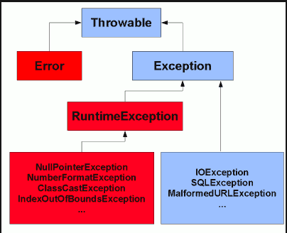
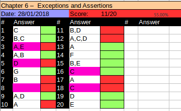

# Reviewing Exceptions
A program can fail for just about any reason. Here are a few posibilities commonly covered in OCP:
- Your program tries to read a file that doesn't exist.
- Your program tries to access a database, but the network connection to the database is unavailable.
- You made a coding mistake and wrote a wrong SQL statement in your JDBC code.
- You used a wrong format specifier when using DateTimeFormatter.h

As you can see some are coding mistakes while others are completely beyond your control. If your network connection goes wrong there isn't much that you can do to deal with this situation.

## Exceptions Terminology
An *exception* is Java's way of saying "I give up. I don't know what to do right now. You deal with it".

## Categories of Exceptions
Below you can find the hierarchy of the exception classes. Rember that a *runtime exception* or unchecked exceptionmight be caught, but it is not requiered to be caught. A *checked exception* is any class that extends Exception but it is not a runtime exception. A checked exception must follow a declare a delcare rule where they either catch or throw an exception. An error is fatal and should never be caught. While it is legal to cathc an error it is not reccommended.



In red are the unchecked exception and in blue checked exceptions. 


## Exceptions on the OCP
- **ArithmeticException:** Thrown by the JVM when code attempts to divide by zero.
- **ArrayIndexOutOfBounds:** Thrown by the JVM when code uses an illegal index to access an array
- **ClassCastException:** Thrown by the JVM when an attempt is made to cast an object to a subclass of which it is not an instance.
- **IllegalArgumentException:** Thrown by the program to indicate that a method has been passed an illegal or inappropriate argument.
- **NullPointerException:** Thrown by the JVM when there is a null reference where an object is required.
- **NumberFormatException:** Thrown by the program when an attempt ismade to convert a string to numeric type, but the string an appropriate format..

You also learnt that *java.io.IOException* is an example of a checked exception. On the OCP you need to know more exceptions. The objectives cover a number of APIs that throw a mix of checked and unchecked exceptions. Just remember that IO, parsing, and SQL exceptions are checked. Anything else is a runtime exception unless the exam states otherwise.

See table below for further information:


## Try Statement
The try statement consists of a mandatory try clause. It can include one or more catch clause to handle the exception that are thrown. It can also include a finally clause, which runs regardless of whether the exception is thrown. This is true for both try and try-with-resources statements.

The syntax looks like below:

```
try{
  //protected code
}catch(exception indentifier){
  //exception handler
}finally{
  //finally block
}
```

A few notes on the try catch block. A finallt block can only appear as part of a try statement. The finally blok always executes whether or not an exception occurs in the try blocks. 

There is also a rule that says a try statement is required to have either or both the catch and finally clauses. This is true for try statements, but it is not true for try-with-resources statements. 

There are two other rules that you need remeber:
- Java checked the catch block in the order they appear. it is illegal to declare a subclass exception in a catch block that is lower down in the list than a super class exception because it will be unreachable code.
- Java will not allow you to declare a catch block for a checked exception type that cannot potentially be thrown by the try clause body. This is again to avoid unreacheable body.

## Throw vs Throws
The exam might try to trick you whether you are paying attention to the difference between throw and throws. Remember that throw means an exception is actually beign thrown and throws indicates that method merely has the potential to throw that exception. See code sample below:

```java
public String getDataFromDatabase() throws SQLException{
  throw new UnsupportedOperationException();
}
```

# Creating Custom Exceptions
Java creates a lot out of the box exceptions classes. Sometimes you want to create your own set of exception classes and Java allows you to do that.

When creating your own exceptions you need to decide whether they are checked or unchecked exceptions. If you want to create checked exceptions you extend Exception and for unchecked exceptions you extend RuntimeExceptions.

Creating your own exceptions is really easy:

```java
class CannotSwimException extends Exception{}
class DangerInWater extends RuntimeException{}
class SharkInWater extends DangerInWater{}
class Dolphin{
  public void swim() throws CannotSwimException{
    //logic here
  }
}

```

The following line shows the most common constructors defined in the Exception class:
```java
public class CannotSwimException extends Exception{
  public CannotSwimgException(){
    super();
  } 
  
  public CannotSwimgException(Exception e){
    super(e);
  } 
  
  public CannotSwimgException(String message){
    super(message);
  } 
}

```

The first constructor is default constructor with no param. The second constructor shows how to wrap another exception inside yours. The third one shows how to pass a custome message.

## Using Multi-Catch
When somethig goes wrong it is common to log the error and convert it a different exception type. In this example we print the stack trace rather than log to a file. Next we throw a expection:

```java
public static void main(String[] args){
  try{
    Path path = Paths.get("dolphinsBorn.txt");
    String text = new String(Files.readAllBytes(path));
    LocalDate date = LocalDate.parse(text);
    System.out.println(date);
  
  }catch(DateTimeParseException e){
    e.printStackTrace();
    throw new RuntimeException();
  }catch(IOException e){
    e.printStackTrace();
    throw new RuntimeException();
  }
}

```

This works however duplicating code is bad! To deal with it we could catch Exception instead of the specific types. The duplicate code migt be gone but it isnt a good approach because it catches other exceptions too. The catch code could catcha NullPointerException and this was never out intention. Another approach would be to use a helper method to handle the exception but we would still have a little duplication. The Java designers realize this problem and they introduced the ability to catch multiple exceptions in the same catch block. Now we have an elegant solution:

```java
public static void main(String[] args){
  try{
    Path path = Paths.get("dolphinsBorn.txt");
    String text = new String(Files.readAllBytes(path));
    LocalDate date = LocalDate.parse(text);
    System.out.println(date);
  
  }catch(DateTimeParseException | IOException e){
    e.printStackTrace();
    throw new RuntimeException();
  }
```
This is much better. There is no code duplication, the common logic is in one place, and the logic is where we would expect it to find. Notice how there is only one variable name in the catch clause. Java is saying that the variable named e can be of type Exception1 or Exception2.

The exam might try to trick you on the syntax. Remember that that exception can be listed in any order within the catch clause. However the variable name must appera only once and at the end. Do you see why these are valid or invalid?

```java
catch(Exception1 e | Exception2 e | Exception3 e)       //DOES NOT COMPILE

catch(Exception1 e1 | Exception2 e2 | Exception3 e3)    // DOES NOT COMPILE

catch(Exception | Exceotion | Exception e)

```

Java intends multi catch for exceptions that aren't related, and it prevents you from specifying redundant types in a multi-catch. Do you see what is wring here?

```java
try{
  throw new IOExceotion();
}catch( FileNotFoundException | IOException e){}    //DOES NOT COMPILE
```

FileNotFoundException is a subclass of IOException. Specifying it in the multi-catch is redundant, and the compiler gives a message like this:

```
The exception FileNotFoundException is already caught by the alternative IOException.
```

Since we can ommit that exception type without changing the behaviour of the program, java does not allow declaring it. The correct code is as follows.

```
try{
  throw new IOException();
}catch(IOException e){ }

```

**Multi-catch is effectively final** this try statement is legal. it is bad idea to reassing the variable in the catch bock, but is is allowed:

```
try{
  // do some work
}catch(RuntimeException e){
  e = new RuntimeException();
}
```

When adding multi-catch, this pattern is no longer allowed:

```
try{
  // do some work
}catch(IOException | RuntimeException e){
  e = new RuntimeException();         // DOES NOT COMPILE
}
```
Java uses the exception variable internally.

To review the multi catch see how many erros you can find:

```java
public void doesNotCompile(){    //DOES NOT COMPILE
  try{
    mightThrow();
  }catch(FileNotFoundException | IlegalStateException e){
  }catch(InputMismatchException e | MissingResourceException e){
  }catch(SQLException | ArrayIndexOutOfBoundException e){
  }catch(FileNotFoundException | IlegalStateException e){
  }catch(Exception e){
  }catch(IOException e){
  }
}

private void mightThrow() throws DateTimeParseException, IOException {}

```
- The second catch has an extra variable name.
- Last two catch blocks are reversed. The more general superclass must be caught after their sublcass. While these does nothing to do with multi-catch, you will see regular catch blocks mixed with multi catch blocks.
- The fourth catch it is already caught. You cannot list the same exception type more than once in the same try statement. 
- The third catch block you cannot SQLException because nothing in the try statement can potentially throw one. Again, just like regular catch blocks any RuntimeException might be caught. However only checked exceptions that have potential to be thrown are allowed to be caught.

# Using Try-With-Resources
Multi-catch allows you to write code without duplication. Another problem arises with duplication in finally blocks. The followning code shows try-with-resources :

```java
public void newApproach(Path, path1, Path path2) throws IOException{
  try(BufferedReader in = Files.newBufferedReader(path1);
      BufferedReader out = Files.newBufferedReader(path2)){
        out.write(in.readLine());
      }
}
```

This new code automatically closes all resources opened in the try clause. This feature is also known as *automatic resrouce management* because java automatically takes care of the closing.  

## Try-With-resource Basics
You might have noticed that there is no finally block in the try-with-resources code. For the OCA exam you learnt that a try statement must have one or more catch blocks or a finally block. This is still true. The finally still exists implicitly. You just don't have to type it. 

A try-with-resources is stll allowed to have catch and/or finally blocks. They are run in addition to the implicit one. The implicit finally block rins before any programmer-coded code.

The resources created in the try clause are only in the scope within the truy block. See example below:

```java
try(Scanner s = new Scanner(System.in)){
  s.nextLine();
}catch(Exception e){
  s.nextInt();            //DOES NOT COMPILE
}finally{
  s.nextInt();            //DOES NOT COMPILE
}

```

The problem is that the Scanner object has gone out of scope at the end of the try clause. 

## AutoCloseable
You cannot just put any ramdon class in the try-with-resources statement. Java commits to closing automatically any resource opened in the try clause. Here we tell Java to try to close the Turkey class when we are fisnish with it:

```java
public class Turkey{
  public static void main(String[] args){
    try(Turkey t = new Turkey()){         //DOES NOT COMPILE
      System.out.println(t);
    }
  }
}
```

Java doesn't allow this. It has no idea how to close Turkey. Java informs us with a compiler error:

```
The resource type Turkey does not implement java.lang.AutoClosable.
```

In order for a class to be able to be created in the try clause, Java requires it  to implement an interface called AutoClosable. See below:

```java
public class Turkey implemets AutoClosable{
  public void close(){
    System.out.println("Close gate");
  }
  
  public static void main(String[] args){
    try(Turkey t = new Turkey()){         //This is ok now
      System.out.println("put turkeys in");
    }
  }
}
```
The AutoClosable interface only has one method to implement:

```
public void close() throws Exception;
```

Wait, Turkey didnt throw an exception but that is fine because an overriding method is allowed to declare more specific expections than the parent or even none at all.

The following shows what happens when an Exception is thrown. 

```java
public class StuckTurkeyCage implements AutoClosable{
  public void close(){
    throw new Exception("Cage door does not close");
  }
  
  public static void main(String[] args){
    try(StuckTurkeyCage t = new StuckTurkeyCage()){     //DOES NOT COMPILE
      System.out.print("Put turkey in")
    }
  }
}

```
This code throws a checked exception. And you do know that checked exceptions need to be handled or delcared. This is somethoing that you need to watch for the exam. If the main method declared an Exception, this code would compile. Java stringly recommends that close() does not actually throw Exception. It is better to throw a more specific exception. Java also recommends to make the close() method *idempotent*. That means that the method can be called multiple times without any side effect on subsequent runs. For example, it shouldn't throw an exception or change the state like below the second time. Both of these are allowed but strongly discouraged:

```java
class ExampleOne implements AutoClosable{
  public void close() throws IllegalStateException{
    throw new IllegalStateException("cage door does not close");
  }
}

class ExampleTwo implements AutoClosable{
  public void close() throws Exception{
    throw new Exception("Cage door does not close");
  }
}

class ExampleThree implements AutoClosable{
  static int COUNT = 0;
  public void close(){ 
    COUNT++;
  }
}
```
ExampleOne is the best implementation. ExampleTwo throws Exception rather than a more specific sublclass, which is not recommended. ExampleThree has a side effect. It changes the state of a variable. Side effects are not recommended. 

## Suppressed Exceptions
What happens if a close method throws an exception? Clearly we need to handle such a condition. We know that resources are closed before any programmer-coded catch blocks are run. This means that we can catch the exception thrown by close() if we wish. Alernatively, we can allow the caller to deal with it. Checked exceptions must be declared or handled. Unlike RuntimeException exceptions. The following code shows how we can catch the exception thrown by close.

```java
public class JammedTurkeyCage implements AutoClose{
  public void close() throws IllegalStateException{
     throw new IllegalStateException("Cage door does not close");
  }
  
  public static void main(String[] args){
    try(JammedTurkeyCage t = new JammedTurkeyCage()){
      System.out.println("Put turkeys in");
    }catch(IllegalStateException e){
      System.out.println("caught :" + e.getMessage());
    }
  }
}
```

The close() method is automatically called by try-with-resources and the catch block catches it and prints caught: Cage door does not close. Note if JammedTurkeyCage's close() method threw a checkedException, the try statement needs to catch it, or the main method needs to throw it.   

But, what happens if the try also throws an exception ? Java 7 added a way to accumulate exceptions. When multiple exceptions are thrown, all but the first all called *surpressed exceptions*. The idea is that java treats the first exception as the primary one and turns around on any that come up while automatically closing. For example:

```java
    try(JammedTurkeyCage t = new JammedTurkeyCage()){
      throw new IllegalStateException("turkeys run off")
    }catch(IllegalStateException e){
      System.out.println("caught :" + e.getMessage());
      for(Throwable t : e.getSuppresed()){
        System.out.println(t.getMessage());
      }
    }
```

The try throws the exception. At this point, the try clause ends and Java automatically calls the close() method. It throws an IllegalStateException, which is added as a suppressed exception. Then the catch statement catches the primary exception. The next line prints the message for the primary exception. Then the loop goes through the suppressed exceptions and prints them out. The output is:

```
caught: turkeys run off
Cage door does not close
```

Keep in mind that the catch block looks for matches on the primary exception. What do you thinks this code prints?

```java
  try(JammedTurkeyCage t = new JammedTurkeyCage()){
      throw new RuntimeException("turkeys run off")
    }catch(IllegalStateException e){
      System.out.println("caught :" + e.getMessage());
    }

```

The second line throws the primary exception. Java again calls the close() method and adds suppressed exceptions. Line 3 would catch an IllegalStateException. However we don't have any of those. The primary exception is a RuntimeException. Since this does not match the catch clause, the exception is thrown to the called. Eventually the main method would output something like the following:

```
Exception in thread main java.lang.RuntimeException : turkeys ran off
  Suppressed: java.lang.IllegalStateException: Cage door does not close
```
Java remembers the suppressed exceptions that go witha primary exception even if we don't handle them imn the code. Now see what happens if two exceptions are thrown while closing resources:

```java
try(JammedTurkeyCage t1 = new JammedTurkeyCage();
    JammedTurkeyCage t2 = new JammedTurkeyCage()){
      System.out.println("turkeys entered cage");
    }catch(IllegalStateException e){
      System.out.println("caught :" + e.getMessage());
      for(Throwable t : e.getSuppresed()){
        System.out.println(t.getMessage());
      }
    }
```

The turkeys enter the cage without exception. The Java tries to close both cages automatically. t2 is closed first, since java closes resources in the reverse order from which they are created. This throws an exception. Since it is the first exception to occur, it becomes the primary exception. Then t1 is closed. Since an exception already been thrown, this one becomes a suppressed exception. The output is:

```
turkeys entered cages
caught: Cage door does not close
Cage door does not close
```

Finally keep in mind that suppressed exceptions apply only to exceptions thrown in the try clause. The following exception does not throw a suppressed exception:

```java
  try(JammedTurkeyCage t = new JammedTurkeyCage()){
      throw new IllegalStateException("turkeys run off");
    }finally{
      throw new RuntimeException("and we couldn't find them");
    }
```

Second line throws an exception. Then Java tries to close the resource and adds a suppressed exception to it. Now we have a problem. The finally block runs after all this. Since the line in the finally throws an exception, the previous exception is lost. This has and continues to be bad programming practice. We don't want to loose exceptions. 

## Putting It Together
You've learned two new rules for the order in which code runs in a try-with-resources statement:
- Resources are closed after the try clause ends and before any catch/finally clauses.
- Resources are closed in the reverse order from which they were created.

Based on these rules, can you figure out what this code prints?

```java
public class Auto implements AutoClosable{
  int num;
  Auto(int num){ this.num = num; }
  public void close(){
    System.out.println("Close " + num);
  }
  
  public static void main(String[] args){
    try(Auto a1 = new Auto(1);
        Auto a2 = new Auto(2)){
      throw new RuntimeException();
    }catch(Exception e){
      System.out.println("ex");
    }finally{
      System.out.println("finally");
    }
  }
}

```
And it prints:

Close: 2
Close: 1
ex
finally

# Rethrowing Exceptions
It is a common pattern to log and then throw the same exception. Suppose that we have a method that declares two checked exceptions

```java
public void parseData() throws SQLException, DateTimeParseException{}
```

When calling this method, we need to handle or declare those two exception types. There are few valid ways of doing this. We could have two catch blocks and duplicate the logic. Or we could use multi-catch:

```java
public void multiCatch() throes SQLException, DateTimeParseException{
  try{
    parseData();
  }catch(SQLException | DateTimeParseException e){
    System.err.println(e);
    throw e;
  }
}
```
If you notice the list of exceptions in the catch block and the list of exceptions in the method signature of multiCatch() are the same. This is duplication. The solution the Java designers came up with was that they made it legal to write Exception in the catch block but really only a limited set of exceptions. The following code is similar to the preceding example:

```java
public void rethrowing() throws SQLException, DateTimeParseException{
  try{
    parseData();
  }catch(Exception e){
    System.err.println(e);
    throw e;
  }
}

```

We still have one catch block. This time Java interprets Exception as the possible exception that can be thrown in the method. As long as all of these checked exceptions are handled or declared, Java is happy. What happens if parseData() throws a NullPointerException? In the multi catch version the exception will not be caught in the catch block and will not be logged into System.err. In the rethrowing example, it will be caught, logged and rethrown. 

# Working with Assertions
An assertion is a Boolean expression that you place at a point in your code where you expect something to be true. The Ebglish definition of the word assert is to state that something is true, which means that you assert that something is true. An assert statement contains this statement along with an optional String message.
An assertion allows for detecting defects in the code. You can turn on assertions for testing and debbuging while leaving them off when your program is in production.

In the following sections we cover the syntax for using an assertion, how to turn them on/off and common uses of assertion.

## The assert Statement
The syntax for an assert statement has two forms:

assert boolean_expression
assert boolean_expression: error_message;

The boolean expression must evaluate to true or false. It can be inside optional parenthesis. The optional error message is a String used as the message for AssertionError that is thrown.

An assertion throws an AssertionError if it is false. Since program aren't supposed to catch an Error, this means that assertion failures are fatal and end the program. The three possible outcomes of an assert statements are as follows:
- If assertion are disabled, Java skips the assertion and goes on in the code.
- If assertion are enabled and the boolean expression is true, then our assertion has been validated and nothing happens, The program continues to execute in its normal manner.
- If assertions are enabled and the boolean expression is false, the our assertion is invalid and java.lang.AssertionError is thrown. 

## Enabling Assertions
By default, assert statements are ignored by the JVM at runtime. To enable assertions, use -enableassertions flag on the command line:

```
java -enableassertions Rectangle
```

You can also use the shortcut -ea flag:

```
java -ea Recatable 
```
Using the -enableassertion or -ea flag without any arguments enables assertions in all classes except system classes. System classes are classes that are part of the Java runtime. You can think of them as the classes that come with Java. You can also enable assertions for a specifi class or package. For example, the following command enables assertions only for classes in the com.wiley.demos package and any subpackages:

```
java -ea:com.wiley.demos... my.programs.Main
```

The three dots means any class in the specified package or subpackages. You can also enable assertions for a specific class:

```
java -ea:com.wiley.demos.TestColors my.programs.Main
```

You can dissable assertions using the -disableassertions or -da flag for a specific class or package that was previously enabled. For example, the following command enables assertions for the com.wiley.demos package but disables assertions for the TestColors class:

```
java -ea:com.wiley.demos... -da:com.widely.demos.TestColors my.programs.Main
```

If the assertion flag is not enabled then the assert statement is ignored in that situation.

## Using Assertions
You can use assertions for many reasons, including the following. You will not be asked to identify the type of assertion in the exam.

- **Internal Invariants** you assert that a value is within a certain constraints. assert x < 0 is an example of an intrenal invariant.

- **Class Invariants** you assert the validity of an object's state. Class invariants are typically private methods within the class the returns boolean.

- **Control Flow Invariants** you assert that a line of code you assume is unreachable is never reached. 

- **Preconditions** you assert that certain conditions are met before a method is invoked.

- **Post Conditions**  you assert that certain conditions are met after a method excutes.

**Assertions should not alter outcomes**
Because assertions are turn off in a production environment, your assertion should not contain any business logic that affects the putcome of your code. For example the following is not a good approach because it alters the value of a variable:

```
int x = 10;
assert ++x > 10;
```

When assertions are turn on, x is incremented to 11 but when assertion are turned off, the value of x is 10. This is not good because the outcome is different whether the assertions are turned on.

Do not user assertions to check for valid arguments passed in to a method. Use an IllegalArgumentException instead.

A lesser known feature of assert

You can append : "Error message" like this:

```
assert d != null : "d is null";
```

To specify what the error message of the thrown AssertionError should be.

# Summary
If a try statement has multiple catch blocks, at most one catch block can run. Java looks for an exception that can be caught by each catch block in the order in which they appear, and the first match is run. Then execution continues after the try statement to appear, and the first match is run. The execution continues after the try statement to the finally gets thrown. Common checked exceptions include ParseException, IOException and SQLException.

Multi-catch allows catching multiple exception types in the same catch block. the types are separated with a pipe. The multiple exception types are not allows to have subclass/superclass relationship. The variable in a multi catch expression is effectively final.

# Review Questions
Completed the questions in about half an hour and didn't seem to be difficult at all while doing the test. The result is a different story, got %55 therefore it's a fail. There were 2 questions that I didn't know the answer one of which I left blank. Got several questions with not all the correct asnwers so I marked it as wrong.



- When using try-with-resources, all of the opened resources are closed in the reverse order even if an exception is thrown, first the resources are closed and then the exception is thrown.
- Exception is superclass of RuntimeException.
- Checking an argument passed from elsewhere in the program is an appropriate use of an assertion.
- Need to memorize which classes are Exceptions and which ones are RuntimeExceptions.
- When a single Exception type is caught only the same type or a sybtype is allowed to be assigned to a variable.
- When usign muti-catch, the variable in the catch block is effectively final.
- The exception within the catch block becomes the primary exception and it is thrown first. Any subsequent exception that is thrown gets added into suppressed exceptions.
- The main difference between Closable and autoColsable is that AutoClosable has Exception in the signature and Closable has only IOException in the signature.
