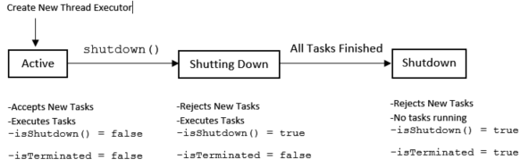
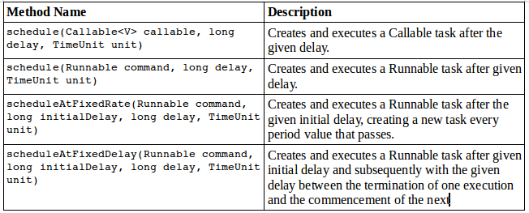
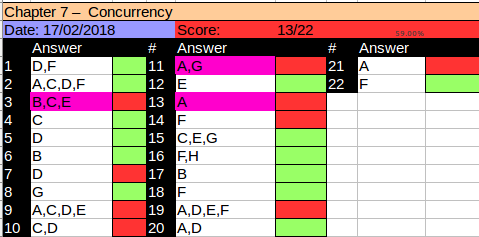

# Introducing Threads
We begin this chapter reviewing common terminology associated with threads. A *thread* is the smallest unit of execution that can be scheduled by the operative system.

A *process* is a group of associated threads that execute in the same, shared environment. It follows then, that a *single-threaded process* is one that contains exactly one thread. whereas a *multi-threaded process* is one that contains one or more threads.

By *shared environment* we mean that the threads in the same process share the same memory space and can communicate directly with one another. In this chapeter we will talk a lot about tasks and their relationship with threads. A task is a single unit of work performed by a thread. A task will commonly be implemented as a lambda expression in this chapter. A thread can complete multiple independent task but only one task at a time. 

## Distinguishing Thread Types
All Java applications are multi-threaded. Even a simple hello world application. To help you understand this we introduce the conceots of system threads and user-defined threads.

A *system thread* is created by the JVM and runs in the background of the application. Foe example, garbage collector thread is a system thread created by the JVM and runs in the background helping to free memory that is no longer use. For the most part, the execution of system-defined threads is invisible to the application developer. When a system-defined thread encounters a problem an cannot recover, such as running out of memory, it generates a Java Error, as opposed to an Exception.
(Remember that even though it is possible to catch an error, it is considered a poor practice to do so since it is rare than an application can recover from system-level failures.)

Alternatively, a *user-defined thread* is one created by the application developer to accomplish a specific task. All of the applications that have been created up to this point have been multi threaded, but they contain only one user-defined thread, which calls the main method. For simplicity, we commonly refer to threads that contain only a single user-defined tread as single-threaded application, sisnce we are often not interested in the system threads. 

(The following is not in the exam, a *daemon thread* is one that will not prevent JVM from existing when the program finishes. A Java application terminates when the only threads that are running are daemon threads. For example if the garbage collector thread is the only thread left running, the JVM will automatically shut down. Both system and user defined threads can be marked as daemon threads.)

## Understanding Thread Concurrency
The property of executing multiple threads and processes at the same time is referred to as *concurrency*. Of course, with a single-core CPU system, only one task is actually executing at a given time. Even in multi core or multi CPU systems, there often far more threads than CPU processors available. How does the system decide what to execute when there are multiple threads available? OS use a *thread scheduler* to determine which thread should be currently executing. A trad scheduler may employ a *round-robin schedule* in which each available thread receives an equal number of CPU cycles with which to execute, with threads visited in a circular order. When a thread alloted time is complete but the thread has not finished processing, a contect switch occurs. A *contect switch* is the process os storing a thread's current state and later restoring the state of the thread to continue execution. Be aware that there is often a cost associated with a contect switch by way of lost time saving and reloading a thread's state.
Finally, a thread can interrupt or supersede another thread if it has a higher thread priority than the other thread. A *thread priority* is a numeric value associated with a thread should currently be executing . In Java, thread priorities are specified as integer values. The Thread class includes 3 static constants. Bu default, user defined threads receive a thread priority value of Thread.NORM_PRIORITY. If you have a thread that needs to be executed right away, you can increase this value to 6 or higher or use the Thread.MAX_PRORITY. If two threads have the same priority, the thread scheduler will arbitrarily choose the one to process first in most situations.

See below the Java thread priority constants

Thread.MIN_PRIORITY = value 1

Thread.NORM_PRIORITY = value 5

Thread.MAX_PRIORITY = value 10


## Introducing Runnable
Runnable is a functional interface that takes no arguments and returns no data. The following is the definition

```java
@FunctionalInterface
public interface Runnable{
  void run();
}

```

The runnable intreface is commonly used to define the work a thread will execute, separate from the main application thread. We will be relying on the Runnable interface throughout this chapter. The following lambda expressions each rely on the Runnable interface:
```
() -> System.out.println("Hello World");
() -> {int 1 = 10; i++;}
() -> {return;}
() -> {}
```

Notice that all of these lambda expressions start with a set of empty parentheses, (). Also notice that none of them return a value. For these reason the following lambdas while valid for other functional interfaces, are not compatible with Runnable:

```
() -> ""
() -> 5
() -> {return new Object();}
```

These examples are invalid Runnable expressions because they each returns a value. In this chapter we focus on creating lambda expressions that implicitly implement the Runnable interface.

## Creating a Thread
The simplest way to execute a thread is using java.lang.Thread class, or Thread for short. Defining the task, or work, that a Thread instance will execute can be done two ways in Java:
- Provide a Runnable object or lambda expression to the Thread constructor.
- Create a class that extends Thread and overrides the run() method.

The following are examples of these techniques. One way implementing Runnable:
```java

public class PrintData implements Runnable{
  public void run(){
    for(int i = =; i < 3; i++){
      System.out.println("Printing record:" + i);
    }
  }
  
  public static void main(String[] args){
    (new Thread(new PrintData())).start();
  }
}

```
The other extending Thread:

```java
public class ReadInventoryThread extends Thread{
  public void run(){
    System.out.println("Printing zoo inventory");
  }
  
  public static void main(String[] args){
    (new ReadInventoryThread()).start();
  }
}

```

Anytime you create a Thread instance, make sure that you remember to start the task with the Thread.start() method. This starts the task in a separate OS thread. For example, what is the output of the following examples?

```java
public static void main(String[] args){
  System.out.println("begin");
  (new ReadInventoryThread()).start();
  (new Thread(new PrintData())).start();
  (new ReadInventory()).start();
  System.out.println("end");
}

```

The answer is that it is unknown until runtime. For example, the following is just one possible output:

```
begin
Pinting zoo inventory
Printing record: 0
end
Printing zoo inventory
Printing record: 1
Printing record: 2
```
This example uses a total of four threads - the main() user thread and three additional threads created by the main() method. While the order of execution once the threads have been started is indeterminate, the order within a single thread is still linear. For example, the for() loop in PrintData is still ordered, as is the end appearing after the begin in the main() method. On the exam, be careful about cases where the Thread or Runnable is created but no start() method is called. While the code will compile, none will actually execute a task on a separate processing thread. Instead, the thread that made the call will be used to execute the task causing the thread to wait until each run() method is complete before moving on to the next line. 

```
new PrintData().run();
(new Thread(new PrintData()).run();
(new ReadInventoryThread()).run();
```

In general you should extend thread under very specific circustances, such as when you are creating your own priority-based thread. In most situations you should implement Runnable interface rather than extend the Thread class. The OCP 8 exam strongly encourages developers to use the Concurrency API to create and manage Thread objects for them.

## Polling with Sleep
Often you need a thread to poll for a result to finish. *Polling* is the process of intermittnely checking data at some fixed interval. For example see example below:
```java
public class CheckResults{
  private static int counter = 0;
  public static void main(String[] args){
    new Thread(() -> {
      for(int i = 0; i < 500; i++){ CheckResult.counter++; }
    }).start();
    
    while(CheckResult.counter < 100){
      System.out.println("Not reached yet");
    }
    System.out.println("Reached!");
  }
}
```

How many times will the while() loop execute and output "Not reached yet?" the answer is, we don't know! It could be zero, ten, or a million times. If our thread scheduler is poor, it could operate infinitely! Using a while() loop to check for data without any delay is considered a very bad coding practice as it ties up with the CPU resources for no reason. We can improve the example by using Thread.sleep() method to implement polling. The Thread.sleep() method requests the current thread of execution rest for a specific number of miliseconds. When used inside the body of the main() method, the thread associated with the main() method will pause, while the separate thread will cointinue to run. Compare the previous implementation with the following one that uses Thread.sleep():

```java
public class CheckResults{  
  private static int counter = 0;  
  public static void main(String[] args) throws InterrupedException{    
    new Thread(() -> {      
      for(int i = 0; i < 500; i++){ CheckResult.counter++; }    
    }).start();        
    
    while(CheckResult.counter < 100){      
      System.out.println("Not reached yet");    
      Thread.sleep(1000);
    }    
    System.out.println("Reached!");  
  }
}
```

While this might seems an small amount, we have prevented a possible infinite loop from executing and locking up our main program. Notice that we also changed the signature of the main method. That is because the sleep method throws a checked exception. Alaternatively we could have used try-catch block insisde the loop. Nother issue to be concerned about is the shared counter variable. What if one thread is reading the counter variable while another thread is writing it? The thread reading the shared variable may end up with an invalid or incorrect value. We will discuss these issues in detail in the upcoming section on synchronization.

# Creating Thread with the ExecutorService
With the announcement of the Concurrency API, Java introduced the ExecutorService, which creates and manages threads for you. You first obtain an instance of an ExecutorService interface, and the you send the service task to be processed. The framework includes numerous useful features, such as thread pooling and scheduling  which would be cumbersome for you to implement in every project. Therefore, it is recommended that you use this framework anytime you need to create and execute a separate task, even if you need only a single thread.

## Introducing the Single-Thread Executor
Since ExecutorService is an interface, how do you obtain an instance fo it? The Concurrency API includes the Executors factory class that can be used to create instances of the ExecutorService object. As you may remember the factory pattern is a creational pattern in which the underlying implementation details of the object creation are hidden from us. Let's start with a simple example using the ```newSingleThreadExecutor()``` method to obtain an ExecutorService instance and the execute() method to perform asynchronous task:

```java
import java.util.concurrent.*;

public class ZooInfo{
  public static void main(String[] args){
    
    ExecutorService = null;
    
    try{
      service = Executor.newSingleThreadExecutor();
      
      System.out.println("begin");
      service.execute(() -> System.out.println("Printing zoo inventory"));
      service.execute(() -> {
        for(int i = 0; i < 3; i++){
          System.out.println("Printing record: " + i);
        }
      });
      service.execute(() -> System.out.println("Printing zoo inventory"));
      System.out.println("begin");
    }finally{
      if(service != null) service.shutdown();
    }
  }
  
}

```

As you may notice, this is just a rewrite of our earlier PrintData and RreadInventoryThread clases to use Runnable-based lambda expressions and an ExecutorService instance. In this example, we used the newSingleThreadExecutor() method, which is the simplest ExecutorService that we could create. Unlike our earlier example, in which we had three extra threads for newly created tasks, this example uses only one, which means that the threads will order their results. For example the following is a possible output:

```
begin
Pinting zoo inventory
Printing record: 0
Printing record: 1
end
Printing record: 2
Printing zoo inventory
```

With a single-therad executor, results are guaranteed to be executed in the order in which they are addded to the executor service. Notice that the end text is output while our thread executor tasks are still running. This is because main() method is still an independent thread from ExecutorService, and it can perform tasks while the other thread is running. On the other hand, as you will see later in chapter, when we increase the number of threads in the excutor service,  the gurantee disapears

## Shutting Down a Thread Executor
Once you have finished using a thread executor it is important that you call shutdown() method. A thread executor creates a non-daemon thread on the first task that is executed, so failing to call shutdown() will result in your application never terminating. The shutdown process of a thread executor involves first rejecting any new tasks submitted to the thread executor while continuing to execute any previously submitted tasks. During this time, submitted to the thread executor while it is shutting down, a RejectedExecutionException will be thrown. Onec all active tasks have been completedm isShutdown() and isTerminated() will both return true. See figure below that shows the life cycle of an ExecutorService object.



For the exam you should be aware that shutdown() does not actually stop any tasks that have already been submitted to the thread executor. What if you want to cancel all running and upcoming tasks? The ExecutorService provides a method called shutdownNow(), which attempts to stop all running tasks and discards any that have not been started yet. Note that shutdownNow() attempts to stop all running tasks. It is possible to create a thread that will never terminate, so any attempt to interrupt it may be ignored. Lastly, shutdownNow() returns a List<Runnable> of tasks that were submitted to the thread executor but that were never started. The ExecutionService interface does not implement AutoClosable, so you cannot use a try-with-resources statement. You can still use a finally block, as we do throughout this chapter. While not required, it is considered a good practice to do so.

## Submitting Tasks
Ypu can submit tasks to an ExecutionService instance multiples ways. The first method we presented, execute(), is inherited from the Executor interface, which the ExecutorService interface extends. The execute() method takes a Runnable lambda expression or instance and completes the task asynchronously. Because the return type of the method is void it does not tell us anything about the result of the task. It is considered "fire and forget" method, as once it is submitted, the results are not directly available to the calling thread. 
Fortunately, the writers of the Java added submit() methods to the ExecutorService interface, which like execute(), can be use to complete tasks asynchronoulsy. Unlike execute(), though, submit() returns a Future that can be used to determine if the task is complete. It can also be used to return a generic result object after the task has been completed

**Method Name**                  | **Description**
---------------------------------|---------------
```void execute(Runnable command)```           | Executes a Runnable task at some point in the future.  
```Future<?> submit(Runnable task)```          | Executes a Runnable task at some point in the future and returns a Future representing tha task.
```<T>Future<T> submit(Callable<T> task)```   | Executes a Callable task at some point in the future and returns a Future representing the pending results of the task.
```<T>List<Future<T>> invokeAll(Collection<? extends Callable<T> tasks>) throws InterrupedException``` | Executes the given tasks, synchronoulsy returning the results of all tasks as a Collection or Future objects, in the same order they were in the original collection.
```<T>T invokeAny(Collection<? extends Callable<T>> tasks) throws InterruptedException, ExecutionException``` | Executes the given tasks, synchronoulsy returning the result of one of finished tasks, cancelling any unfished tasks.

In practice using the submit() method is quite similar to using the execute() method, except that the submit() method return a Future object that can be used to determine whether or not the task has completed execution. Don't worry if you haven't seen Future or Callable before we will discuss them in detail shortly. We use and prefer the submit() method in the majority of the cases and it this chapter we will use submit() as a result. For the exam you need to be familiar with both execute() and submit(), but in your own code we recommend submit() over execute() whenver possible.

### Submitting Task Collections
The last two methods in the table above that you should know for the exam are invokeAll() and invokeAny(). Both of these methods take a Collection object containing a list of tasks to execute. Both of these methods also execute synchronously. By synchronously, we mean that unlike other methods used to submit tasks to a thread executor, these methods will wait until the results are available before returning control to the enclosing program.

The invokeAll() method executes all tasks in a provided collection and returns a List of ordered Future objects, with one Future object corresponding to each submitted task, in the order they were in the original Collection. Even though Future.isDone() returns true for each element in the returned List, a task could have completed normally or thrown an exception. The invokeAny() method executes a collection of tasks and returns the result of one of the tasks that succesfully completes execution, cancelling all unfinished tasks. While the first task to finish is often returned, this behaviour is not guaranteed, as any completed task can be returned by this method. Finally, the invokeAll() method will wait indefinitely until all tasks are complete, while the invokeAny() method will wait indefinitely until at least one task completes. The ExecutorService interface also includes overloaded versions of invokeAll() and invokeAny() that takes a timeout value and TimeUnit parameter. We will see how to use these types of parameters in the next section when discussing the Future class.

## Waiting for Results
How do we know when a task submitted to an ExecutorService is complete? AS mentioned in the last section, the submit() method returns a java.util.concurrent.Future<V> object, or Future<V> for short, that can be used to determine this result:
  
```
Future<?> future = service.submit(() -> System.out.println("Hello Zoo"));
```
The Future class includes methods that are useful in determining the state of a task, as shown in the table below:

**Method Name**                    | **Description**
-----------------------------------|-------------------------------------------------------------------------------------
boolean isDone()                   | Returns true if the task was completed, threw an exception, or was cancelled.
boolean isCancelled()              | Returns true if the task was cancelled before it completed normally
boolean cancel()                   |  Attempts to cancel execution of the task
V get()                            |  Retrieves the result of a task, waiting endlessly if it is not yet available.
V get(long timeout, TimeUnit unit) | Retrieves the result of a task, waiting the specified amount of time. if the result is not ready by the time the timeout is reached, a checked TimeoutException will be thrown.

The following is an updated version of our earlier polling example CheckResults class,which uses a Future instance to poll for the results:

```java
import java.util.concurrent.*;

public class CheckResults{

  private static int counter = 0;
  public static void main(String[] args) throws InterruptedException, ExecutionException{
      ExecutorService service= null;
      try{
        service = Executor.newSingleThreadExecutor();
        Future<?> result = service.submit(() -> {
          for(int i = 0; i < 500; i++) CheckResults.counter++;
        });
        result.get(10, TimeUnit.SECONDS);
        System.out.println("Reached!");
      }catch(TimeoutException e){
        System.out.println("Not reached in time")
      }finally{
        if(service != null) service.shutdown();
      }
  }
}
```

This example is similar to our ealier polling implementation, but it does not use the Thread class directky. In part, this is the essence of the Concurrency API: to do complex things with threads without using Thread class directly. It also waits at most 10 seconds, throwing a TimeoutException if the task is not done. What is the return value of this task? As Future<V> is a generic class, the type V is determined by the return type of the Runnable method. Since the return type of Runnable.run() is void, the get() method always returns null. In the next section, you will see that there is  another task class compatible with ExecutorService that supports other return types. As you saw in the previous example, the get() method can take an optional value and enum type java.util.concurrent.TimeUnit. We represent the full list of TimeUnit values in the table below in increasing order of duration. Note that numerous methods in the Concurrency API use the TimeUnit enum. The TimeUnit values are:
- TimeUnit.NANOSECONDS
- TimeUnit.MICROSECONDS
- TimeUnit.MILLISECONDS
- TimeUnit.SECONDS
- TimeUnit.MINUTES
- TimeUnit.HOURS
- TimeUnit.DAYS
  
## Introducing Callable
When Concurrency API was released in Java 5 the java.util.concurrent.Callable interface was added. It is similar to Runnable except that its ```call()``` method returns a value and can throw a checked exception. As you may remember from the definition of Runnable, the ```run()``` method returns void and cannot throw any checked exceptions. Along with Runnable, Callable was also made a funcionalInterface in Java 8. The following is the definition of the Callable interface:
```java
@FunctionaInterface
poublic interface Callable<V>{
  V call() throws Exception;
}
```
The Callable interface was introduced as an alternative to the Runnable interface, since it allows more details to be retrieved easily from the task after it is completed. The ExecutorService includes an overloaded version of the ```submit()``` method that takes a Callable object and returns a generic Future<T> object.
  
:yin_yang: **Ambiguous Lambda Expressions: Callable vs. Supplier** The Callable functional Interface strongly resembles the Supplier functional interface , in that they both take no arguments and return a generic type. Once difference is that Callable can throw a checked exception. How do you tell lambda expression for these two parts? The answer is that sometimes you cannot. See the following example:
```java
public class AmbiguousLambdaExample{
  public static void useCallable(Callable<Interger> expression){}
  public static void useSupplier(Supplier<Interger> expression){}
  public static void use(Callable<Interger> expression){}
  public static void use(Supplier<Interger> expression){}
  
  public static void main(String[] args){
    useCallable(() -> {throw new IOException();});    // COMPILES
    useSupplier(() -> {throw new IOException();});    // DOES NOT COMPILE
    use(() -> throw new IOEXception(););              // DOES NOT COMPILE
  }
}

```
The first line of the main method compiles as Callable is permitted to throw checked exception, unlike the Supplier in the second line. What about last line? the use method is overloaded but the compiler does not take into account the fact that the body of the lambda expression happens to throw an exception; when the compiler does not what to do it reports an error and does not compile. When the compiler is unable to assign a functional interface to a lambda expression, it is referred to as an ambiguous lambda expression. Note that ambiguity can be resolved with an explicit cast. For example the following will compile:

```java
use((Callable<Integer>)() -> {throw IOException()};);   // COMPILES
```

Unlike Runnable in which the ```get()``` method always returns null, the ```get()``` methods on the Furute object return the matching generic type or null.

Let's take a look to some examples:

```java
import java.util.concurrent.*;

public class AddData{
  public static void main(String[] args) throws InterruptedException, ExecutionException{
    ExecutorService service = null;
    try{
      service = Executor.newSingleThreadExecutor();
      Future<Integer> result = service.submit(() -> 30 + 11);
      System.out.println(result.get());
    
    }finally{
      if(service != null) service.shutdown();
    }
  }
}
```
We can now retrieve and print the output of the Callable results, 41 in this example. The results could have also been obtained using Runnable and some shared, possibly static, object, although this solution using Callable is a lot simpler to follow. The Callable and Runnable interface are interchangeable is some situations where the lambda does not throw an exception and there is no return type.

**Checked Exceptions in Callable and Runable:** Besides having a return type the Callable interface also supports Checked Exceptions, whereas the Runnable interface does not without an embedded ```try/catch``` block. Given an instance of ExecutionService called service, which of the following lines of code will compile or not?

```java
service.submit(() -> {Thread.sleep(1000); return null; });
service.submit(() -> {Thread.sleep(1000); });
```

The first line compile, while the second line does not. Why? recall that Thread.sleep() throws a checked InterruptedException. Since the first lambda expression has a return type, the compiler treats this as Callable expression that supports checked exceptions. The second lambda expression does not have a return value; therefore the compiler treats it as Runnable expression. And Runnable does not support checked exceptions , the compiler reports an error and does not compile this code.

## Waiting for All Tasks to Finish
After submitting a set of tasks to a thread executor, it is common to wait for the resut. One solution is to call ```get()``` method on each Future object  returned by the ```submit()``` method. If we don't need the results of the tasks and are finished using our thread executor, there is a much simpler approach. First we shutdown the tread executor using ```shutdown()``` method. Next, we use the ```awaitTermination(long timeout, TimeUnit unit)``` method available for all thread executors. The method waits the specified time to complete all tasks, returning sooner if all task finish or an InterruptedException is detected. You can see an example of this in the following cde snippet:
```java
ExecutorService service = null;
try{
  service = ExecutorService.newSingleThreadExecutor();
  
  //add tasks to the thread executor
  
}finally{
  if(service != null) service.shutdown();
}

if(service != null){
  service.awaitTermination(1, TimeUnit.MINUTES);
  //Check whether all tasks are finished
  if(service.isTerminated()){
  `System.out.println("All tasks are finished");
  }else{
    System.out.println("At least one task is still running");
  }
}
```
In this example we submit a number of tasks to the thread executor and then shutdown the thread executor and wait up to one minute for the result. Notice that we call isTerminated() after awaitTermination() method finishes to confirm that all tasks are actually finished.

## Scheduling Tasks
Oftentimes in Java, we need to schedule a tasks to happen at some point in the future time. We might even need to schedule the task to happen repeatedly, at some set interval. For example, imagine you want to check the food supply of zoo for the animals once an hour and fill it as needed. The ```ScheduleExecutorService``` which is a subinterface of ExecutorService, can be used for just such task. Like ```ExecutorService``` we obtain an instance of ```ScheduleExecutorService``` using a factory method in the Executors class, see below:
```
ScheduleExecutorService service = Executors.newSingleThreadScheduledExecutor();
```
Note that we could implicitly cast an instance of ScheduleExecutorService to ExecutorSerice, although doing so will remove the scheduled method that we want to use.



In practice, these methods are the most convenient in the Concurrency API, as they perform complex tasks with a single line of code. The first two methods take a Callable or a Runnable, perform the task after some delay, and return a ScheduledFuture<V> instance. ScheduledFuture<V> is identical to Future<V> class, except that it includes a getDelay() method that returns the delay set when the process was created. The following uses the schedule() method with Callable and Runnable task.
  
```java
ScheduleExecutorService service = Executor.newSingleThreadScheduledExecutor();

Runnable task1 = () -> System.out.println("Hello Zoo");
Callable<String> task2 = () -> "Monkey";

Future<?> result1 = service.schedule(task1, 10, TimeUnit.SECOND);
Future<?> result2 = service.schedule(task2, 8, TimeUnit.MINUTES);
```

The first task is scheduled 10 seconds in the future, whereas the second task is scheduled 8 minutes in the fuuture. Note that these task are scheduled in the future, the actual execution may be delayed. For example, there may be no threads available to perform the task, at which point they will just wait in the queue. Also, if the ScheduledExecutorService is shutdown by the time the scheduled task execution is reached they will be discarded.

The last two method in the table above might be a little confusing if you have not seen them before. They both seem to be similar. The difference is related to the timing of the process and when the next task starts. The ```scheduleAtFixedRate()``` method creates a new task and submits it to the executor every period, regardless of whether or not the previous task finished. The following example executes a Runnable task every minute, following an initial five minute delay.

```
service.scheduleAtFixedRate(command, 5, 1, TimeUnit.MINUTE);
```

One risk of using this method is that a task could consistently take longer to run than the period between tasks. Despite the fact that the task is still running, The ScheduledExecutorService would summit a new task to be started every minute. is a single thread executor was used, over time this would result in endless set tasks beign scheduled, which would run back to back assuming that no other tasks were submitted to the ScheduledExecutorService. On the other hand, the scheduledAtFixedDelay() method creates a new task after the previous task has finished. For example, if the first task runs at 12:00 and takes five minutes to finish, with a period of 2 minutes, then the second task will start at 12:07.

```
service.scheduleAtFixedDelay(command, 0, 2, TimeUnit.MINUTE);
```
Notice that neither of the methods, scheduleAtFixedRate() and scheduleAtFixedDelay() take a callable object as a input parameter. Since these tasks are scheduled to run infinetly, as long as the ScheduledExecutorService is still alive, the would generate an endless series of Future objects.

Each of the ScheduledExecutorService methods is important and has real-world applications. For example, you can use the schedule() command to check on the state of processing a task and send out notifications if it is not finished or even call schedule() again to delay processing.

The scheduleAtFixedRate() is useful for tasks that need to be run at specific intervals, such as checking the health of the animals once a day. Even if it takes two hours to examine an animal on Monday, this does not mean that Tuesday examination will start any later.

Finally, scheduleAtFixedDelay() is useful for process that you want to happen repeately but whose specific time is unimportant. For example, imagine that we have a zoo cafeteria worker who peridically restock the salad bar throughout the day. The process can take 20 min or more, since it is requires the worker to haul a large number of items from the back room. Once the worker has filled the salad bar with fresh food, he doesnt need to check at some specific time, just after enough time has passed for it to become low on stock again.

## Increasing Concurrency with Pools
All of our examples up until now have been with single-thread executors, which, while interesting , weren't particularly useful. After all, the name of this chapter is "Concurrency",and you can't do a lot of that with a single-thread executors!
We now present three additional factory methods in the Executor class that act on a pool of threads, rather than on a single thread. A *thread pool* is a group of pre-instantiated reusable threads that are available to perform a set of arbitrary tasks. The table below includes our two previous single-thread executor methods, along with the new one that you should know for the exam.

**Method Name**                           |  **Return type**  | **Description**
------------------------------------------|-------------------|-------------------------------------------------------------
newSingleThreadExecutor()                 | ExecutorService   | Creates a single threaded executor that uses a single worker thread operating off an unbounded queue. Results are processed sequentially in order in which they are submitted.
newSingleThreadScheduledExecutor()        | ScheduledExecutorService | Creates single-threaded executor that can schedule commands to run after a given delay or to execute periodically.
newCachedThreadPool()                     | ExecutorService  | Creates a thread pool that creates new threads as needed, but will reuses previously constructed threads when they are available.
newFixedThreadPool(int nThreads)          | ExecutorService  | Creates a thread pool that reuses a fixed number of threads operating off a shared unbounded queue.
newScheduledThreadPool(int nThreads)      | ScheduledExecutorService | Creates a thread pool that can schedule commands to run after a given delay or to execute periodically.


As shown in table above these methods return the exact same instance types, ExecutorService and ScheduledExecuterService that we used earlier in this chapter. In other words, all of our previous examples are compatible with these new pooled-thread executors! There are also overloaded versions of each of the methods in the table above that create threads using a ThreadFactory input parameter. For the exam, you are only required to know the methods to create thread executors in the table above.

The difference betwen a single-thread and a pooled-thread executor is what happends when a task is already running. While a single-thread executor will wait for an available thread to become available before running the next task, a pooled-thread executor can execute the next task concurrently. If the pool runs out of available threads, the task will be queued by the thread executor and wait to be completed.

The newCachedThreadPool() method will create a thread pool of unbounded size, allocating a new thread anytime one is required or all existing threads are busy. this is commonly used for pools that require executing many short-lived asynchronous tasks. For long-lived processes, usage of this executor is strongly dioscouraged, as it could grow to encompass a large number of threads over the application life cycle.

The newFixedThreadPool() takes a number of threads and allocates them all upon creation. As long as our number of tasks is less than our number of threads, all tasks will be executed concurrently. If at any point the number of tasks exceed the number of threads in the pool, they will wait in similar manner as you saw with a single-thread executor. In fact, calling newFixedThreadPool() with a value of 1 is equivalent to calling newSingleThreadExecutor().

The newScheduledThreadPool() is indentical to the newFixedThreadPool() method, except that it returns an instance of ScheduledExecutorService and is therefore compatible with scheduling tasks. This executor has subtle differences in the way that the scheduleAtFixedRate() performs. For example, recall our previous example in which tasks took five minutes to complete:

```
ScheduledExecutorService service = Executors.newScheduledThreadPool(10);
service.scheduleAtFixedRate(command, 3, 1, TimeUnit.MINUTE);
```

Whereas with a single-thread executor and five-minutes task execution time, an endless set of tasks would be scheduled over time. With a pooled executor, this can be avoided. if the pool size is sufficiently large, 10 for example, then as each thread finishes, it is returned to the pool and results in new threads available for the next tasks as they come up.

# Synchronizing Data Access
Recall that thread safety is the property of an object that guarantees safe execution by multiple threads at the same time. Now that we have multiple threds capable of accessing the same objects in memory, we have to make sure to organize our access to this data such that we don't end up with invalid or unexpected results. Since threads run in a shared environment and memory space, how do we prevent tow threads from interfering with each other?

Imagine our zoo has a program to count sheep, preferably one that won't put the zoo workers to sleep! Each zoo worker runs out to a field, adds a new sheep to the flock, count the total number of sheep, and runs back to us to report the result. We present the following code to represent this conceptually:

```java
import java.util.concurrent.*;

public class SheepManager{
  
  private int sheepCount = 0;
  private void incrementAndReport(){
    System.out.println((++sheepCount)+ " ");
  }
  
  public static void main(String[] args){
    ExecutorService service = null;
    try{
      service = Executors.newFixedThreadPool(20);
      SheepManager manager = new SheepManager();
      
      for(int = 0; i < 10; i++){
        service.submit(() -> manager.incrementAndreport());
      }
    }finally{
      if(service != null) service.shutdown();
    }
  }

}

```

A problem occurs when two threads both execute the right side of the expression, reading "old" value before either thread writes the new value of the variable. The two assignments become redundant; they both assign the same new value, with one thread overwriting the results of the other. Both threads read and write the same values, causing one of the two ++sheepCount operations to be lost. Therefore, the increment operator ++ is not thread safe. As you will see later in this chapter, the unexpected result of two tasks executing at the same time is referred to as *race condition*.

Returning to the sheep example, we choose a large thread size of 20 so that all tasks can be run concurrently. Let's say that each lambda expression submitted to the thread executor corresponds to a zoo worker. Each time a zoo worker increments the sheep counter, they run back to report the results. What would you expect the putput of this program to be? Although the putput will vary, the following are some samples created by this program:

```
1 2 2 3 4 5 6 7 8 9

2 4 5 6 7 8 1 9 10 3

2 1 3 4 5 6 7 8 9 10
```

In this example, multiple workers are sharing the sheepCount variable. In the first sample, two zoo workers both call ++sheepCount at the same time, resulting in one of the increment operations actually beign lost, with the last total beign 9 instead of 10. In the other examples, results from earlier threads are output before ones that started later, such as 3 beign output after 4 in the second example. We know we had 10 workers but results are incomplete and out of order.
The idea here is that some zoo workers may run faster on their way to the field but more slowly on their way back and report late.

## Protecting Data with Atomic Classes
Withe the release of the ConcutrrentyAPI, Java added a new ```java.util.concurrent.atomic``` package to help coordinate access to primitive values and object references. As with most classes in the Concurrency API, these classes are added solely for convenience. In our first SheepManager smaple output, the same value, 2, was printed twice, with the highest counter beign 9 instead of 10. As we demonstrated in the previous section, the increment operator ++ is not thread safe. Furthermore, the reason that it is not thread safe is that the operation is not atomic, carrying out two tasks, read and write, that can be interrupted by other threads.
*Atomic* is the property of an operation to be carried out as single unit of execution without any interference by another thread, A thread-safe atomic version of the increment operator would be one that performed the read and write of the variableas as single operation, not allowing any other threads to access the variable during the operation. Any thread trying to access the sheepCount variable while an atomic operation is in process will have to wait until the atomic operation on the variable is complete. Of course, this exclusivity applies only to threads trying to access the sheepCount variable, with the rest of memory space not affected by this operation. Since accessing primitives and references in Java in shared environments, the concurrency API includes numerous useful classes that are conceptually the same as our primitive classes but that support atomic operations. The table below list atomic classes with which you should be familiar with for the exam:

**Class Name**       |  **Description**
---------------------|-----------------------------------------------------------------------------
AtomicBoolean        | A boolean value that may be updated automatically
AtomicInteger        | An int value that may be updated automatically
AtomicIntegerArray   | An int array in which elements may be updated automatically
AtomicLong           | A long value that may be updated automatically
AtomicLongArray      | A long array in which elements may be updated automatically
AtomicReference      | A generic object reference that may be updated automatically
AtomicReferenceArray | An array of generic object references in which elements may be updated automatically

How do we use an atomic class? Each class includes numerous methods that are equivalent to many of the primitve built-in ioerators that we use on primitves, such as the assignment operator = and the increment operators ++. We describe the common atomic methods that you should know for the exam in the table below:

**Method Name**   |  **Description**
------------------|-----------------------------------------------------------------------------
get()             | Retrieve the curent value
set()             | Set the given value, equivalent to the assignment = operator
getAndSet()       | Atomically sets the new value and returns old value
incrementAndGet() | For numberic classes, atomic pre-increment operation equivalent to ++value
getAndIncrement() | For numeric classes, atomic post-increment operation equivalent to value++
decrementAndGet() | For numeric classes, atomic pre-decrement operation equivalent to --value
getAndDecrement() | For numeric classes, atomic post-decrement operations equivalent to value--

In the following examples, we update our SheepManager class with an AtomicInteger:

```java
private AtomicInteger sheepCount = new AtomicInteger(0);

private void incrementAndReport(){
  System.,out.println(sheepCount.incrementAndGet() + " ");      
}
```

When we run the above we get the following outcome:

```
2 3 1 4 5 6 7 8 9 10

1 4 3 2 5 6 7 8 9 10

1 4 3 5 6 2 7 8 10 9

```

Unlike our previous sample output, the number 1 through 10 will always output. As you might notice, the result are still not ordered, although we will get to that soon. The key here is that using the atomic classes ansures that the data is consistent between workers and that no values are lost due to concurrent modifications.

## Improving Access with Synchronized Blocks
How do we improive the result so that each worker is able to increment and report the result in order? The most common technique is to use a monitor, also called a *lock* to synchronize access. A *monitor* is a structure that supports mutual exclusion or the property that at most one thread is executing a particular segment of code at a given time. In Java, any object ca be used as monitor, along with ```synchronized``` keyword, as shown in the following example:

```
SheepManager manager = new SheepManager();
synchronized(manager){
  // work to be completed by one thread at a time
}
```

This example is referred to as *synchronized block*. Each thread that arrives will first check if any threads are un the block. In this manner, a thread "acquires a lock" for the monitor. If the lock is available, a single thread will enter the block, acquiring the lock and preventing all other threads from entering. While the first thread is executing the block, all threads that arrive will attempyt to acquire the same lock and wait for first thread to finish. Once a thread finishes executing the block, it will release the lock, allowing one of the waiting threads to proceed.

Note that in order to synchronize access across multiple threads, each threads must have access to the same Object. For example, synchronizing on different objects would not actually organize the result.

Let's revisit our SheepManager example and see if we can improve the results so that each worker increments and outputs the counter in order. Let's say that we replaced our for() loop with the following implementation:

```java
for(int i = 0; i < 10; i++){
  synchronized(manager){
    service.submit(() -> manager.incrementAndReport());
  }
}

```

Does this solution fix the problem? No it does not. Can you spot the problem? We have synchronized the creation of the threads but not the execution of the threads. In this exampl, each thread would be created one at a time, but they may all still execute and perform their work art the same time., resulting in the same type of output that you saw earlier. Diagnosing resolving threading problems is often one of the most difficult tasks in any programming language.

We now represent a corrected version of the SheepManager class, which does not order the workers:

```java

import java.util.concurrent.*;

public class SheepManager{
  
  private int sheepCount = 0;
  private void incrementAndReport(){
    synchronized(this){
      System.out.println((++sheepCount) + " ");
    }
  }
  
  public static void main(String[] args){
    ExecutorService service = null;
    
    try{
      service = Executor.newFixedThreadPool(20);
      service.submit(() -> manager.incrementAndReport());
      
    }finally{
      if(service != null) service.shutdown();
    }
  }

}
```

When this code executes, it will consistenly output the following:
```
1 2 3 4 5 6 7 8 9 10
```
Although all threads are sitll created and executed at the same time, they each wait at the synchronized block for the workers to increment and reports the result before entering. In this manner, each zoo worker waits for the previous zoo worker to come back before running out on the field. While it's random which zoo worker will run out next, it is guanranteed that there will be at most one on the field.

We could have synchronized on any object, so lonmg as it was the same object. For example, the following code snippet would have also worked:

```java

private final Object lock = new Object();
private void incrementAndReport(){
  synchronized(lock){
    System.out.println((++sheepCount) + " ");
  }
}
```

Although we didn't need to make the lock variable final, doing so ensured that is not reassigned after threads starts using it. Note that we could have used an atomic count variable along with the synchronized block in this example, although it is unnecessary. Since synchronized blocks allow only one thread to enter, we're not ganing any improvement by using an atomic variable only time that we access the variable is within synchronized block.

## Synchronizing Methods
In the previous example, we estabilished our monitor using ```synchronized(this)``` around the body of the method. Java actually provides a more convenient compiler enhancement for doing so. We can add the synchronized modifier to any instance method to syncronize automatically on the objet itself. For example, the follosing two method definitions are equivalent:

```java
private void incrementAndReport(){
  synchronized(this){
    System.out.println((++sheepCount) + " ");
  }
}

private synchronized void incrementAndReport(){  
  System.out.println((++sheepCount) + " ");
}
```

The first uses a synchronized block whereas the second method uses a synchronized method modifier. Which one you use if completely up to you. We can also add the synchronzed modifier to static methods. What object is used as the monitor when we synchronize on a static method? The class object, of course! For example the following two methods are equivalent for static synchronization inside our SheepManager class:

```java
public static void printDaysWork(){
  synchronized(SheepManager.class){
    System.out.println("Finished work");
  }
}

public static synchronized void printDaysWork(){
  System.out.println("Finished work");
}
```

As before, the first uses a synchronized block, with the second example using the synchronized modifier. You can use static synchronization if you need to order thread access across all instances, ratrher trhan a single instance.

## Understanding the Cost of Synchronization
We complete this section by noting that synchronization, while useful, may be constly in practice. While multi-threaded programming is about doing multiple things at the same time, synchronization is about taking multiple threads and making them perform in a more single threaded manner.
For example, let's say that we have a highly concurrent class with numerous methods that synchronize on the same object. Let's say that 50 concurrent thread access it. Let's also say that, on average, each thread takes a modes 100 millisecs to execute. In this example, if all of the threads try to access the lock/monitor at the same time, how long will it take for them to complete their work, assuming that 50 threads are available in the thread pool?

```
50 threads * 100 millisecs
  = 5,000 millisecs
  = 5 secs
```

Even though five seconds many not seem like a lot, it's actually pretty long in computter time. What if 50 new tasks are created before the five seconds are up? This will pile up into the workload, resulting in most threads constantly entering a waiting or "stuck" state. In this application, this may cause tasks that would normally be quick to finish ina a non-synchronized environment to take a significantly long amount of time to complete. Synchronization is about protecting data integrity at the cost of performance. In many cases, performance costs are minimal, but in extreme scenarios the application could slow down significanlty due to the inclusion of synchronization. Beign able to identify synchronization problems, including finding ways to improve performance in synchronized multi-threaded environments, is a value of skills in practice.

# Using Concurrent Collections
Besides managing threads, the Concurrency API includes interfaces and classes that help you coordinate access to collections across multiple tasks. By collections, we are of course referring to the Java Collections Framework that we introduced in chapter 3 "generics and collections". In this section, we will demonstrate many of the new concurrent classes available to you when using the Concurrency API.

## Introducing Concurrent Collections
The first questions you might be asking is "Do we really need a new concurrent collection classes?". After all, in the previous section you saw that we can use the synchronized keyword on any method or block, so couldn't we do the same for our existing collection classes? The short answer is "We could". For example, take a look a the following code to access a map using synchronized keyword:

```java
public class ZooManager{
  private Map<String, Object> fooData = new HashMap<String, Object>();
  
  public synchronized void put(String key, String value){
    fooData.put(key, value);
  }
  
  public synchronized Object get(String key){
    return fooData.get(key);
  }
}

```

So then, why use a concurrent collection class? Like using ExecutorService to manage threads for us, using concurrent collections is extremely convenient in practice. It also prevents us from introducing mistakes in own custom implementation, such as if we forgot to synchronize one of the accessor methods. In fact, the concurrent collections often include performance enhancements that avoid unnecessary synchronization. Accessing collections from accross multiple threads is so common that the writters of Java thought it would be a good idea to have alternative versions of many of the regular collection classes just for multi threaded access. The following is an alternate version of our implementation that does not use the synchronized keyword but instead uses a concurrent collection class:

```java
public class ZooManager{
  private Map<Strin,Object> foodData = new ConcurrentHashMap<String,Object>();
  
  public void put(String key, String value){
    foodData.put(key, value);
  }
  
  public Object get(String key){
    return foodData.get(key);
  }

}

```

You may notice that this code is almost the same to our previous example. In fact, even our reference type for the object, Map, remained unchanged. As you may remeber from our discussion of polymorphism in capter 2, even though the reference type changes, the underlying object is still a ConcurrentHashMap. Also, notice that since ConcurrentHashMap implements Map, it uses the same get()/put() methods. Therefore, there is no need to use the ConcurrentHashMap reference type in this example.

## Understanding Memory Consistency Errors
The purpose of the concurrent collection classes is to solve common memory consistency errors. A *memory consistency error* occurs when two threads have inconsistent views of what should be the same data. Conceptually, we want writes on one thread to be available to another thread if it accesss the concurrent collection after the write has occurred.  When two thread try to modify the same non-concurrent collection, the JMV may throw a ConcurrentModificationException at runtime. In fact, it can happen witha single thread. Take a look at the following code snippet:

```java
Map<String, Object> fooData = new HashMap<String, Object>();
foodData.put("penguin",1);
foodData.put("flamingo", 2);
for(String key: foodData.keySet()){
  foodData.remove(key);
}

```
This snippet will throw a ConcurrentModificationException at runtime, since the iterator keySet() is not properly updated after the first element is removed. Changing the first line to use a ConcurrentHashMap will prevent the code from throwing an exception at runtime:

```java
Map<String, Object> foodData = new ConcurrentHashMap<String, Object>();
foodData.put("penguin", 1);
foodData.put("flamingo", 2);
for(String key: foodData.keySet()){
  foodData.remove(key);
}
```

Although we don't usually modify a loop variable, this example highlights the fact that the ConcurrentHashMap is ordering read/write access such that all access to the class is consistent. In this code snippet, the iterator created keySet() is updated as soon as an object is removed from the Map. The concurrent classes help to avoid common issues in which multiple threads are adding and removing objects from the same collections. At any given instance, all threads are adding and removing objects from the same collections. At any given instance, all threads should have the same consistent view of the structure of the collection.

## Working with Concurrent Classes
There are numerous collections classes with which you should be familiar for the exam. Luckily, you already know how to use most of them, as the methods available are a superset to the non-concurrent collection classes that you learned about it in chapter 3.
You should use a concurrent collection class anytime that you are going to have multiple threads modify a collections object outside a synchronized block or method, even if you don't expect a concurency problem. On the other hand, if all of the threads are accessing an establish immutable or read-only collection, a concurrent collection class is not required. In the same way that we instantiated an ArrayList object but pass around a List reference, it is considered a good practice to instantiate a concurrent collection but pass it around using a non-concurrent interface whenever possible.

The table below list a common concurrent classes with which you should be familiar for the exam:

**Class Name**    |    **Java Collection Framework Interface**  | **Elements ordered?** |  **Sorted?**  |   **Blocking?**
------------------|---------------------------------------------|-----------------------|---------------|-----------------
ConcurrentHashMap | ConcurrentMap                               | No                    | No            | No
ConcurrentLinkedDeque | Deque                                   | Yes                   | No            | No
ConcurrentLinkedQueue|  Queue                                   | Yes                   | No            | No
ConcurrentSkipListMap |  ConcurrentMapSortedMapNavigableMap     | Yes                   | Yes           | Yes
ConcurrentSkipListSet |  SortedSetNavigableSet                  | Yes                   | Yes           | No
CopyOnWriteArrayList  | List                                    | Yes                   | No            | No
CopyOnWriteArraySet   | Set                                     | No                    | No            | No
LinkedBlockingDequeue | BlockingQueue / BlockingDeque           | Yes                   | No            | Yes
LinkedBlockingQueue   | BlockingQueue                           | Yes                   | No            | Yes

Based on your knowledge on Collections from Chapter 3, classes like ConcurrencyHashMap, ConcurrentLinkedQueue and ConcurrentLinkedDeque should be quite easy for you to learn. Take a look at the following sample:

```java
Map<String, Integer> map = new ConcurrentHashMap<>();
map.put("zebra", 52);
map.put("elephant", 10);
Sustem.out.println(map.get("elephant"));

Queue<Integer> queue = new ConcurrentLinkedQueue<>();
queue.offer(31);
System.out.println(queue.peek());
System.out.println(queue.poll());

Deque<Integer> deque = new ConcurrentLinkedDeque<>();
deque.offer(10);
deque.push(4);
System.out.println(deque.peek());
System.out.println(deque.pop());

```

As you may have noticed, these samples strongly resemble the collection snippets that you saw earlier in this book, with the only differnce beign the object creation call. In each of the samples, we assign an interface reference to newly created object and use it the same way as we would a non-concurrent object.

The ConcurrentHaspMap implements the ConcurrentMap interface, also found in the Concurrency API. You can use either reference type Map or ConcurrentMap, to access a ConcurrentHashMap object, depending on whther or not you want the caller to know anything about underlying implementation. For example, a method signature may require a ConcurrentMap reference to ensure that object passed to it is properly supported in multi-threaded environment.

## Understanding Blocking Queues
As you may have noticed in the previous table, it included two queue classes that implement blocking interfaces: linkedBlockingQueue and LinkedBlockingDeque. The BlockingQueue is just like a regular Queu, except that it includes methods that will wait specific amount of time to complete an operation. Since BlockingQueue inherits all of the methods from Queue, we skip the inherited methods and present the new waiting methods, see table below BlockingQueue waiting methods:

**Method Name**                           | **Description**
------------------------------------------|-----------------------------------------------------------------------------
offer(E e, long timeout, TimeUnit unit)   | Adds item to the queue waiting the specified time, returning flase if time elapses before space is available
poll(long timeout, TimeUnit unit)         | Retrieves and removes an item from the queue, waiting the specified time, returning null if the time elapses before the item is available

A LinkedBlockingQueue as the name implies mantains a linked list between elements. The following sample is using a LinkedBlockingQueue to wait for the results of some of the operations. The methods in table above can each throw a checked IterruptedException, as they can be interrupted before they finish waiting for result; therefore they must be properly caught.

```java
try{
  BlockingQueue<Integer> blockingQueue = new LinkedBlockingQueue<>();
  
  blockingQueue.offer(39);
  blockingQueue.offer(3, 4, TimeUnit.SECONDS);
  
  System.out.println(blockingQueue.poll());
  System.out.println(blockingQueue.poll(10, TimeUnit.MILLISECONDS));
}catch(InterruptedException e){
  // handle exception
}

```
As shown in this example, since LinkedBlockingQueue implements both Queue and BlockingQueue, we can use methods available to both, such as those that don't take any wait argument. The other table above also includes LinkedBlosckingDeque class that mantains a doubly linked list between elements and implements a BlockingDeque interface. The BlockingDeque interface extends Deque much in the same way that BlockingQueue extends Queue, providing numerous waiting methods. See table below for waiting methods defined in BlockingDeque:

**Method Name**                              |    **Description**
---------------------------------------------|-----------------------------------------------------------------------------
offerFirst(E e, long timeout, TimeUnit unit) | Adds an item to the front of the queue, waiting a specified time, returning false if time elapses before space is available.
offerLast(E e, long timeout, TimeUnit unit)  | Adds an item to the tail of the queue, waiting a specified time, returning false if time elapses before space is available.
pollFirst(long timeout, TimeUnit unit)       | Retrieves and removes an item from the front of the queue, waiting the specified time, returning null if the time elapses before the item is available.
pollLast(long timeout, TimeUnit unit)        | Retrieves and removes an item from the tail of the queue, waiting the specified time, returning null if the time elapses before the item is available.

The following is a smaple code of using LinkedBlockingDeque. As before, since the methods in the table above each throw a checked InterruptedException , they must be properly caught in the code that uses them.
```java
try{
  BlockingDeque<Integer> blockingDeque = new LinkedBlockingDeque<>();
  
  blockingDeque.offer(91);
  blockingDeque.offerFirst(5, 2, TimeUnit.MINUTES);
  blockingDeque.offerLast(47, 100, TimeUnit.MICROSECONDS);
  blockingDeque.offer(3, 4, TimeUnit.SECONDS);
  
  System.out.println(blockingDeque.poll());
  System,out.println(blockingDeque.poll(950, TimeUnit.MILLISECONDS));
  System,out.println(blockingDeque.pollFirst(200, TimeUnit.NANOSECONDS));
  System,out.println(blockingDeque.pollLast(1, TimeUnit.SECONDS));
  
}catch(){
  //handle interruption
}
```

This exam creates a LinkedBlockingDeque and assigns it to a BlockingDeque rederence. Since BlockingDeque extends Queue, deque and BlockingQueue, all of the previously defined queue methods are available for use.

## Understanding SkipList Collections
The SkipList classes, ConcurrentSkipListSet and ConcurrentSkipListMap, are concurrent versions of their sorted counterparts, TreeSet and TreeMap respectively. They maintein their elements or keys in the natural ordering of their elements. When you see SkipList or SkipSet on the exam, just think "sorted" concurrent collections and the rest should follow naturally.
Like other queue examples, it is recommeded that you assign these objects to interface references, such as SortedMap or NavigableSet. In this manner, using them is the same as the code that you worked with in Chapter 3.

## Understanding CopyOnWrite Collections
The concurrent collection classes table from before included two classes, CopyOnWruteArrayList and CopyOnWriteArraySet, that behave a little differently than the other concurrent examples that you have seen. These classes copy all of their element to a new underlying structure anytime an element is added, modified, or removed from the collection. By a modified element, we mean that the reference in the collection is changed. Modifying the actual contents of the collection will not cause a new structure to be allocated. 
Although the data is copied to a new underlying structure, our reference to the object does not change. This is particularly useful in multi-threaded environments that need to iterate the collection. Any iterator established prior to a modification will not see the changes, but instead it will iterate over the original elements prior to the modification. Let's see an example:

```java
List<Integer> list = new CopyOnWriteArrayList<>(Arrays.asList(4,3,52));
for(Integer item : list){
  System.out.println(item + " ");
  list.add(9);
}

System.out.println();
System.out.println("Size: " + list.size());
```

When executed as part of a program, this code snippet outputs the following:
```
4, 3, 52
Size: 6
```
Despite aadign elements to the array, while iterating over it, only those elements in the collection at the time the for() loop was created were accessed. Alternatively, if we had used a regular ArrayList object, a ConcurrentModificationException would have been thrown at runtime. With either class, though, we avoid entering an infinite loop in which elements are constantly added to the array as we iterate over them.

Note: the CopyOnWrite classes are similar to the immutable object pattern that you saw in Chapter 2, as a new underlying structure is created every time the collection is modified. Unlike immutable object pattern, though, the reference to the object stays the same even while the underlying data is changed. Therefore, strictly speaking, this is not an immutable object pattern, although it shares many similarities.

The CopyOnWrite classes can use a lot of memeory, since a new collection structure needs to be allocated anytime the collection is modified. They are commonly used in multi-threaded environment situations where reads are far more common that writes.

## Obtain Synchronized Collections
Besides the concurrent collection classes that we have covered, the Concurrency API also includes methods for obtaining synchronized version of existing non-concurrent  collection objects. These methods, defined in teh Collections class, contain synchronized methods that operate on the inputted collection and return a reference that is the same type as the underlying collection. We list these methods in the table below:

**Method Name**                              
--------------------------------------------
synchronizedCollection(Collection<T> c)
synchtronizedList(List<T> t)
synchronizedMap(Map<K,V> m)
synchronizedNavigableMap(NavigableMap<K,V> m)
synchronizedNavigableSet(NavigableSet<T> s)
synchronizedSet(Set<T> s)
synchronizedSortedMap(SortedMap<K,V> m)
synchronizedSortedSet(SortedSet<T> s)


When should you use these methods? If you know at the time of creation that your object require synchronization, then you should use one of the concurrent collection classes listed in the table of concurrent collection classes shown earlier in the section working with concurrent classes. On the other hand, if you are given an exisiting collection that is not a concurrent class and need to access it among multiple threads, you can wrap it using the method in the table above. While the methods in this table synchronize access to the data elements, such as the get() and set() methods, they do not synchronize access on any iterators that you may create from the synchronized collection. Therefore, it is imperative that you use a synchronization block if you need to iterate over any of the returned collection is the table above as shown in the following example:

```java
List<Integer> list = Collections.synchronizedList(new ArrayList<>(Array.asList(4,3,52)));
synchronized(list){
  for(int data : list){
    System.out.println(data + " ");
  }
}

```

Unlike the concurrent collections, the synchronized collections also throw an exception if they are modified within an iterator  by a single thread. For example, take a look at the following modification of out earlier example:

```java
Map<String, Object> foodData = new HashMap<String, Object>();
foodData.put("penguin", 1);
foodData.put("flamingo", 2);
Map<String, Object> synchronizedFoodData = Collections.synchronizedMap(foodData);
for(String key: synchronizedFoodData.keySet()){
  synchronizedFoodData.remove(key);
}
```

This code throws a ConcurrentModificationException at runtime, whereas our example that used CocurrentHashMap did not. Other than iterating over the collection, the object returned by the methods in table above are inherently safe to use among multiple threads.

# Working with Parallel Streams
In Chapter 4, you learned the Stream API enabled functional programming in Java 8. One of the most power features of the Stream API is the built-in concurrency support. Up until now, all of the streams with which you have worked have been serial streams. A *serial stream* is a stream in which the results are ordered, with only one entry beign proessed at a time.
A *parallel stream* is a stream that is capable of processing results concurrently, using multiple threads. For example, you can use a parallel stream and the stream map() method to operate concurrently on the elements in the stream, vastly improving performance over processing a single element at a time.
Using a parallel stream can change not only the performance of your application but also the expected results. As you shall see, some operations also require special handling to be able to processed in parallel manner.

Note, by default the number of threads available in a parallel stream is related to the number of available CPUs in your environment. In order to increase the thread count, you would need to create your own custom class.

## Creating Parallel Streams
The Stream API was designed to make creating parallel streams quite easy. Foe the exam, you should be familiar with the two ways of creating a parallel stream. 

### parallel()
The first way to create a parallel stream is form an exisiting stream. You just call parallel() on the existing stream to convert it to one that supports multi-threaded processing, as shown in the following code:

```java
Stream<Integer> stream = Arrays.asList(1,2,3,4,5,6).stream();
Stream<Integer> parallelStream = stream.parallel();
```

Be aware that parallel() is an intermediate operation that operates on the original steam.

### parallelStream()
The second way to create a parallel stream is from Java collection class. The Collection interface includes a method parallelStream() that can be called on any collection and returns a parallel stream. The following  is a revised code snippet that creates the parallel stream direclty from the List object:

```java
Stream<Integer> parallelStream2 = Arrays.asList(1,2,3,4,5,6).parallelStream();
```

We will use parallelStream() and Collection objects throughout this section.

Note: The stream interface includes a method isParallel() that can be used to test if the instance of a stream supports parallel processing. Some operations on streams preserve the parallel attribute, while others do not. For example, the Stream.concat(Stream s1, Stream s2) is parallel if either s1 or s2 is parallel. On the other hand, flatMap() creates a new stream that is not parallel by default, regardless of weather the underlying elements were parallel.


## Processing Task in Parallel
AS you may have noticed, creating the parallel stream is the easy part. The interesting part comes in using it. Let's take a look at a serial examples:

```java
Arrays.asList(1,2,3,4,5,6)
  .stream()
  .forEach(s -> System.out.println(s + ""));
```

What do you think this code will output when executed as part of main() method? Let's take a look:
```
1,2,3,4,5,6
```

As you might expect, the results are ordered and predictable because we are using a serail stream. What happens if we use a parallel stream, though?
```java
Arrays.asList(1,2,3,4,5,6)
  .parallelStream()
  .forEach(s -> System.out.println(s + " "));
```

With parallel stream, the forEach() operation is applied accross multiple elements of the stream concurrently. The following are each sample outputs of this code snippet:
```
4 1 6 5 2 3

5 2 1 3 6 4

1 2 6 4 5 3
```

As you can see the results are no longer predictable. If you compare this to the earlier parts of the chapter, the forEach() operation on a parallel stream is equivalent to submitting multiple runnable lambda expressions to a pooled thread executor.

**Ordering for each results**
------------------------------
The Stream API includes an alternate version of the for each() operaion called forEachOrdered() which forces a parallel stream to process the results in order at athe cost of performance. For example, take a look at the following code snippet:
```java
Arrays.asList(1,2,3,4,5,6)
  .parallelStream()
  .forEachOrdered(s -> System.out.println(s + " "));
```

Like our starting example, this outputs the results in order:
```
1 2 3 4 5 6
```

Since we have ordered the results, we have lost some of the performance gains of using a parallel stream, so why use this method? You might be calling this method in a section of your application that takes both serail and parallel streams, and you need to ensure that the results are processed in a particular order. Also, stream operations that occur before/after the forEachOrdered() can still gain performance improvements for using a parallel stream.

## Understanding Performance Improvements
Let's look at another example to see how much using a parallel stream may improve performance in your application.Let's say that you have a task that requires processing 4,000 records, with each record taking modest 10 milisecond to complete. The following is a sample implementation that uses Thread.sleep() to simulate processing the data:

```java
import java.util.*;

public class WhaleDataCalulator{
  
  public int processRecord(int input){
    try{
      Thread.sleep(10);
    }catch(InterruptedException e){
      //Handle interrupted exception
    }
    return input + 1;
  }
  
  public void processAllData(List<Integer> data){
    data.stream().map( a -> processRecord(a)).count();
  }
  
  public static void main(String[] args){
    WhaleDataCalculator calculator = new WhaleDataCalculator();
    
    //Define the data
    List<Integer> data = new ArrayList<Integer>();
    for(int i=0; i<4000; i++) data.add(i);
    
    //Process the data
    long start = System.currentTimeMillis();
    calculator.processAllData(data);
    double time = (System.currentTimeMillis() - start)/1000.0;
    
    //Report results
    System.out.println("Task completed in: " + time + " seconds");
  }
}
```

Given that there are 4000 records, adn each record takes 10 milliseconds to process, by using a serial stream(), the resuls will take approximately 40 seconds to complete this task. Each task is completed one at a time:
```
Task completed in: 40.044 seconds
```

If we use a parallel stream, though, the results can be processed concurrently.

```
public void processAllData(List<Integer> data){
  data.parallelStream().map(a -> processRecord(a)).count();
}
```
Depending on the number of CPUs available in your environment, the following is a possible output of the code using a parallel stream:
```
Tasks completed in: 10.542 seconds
```

You see that using a paralle stream can have a four-fold improvement in the results. Even better, the results scale with the number of procesors. Scalling is the property that as we add more resources such as CPU, the results gradually improve.
Does that mean that all yopu streams should be parallel? not exaclty. Prallel streams tend to achieve the most improvements when the number of elements in the stream is significantly large. For small streams, the improvmenet is often limited, as there are some overhead costs to allocating and setting up the parallel processing.

Note: As with earlier examples in this chapter, the performance of using parallel streams will vary with your local computing environments., There is never a guarantee that using a parallel stream will improive performance. In fact, using a parallel stream could the application due to the overhead of creating the parallel processing structures. That said, in a variety of circustances, applying parallel streams could result in significant performance gains.

## Understanding Independent Operations
Parallel streams can improve performance because the rely on the property that many stream operations can be executed independently. by independent operations, we mean that the results of an operation on one elements of a stream do not require or impact the results of another element of the stream. For example, in the previous example, each call to processRecord() can be executed separetly, without impacting any other invocation of the method. As another example, consider the following lambda expression supplied to the map() method, which maps the streams content to uppercase strings:

```java
Arrays.asList("jackal", "kangaroo" ,"lemur")
  .parallelStream()
  .map(s -> s.toUpperCase())
  .forEach(System.out::println());
```

In this example, mapping jackal to JACKAL can be done independently of mapping kangaroo to KANGAROO. In other workds, multiple elements of the stream can be processed at the same time and the results will not change.
Many common stream including map(), forEach(), and filter() can be processed independently, altough order is never guanranteed. Consider the following modified version of our previous stream code:
```java
Arrays.asList("jackal","kangaroo","lemur")
  .parallelStream()
  .map(s -> {System.out.println(s); return s.toUpperCase();})
  .forEach(System.out::println())
```
This example includes an embedded print statement in the lambda, passed to the map() method. While the return values of the map() operations are the same, the order in which they are processed can result in very different output. We might even print terminal results before the intermidiate operations have finished, as showhn in the following generated output:

```
kangaroo
KANGAROO
lemur
jackal
JACKAL
LEMUR
```

When using stream, you should avoid any lambda expressions that can produce side effects. Note that for the exam, you should remeber that parallel streams can process results independently, altough the order of the results cannot be determined ahead of time.

## Avoiding Stateful Operations
Side effects can also appear in parallel stream if you lambda expression are stateful. A stateful lambda expression is one whose result depenmds on any state that might change during the execution of a pipeline. On the other hand, a stateless lambda expression is one whose result does not depend on any state that might change during the execution of a pipeline. Let's look an example to see why stateful lambda expression should be avoided in parallel streams:

```
List<Integer> data = Collections.synchronizedList(nmew ArrayList<>());
Arrays.asList(1,2,3,4,5,6).parallelStream()
  .map(i -> {data.add(i); return i;})    // AVOID STATEFUL LAMBDA EXPRESSIONS!
  .forEachOrdered( i -> System.out.println(i + " "));
  
System.out.println();
for(Integer e : data){
  System.out.println(e + " ");
}
```

The following is a sample generation of this code snippet using a parallel stream:

```
1 2 3 4 5 6
2 4 3 5 6 1
```

The forEachOrdered() method displays the number iun the stream sequentially, whereas the order of the elements in the data list is completely random. You can see that stateful lambda expressionm which modifies the data list in parallel, produces unpredictable results at runtime. Note that this would not have been noticeable with a serial stream, where the results would have been the following:

```
1 2 3 4 5 6
1 2 3 4 5 6
```

It strongly recommended that you avoid stateful operations when using parallel streams, so as to remove any potential data side effects. In fact, they should generally, be avoided in serial streams wherever possible, since they prevent your streams from taking advantage of parallelization.

**Real World Scenario: Using concurrent collections with parallel streams**
We applied the parallel stream to a synchonized list in the previous example. Anytime you are working with a collection with a parallel stream, it is recommended that you use a concurrent collection. For example, if we had used regular ArrayList rather than a synchronized one, we could have seen output such as the following.

```
   1 2 3 4 5 6
null 2 4 5 6 1
```
For an ArrayList object, the JVM internally manages a primitive array of the same type. As the size of the dynamic ArrayList grows, a new, larger primitive array is periodically required. If two threads both trigger the array to be resized at the same time , a result can be lost, producing the unexpected value shown here. As briefly mentioned earlier, and also discussed later in this chapter, the unexpected results of two tasks executing at the same time is a race condition.

## Processing Parallel Reductions
Besides possibly improving performance and modifying the order of operations, using a paralle streams can impact how you write your application. Reduction operations on parallel streams are referred to as parallel reductions. The results for parallel reductions can be different from what you expect when working with serial streams.

### Performing Order-Based Tasks
Since orer is not guaranteed with parallel streams, methods such as findAny() on parallel stream may result in unexpected behavious. Let's look at the results of findAny() applied to a serial stream:
```
System.out.println(Arrays.asList(1,2,3,4,5,6).stream().findAny().get());
```

This code consisitenly outputs the first value in the serial stream, 1. With parallel stream, the JVM can create any number of threads to process the stream. When you call findAny() on a parallel stream, the JVM selects the first thread to finish the task and retrieve its data:

```
System.out.println(Arrays.asList(1,2,3,4,5,6).parallelStream().findAny().get());
```

The result is that the putput could be 4,1 or really any value in the stream. You can see that with parallel streams, the results of findAny() are no longer predictable. Any stream operation that is based on order, including findFirst(), limit(), or skip(), may actually perform more slowly in a parallel env. This is a result of a parallel processing taks, beign forced to coordinate all of its threads in a synchronized-like fashion.
On the plus side, the results of ordered operation on a parallel stream will be consistent with a serial stream. For example. calling skip(5).limit(2).findFirst() will return trhe same result on ordered serail and parallel streams.

### Combining Results with reduce()
The stream operation reduce() combines a stream into a single object. Recall that first parameter to the reduce() method is called the identity, the second parameter is called the accumulator and third param is called the combiner. We can concatenate a string using the reduce() method to produce wolf, as hown in the following example:

```java
System.out.println(Arrays.asList('w','o','l','f'))
  .stream()
  .reduce("", (c, s1) -> c + s1, (s2, s3) -> s2 + s3);
```

Noite that the naming of the variables in this stream example is not accidental. The variable c is interpreated as a char, whereas s1, s2 and s3 are string values. Recall that in the three argument version of reduce(), the accumulator is a BiFUnction, while the combiner is a BinaryOperator. 

On paralle streams, the reduce() method works by applying the reduction to pairs of elements within the stream to create intermidiate values and then co,bining those intermidiate values produce a final result. Whereas witjh a serail stream, wolf was built one character at a time, in a aprallel stream, the intermidiate string wo and lf could have been created and the combined.
Whith parallel streams though, we now have to be concerned about order. What if the elements of a string are combined in the rowng order to produce wlfo or flow? the Stream API prevents this problem, while still allowing streams to be processed in parallel, as long as the arguments to the reduce() operation adhere to certain principles.

Reuierements for reduce() arguments
- The indetity must be defined such that for all elements in the stream u, combiner.apply(indentity, u)is equals to u.
- The accumulator operator op must be associative and stateless such that (a op b) op c is equal to a op (b op c).
- The combiner operator must also be associative and stateless and compatible with the indetity, such that for all u and t combiner.apply(u, accumulator.apply(indetity, t)) is equals to accumulator.apply(u, t)
If you follow these principles when building your reduce() arguments, then the operations can be performed wugina parallel stream and the results will be ordered as they would be with a serial stream. Note that these principles still apply to the identity and accumulator when using the one-or-two argument version of reduce() on parallel streams.

Note: while the requirements for the input arguments reduce() method hold true for both serial and paralle streams, you may not have noticed any problems in serail streams because the result was always ordered. With parallel streams, though, order is no longer guanrateed, and an argument that violates one of these rules is much more likely to produce side effects and/or unpredicatble results.

Lets take a looks at an example using a non-associative accumulator. In particular substracting numbers is not an associative operation; therefore  the following code can output different values depending on whther you use a serial or parallel stream:
```java
System.out.println(Arrays.asList(1,2,3,4,5,6)
  .parallelStream()
  .reduce(0, (a,b) -> (a-b)));    //NOT AN ASSCIATIVE ACCUMULATOR
```

It may output -21, 3, or some other value as the accumulator function violates the associativity property. You can see other problems if we use an identity parameter that is not truly ad indetify value. For example, what do you expect the following code to outout?

```java
System.out.println(Arrays.asList("w","o","l","f")
  .parallelStream()
  .reduce("X", String::concat));
```

In fact, ti can output XwXoXlXf. AS part of the parallel process, the identity is applied to multiple elements in the stream, resulting in very unexpected data.

Uing the three argument reduce() method is recommended to be used when working with parallel streams.

### Combining Results with collect()
Like reduce(), the Stream API includes a three argument version of collect() that takes accumulator and combiner operator, alonmg with a supplier operator insted of an indentity. Also like reduce() , the accumulator and combiner operations must be associative and stateless, with the combiner operations compatob;le with the accumulator operator, as previously discussed. In this manner, the three argument verwsion of collect() can be performed as a parallel reduction, as shown in the following example:

```java

Stream<Integer> stream = Stream.of("w","o","l","f").parallel();
SortedSet<String> set = stream.collect(COncurrentSkipListSet::new, Set::add, Set::addAll);
System.out.println(set);      // [f, l, o ,w ]
```

Recall that elemetns in a ConcurrentSkipListSet are sorted accoring to their natural ordering. Ypou should use a concurrent collection to combine the results, ensuring that the results of concurrent threads do not cause a ConcurrentModificationException.

### Using the One-Argument collect() Method
Recall that one-argument version of collect() takes a collector argument as shown in the follosing example:

```java
Stream<String> stream = Stream.of("w","o","l","f").parallel();
Set<String> set = Stream.collect(Collectors.toSet());
System.out.println(set);        //[f, w, l ,o ]
```
Performing parallel reductions with a collector required additional considerations, For example, if the collection into which you are inserting in an ordered data set, such as a List, then the elements in the resulting collection must be in the same order, regarless of whther you use a serial or parallel stream. This may reduce your performance, though,as some operations are unable to be completed in parallel. The following rules ensure that a parallel reductions will be performed efficiently in Java using a collector.

Requirements for Parallel Reductions with collect():
- The stream is parallel
- The parameter of the collect operations has the Collector,Characteristics.CONCURRENT characteristics.
- Either the stream is unordered or the collector has the characteritics Collector.Characteristics.UNORDERED

Any class that implements the Collector interface includes a characteristics() method that retusn a set of available attributes for the collector. While Collectors.toSet() does have UNORDERED characteristics, it does not have the CONCURRENT characteristics; therefore the previous collector example will not be performed as a concurrent reduction.

The Collcetors class includes two sets of methods for retrieving collectors that are both UNOURDERED and CONCURRENT, Collectors.toConcurrentMap() and Collectors.groupingByConcurrent(), and therefore it is capable of performing parallel reductions efficiently. Like their non-concurrent couterparts, there a reoverloaded versions that take additional arguments.
Here is a rewrite of an example fro chapter 4 to use parallel stream and parallel reductions:

```java
Stream<String> ohMy = Stream.of("lions","tigers","bears").parallel();
ConcurrentMap<Integer, String> map = ohMy
  .collect(Collector.toConcurrentMap(String::length, k -> k, (s1, s2) -> s1 + "," + s2));
System.out,println(map);      //{5=lions,bears, 6=tigers}
System.out.println(map.getClass());    //java.util.concurrent,ConurrentHashMap
```

We use ConcurrentMap reference, although the actual class returned is likely CncurrentHashMap. The particular class is not guaranteed; it will just be a class that implements the interface ConcurrentMap.
Finally, we can rewrite our grouingBy() example from Chapter 4 to use a parallel stream and paralle reduction:

```java
Stream<String> ohMy = Stream.of("lions","tigers","bears").parallel();
ConcurrentMap<Integer, List<String>> map = ohMy.collect(
  Collectors.groupingByConcurrent(String::length));
System.out.println(map);     //{5=[lions,bears], 6=[tigers]}  
```

As before, the returned object can be assigned a ConcurentMap reference.

# Managing Concurrent Processes
The Concurrency API includes classes that can be used to coordinate tasks among a group of related threads. These classes are designed for use in specific scenarios, similar to many of the design patterns that you saw in Chapter 2. In this chapter, we present two classes with which you should be familiar for the exam, ```CyclicBarrier``` and ```ForkJoinPool```.

## Creating a CyclicBarrier
Our zoo workers are back, and this time they are cleaning pens. Imagine that there is a lion pen that needs to be emptied, cleaned, and then filled back up with the lions. To complete the task, we have assigned four zoo workers. Obviously, we don't want to start cleaning the cage while the lion is roaming in it, lest we end up losing a zoo worker! Furthermore, we don't want to let lions back into the pen while it is still beign cleaned.

We could have all of the work completed by a single worker, but this would be slow and ignore the fact we have three zoo workers standing to help. A bettern solution would be to have all four zoo employees work concurrently, pausing between the end of one set of tasks and the start of the next.

To coordinate these tasks, we can use the ```CyclickBarrier``` class. For now, let's start with a code sample without a ```CyclickBarrier```.

```java
import java.util.concurrent.*;

public class LionPenManager{
  
  private void removeAnimals(){ System.out.println("Removing animals");}
  
  private void cleanPen(){ System.out.println("Cleaning the pen"); }
  
  private void addAnimals(){ System.out.println("Adding animals"); }
  
  public void performTask(){
    removeAnimals();
    cleanPen();
    addAnimals();
  }

  public static void main(String[] args){
    ExecutorService service = null;
    try{
      service = Executor.newFixedThreadPool(4);
      LionPenManager manager = new LionPenManager();
      for(int i = 0; i < 4; i++){
        service.submit(() -> manager.performTask());
      }
    }finally{
      if(service != null) service.shutdown();
    }
  }
}
```

The following is sample output based on this implementation:

```
Removing animals
Removing animals
Cleaning the pen
Adding animals
Removing animals
Cleaning the pen
Adding animals
Removing animals
Cleaning the pen
Adding animals
Cleaning the pen
Adding animals
```

Although within a single thread the results are ordered, among multiple workers the output is entirely random. We see that some animals are still being removed while the cage is beign cleaned, and other aniamals are added before the cleaning process is finished. In our conceptual example, this would be quite chaotic and would not lead to a very clean cage. We can improve these results by using ```CyclickBarrier``` class. This class takes in its constructor a limit value, indicating the number of threads to wait for. As each thread finishes, it calls await() method on the cycle barrier. Once the specified number of threads have each called await(), the barrier is released and all threads can continue. The following is a reimplementation of our LionPenManager class that uses ```CyclicBarrier``` objects toi coordinate access. 

```java
import java.util.concurrent.*;

public class LionPenManager{
  
  private void removeAnimals(){ System.out.println("Removing animals");}
  
  private void cleanPen(){ System.out.println("Cleaning the pen"); }
  
  private void addAnimals(){ System.out.println("Adding animals"); }
  
  public void performTask(CyclicBarrier c1, CyclicBarrier c2){
     try{
      removeAnimals();
      c1.await();
      cleanPen();
      c2.await();
      addAnimals();
     }catch(InterruptedException | BrokenBarrierException e){
      //handle checked exceptions here
     }
  }
  
  public static void main(String[] args){
    ExecutorService service = null;
    try{
      service = Executors.newFixedThreadPool(4);
      
      LionsPenManager manager = new LionPenManager();
      CyclicBarrier c1 = new CyclicBarrier(4);
      CyclicBarrier c2 = new CyclicBarrier(4,
        () -> System.out.println("*** Pen Cleaned!"));
        
      for(int i = 0; i < 4; i++){
        service.submit(() -> manager.performTask(c1, c2));
      }  
    }finally{
      if(service != null) service.shutdown();
    }
  }

```
In this example we have updated the performTask() to use the CyclicBarrier objects. Like synchronizing on the same object, coordinating a task with a ```CyclicBarrier``` requires the object to be static or passed to the thread performing the task. We also add a try/catch block in the performTask() method, as the await() method throws multiple checked expections.

The following is sample output based on this revised implementation of our LionPenManager class:

```
Removing animals
Removing animals
Removing animals
Removing animals
Cleaning the pen
Cleaning the pen
Cleaning the pen
Cleaning the pen
*** Pen Cleaned!
Adding animals
Adding animals
Adding animals
Adding animals
```

As you can see, all of the results are now organized. Removing the animals all happens in one step, as does cleaning the pen and adding the animals back in. In this example we used two different constructors for our ```CyclicBarrier``` obecjts, the latter of which called a ```Runnable``` method upon completion.

**Thread Pool Size and Cyclic Barrier Limit**
If you are using a thread pool, make sure that you set the number of available threads to be at least as large of your CiclicBarrier. For example, what if we changed the code to allocate only two threads, such as in the following snippet?
```
ExecutorService service = Executors.newFixedThreadPool(2);
```
In this case, the code will hang indefinitely. The barrier would never be reached as the only threads available in the pool are stuck waiting for the barrier to be complete. As you shall see in the next section, this is a form of deadlock.

-----------------------

The CyclicBarrier class allows us to perform complex, multi-threaded tasks, while all threads stop and wait at logical barriers. This solution is superior to a single-threaded solution, as the individual tasks, such as removing the animals, can be completed in parallel by all four zoo workers. The ir a slight loos in performance to be expected from using CyclicBarrier. For example, one worker may be increadibly slow at removing lions, resulting in the other three workers waiting for him to finish. Since we can't start cleaning the pen while it is full of lions, though, this solution is about as concurrent as we can make it.

**Reusing CyclicBarrier** 
After a CyclickBarrier is broken, all threads are released and the number of threads waiting on the CyclicBarrir goes back to zero. At this point, the CyclicBarrir may be used again for a new set of waiting threads. For example, if our CyclicBarrir limit is 5 and we have 15 threads that call await(), then the CyclicBarrir will be activated a total of three times.

## Applying the Fork/Join Framework
Suppose that we need to measure the ewight of all of the animals in our zoo. Further suppose that we ask exactly one person to perform this task and perform in one hour. What's the first thing that the person is likely to do? Probably ask for help! In most of the examples in this chapter, we knew at the start of the process exactly how many threads and tasks we needed to perform. Sometimes, we aren't so lucky. It may be that we have five threads, or five zoo workers in our example, but we have no idea how many tasks need to perform. When a tasks gets too complicated, we can split the task into multiple other tasks using the fork/join framework. 

**Introducing Recursion**
The fork/join framework relies on the concept of recusrion to solve complex tasks. Recursion is the process by which a task calls itself to solve a problem. A recursive solution is constructed with a base case and a recursive case:

Base case: A no-recursive method that is used to terminate the recursive path.
Recursive case: A recursive method that may call itself one or multiple times to solve a problem.

For example, a method that computes the factorial of a number can be expressed as a recursive function. In mathematics a factorial is what you get when you multiply a number by all of the intergers below it. The factorial of 5 * 4 * 3 * 2 * 1 = 120. The following is a recursive factorial function in java.

```java
public static int factorial(int n){
    if(n <= 1){
      return 1;  
    }
    return n * factorial(n - 1);
}
```

In this example, you see that 1 is the base case, and any integer value greater tyhan 1 triggers the recursive case. One challenge in implementing a recursive solution is always to make sure that the recursive process arrives at a base case. For example, if the base case is never reached, the solution will continue infinitely and the program will hang. In Java, this will result in a StackOverflowError anytime the application recurse too deeply.

--------------------------------

Let's use an array of Double values called weights. For simplicity, let's say that there are 10 animals in the zoo; thus our array is of size 10.

```
Double[] weights = new Double[10];
```

We are further constrained by the fact that the animals are spread out, and a simgle person can weight at most three animals in an hour. If we want to complete this task in an hour, our zoo is going to to need help. Conceptually we start off with a single zoo worker who realizes that they cannot perform all 10 tasks in time. They perform a recursive step by dividing the set of 10 animals into two sets of 5 animal, one set for each zoo worker. The two zoo workers then further subdivide the set until each zoo worker has the most three animals to weight, which is the base case of our example. Applying the fork/join framework requires us to perform three steps:
1. Create a ForJoinTask
2. Create the ForkJoinPool
3. Start the ForJoinTask

The first step is the most complex, as it requires defining the recursive process. Fortunately, the second and third steps are easy and can each be completed with a single line of code. For the exam, you should know how to implement the fork/join solution by extending oine of the two classes, ```RecursiveAction``` and ```RecursiveTask```, both of which implement the ```ForkJoinTask``` interface.

The first class, RecursiveAction is an abstract class that requiress us to implement the compute() method, which returns void, to perform the bulk of the work. The second class, RecursiveTask, is an abstract generic class that requires us to implement the compute() method, which returns the generic type, to perform the bulk of the work. As you might have guessed, the difference between RecursiveAction and RecursiveTask is analogous to the difference between Runnable and Callable, respectively, which you saw at the start of the chapter.

Let's define a WeightAnimalAction that extends the fork/join class RecursiveAction:

```java
import java.util.*;
import java.util.concurrent;

public class WeightAnimalAction extends RecursiveAction{
  private int start;
  private int end;
  private Double[] weights;
  
  public WeightAnimalAction(Double[] weights, int start, int end){
    this.start = start;
    this.end = end;
    this.weights = weights;
  } 
  
  protected void compute(){
    if(end - start <= 3){
      for(int i = start; i < end; i++){
        weights[i] = (double) new Random().nextInt(100);
        System.out.println("Animal Weighted: " + i);
      }
    }else{
      int middle = start + ((end-start) / 2);
      System.out.println("[start=" + start + ", middle=" + middle + ",end=" + "]");
      invokeAll(new WeightAnimalAction(wweights, start, middle),
                new WeightAnimalAction(weights, middle, end));
    }
  } 
}

```

We start off by defining the task and the arguments on which the task will operate, such as start ,end and weights. We then override the abstract compute() method, defining our base and recursive process. For the base case, we weight the animal if there are most three left in the set. For simplicity, this base case assigns a random number from 0 to 100 as the weight. For the recursive case, we split the work from one WeightAnimalACtion object into two WeightAnimalAction instances, dividing the available indices between the two tasks. Some subtask may end up with little or no work to do, which is fine, as long as they terminate in a base case.

Note: Dividing tasks into recursive subtasks may not always result in evenly divided sets. In our zoo example, one zoo worker may end up with three animals to weight, while other may have only one animal to ewight. The goal of the fork/join framework is to break up larger tasks into smaller ones, not to guarantee every base case ends up beign exactly the same size.
 
-----------------------------------------------------------

Once the task class is defined, creating the ForkJoinPool and starting the task is quite easy. The following main() method performs the task on 10 records and outputs the results:

```java
public static void main(String[] args){
  Double[] weights = new Double[10];
  
  ForkJoinTask<?> task = new WeightAnimalAction(weights, 0, weights.length);
  ForJoinPool pool pool = new ForkJoinPool();
  pool.invoke(task);
  
  //print results
  System.out.println();
  System.out.println("Weights: ");
  Arrays.asList(weights).stream().forEach(
    d -> System.out.println(d.intValue() + " "));
}

```

By default, the ForJoinPool class will use the number of preoicessors to determine how many threads to create. The following is a sample output of this code:

```
[start=0,middle=5,end=10]
[start=0,middle=2,end=5]
Animal Weighted: 0
Animal Weighted: 2
[start=5,middle=7,end=10]
Animal Weighted: 1
Animal Weighted: 3
Animal Weighted: 5
Animal Weighted: 6
Animal Weighted: 7
Animal Weighted: 8
Animal Weighted: 9
Animal Weighted: 4

Weights: 94 73 8 92 75 63 76 60 73 3
```

The key concept to take away from this example is that the process was started as a single task, and it spawned additional concurrent tasks to split up the work after if had already started. As you might have noticed in the sample output, some taskss reached their base case while others were still performing recursive work. Likewise, the order of the output cannot be guaranteed, since some zoo workers finish before others.

Note: Creating a ForkJoinTask and submitting it to the ForkJoinPool does not guarantee it will be executed immediately. For example, a recursive step may generate 10 tasks when there are only four threads available, Like a pooled thread executor, the task will wait for an available thread to start processing the data.

## Working with a RecursiveTask
Let's say that we want to compute the sum of all weight values while processing the data. Instead of extending RecursiveAction, we could extend the generic RecuriveTask to calculate and return each sum in the compute() method. The following is an updated implementation that uses RecursiveTask<Double>:

```java
public class WeightAnimalAction extends RecursiveTask<Double>{
  private int start;
  private int end;
  private Double[] weights;
  
  public WeightAnimalAction(Double[] weights, int start, int end){
    this.start = start;
    this.end = end;
    this.weights = weights;
  } 
  
  protected Double compute(){
    if(end-start <= 3){
      double sum = 0;
      for(int i=start; i<end; i++){
        weights[i] = (double)new Random().nextInt(100);
        System.out.println("Animal Weighted: " + i);
        sum += weights[i];
      }
      return sum;
    }else{
      int middle = start + ((end-start) / 2);
      System.out.println("[start=]" + start + ",middle=" + middle + ", end=" + end + "]");
      RecursiveTask<Double> otherTask = new WeightAnimalTask(weights, start, middle);
      otherTask.fork()
      return new WeightAnimalTask(weights, middle, end).compute() + otherTask.join();
    }
  }
```
While our base case is mostly unchanged, except for returning a sum value, the recursive case is quite different. Since the invokeAll() method doesn't return a value, we instead issue a fork() and join() commmand to retrieve a recursive data. The fork() method instructs the fork/join framework to complete the task in a separate thread, while the join() method causes the current thread to wait for the results.
In this example, we compute the [middle,end] rangeusing the current thread, since we already have one available, and the [start, middle] range using a separate thread. We then combine the results, waiting for the otherTask to complete. We can then update our main() method to include the results of the entire task:

```java
ForkJoinTask<Double> task = new WeightAnimalTask(weights, 0, weights.length);
ForJoinPool pool pool = new ForJoinPool();
Double sum = pool.invoke(task);
System.out.println("Sum: " + sum);
```

Given our previous sample run, the toal sum would have been 617.  One thiong to be careful about when using the fork() and join() methods is the order in which they are applied. For instance, while previous example was multi-threaded, the following variation operates with single threaded performance:

```java
RecursiveTask<Double> otherTask = new WeighAnimalTask(weights, start, middle);
Double otherResult = otherTask.for().join();
return new WeightAnimalRTask(weights, middle, end).compute() + otherResults;
```

In this example the current thread class join(), causing it to wait for the [start, middle] subtask to finish before starting on the [middlem,end] subtask. In this manner, the results are actually performed in a single-threaded manner. For the examm, make sure that fork() is called before current thread begins a subtask and that join() is called after it finishes retrieveing the result, in order for them to be done in parallel.

## Indentifying Fork/Join Issues
Unlike many of our earlier Concurrency API classes and structures, the fork/join framework can be a bit overwhealming for developers whoi have not seen it before. With that in mind, we have created the following list of tips for identifying issues in a for/join class on the exam.

Tips for Reviewing Fork/Join Class:
- The class should extedn RecursiveACtion or RecursiveTask.
- If the class extends RecursiveAction, then it should override a protected compute() method that takes no arguments and returns void.
- If the class extedns RecursiveTask, then it should override a protected cvompute() method that takes no arguments and returns a generic type listed in the class.
- The invokeAll() method takes two instances of the fork/join class and does not return a result.
- The fork() method causes a new task to be submitted to the pool and is similar to the thread executor submit() method.
- The join() method is called after the fork() and causes the current thread to wait for the results of a subtask.
- Unlike fork(), calling compute() within a compute() method causes the task to wait for the results of the subtask.
- The fork() method should be called before concurrent thread performes a compute() operation, with join() called to read results afterwards.
- Since compute() takes no arguments, the constructor of the class is often used to pass instructions to the task.

Obviously, this is a lot to look for when taking the exam, so we recommend that you practive with the framework by writing your own fork/join classes. You can also time the results with System.currentTimeMillis() to see how the fork/join can improve performance.

# Identifying Threading Problems
A threading problem can occur in muti-threaded applications when tow or more threads interact in an unexpected and undesirable way. For example, two threads may block each other form accessing a particular segment of code.

The Concurrency API was created to help eliminate potential threading issues common to all developers. As you have seen, the Concurrency API creates threads and manages complex thread interactions for you, often in just a few lines of code. Although the Concurrency API reduces the potential for threading issues, it does not eliminate it. In practice, finding and indetiying threading issues within an application is often on of the most difficult tasks a developer can undertake.

## Understanding Liveness
As you have seen in this chapter, many thread operations can be performend independently, but some require coordination. For example, synchronizing on a method requires all threads that call the methoid to wait for other threadsto fionish before continuing. You also saw earlier in the chapter that threads in a CyclicBarrier will each wait for the barrier limit to be reached before continuing. What happens to the application while all of these threads are waiting? In many cases, the waiting is ephemeral and the user has very little idea that any dealy has occurred. In other cases, though, the waiting may be extremely long, perhaps infinite.

*Liveness* is the ability of an application to be able to execute in a timely manner. Liveness problems, then, are those in which the application becomes unresponsive or in some kind of "stuck" state. For the exam, there are three types of liveness issues with which you should be familiar; deadlock, starvation and livelock.

## Deadlock
*Deadlock* occurs when two or more threads are blocked forever, each waiting on the other. We can illustrate this principle with the following example. Imagine that our zoo has two foxes; Foxy and Tails. Foxy likes to eat first and then drink water, while Tails like to drink water first and then eat. Furthermore, netiher animal likes to share, and they will finish their meal only if they have exclusive access to both food and water. The zookeeper places the food on one side of the environment and the water on the other side. Although our foxes are fast, it still takes them 100 milliseconds to run from one side of the environment to the other. What happens if Foxy gets the food first and Tails gets the water first? The following application models this behaviour:

```java
import java.util.concurrent.*;

public class Food(){}

public class Water{}

public class Fox{
  
  public void eatAndDrink(Food food, Water water){
    synchronized(food){
      System.out.println("Got Food");
      move();
      
      synchornized(water){
        System.out.println("Got Water");
      }
    }
  }

  public void drinkAndEat(Food food, Water water){
    synchronized(water){
      System.out.println("Got Water");
      move();
      
      synchronized(food){
        System.out.println("Got Food");
      }
    }
  }
  
  public void move(){
    try{
      Thread.sleep(1000);
    }catch(InterruptException e){
      //Handle exception
    }
  }
  
  public static void main(Stirng[] args){
    //create participants and resource
    Fox foxy = new Fox();
    Fox tails = new Fox();
    Water water = new Water();
    Food food = new Food();
    
    //process data
    ExecutorService service = null;
    
    try{
      service = Executor.newSchedulesThreadPool(10);
      service.submit(() -> foxy.eatAndDrink(food, water));
      service.submit(() -> tails.drinkAndEat(food, water));
      
    }finally{
      if(service != null) service.shutdown();
    }
  }
}

```
In this example, foxy obtains the food and then moves to the other side of the environment to obtain water. Unfortunately, Tail has already drunken the water and is waiting for the food to become available. The result is that our program outputs the following and it hangs indefinitely:is example is consireded a deadlock because both participants are permanently blocked, waiting on resources that will never become available. The result is that our program putputs the following and hangs indefinitely:

```
Got Food!
Got Water!
```

This example is considered a deadlock because both participants are permanetly blocked, waiting on resources that will never happen again.

**Preventing Deadlocks**

How to fix it once it happens? The answer is that you can't in most situations. On the other hand, there are numerous strategies to help prevent a deadlock from ever happening in the first plance. One common strategy to avoid deadlock is for all threads to order their resources requests. For example, if both foxes have a rule that they need to obtain the food before water, then the previous deadlock scenario will not happen again. Once one of the foxes obtain the lock, the second fox would wait, leaving the water resource available. There are some advanced techniques that try to detect and resolve a deadlock in real time, but they are quite often difficult to implement and have limited success in practice. In fact, many operating systems ignore the problem altogether and pretend that *deadlocks never happen*  

## Starvation
*Starvation* occurs when a single thread is perpetually denied access to shared resource or lock. The thread is still active, but it is unable to complete its work as a result of other threads constatly taking the resource that they try to access. In our fox example, imagine that we have a pack of very hungry, very competitive foxes in our environment. Every time Foxy stands up to go get food, one of the other foxes sees her and rushes to eat before her. Foxy is free to roam around the enclosure, take a nap, and howl for a zookeeper but is never able to obtain access to the food. In this example, Foxy literally and figuratively experiences starvation. Good thing that this is just theoretical example!    

## Livelock
*Livelock* occurs when two or more threads are conceptually blocked forever, although they are still active trying to complete their task. Livelock is a special case of recource starvation in which two or more threads actively try adquire a set of locks, are unable to do so, and restart part of the process. Livelock is often a result of two threads trying to resolve a deadlock. Returning to our fox example, imagine that Foxy and Tails are both holding their food and water recources. They each realize that they cannot finish their meal in this state, so they both let go of their food and water, run to opposite side of the environment, and pick up the other resource. Now Foxy has the water, Tail has the food, and neither is able to finish their meal! 

If Foxy and Tails continue this process forever, it is referred to as livelock. Both Foxy and Tails are active, running back and forth across their area, but neither is able to finish their meal. Foxy and Tails are executing a form of failer deadlock recovery. Each fox notices that they are potentially entering a deadlock state that responds by releasing all of its lock resources. unfortunately, the lock and unlock process is cyclical, and the two foxes are conceptually deadlocked. In practice, livelock is often very difficult issue to detect. Threads in a livelock state appera actice and able to respond to requests, even when they are in fact stuck in an endless cycle. 

## Managing Race Condition
A *race condition* is an udesirable result that occurs when two tasks, which should be completed sequentially, are completed at the same time. We encountered two examples of race conditions earlier in the chapter when we introduced, synchronization and parallel streams. Imagine two zoo patrons. olivia and Sophia, are signing up for an account on the zoo's new visitor website. Both of them want to use the same username, ZooFan, and they each send requestes to create the account at the same time.

What result does the web server return when both users attempt to create an account with the same username?

Possible outcomes for this Race Condition

- Both users are able to create accounts with username ZooFan
- Both users are unable to create accounts with username ZooFan, returning an error message to both users.
- One user is able to create the account with username ZooFan, while the other user receives an error message.

Which of these results is most desirable when designing a website for our server ? The first possiblity, in which both users are able to create an account with the same username, could cause serious problems and break numerous invariants in the system. Assuming that the username is required to log into the website, how can they both log in with the same username. This is the worst possible outcome as the server will not be able to differenciate in between both of these users.

What about the second scenario? They will receive an error and ask to try again. in this scenario the data is protected. The users are free to try again with the same username, ZooFan, since no one has been granted access to it. When users try again the chances of hitting a race condition again tend to disminish. For example, if one user submist the request a few seconds before the second user they might avoid another race condition entirely by the system informing the second user that the account name is already in use.

The third scenario in which one user obtains the account while the other does not, is often considered the best solution to this type of condition. Like the second situation, we preserve the data integrity, but unline the second stituation, at least one user is able to move forward on their first request, avoiding additional race condition scenarios. Also unlkike the previous scenario, we can provide the user who didn't win the race with a clear error message beacuse we are noe sure that the account username is no longer available in the system.

For the exam you should understand that race conditions lead to invalid data if they are not properly handled. Even the solution where both participantsfail to proceed is preferable to one in which invalid data is permitted to enter the system. Race conditions tesnd to appear in higly concurrent applications. As a softaware system grows and more users are added, they tend to appear more frecuently. One solution is to use a monitor to synchronize on the relevant overlapping task. In the previous example, the relevatn task is the method that determines whether an account username is in use and reserves it in the system if it is available. We could also use singletons, to coordinate access to shared resources.

# Summary

This chapter instroduced you to threads and showed you how to process tasks in parallel using Concurrency API. For the exam, you should know how to create threads indirectly using an ExecutorService and fork/join recursive framework. The work that a thread performs can be defined in an instance of Runnable or Callable. As of Java 8, these tasks can be now be expressed with lambda expression.

We presented techniques for organizing tasks among multiple threads using atomic classes, synchronization blocks, synchronized methods, and the CyclicBarrier class. The Concurrency API includes numerous collection classes that support multi-threaded processing. For the exam you should also be familiar with ```CopyOnWriteArrayList``` class, which creates a new underlying structure anytime the list is modified.

We then instroduced the notion of parallel streams and showed you how using them can improve performance in your application. Parallel streams can also cause unexpected results, since the results are no longer ordered. We also reviewed parallel reduction and showed how they differed from reduction and serial streams.

We concluded the chapter by discussing potential threading issues with which yu should be familiar for the exam including deadlock, starvation, livelock and race conditions. You need to know only th basic theory behind these concepts for the exam. In professional software development, however, finding and resolving such problems is often quite challenging

# Official Oracle documentation 
https://docs.oracle.com/javase/tutorial/essential/concurrency/index.html

# Review Quesitons

It took me a while to go through the questions in order to figure out what the code does. In fact I did the questions in two separate days. I struggled to go through and does not surprise me failing the reivew question's test.



- Definitions of livelock, race condition and deadlock
- CopyOnWriteArrayList class is designed to preserve the original list on iteration. The ConcurrentSkipListSet class allows modifications while iterating.
- A Callable takes no argument in the lambda expression same as Runnable. But the first returns a generic type.
A Callable takes no argument in the lambda expression same as Runnable. But the first returns a generic type.
