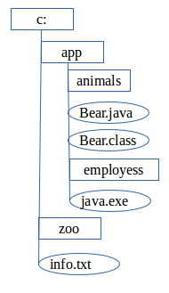
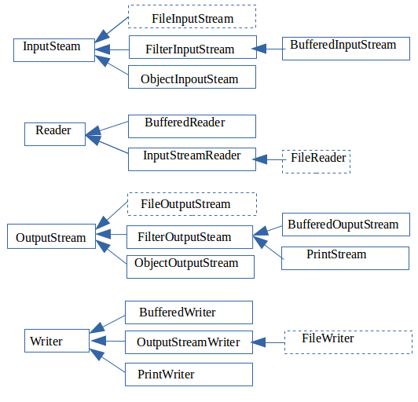
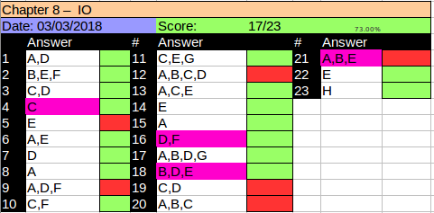

# Understanding Files and Directories
WHat can java do outside the scope of managing objects anb attributes in memory? How can they save data so that information is not lost every time the program is terminated? The use files of course! You can design a program that writes the current state of an application to a file every time the application is closed and then reloads the data when the application executed the next time. IN this manner the information is preserved between program executions.

We begin this Chapter by describing what a file is and what a directory is within a file system. We then present the ```java.io.File``` class and demonstrate how to use it to read and write file information.

## Conceptualizing the File System
A *file* is record within a file system that stores user and system data. Files are organized using directories. A *directory* is a record within a file system that contains files as well as other directories. For simplicity, we often refer to a directory reference as a file record throughout this chapter , since it is stored in the file system with a unique name and with attributes similar to a file.Finally a *root directory* is the topmost directory in the file system, from which all files and directories inherit. In Windows, it is denoted with a drive name such as c:\ while on linux it is denoted with a single forward slash /. The *file system* is in charge of reading and writing data within a computer. Different operative systems use different file systems to manage their data. For example, Windows-based systems use a different file system than Unix-based ones. Java includes numerous methods, which automatically connect to the local file system for you, allowing you to perform the same operations across multiple file systems.

A *path* is a string representation of a file or directpry within a file system. Each file system defines own path separator character that is used between directory entries. In most file systems, the value of the left of the separator is the parent of the value of the right of the separator. For example, ```/user/home/zoo.txt``` means that zoo.txt is inside the home directory, with the home directory inside the user directory. You will see that paths can be absolute or relative later in the Chapter. In the figure below we show how a durectory and a file system is organized in hierarchical manner. In this example, directories are rectangles and files as ovals. Directories can be empty, as shown with tyhe c:\zoo and c:\app\employees directories.



## Introducing the File Class
The first class the we will discuss is one of the most commonly used in the java.io API, the java.io.File class. The File class is used to read information about existing files and directories, list the contents of a directory, and create/delete files and directories.
An instance of a File class represents the pathname of a particular file or directory on the file system. The File class cannot read and write data within a file, altough it can be passed as reference to many stream classes to read or write data. 

:yin_yang: one common mistake new Java developers make is forgetting that File class can be used to represent directoris as well as files.

## Creating a File Object
A File object often initilizes with String containing either an absolute or relative path to the file or directory within the file system. Different operative systems vary in their format of path names. For example, Unix based systems use the forward slash / for paths, whereas Windows-based systems use the backslash \ character. That said, many programming languages and file systems support both types of slashes when writing path statements. For convenience, Java offers two options to retrieve the local separator character: a system property and a static variable defined in the File class. Both of the following examples will output the separator character:

```
System.out.println(System.getProperty("file.separator"));

System.out.println(java.io.File.separator);
```

The following code creates a File object and determines if the path it referenes exists within the file system:

```java
import java.io.File;

public class FileSample{
  public static void main(String[] args){
    File file = new File("/home/smith/data/zoo.txt");
    System.out.println(file.exists());
  }
}

```

This example uses the absolute path to a file and outputs true or false, depending on whther the file exists or not.The most common File construcot we will use takes a single String as an argument representing a relative of absolute path. The are other constructors such as the one that joins an exising File path with a relative child path, as shown in the following example:

```
File parent = new File("/home/smith");
File child = new File(aprent, "data/zoo.txt");
```

In this example we create a path that is equivalent to our previous example, using a combination of a child and a parent path. If the parent object happens to be null, then it would be skipped and the method would revert to our Sstring constructor.

## Working with a File Object
The File class contains numerous useful methods for interacting with files and directories within the file system. We represent the most commonly used one in the table below. Although this table may seem loke alot to learn, many of them are self explanatory:

**Method Name**    | **Description**
-------------------|---------------
exists()           | Returns true if the file or directory exists
getName()          | Returns the name of the file or directory denoted by this path
getAbsolutePath()  | Returns the absolute pathname string of this path
isDirectory()      | Returns true if the file denoted by this path is directory.
isFile()           | Returns true if the file denoted by this path is a file
length()           | Returns the number of bytes in the file. For performance reasons, the file system may allocate more bytes on disk than the file actually uses
lastModified()     | Returns the number of milliseconds since the epoch when the filke was last modified
delete()           | Deletes the file or directoryu. If this pathname denotes a directory, then the directory must be empty in order to be deleted
reanmeTo(File)     | Renames the file denoted by this path
mkdir()            | Creates the directory named by this path
mkdirs()           | Creates the directory named by this path
getParent()        | Returns the abstract pathname of this path including any nonexisitent parent directories.
listFiles()        | Returns a File[] array denoting the files in the directory

The following is a sample program that given a file path outputs information about the file or directory, such as whther it exists, what files are contained within it and so forth:

```java
import hava.io.File;

public class ReadFileInformation{
  public static void main(String[] args){
    File file = new File("C:\\data\\zoo.txt");
    System.out.println("File exists: " + file.exists());
    
    if(file.exists()){
      System.out.println("Absilute Path: " + file.getAbsolutePath());
      System.out.println("Is Directory: " + file.isDirectory());
      System.out.println("Parent Path: " + file.getParent());
      
      if(file.isFile()){
        System.out.println("File Size: " + file.length());
        System.out.println("File Last Modified: " + file.lastModified());
      }else{
        for(File subfile : file.listFiles()){
          System.out.println("\t" + subfile.getName());
        }
      }
    }
  }
}

```
If the path provided did not point to a file, it would output the following

```
File Exists: false
```

If the path provided pointed to a valid faile, it would putput something similar ro the following:

```java
File Exists: true
Absolute Path: C:\data\zoo.txt
Parent Path: C:\data
Is Directory: false
File Size: 12382
File lastModified: 104215000000
```

Finally, if the path provided pointed to a valid directory, such as C:\data, it would output something similar to the following:

```java
File Exists: true
Absolute Path: C:\data
Parent Path: C:\

Is Directory
  employee.txt
  zoo.txt
  zoo-backup.txt

```


# Introducing Streams
In this section, we present the concept of streams in Java and show how they are used for input/output processing. I/O refers to the natura of how data is accessed, either by reading the data fro the resource (input), or writing the data to a resource (output). This section will focus on the common ways that data using files accessed by streams. Notice that the I/O streams that we discuss in this chapter are data streams and completely unrelated to the new Stream API that you saw in Chapter 4 "Functional Programming".

## Stream Fundamentals
The contents of a file may be accessed or written via a stream, which is a list of data elements presented sequentially. Streams should be conceptually thought of as long, nerly never ending stream of water with data presented one "wave" at a time.For example, it may be helful to visualize a stream as being so large that all of the data contained in it could not possibly fit into memory. A 1 terabyte file could not be stored entirely in memory by most computer systems. The file can still be read and written by a program with very little memory, since the streams allows the application to focus on only a small portion of the overall stream at any given time. A real world scenario example is that writing a file one byte at a time is time consuming and slow in practice because the round-trip between the Java application and the file system is relatively expensive. By using a ```BufferedOutputStream``` the Java application can write a large chunk of bytes at a time, reducing the round-trips and drastically improving performance.

In fact you have been using streams since your first "Hello World" program! Java provides three built-in streams, System.in, System.err and System.out the last of which we have been using to output data to the screen throughtout this book. 

## Stream Nomenclature
The ```java.io``` API provides numerous classes for creating, accessing, and manipulating streams - so many that it tends to overwhelm most new Java developers/programmer. Stay calm! we will review the major differences between each stream class and show you how to distinguish between them. Even if you do come across a particular stream that you don't recognize, often the name of the stream gives you enough info to understand exactly what it does.

The goal in this section is to familiarize you with common terminology and naming convention used with streams. Don't worry if you don't recognize the particular stream class names used in this section or their function; we will covering in detail in the next part of the chapter.

## Byte Streams vs. Character Streams
The java.io API defines two sets of classes for reading and writing streams; those with Stream in their names and those with Reader/Writer in their name. For example, the java.io API defines both ```FileInputStream``` class as well as a ```FileReader``` class, both of which defines a Stream that reads a file. The difference between the two classes is based on how the stream is read or written. 

Differences between Stream adn Reader/Writers:

1- The stream classes are used for inputting and outputting **all types of binary or byte data**.
2- The reader and writer classes are used for inputting and outputting **only character and String data**.

It is important to remember that even though readers/writers do not contain the word Stream in their class name, they are still in fact streams! The use of Reader/Writer in the name is just to distinguish them from byte streams. Throughout the chapter, we will often refer to Reader/Writer classes as streams, since conceptually they are streams.

**Why use Character Streams?** Since they byte stream classes can be used to input and output all types of binary data, including strings, it naturally follows that you can write all of your code to use the byte stream classes, never really needing the character stream classes. There are advantages, though, to using reader/writer classes, as they are specifically focused on managing character and string data. For example, you can use a Writer class to output a String value to a file without having to worry about the underlying byte encoding of the file.  For this reason the character stream classes are sometimes referred to as convenience classes for working with thext data.

The java.io API is structured shuch that all of the stream classes have the word ```InputStream``` or ```OutputStream``` in their name, while all Reader/Writer classes have either Reader or Writer in their name. Pay close attention to the name of the java.io class on the exam, as decoding it often gives you context clues as to what the class does. For example, without needing to look it up, it should be clear that ```FileReader``` is a class that reads data from a file as characters or strings. Furthermore, ```ObjectOutputStream``` sounds like a class that writes object data to a byte stream.  

## Input and Output
Most input stream classes have corresponding Output class and vice versa. For example, the ```FileOutputStream``` class writes data that can be read by a ```FileInputStream```. If you understand the features of a particular Inout or Output stream class, you should naturally know what its complementary class does. It follows, then, that most Reader classes have corresponding Writer class. For example, the FileWriter class writes data that can be read by a FileReader.
There are exceptions to this rule. For the exam, you should know that PrinterWriter has no accompanying PrinterReader class. Likewise, the PrintStream class has no corresponding InputStream class. We will discuss these classes later in the chapter.

## Low-Level vs. High-Level Streams
Another way you can familiarize yourself with java.io API is by segmenting streams into low-level and high-level streams. A *low-level stream* connects directly with the source of the data, such as a file, an array, or a String. Low-level streams process the raw data or resources and are accessed in a direct and unfiltered manner. For example, a ```FileInputStream``` is a class that reads file data one byte at a time. 

Alternatively, a *high-level stream* is built on top of another stream using wrapping. *Wrapping* is the process by which an instance is passed to the constructor of another class and operations on the resulting instance are filtered and applied to the original instance. For example, take a look at the FileWriter and BufferedWriter objects in the following sample code. 

```java
try(Buffered bufferedReader = new BufferedReader(new FileReader("zoo-data.txt")){
  System.out.println(bufferedReader.readLine());
}
```
In this example, FileReader is the low-level stream reader, whereas BufferReader is the high-level stream that takes a FileReader as input. Many operations on the high-level stream pass through as operations to the underlying low-level stream, such as read() or close(). Other operations override or add new functionality to the low-level stream methods. The high level stream adds new methods, such as readLine(), as well as performance enhancements for reading and filtering the low-level data.

High-level streams can take other high-level streams as input. For example, although the following code might seem a litte odd at first, the style of wrapping a stream is quite common in practice:

```java
try (ObjectInoutStream objectStream = new ObjectInputStream(
                                              new BufferedInputStream(
                                                new FileInputStream("zoo-data.txt")))){
    System.out.println(objectStream.readObject());                                                
}
```

In this example, FileInputStream is the low level stream that interacts directly with the file, which is wrapped by a high level BufferedInputStream to improve performance. Finally, the entire object is wrapped by a high level ObjectInputStream, which allows us to filter the data as Java objects. 

For the exam the only low-level stream classes you need to be familiar with are the one that operates on files. The rest of the non-abstract stream classes are all high level streams.

***Real World Scenario*** **Use Buffered Streams When Working with Files**. As briefly mentioned, Buffered classes read or write data in groups, rather than a single byte or character at a time. The performance gain from using a Buffered class to access a low-level file stream cannot be overstated. Unless you are doing something very specilized in your application, you should always wrap a file stram with a Buffered class in practice.

The reason that Buffered streams tend to perform so well in practice is that file systems are geared for sequencial disk access. The more sequencial bytes you read at a time, the fewer round-trips between the Java process and the file-system, improving the access of your application. For example, accessing 16 sequential bytes is a lot faster than accessing 16 bytes spread accross the hard drive.


## Stream Base Classes
The java.io library defines abstract classes that are the parents of all stream classes defined within the API: InputStream, OutputStream, Reader and Writer. For convenience, the authors of the Java API include the name of the abstract parent class as the suffix of the child class. For example, ```ObjectInputStream``` ends with ```InputStream``` meaning it has InputStream as an inherited parent class. Although most stream classes in java.io follow this pattern, PrintStream, which is an OutputStream, does not. The constructor of high-level streams often take a reference to the abstract class. For example. BufferedWriter takes Writer object as input, which allows it to take any subclass or Writer. The advantage of using a reference to the abstract parent class in the class constructor should be apparant in the previous high-level stream example. With high level-streams, a class may be wrapped multiple times. Furthermore, developers may define their own stream subclass that performs custom filtering. By using the abstract parent class as input, the high level stream classes can be used much more often without concern for the particular underlying stream subclass.

Once common area where the exam likes to play tricks on you is mixing and macthing stream classes that are not compatible with each other. For example, take a look at each of the following examples and see if you can determine why they do not compile. 

```java
new BufferedInputStream(new FileReader("zoo-data.txt"));      //DOES NOT COMPILE

new BufferedWriter(new FileOutputStream("zoo-data.txt"));     //DOES NOT COMPILE

new ObjectInputStream(new FileOutputReader("zoo-data.txt"));  //DOES NOT COMPILE

new BufferedInputStream(new InputStream());                   //DOES NOT COMPILE

```

The first two examples do not compile because they mix Reader/Writer classes with InputStream/OutputStream classes, respectively. The third example does not compile because we are mixing an OutputStream with an InputStream. Although it is possible to read data from and InputStream abd write it to an OutputStream, wrapping the stream is not the way to do so. As you shall see later in this chapter the data must be copied over, often interatively. Finally the last example does not compile because InoutStream is an abstract class, and therefore you cannot instantiate an instance of it.

## Decoding Java I/O Class Names
Given that there are so many different java.io stream classes, it is reasonable to think that you might encounter one on the exam whose name you may have forgotten. Luckily, the function of most stream classes can be understood by decoding the name of the class. We summarize these properties in the following list.

### Review of java.io Class Properties
- A class with the word InputStream or OutputStream in its name is used for reading or writing binary data, respectively.
- A class with the word Reader or Writer in its name is used for reading or writing character or string data, respectively.
- Most, but not all, input classes have corresponding output class.
- A low level stream connects directly with the source of the data.
- A high-level stream is built on top of another stream using wrapping.
- A class with Buffered in its name reads or writes data in groups of bytes or characters and often improves performance in sequential file systems.

When wrapping a stream you can mix and match only types that inherits from the same abstract parent stream. The table below describes those java.io streams you should be familiar with for the exam. Note that most of the information about each stream, such as whether it is an input or output stream or whether it accesses data using bytes characters, can be decoded by the name alone.

**Method Name**    | **Low/High Level**   |    **Description**
-------------------|----------------------|--------------------------------------------
InputStream        |  N/A                 | The abstract class all InputStream classes inherit from
OutputStream       |  N/A                 | The abstract class all OutputStream classes inherit from
Reader             |  N/A                 | The abstract class all Reader classes inherit from
Writer             |  N/A                 | The abstract class all Writer classes inherit from
FileInputStream    |  Low                 | Reads file data as bytes
FileOutputStream   |  Low                 | Writes file data as bytes
FileReader         |  Low                 | Reads file data as bytes
FileWriter         |  Low                 | Writes file data as characters
BufferedReader     |  High                | Reads charater data from an exisiting Reader in a buffered manner, which improves efficiency and perfrmance
BufferWriter       |  High                | Writes charater data from an exisiting Writer in a buffered manner, which improves efficiency and perfrmance
ObjectInputStream  |  High                | Deserializes primitive Java data types and graphs of Java objetcs to an existing InputStream
ObjectOutputStream |  High                | Serializes primitive Java data types and graphs of Java objetcs to an existing OutputStream
InputStreamReader  |  High                | Reads character data from existing InputStream
OutputStreamWriter |  High                | Writes character data to an exisiting OutputStream
PrintStream        |  High                | Writes formatted representations of Java objects to a binary stream
PrintWriter        |  High                | Writes formatted representation of Java objects to a text-based output stream

We will discuss these java.io classes in more details including examples in upcoming sections.

## Common Stream Operations
Before we delve into specific stream classes, let's review some common processes when working with streams.

### Closing the Stream
Since streams are considered resources, it is imperative that they be closed after they are used lest they lead to resource leaks. As you saw in chapter 6 "Exceptions and Assertions" you can accomplish this by calling the close() methoid in the finally block or using try-with-resource syntax.

In a file system, failing to close a file properly could leave oit locked by the operative system such that no other process could read/write to it until the program is terminated. Throughout this chapter, we will close stream resources wusing try-with-resources syntax, since this is preferred way of closing resources in Java. 

### Flushing the Stream
When data is written to an OutputStream, the underlying operative system does not necessarily guarantee that the data will make it to the file immediately. In many operating systems, the data may be cached in memory, with a write occuring only after a temporary cache is filled or after some amount of time has passed. If the data is cached in memory and the application terminates unexpectedly, the data would be lost, bacause it was never written to te file system. To address this, Java provides a flush() method, which requests that all accuulated data be written immediately to disk. The flush() method helps reduce the amount of data lost if the application terminates unexpectedly. It is not without cost though. Each time it is used it may cause a noticeable delay in the application, especially for large file. The flush() method should be use intermittently. For small files it should only be called only once.

You do not need to call the flush() method explicitly when you have finished writing to a file, since the close() method will atomatoically do this. in some cases, calling the flush() method intermittently while writing a large file, rather than performing a single large flush when the file is closed, may appear to improve performance by stretcthing the disk access over course of the write process.

### Making the Stream
The InputStream and Reader classes include mark(int) and reset() methods to move the stream back to an earlier position. Before calling either of these methods, you should call the markSupported() method, which returns true only if mark() is supported. Not all java.io input stream classes support this operation, and trying to call mark(int) or reset() on a class that doesn not support these operations will throw an exception at runtime.

Once you've verified that the stream can support these operations, you can call mark(int) with a read-ahead limit value. You can then read as many bytes as you want up to the limit value. If at any point you want to go back to the earlier position where you last called mark(), then you just call reset() and the stream will "revert" to an earlier state. In practice, it's not actually putting the data back into the stream but storing the data that was already read into memory for you to read again. Therefore, you should not call the mark() operation with too large a value as this could take up a lot of memory. Assume that we have an InputStream instance whose next values are ABCD. Consider the following code snippet:

```java
InputStream is = ...
System.out.println((char) in.read());
if(is.markSupported()){
  is.mark(100);
  System.out.print((char) is.read());
  System.out.print((char) is.read());
  is.reset();
}
System.out.print((char) is.read());
System.out.print((char) is.read());
System.out.print((char) is.read());
```

The code snippet will output the following if the mark() operation is supported:

```
ABCBCD
```

It first outputs A before the if statement. Since we are given that the stream supports the mark() operation, it will enter the if statement and read two characters, BC. It then calls the reset() operation, moving our stream back at the state that it was in after the A was read, comes out of the if statement and BC are read again, followed by D.
If the mark operation is not supported it will output this instead, skipping the if statement entirely:

```
ABCD
```

Notice that regardless of whether the mark() operation was supported, we took care to have the stream end at the same position. Finally, if you call reset() after you have passed your mark() read limit, an exception may be thrown at runtime since the marked position may become invalidated. We say "an exception may be thrown" as some implementations may use a buffer to allow extra data to be read before the mark is invalidated  

### Skipping over Data
The InputStream and Reader classes also include ```skip(long)``` method, which as you might expect skips pver a certain number of bytes. It returns a long value, which indicates the number of bytes that were actually skipped. If the return value is zero or negative, such as if the end of the stream was reached, no bytes were skipped. Assume we have an InputStream instance whose next values are TIGERS. Consider the following code snippet:

```java
InputStream is = ...
System.out.println((char) is.read());
is.skip(2);
is.read();
System.out.println((char) is.read());
System.out.println((char) is.read());
```
The code will read one character, T, skip two characters, IG and then read three more characters, ERS, only the last two of which are printed to the user, which results in the following output.

```
TRS
```
You may notice in this example that calling the skip() operation is equivalent to calling read() and discarding the output. For skipping a handful of bytes, there is virtually no difference. On the other hand, for skipping a large number of bytes, skip() will often be faster, because it will use arrays to read the data.

# Working with Streams
Now that we have reviewed the types of streams and their properties it's time to jump in and work with some stream code! Some of the techniques for accessing streams may seem a bit new to you, but as you will see they are very similar among different stream classes.

## The FileInputStream and FileOutputStream Classes
These two are used to read bytes from a file or write bytes to a file, respectively. These classes include constructors that take a File object or a String, representing a path to the file.

The data in a FileInoutStream object is commonly accessed by successive calls to the read() method until a value of -1 is returned, indicating that the end of the stream - in this case the end of the file - has been reached. Although less common, you can choose to stop reading the stream early just by exiting the loop, such as if some search String is found. Note that when reading a single value of a FileInputStream instance, the read() method returns primitive int value rather than a byte value. It does this so that it has an additional value avaialable to be returned, specifically -1, when the end of the file is reached. For compatibility, the FileOutputStream also uses int instead of byte for writing a single byte to a file.

The FileInputStream class also contains overloaded versions of the read() method, which takes a pointer to a byte array where the data is written. The method returns an integer value indicating how many bytes can be read into the byte array. It is also used by Buffered classes to improve performance, as you shall see in the next section.

A FileOutputStream object is accessed by writing successive bytes using the write(int) method. Like the FileInputStream class, the FileOutputStream also cotains overloaded versions of the write() method that allow a byte array to be passed and can be used by Buffered classes. The following code uses FileInputStream and FileOutputStream to copy a file:

```java
import java.io.*;

public class CopyFileSample{
  public static void copy(File source, File destination) throws IOException{
      try(InputStream in = new FileInputStream(source); 
          OutputStream out = new FileOutputStream(destination)){
            int b;
            while((b = in.read()) != -1){
              out.write(b);
            }
      }
  }
  
  public static void main(String[] args) throws IOException{
    File source = new File("Zoo.class");
    File destination = new File("ZooCopy.class");
    copy(source, destination);
  }
}
```

The main method creates two File objects, one for the source file to copy from and one for the destination file to copy to. If the destination file already exists, it will be overridden by this code. Both File objects are created using relative paths, so application would search for the Zoo.class in the current directory to read from, throwing a FileNotFoundException if the file is not found, which is a subclass of an IOException.

The copy() method creates instances of FileInputStream and FileOutputStream, and it proceeds to read the FileInputStream one byte at a time, copying the value to the FileOutputStream as it's read. As soon as the in.read() returns a -1 value, the loop ends. Finally, both streams are closed using the try-with-resources syntax. Note that performance for this code, epecifically for large files, would not be particularly good because the sample does not use any byte arrays.As you shall see in the next section, we can improve the implementation using byte arrays and buffered streams. 

## The BufferedInputStream and BufferedOutputStream Classes
We can enhance our implementation with only a few minor a few minor code changes by wrapping the FileInputStream and FileOutputStream classes that you saw in the previous example, with the BufferedInputStream and BufferedOutputStream classes respectively. Instead of reading the data one byte at a time, we use the underlying ```read(byte[])``` method of BufferedInputStream, which returns the number of bytes read into the provided byte array. The number of bytes read is important for two reasons. First, if the value returned is 0, then we know that we have reached the end of the file and can stop reading from the BufferedInutStream. Second, the last read of the file will likely only partially fill the byte array, since it is unlikely for the file size to be an exact multiple of our buffer array size. For example, if the buffer size is 1024 bytes and the file size 1054 bytes, then the last read will only be 30 bytes. The length value tells us how many of the bytes in the array were actually read from the file. The remaining bytes of the array will be filled with leftover data fro the previous read that should be discarded. The data is written into the BufferedOutputStream using the ```write(byte[],int,int)``` method, which takes as input a byte array, an offset, and a length value, respectively. The offset value is the number of values to skip before writing characters, and it is often set to 0. The length value is the number of characters from the byte array to write.

**Why use the Buffered Classes?** It's quite common to use Buffered classes anytime you are reading or writing data with byte arrays. The Buffered classes contain numerous performance enhancements for managing stream data in memory.

For example, the BufferedInputStream class is capable of retrieving and storing in memory more data than you might request with a single read() call. For successive calls to the read() method with small byte arrays, this would e faster in a wide variety of situations, since the data can be returned directly from memory without going to the file system. 

Here is a modified form of our copy() methid, which uses byte arrays and BufferedStream classes:

```java
import java.io.*;

public class CopyBufferFileSample{
  public static void copy(File source, File destination) throws IOException{
    try (
      InputStream in = new BufferedInputStream(new FileInputStream(source));
      OutputStream out = new BufferedOutputStream( new FileOutputStream(destination))){
      byte[] buffer = new byte[1024];
      int lengthRead;
      while((lengthRead = in.read(buffer)) > 0){
        out.write(buffer, 0, lengthRead);
        out.flush();
      }
    }
  }
}

```

You can see that this sample code that uses byte arrays is very similar to the nonbuffered sample code, although the performance improvement for using both the Buffered classes and byte arrays is an order of magnitude faster in practice. We also added a flush() command in the loop, as previously discussed, to ensure that the written data actually makes it to disk before the next buffer of data is read.

**Buffer Size Tuning** we chose a buffer size of 1024 in this example, as this is appropriate for a wide variety of circumstances, although in practice you might see a better performance with a higher or lower buffer size. This depends of several number of factors like the system block size and the CPU hardware. It is also common to choose a power of 2 for the buffer size, since most underlying hardware is structured with file block and cache sizes that are power of 2. The Buffered classes allow you to specify the number in the constructor and if none is provided they use a default value which is a power of 2. Regardless the buffer size you choose the biggest performance you will see is moving from nonbuffer to buffred file access. Adjusting the buffer size may improve slightly but it is unlikely to have a significant impact.

## The FileReader and BufferedWriter Classes
The FileReader and FileWriter classes, along with their associated buffer classes, are among the most convenient classes in the java.io API, in part because reading and writing text data are among the most common ways the developers interact with files.

Like the FileInputStream and FileOutputStream classes, the FileReader and FileWriter classes contain read() and write() methods, respectively. These methods read/write char values instead of byte values; although similar to what you saw with streams, the API actually uses int value to hold the data so that -1 can be returned if the end of the file is detected. The FileReader and FileWriter classes contain other methods that you saw in the stream classes, including close() and flush() the usage of which is the same.

The Writer class, which FileWriter inherits from, offers a write(String) method that allows a String object to be written directly to the stream. Using FileReader also allows you to pair it BufferedReader in order to use the very convenient readLine() method, which you will see in the next example.

## The BuferedReader and BufferedWriter Classes
Let's take a look at a sample program that makes use of both the BufferedReader abd BufferedWriter classes unsing the associated readLine() abd write(string) methods. It reads a text file, outputs each line to screen, and writes a copy of the file to disk. Since these classes are buffered, you can expect better performance  than if you read/wrote each characters one at a time:

```java

import java.io.*;
import java.util.*;

public class CopyTextFileSample{
  public static List<String> readFile(File source) throws IOException{
    List<String> data = new ArrayList<String>();
    try(BufferedReader reader = new BufferedReader(new FileReader(source))){
      String s;
      while((s = reader.readLine()) != null){
        data.add(s);
      }
    }
    return data;
  }
  
  public static void writeFile(List<String> data, File destination) throws IOException{
    try(BufferedWriter writer = new BufferedWriter(new FileWriter(destination))){
      for(String s: data){
        writer.write(s);
        writer.newLine();
      }
    }
  }
  
  public static void main(String[] args) throws IOException{
    File source = new File("Zoo.csv");
    File destination = new File("ZooCopy.csv");
    List<String> data = readFile(source);
    for(String record: data){
      System.out.println(record);
    }
    writeFile(data, destination);
  }

}

```

This example is similar to the file copy example that you saw previously, with some important differences. First, in the readFile() method, we use a temporary String reference s to hold the value of the data in loops as we read it. Unlike FileInputStream and FileReader, where we use -1 to check for file termination of an int value, with BufferedReader, we stop reading the line when readLine() returns null.

Next, instead of immediatelly copying the data we read from the file into the output file, we store it in a List of String objects in the readFile() method. This allows us to both display and modify the data, prior to writing it to disk later. For example, let's say we wanted to replace one persons name in a text file with another. We would just use the String.replaceAll() method on the data as we wrote it to the disk, and the new file would have the replacement. By working with String values instead of of byte values, we have access to all of the String methods to manipulate data. The major difference between this version and previous one is the code that is written in the readFile() method. Unlike the previous example where we had to write the code one byte at a time or by using byte array, we can write the entire string in a single call. The write(String) method is quite convenient in practice. We then use the writer.newLine() method to insert a line break into the copied file, as our reader.redLine() method split on line breaks. Note that we used .csv file extension in this example to represent comma-separated values files, as these are are commonly text based. This example also assumes that the CSV file is small enough to fit entirely in memory. Let's say that the file is so large that it cannot fit in memory. If you wanted to write it directly to disk, rathen than sorting it in a List object, you could take our earlier copy file stream example and replace it with Reader/Writer methods. 

### Comparing the Two Copy Applications
Although both of this examples and the previous InputStream/OutputStream solution can successfully copy the file, only the Reader/Writer solution gives us structured access to the text data. In order to accomplish the same feat with the InputStream/OutputStream classes the application would have to detect the end of each line, which would be a lot of extra work. For example, if we are using BufferedInputStream, multiple end-of-line characters could appear in the buffer array, meaning that we would have to go searching for them and then reconstruct the strings contained within the buffer array manually. We would also have to write code to detect and process the character encoding. The character encoding determines how characters are encoded and stored in bytes and later read back or decoded as characters. Although this may seem simple, Java supports a wide variety of character encodings, ranging from ones that may use one byte for Latin characters, UTF-8 and ASCII for example, to using two or more bytes per character, such as UTF-16. For the exam you dont need to memorize he character encodings, but you should be familiar with the names if you come accross them on the exam.

**Character encoding in Java** Character encoding can be specified using the Charset class by passing a name value to the static Charset.forName() method, such as in the following examples:

```
Charset usASsciiCharset = Charset.forName("US-ASCII");

Charset utf8Charset = Charset.forName("UTF-8");

Charset utf16Charset = Charset.forName("UTF-16");

```

Java supports numerous character encoding, each specified by a different standard name values. 

The key point here is that although you can use InputStream/OutputStream instead of Reader/Writer to read and write text files, it is inappropriate to do so. Recall that the character stream classes were convenience, and you should certainly take advantage of them when working with text data.

## The ObjectInputStream and ObjectOutputStream Classes
Throughout this book, we have been managing our data model using classes, so it makes sense that we would want to write these objects to disk. The process of converting an in-memory object to a stored data format is referred to as *serialization* with the reciprocal process of converting stored data into an object, which is known as *deserialization*. In this section, we will show you how Java provides built-in mechanisms for serializing and deserializing streams of objects directly to and from disk respectively.

Note that Oracle has a long history for adding and removing serialization from the list of the exam objectives. So please check the latest list of objectives prior to taking the exam to determine if it is present.

## The Serializable Interface
In order to serialize objects in java.io API, the class they belong to must implement the java.io.Serializable interface. The Serilizable interface is a tagging or marker interface, which means that it does not have many methods associated with it. Any class can implement the Serializable interface since there are no required methods to implement. The purpose of implementing the Serializable interface is to inform any process attempting to serialize the object that you have taken the proper streps to make the object serializable, which involves making sure that the classes of all instance variables within the object are also marked Serializable. Many of the built-in Java classes that you have worked with throughout this book, including the String class, are marked serializable. This means that many of the simple classes that we have built throughout this book can be marked Serializable without any additional work.

Note that the requirement for properly marking an object as Serializable may involve nested objects. For exampl, if a Cat class is marked as Serializable and contains reference to a Tail object, then the class definion of Tail object must also be marked as Serializable. Therefore, any object reference contained within the Tail class must belong to classes that are alos marked as Serialiable, and so on.

A process attempting to serialize an object will throw a NotSerializableException if the class or one of its contained classes does not properly implement the Serializable interface. You can use the **transcient** keyword on the reference to the object , which will instruct the process serilizing the object to skip it and avoid throwing a NotSerializableException. The only limitation is that the data stored in the object will be lost during the serialization process. 

Besides transcient instance variables, static class memebers will also be ignored during the serialization and deserialization process. This should follow logically, as static class variables do not belong to one particular instance. If you need to store static class information, it will need to be copied to an instace object serialized separately.

**Why Not Mark Every Class as Serializable ?** You might be wondering why don't you just mark every class with the Serializable interface since there is a no cost to doing so. The reason that we do not is that there are some classes that we want to instruct the JVM not o serialize. In particular, process-heavy classes such as the Thread class or any of the Stream classes would be difficult, often impossible, to save to persisitent storage, since much of their work involves managing JVM processes or resources in real time. By refraning from making a class Serializable, we are encouraging developers using it within their Serializable object either to make the reference to the class a local variable or, if they choose to include it in their class definition, to make sure that they mark it as transcient, so that they realize the contentof the object will not be saved when the larger object is serialized.

The following program is an exmaple of our Animal class that implement a Serilizable properly:

```java
import java.io.Serializable;

public class Animal implements Serializable{
  private static final long serialVersionUID = 1L;
  private String name;
  private int age;
  private char type;
  
  public Animal(String name, int age, char type){
    this.name = name;
    this.age = age;
    this.type = type;
  }
  
  public String getName(){ return name;}
  
  public int getAge(){ return age;}
  
  public char getType(){ return type;}
  
  public String toString(){
    return "Animal [name=]" + name + ", age=" + age + "type=" + type + "]";
  }
}
```

All that was required to make our previous Animal class serializable in Java was to add implements Serializable to the class definition. Notice that we also added a variable called serialVersionUID. Although this is certainly not required as part of implementing the Serializavble interface, it is considered a good practice to do so and update this static class variable anytime you modify the class. The serialVersionUID is stored with the serialized object and assists during the deserialization process. The serialization process uses the serialVersionUID to identify uniquely a version of the class. That way, it knows whether the serialized data for an object will macth the instance variable in the current version of the class. If an older version of the class is encountered during the deseriliazation, an exception is thrown. Alternatively, some deserialization tools support conversions automatically.

**Mantaining a Serail UID** We recommend that you do not rely on the generated serialVersionUID provided by the java compiler and that you explicitly declare one in each of your Serializable classes. Different Java compiler versions accross different platforms may differ in their implementation if the generated serialVersionUID. For example, you might end up with different ID values for the same class, if you are working with the Oracle impemntation of Java 8 on a Windows platform versus a collegue using an OpenJDK Java 6 product on a Linux Platform. Therefore it is recommended that you provide and manage the serialVersionUID in all of your Serializable classes, updating it anytime the instance variables in the class are changed.

## Serializing and Deserializing Objects
The java.io API provides two stream classes for object serialization and deserialization called ObjectInputStream and ObjectOutputStream. The ObjectOutputStream class includes a method that serialize the object to the stream called ```void writeObject(Object)```. If the provided object is not Serializable, or it contains an embedded reference to a class that is not Serializable, or not marked trancient, a NotSerializableException will be thrown at runtime. 

For the reciprocal process the ObjectInputStream class includes a deserialization method that returns an object called readObject(). Notice that the return type of this method is the generic type java.lang.Object, indicating that the object will have to be cast explicitly at runtime to be used.

We now provide a sample program that reads and writes Animal data objects:

```java
import java.io.*;
import java.util.*;
public class ObjectStreamSample{
  public static Lis<Animal> getAnimals(File dataFile) throws IOExceotion, ClassNotFoundException{
    List<Animal> animal = new ArrayList<Animal>();
    try( ObjectInputStream in = new ObjectInputStream(new BufferedIntputStream(new FileInputStream(dataFile)))){
      while(true){
        Object object = in.readObject();
        if(object instanceof Animal){
          animals.add((Animal)object);
        }
      }catch(EOFException e){
        // FIle end reached
      }
      
      return animals;
    }
    
    public static void createAnimalsFile(List<Animal> animals, File dataFile) throws IOException{
      try(ObjectOutputStream out = new ObjectOutputStream(new BufferedOutputStream(new FileOutputStream(dataFile)))){
        for(Animal animal : animals){
          out.writeObject(animal);
        }
      }
    }
    
    public static void main(String[] args) throws IOException, ClassNotFoundException{
      List<Animal> animals = new ArrayList<Animal>();
      animals.add(new Animal("Tommy Tiger", 5, 'T'));
      animals.add(new Animal("Peter Penguin", 8, 'P'));
      
      File dataFile = new File("animal.data");
      createAnimalsFile(animals,dataFile);
      System.out.println(getAnimals(dataFile));
    }
  }
}

```

From a high-level the program first creates a list of Animal objects in memory that includes two Animal instances. It then writes the list data into memory to an animal.data file saved in the current working directory. Finally, it reads data from the file and outputs the following text:

```
[Animal [name=Tommy Tiger, age=5, type=T], Animal [name=Peter Penguin, age=8, type=P]]
```

For performance reasons, we wrap each low-level file stream with a Buffered stream and then chain the result to an Object stream. The createAnimalsFile() emthod should be somewhat straightForward since we are just interating over the List object and serializing each Animal object to disk using the writeObject() method.

The getAnimals() method is a little more complex, as we must take special care to deserialize the object form disk. Forst we need to check that the object we are reading is actually an instance of the Animal class before explicitly casting it, or else we might get a ClassCastException at runtime. In practice, we may want to throw an exception or log additional details if we encounter a class type that we did not expect. Next the readObject() throws a checked Exception. ClassNotFoundException, since the class of the deserialized object may not be available to the JRE. Therefore we need to catch the exception and rethrow in out emthod signature; in this case, we chose the latter. Finally since we are reading objects we cant use a -1 interger value to determine when we have finish reading a file. Instead, the proper technique is to catch EOFException, which marks the program encountering the end of the file. Notice that we dont do anything with the exception other than finish the method. 

We conclude the discussion of the Object stream classes by noting that they do support reading and writing  null objects. Therefore, it is important to check for null values when reading from a serilized data stream. In our sample application, we rely on the property of the instance operatir always to return false for null values to skip explicitly needing to check for null values.

## Understanding Object Creation
For the exam you need to be aware of how a deserilized object is created. When you deserilize an object, the constructor of the serialized class is not called. In fact, Java calls the first no-arg constructor for the first non-serializable parent class, skipping the constructor of any serialized class in between. Furthermore, any static variables or default initilizations are ignored. Let's take a look at a modified version of the Animal class and see how the output of the ObjectStreamSample program would change with some modifications to our attributes and add a new constructor:

```java
public class Animal implements Serializable{
  private static final long serialVersionUID = 2L;
  private transcient String name;
  private transcient int age = 10;
  private static char type = 'C';
  {this.age = 14;}
  
  public Animal(){
    thismname = "Unknown";
    this.age = 12;
    this.type = 'Q';
  }
  
  public Animal(String name, int age, char type){
    this.name = name;
    this.age = age;
    this.type =type;
  }
  
  // some methods as before...

}

```

As we said earlier, transcient means that the value woun't be included in the serialization process, so it's safe to assume name and age will be left out of the serialized file. More interestengly, the values of age beign set to 10, 12 or 14 in the class are all ignored when the object is deserialized, as no class constructor or default initilizations are used. The following is the output of the ObjectStreamSample program with the new Animal class definition:

```
[ Animal [name=null, age=0,type=P], Animal [name=null, age=0,type=P]]
```

As expected, you can see that the values for name and age are lost on serialization and not set again during deserialization. The JVM initializes these variables with the default values based on the data types String and int, which are null and 0, respectively. Since the type variable is static, it is not serialized to disk. The sample program displays a value for type, as the variable is shared by all instances of the class and is the last value in our sample program. For the exam, make sure that you understand that the constructor and any default initilizations are ignored during the deserialization process.

## The PrintStream and PrintWriter Classes
These are the high level stream classes that write formatted representation of Jva objects to a text-based output stream. As you may have noticed by the name, the PrintStream class operates on OutputStream instances and writes data as bytes, whereas the PrintWriter class operates on Writer instances and writes data as characters. For convenience, both of these classes include construcotrs that can be open and write to files directly. Furthermore, the PrintWreiter class even has a constructor that takes an OutputStream as input, allowing you to wrap a PrintWriter class aroud an OutputStream. These classes are primarily convenience classes in that you could write the low-level primitive or object directly to a stream without a PrintStream or PrintWriter class, although using one is helpful in a wide variety of situations. In fact, the primary method class we have been using to output information to the screen throughout this book uses a PrintStream object! For the exam, you should be aware that System.out and System.err are actually PrintStream objects! 

Because a PrintStream inherits OutputStreams  and PrinterWriter inherist Writer, both support the underlying write() method while providing a slew of print-based methods. For the exam, you should be familiar with the print(), println(), format() and printf() methods. Unlike the underlying write() method, which throws a checked IOException that must be caught in your application, these print based methods do not throw any checked exceptions. If they did , you would have been required to catch a checked exception anytime you called System.out.println() in your code. Both classes provide a method, checkError(), that can be used to detect the presence of a problem after attempting  to write data to the stream. For the rest of this section, we will use a PrintWriter in our examples, as writing String data as characters instead of byte values is recommended. Keep in mind that the same examples could be easily rewritten with PrintStream object.

Note that for the exam you should be aware that the Console class includes two methods, format() and printf() which take an optional vararg and format output, although you are no longer required to know the various rules for formatting for the exam. For this chapter, we will provide the first String argument to these methods only.

### print()
The most basic of the print methods is this one, which is overloaded with all Java primitives as well as String and Object. In general, these methods perform String.valueOf() on the argument and call the underlying  stream's write() method, although they also handle character encoding automatically. For example, the following sets of print/write code are equivalent:

```java
PrintWriter out = new PrintWriter("zoo.log");

out.print(5);  //PrintWriter method
out.write(String.valueOf(5))   //Writer method

out.print(2.0);  //PrintWriter method
out.write(String.valueOf(2.0))   //Writer method

Animal animal = new Animal();
out.print(animal);     //PrintWriter method
out.write(animal == null ? "null" : animal.toString());   //writer method

```

You may remember from your OCA study material that valueOf() applied to an object calls the object's toString() method or returns null if the obeject is not set. As these examples show , you could write to the same stream without the PrinterWriter methods, but having the convenience of methods that convert everyting to String values for you is extremely useful in practice.

### println()
The next method available in the PrinterStream and PrintWriter classes are the println() a methods, which are virtually identical to the print() methods, except that they insert a line break after the string value is written. The classes also include a version of println() that takes no arguments, which terminates the current line by writing a line separator. 

These methods are specially helpful, as the line break or separator character is JVM dependent. For example, in some systems a line feed symbol, \n signifies a line break whereas other systems use a carriege return synbol followed by a line feed synbol, \r\n, to signify a line break. As you saw earlier in the chapter with file.separator, the line.separator value is available as a Java system property at any time:

```
System.getProperty("line.separator");
```
Although ypu can use pirnt() instead of println and insert all the line breaks manually, it is not recommended in practice. As the line break character is OS dependant, it is recommended to rely in the println() for inserting line breaks since it makes your code more lightweight and portable.

### format() and printf()
Like the String.format() methods discussed in chapter 5 the format() method in PrintStream and PrintWriter takes a String an opetional locale, and a set of arguments and it writer a formatted string to the stream based on the input, In other workdsm it is a convenience method for formatting directly to the stream, Refer to chapter 5 for more details about how string values can be formatted in Java.

For convenience, as well as to make C developers fell more home in Java, the PrintStream and PrintWriter API also include a set to printf() methods, which are straight pass through methods to the format() methods. For example, although the names of the following two methods to the format() methods. For exampl, although the names of the following two methods differ their input values, outout value, and behavious are identical in Java. They can be used interchangeably:

```java
public PrintWriter format(String format, Object args...);
public PrintWriter printf(String format, Object args...);
```

## Sample PrintWriter Application
We conclude this section with sample code of the PrinterWriter class in action, as well as the accompanying output file:
```java
import java.io.*;

public class PrinterWriterSample{
  public static void main(String[] args) throws IOException{
    File source = new File("zoo.log");
    try(PrintWriter out = new PrintWriter(new BufferedWriter(new FileWriter(source)))){
      out.print("Today's wheater is: ");
      out.println("Sunny");
      out.print("Today's temperature at the zoo is: ");
      out.print(1 / 3.0);
      out.println('C');
      out.format("It has rained 1.12 inches this year")
      out.println();
      out.printf("It may rain 21.2 more inches this year");
    }
  
  }
}

```

Note that we used a BufferedWriter along with FileWriter to access the file. We could have also used the PrinterWriter(String filename) constructor in this example, as we did earlier in this section. The following are the contents of the file generated by the preceding code.

```
Today's weather is: Sunny
Today's temperature at the zoo is: 0.333333333C
It has rained 10.12 inches this year
It may rain 21.2 more inches this year
```

You should pay close attention to the line breaks in the sample. For example, we called println() after our format() since the format() does not automatically insert a line break after the text. One of the most common bugs with printing data in practice is failing to account for line breaks properly.

## Review of Stream Classes
We conclued this part of the chapter with figure below which shows the various java.io stream classes that we have discussed and how they are related to one another via inheritance.The classes on the left side of the diagram are the abstract parent classes . The classes on the right hand side with dotted borders are lowe-level streams, and the one with solid borders are high level streams. Note that this diagram does not include all hava.io streams clkasses, just the one with which you should be familiar for the exam.



## Other Stream Classes
The high-level InputStreamReader and OutputStreamWriter presented in the figure above are out of scope for the exam but usefil in practice. The InputStreamReader class takes an InputStream instance and returns a Reader object. Likewise, the OutputStremWriter class takes an OutputStrem instance and returns a Writer object. In this manner, these classes convert data between character and byte streams, These classes are also unique in that they are the only java.io stream clases to have both Stream and Reader/Writer in their name.

Likewise, the DataInputStream and DataOutputStream are no longer required for the exam. They function quite similarly to the Object stream classes but are tailored to write only primitives and String values. In practice, they are rarely used as they require values example, if you wrote a String followed bu an int and then a float, you would need to repeat in this order exactly to read the data properly. In this manner, the files created by the DataOutputStream methods tend to be too rigid and too cumbersome to use in professional software developement. Finally, the parent classes FilterInputStream and FilteredOutputStream are not discussed in this section, but they are also presented in the figure above since we did discuss classes that inherit from them. The Filter clases are the superclass of all classes that filter or tranform data. These classes will not be on the exam.

# Interacting with Users
The java.io API includes numerous classes for interacting with the user. For example, you might want to want to write an application the asks the user to log in and reads their loging details. In this section we will cover the java.io.Console class.
The Console class was introduced in Java 6 as a more evolved form of System.in and System.out stream classes. It is now the recommended technique for interacting with and displaying information to the user in a text-based environment.

## The Old Way
Before we crack on with the Console class, let's review the old way of obtaining text input from the user. Similar to how System.out returns PrintStream and is used to output text data to the user, System.in returns an InputStream and is used to retrieve text input from the user. It can be chained to a BufferedReader to allow input that terminates with the Enter key. Before we can apply the BufferedReader, though, we need to wrap the System.in object using the InputStreamReader class, which allows us to build Reader object out of an exisiting InputStream instance. The result os shown in the following application:

```java
import java.io.*;

public class SystemInSample{
  public static void main(String[] args) throws IOException{
    BufferedReader reader = BufferedReader(new InputStreamReader(System.in));
    
    String userInput = reader.readLine();
    System.out.println("You entered the following: " + userInput);
  }

}


```

When run, this application fetches a single line of text from the user and then outputs it to the user before terminating. Norice that we did not close the stream, as closing System.in would prevent our application from accepting user input for the reminder of the application execution.

## The New Way
The System.in and System.out objects have been available since the earliest versions of Java. In Java 6, the java.io.Console class was introduced with far more features and abilities than the original techniques. After all, System.in and System.out are just raw streams, whereas Console is a class with multiple convenience methods.

To begin, the Console class is a singleton, and means that there is only one version of the object available in the JVM. It is created automatically for you by the JVM and accessed by calling the System.console() method. Be aware that this method will return null in envorionment where texrt interaction are not supported.

Next, let's look at out single code rewritten using the Console class:

```java
import java.io.Console;

public class ConsoleSample{
  public static void main(Stirng[] args){
    Console console = System.console();
    if(console != null){
      String userInput = console.readLine();
      console.writer().println("You entered the following: " + userInput);
    }
  }

}


```

The sample code first retrieves an instance of the Console singleton and determines if the Console is available by checking it for null value. If the Console is available, it then retrieves a line of input from the user using the readLine() method, and it outputs the result using Console's built-in PrintWriter objects, accessed via the writer() method.

As you can see, the sample with System.in and System.out is very similar to the COnsole example by design. We will now review the various methods available in the Console class you should be familiar with in the exam.

### reader() and writer()
The Console class provides access to an instance of Reader and PrintWriter using the methods reader() and writer(), respectively. Access to these classes is analogous to calling System.in and System.out directly, although they use reader/Writer classes instead of the InputStream/OutputStream classes, which are more appropriate for working with character and String data. In this manner, they handle the ubderlying character encoding autmatically.

These reader() abd writer() methods are the most general ones in the Console class, and they are used by developers who need raw access to the user input and output stream or who may be in the process of migrating away from System.in.

### format() and printf()
For formatting data to the user , you can use PrinterWriter writer() object or use the convenience format(String, Object...) method directly. The format() method takes a String format and list of arguments, and it behaves in the exact same manner as String.format() described in chapter 5. For convenience to C developers, there is also printf() method i the Console class, which is identical in every way but name to the format() method, and it can be used in any place format() is used. Note that the Console class defines only one format() method, and it does not define a format() method that takes a local variable. In this manner, it is used the default system locale to establish the formatter. Of course, you could always use a custome locale by retrieving the Writer object and passing your own locale instance, such as in the following example:

```java
Console console = System.console();
Console.writer().format(new Locale("fr", CA), "Hello World");

```

The following sample Console application prints information to the user:

```java
import java.io.*;

public class ConsoleSamplePrinter{
  public static void main(String[] args) throws NumberFormatException, IOException{
    Console console = System.console();
    if(console == null){
      throw new RuntimeException("Console not available");
    }else{
      console.writer().println("Welcome to our zoo!");
      console.format("Our zoo has 391 animals and employs 25 people");
      console.writer().println();
      console.printf(The zoo spans 128.21 acres.");
    }
  }
}
```
You can see that a wide variety of methods are available to present text data to the user, inclusing using the underlying console.writer() instances directly.

### flush()
The flush() method forces any buffered output to be rewritten immediately. It is recommended that you call the flush method prior to calling any readLine() or readPassword() methods in order to ensure that no data is pending during the read. Failure to do so could result in a suer prompt for input with no preceding text, as the text prior to the prompt may still be in a buffer.

### readLine()
The basic readLine() method retrieves a single line of text fro the user, and the user presses the Enter key to terminate it. The Console class also supports an overloaded version of the readLine() method with the signature readLine(String format, Object... args), which displays a formatted prompt to the user prior to accepting text.

The following sample application reads information for the user and writes it back to the screen:

```java
import java.io.*;

public class ConsoleReadInputSample{
   public static void main(String[] args) throws NumberFormatException, IOException{
    Cponsole console = Syste.console();
    if(console == null){
      throw new RuntimeException("Console not available");
    }else{
      console.writer().print("how excited are you about your trip today?");
      console.flush();
      String excitementAnswer = console.readLine();
      String name = console.readLine("Please entre your name: ");
      
      Integer age = null;
      console.writer().print("What is your age?");
      console.flush();
      
      BufferedReader reader = new BufferedReader(console.reader());
      String value = reader.readLine();
      
      age = Integer.valueOf(value);
      console.writer().println();
      i
      console.writer().println();
      console.fomrat("Yor age is" + age);
      console.printf("Your excitement level is: " + excitementAnswer);
    }
   }
}

```

The example includes multiple ways to read input from the user including the console.readLine() method, as well as creating a BufferedReader out of the console.read() object. The information is printed back to the user via a variety of different writer methods available in the Console class.

### readPassword()
The readPassword() method is similar to the readLine() method, except that echoing is disabled. By disabling echoing, the user does not see the text they are typing, meaning that their password is secure if someone happens to be looking at their screen.
Alos like readLine() method, the Console class offers an overloaded version of the readPassword() method with the signature readPassword(String format, Object... args) used to dislpaying a formatted prompt to the user prior to accepting text. Unlike the readLine() method, though, the readPassword() method returns an array of characters instead of a String.

**Why does the readPassword() return a Character array?** As you may rememeber for the OCA study material, String values are added to a shared memory pool for the performance reasons in Java. This means that if a password that a user typed in were to be returned to the process as a String, it might be available in the String pool long after the user entered it. If the memory in the application is ever dumped to disk, it means that the password could be recovered by a malicious individual after the user has stopped using the application. The advantage of the readPassword() method using a character array shoukd be clear. As soon as the data is read and used, the sensitive password data in the array can be "erased" by writing garbage data to the element of the array. This would remove the password form memory long before it would be removed by garbage collection if a String value value were used.

The last sample application that we will present retrieves two passwords from the user and verifies that they are correct:

```java
import java.io.*;
import java.util.Arrays;

public class PasswordCompareSample{
  pulic static void main(String[] args) throws NumberFormatException, IOException{
    Console console = System.console();
    if(console == null){
      throw new RuntimeException("Console not available");
    }else{
      char[] password = console.readPassword("Enter you password ");
      console.format("Enter your password again: ");
      console.flush();
      char[] verify = console.readPassword();
      boolean match = Arrays.equals(password, verify);
      
      //immeditely clear passwords from memory
      for(int i = 0; i < passwords.length; i++){
        password[i] = 'x';
      }
      
      for(int i = 0; i < verify.length; i++){
        verify[i] = 'x';
      }
      
      console.format("Your password was" + (match ? "correct" : "incorrect"));
    }
  
  }

}

```

You can see that this sample application uses both overloaded versions of the console.readPassword() method. For security reasosn, we immediately clear the character arrays that store the password as soon as they are no longer needed in the application. Note that you could also use Arrays.fill(password, 'x') to wipe an array's data.

# Review Questions
Took me about an hour to go through the questions. In general it was ok.



- Remeber the figure of strem classes review
- The console class method’s return types
- The exceptions that might be thrown by appen() and if console is not available a NullPointerException is thrown.
- A File class might refer to a path that does not exist withi the filesystem
- Reqirements for a class to be Serilized; Remember it has to inplement the Serilizable interface. The delaration of the static serialVersionUID is optional. All intance member objects have to implement serializable or be marked as transcient.
- Remember the methods in the File class
- Java requires a backslash to be scaped with another backslash. Java converts the slash to the correct one
- Any class, abstract, concrete or final can be marked Serializable. Serializing an object throws away the static class data.
- Console defines two output method, format() and printf() that are identical in function. You can use writer() method to gain access to the Console’s  PrinterWriter object.
- When a variable is marked transcient means that it will not be taken into account when serializing and when deserializing it will use the default values. Static variables is not serilized, it will be available on the class after deserilization.
- Not all java.io streams support mark(); therefore without calling markSupported() on the stream, the result is unknown until runtime
