# Introducing Relational Databases and SQL
A *Database* is an organized collection of data. In the real world, a type cabinet is a type of database. A *relational database* is a database that is organized into tables, which consist of rows and columns. You can think of a table as a spreadsheet. There are two main ways to access a relational database from Java:
- Java Database Connectivity Language (JDBC): Accesses data as rows and columns. JDBC is the API covered in this chapter.
- Java Persistence API (JPA): Accesses data through Java objects using concept called object-relational mapping (ORM). The idea is that you don't have to write as much code, and you get your data in Java objects. JAP is not on the exam, and therefore it is not covered in this chapter.
- A relational database is accessed through Structured Query Language (SQL).
- In addition to relational database, there is another type of database called NoSQL database. This is for database that store their data in format other than tables. NoSQL is out of the scope for the exam as well.
- In the following  section, we introduce a small relational database that we will be using for the examples in this chapter and present the SQL to access it. We will also cover some vocabulary that you need to know.

## Indentifying the Structure of a Relational Database
Our smaple database has two tables. One has a row for each species that is in our zoo. The other has a row for each animal. These two relate to each other because an animal belong to a species. These relationships are why this type of databases is called a relational database. The figure below shows the structure if the database.

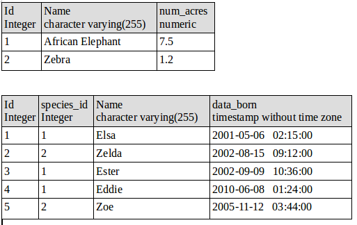

As you can see we have two tables. One is species and the other ios named animal. Each table has a primary key. After all two animals might have the same name but they cannot have the same ID. In this case the primary is just one column in some situations it is a combination of columns. For example, a student identifier and year might be a key.

## Writing Basic SQL Statements
The only thing you need to know for SQL in the exam is that there are 4 types of statements for working with data in tables. Pay attention to the first word of each:

INSERT: Add a new row to the table
SELECT: Retrieve data from the table
UPDATE: Change zero or more rows in the table
DELETE: Remove zero or more rows from the table

That's it. You are not expected to determine if SQL statements are correct. You are not expected to spot syntax errors in SQL statements. You are not expected to write SQL statements. As far as the exam is concerned, joining two tables is a concept that doesn't exist.
Unlike Java, SQL keywords are case insensitive. This means select, SELECT, and Select are all equivalent. Most people use uppercase for the database so that they stand out. It is also common practice to use underscore to separate "words" in column names. We follow these conventions. Now it's time to write some code.

SQL has a number of types. Most are self explanatory like INTEGER, TIMESTAMP. There is also DECIMAL which is like a double in Java. The strangest one is VARCHAR, standing for "variable character" which is like a String in Java. The variable part means that the database should only use as much as it needs to store the value. 
The INSERT statement is usually used to create one new row in a table, for example:

```
INSERT INTO species VALUES (3, 'Asian Elephant', 7.5);
```

If there are two rows in the table before this command is run, then there are three afterwards. The INSERT statement lists the values that we want to insert. By default, it uses the same order in which the columns were defined, String data is enclosed in single quotes.

The SELECT statement reads data from the table.
```
SELECT * FROM species WHERE ID = 3;
```
The WHERE clause is optional. If you omit, the contents of the entire table are returned. The * indicates to return all of the columns in the order in which they are defined. Alternatively, you can list out the columns that you want returned:
```
SELECT name, num_acres FROM species WHERE ID = 3;
```
it is preferable to list the column names for clarity. It also helps if table changes in the database. 

You can also get information about the whole result without returning individual rows using special SQL functions:

```
SELECT COUNT(*), SUM(num_acres) FROM species;
```
This query tells us how many species we have and how much space we need for them. It returns only one row since it is combining information. Even if there are no rows in the table, the query returns one row that contains zero as the answer. 

The UPDATE statement changes one or more rows in the database:

```
UPDATE species SET num_acres = num_acres + .5 WHERE name = 'Asian Elephant';
```

Again, the WHERE clause is optional. If it is omitted, all rows in the table will be updated. The UPDATE statement always specifies the table to update and the column to update.

The DELETE statement deletes one or more rows in the database:

```
DELETE FORM species WHERE name = 'Asian Elephant';
```

And yet again, the WHERE clause is optional. If it is omitted, the entire table will be emptied. So be careful! All of the SQL shown in this section is common across the database. 

# Introducing the Interfaces of JDBC
For the exam you need to know four key interfaces of JDBC. The interfaces are declared in the JDK. This is just like all of the other interfaces and classes that you have seen in this book. List is in the JDK, Path is in the JDK and so forth.

As you know, interfaces need a concrete class to implement them in order to be useful. These concrete classes come from the JDBC driver. Each database has a different JAR file with these classes. For example. PostgreSQL's JAR is called somthing like ```postgresql-9.4-1201-jdbc4.jar``` Whereas MySQL's JAR is called something like ```mysql-connector-java-5.1.36.jar``` The exact name depends on the version of the driver JAR. This driver JAR contqains an implementation of these key interfaces alonmg with a number of others. The key is that the provided implementation know how to communicate with a database. There are different types of drives: luckily, you don't need to know about this for the exam.

The figure below shows four key interfaces that you need to know. It also shows that the implementation is provided by an imaginary Foo driver JAR. They cleverly stick the name Foo in all classes.

You have probably noticed that we didn't tell you what the implementing classes are called in any real database. The main point is that you shouldn't know. With JDBC, you use only interfaces in your code and never implementation classes directly. In fact they might not even be public classes.

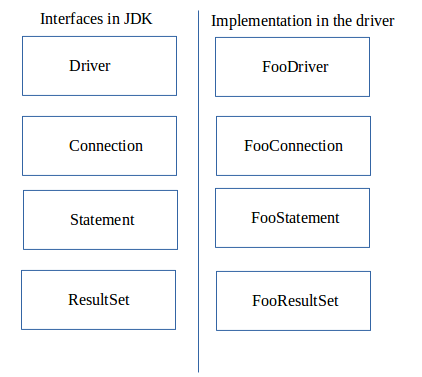

What do these four interfaces do? On a very high level, we have the following:

Driver: Knows how to get a connection to the database
Connection: Knows how to communicate with the database
Statement: Knows how to run the SQL
ResultSet: knows what was retruned by a SELECT query

All database classes are in the package ```java.sql``` so will omit the imports going foward.

In thisnext example, we show you what JDBC code looks like end to end. If you are new to JDBC, just notice that three of the four interfaces are in the code. If you are experienced, this is what JDBC looks like accoridng to the OCP exam. Yes we know - you wouldn't and shouldn't write code like this. We wouldn't either. It's OK. Grumblr to yourself and it out of your system.

```java
package com.wiley.ocp.connection;

import java.sql.*;

public class MyFirstDatabaseConnection{
  public static void main(String[] args){
    String url = "jdbc:derby:zoo";
    try(Connection conn = DriverManager.getConnection(url);
        Statement stmt = conn.createStatement();
        ResultSet rs = stmt.executeQuery("select name from animal")){
    
        while(rs.next()){
          System.out.println(rs.getString(1));
        }
    }
  }
}

```

If the URL were using our imaginary Foo driver, DriverManager would return an instance of FooConnection. Calling createStatement() would return an instance of FooStatement, and calling executeQuery() would return an instance FooResultSet. Since the URL uses derby instead, it returns the implementations that derby has provided for these interfaces. You don't need to know their names. In the rest of the chpater, we will explain hoto use all four of the interfaces and go into more detail about what they do. By the end of the chapter, you will be writting code like this yourself.

# Connecting to a Database
The first step in doing anything with a database is connecting to it. First we will show you how toi build the JDBC URL. Then we will show yuu how the exam wants you to get a Connection to the database.

## Building a JDBC URL
To access a website, you need to know the URl if the website.To access you emails, you need to know username and passwprd. JDBC is no different. In order to access a database, you need to know this information about it. Unlike web urls, JDBC URL has a variety of formats. They have three parts in common, as shown in figure below. There are three if you can count third one as beign in commmon, The first piece is always the same. It is the protocol jdbc. The secodn part is the name of the database such as derby, mysql or postgres. The third part is the rest of it, which is database specific format. Colons separate the three parts.

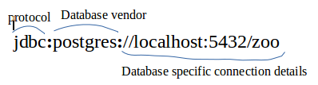

The third part typically contains the location and the name of the database. The syntax varies. You need to know about the three main parts. You don't need to memorize the vendor specific part. Phew! You've already seen one such URL:

```
jdbc:derby:zoo
```

Notice the three parts. It starts with jdbc, then comes derby and it ends with the database name. Other examples are shown here:

```
jdbc:postgres://localhost/zoo

jdbc:oracle:thin:@123.123.123.123:1521:zoo

jdbc:mysql://localhost:3306/zoo?profileSQL=true
```

You can see that each of these begin with jdbc, followed by a colon, and then followed by the vendor/product name. After that it varies. Notice how all of them include the location of the datbase, which are localhost, 123.123.123.123:1521 and localhost:3306, respectively. Also notice that the port is optional when using the default. Finally, notice that all of them include the name of the datbase, which is zoo.
To make sure you get this, do you see what is wrong with each of the following?

```
jdbc:postgresql://local/zoo

jdbc:mysql://1234567/zoo

jdbc;oracle;this;/lcoalhost/zoo
```

The first one uses local instead of localhost. Localhost is a specially defined name. You can't just make up a name. Granted it is possible for ourserver to be named local, but the exam will not have you assume names. If the database has a special name, the question will let you know. The second one says that the location of the database is 123456. This doesn't make sence. A localtion can be localhost or a IP address or a domain name. It can't be any random number. The third one is no good because it uses semicolons instead of colons.
In some databases, you use an alias rather than the database name. For the purpose of the exam, consider the alias to be logical database name.

## Getting a Database Connection
There are two main ways to get a Connection: DriverManager or DataSource. DriverManager is the one covered on the exam. Do not use a DriverManager in code someone is paying you to write. A DataSource is a factory, and it has more features than DriverManager. For example, it can pool connections or store the database connection info outside the application.

The DriverManager class is in JDK, as it is an API that comes with Java. It uses the factory pattern, which means that you call static method to get a Connection. As you learned in Chapter 2, "Design Patterns and Principles" the factory pattern means that you can get any implementation on the interface when calling the method. The good news is that the method has an easy-to-remember name - getConnection(). To get a connection form the embedded database, you write the following: 

```
import java.sql.*;

public class TestConnect{
  public static void main(String[] args) throws SqlException{
    Connection conn = DriverManager.getConnection("jdbc:derby:zoo");
    System.out.println(conn);
  }
}
```
Running this example as java TestConnect will give you an error that begins with this:

```
Exception in thread "main" java.sql.SQLException: No suitable driver found for jdbc:derby:zoo 
```

The class SQLException means "something went wrong when connecting to or accessing the database". In this case, we didn't tell java where to find the database driver JAR file. Remeber that the implementation class for Connection is found inside a driver JAR. We try this again by adding the classpath with ```java -cp <java_home>/db/lib/derby.jar``` TestConnect. Remember to substitute the location of where Java is installed on your computer for "java_home". (If you are on Windows, replace the colon woth semicolon) This time the program runs successfully and prints something like the following:
```
org.aparache.derby.impl.jdbc.EmbeddedConnection40@1377654657
(XID = 156), (SESSIONID = 1), (DATABASE = zoo), (DRDAID = null)
```

The details of the output arent important. Just notice that the class is not Conneciton. It is a vendor implementation of Connection. There is also a signature that takes a suername and password:

```java
import java.sql.*;

public class TestExternal{
  public static void main(String[] args) throws SQLException{
    Connection conn = DriverManager.getConnection(
      "jdbc:postgresql://localhost:5432/ocp-book",
      "username",
      "password");
      
    System.out.println(conn);
  }
}

```

Notice the three params that are passed to getConnection(). The first is the JDBC URL that you learned about in the previous section. The second is the username for accessing the database, and the third is the password for accessing the database. It should go without saying that our password is not "password". Also, don't put your password in real code. It is horrible practice and Oracle should not be encouraging.

This time, now that we have included the drived file, the pogram rins successfully and prints something like this:

```
org.postgresql.jdbc4.Jdbc4Connection@eed1f14
```

Again, notice that it is driver-specific implementation class. You can tell from the package name. Since the package is org.postgresql.jdbc4, it is part of the PostgresSQL driver. The command line tells Java where to find the driver JAR. It also includes the current directory so Java can find TestConnect itself!

Unless the exam specifies a command line, you can assume the the correct JDBC driver JAR is in the classpath. The exam creators explicitly ask about the driver JAR if they want you to think about it.

The nice thing about a factory is that it takes care of the logic of creating a class for you. You don't need to know the name of the class that implements Connection, and you don't need to know it is created. You are probably a bit curious, though.

The DriverManager class looks through the classpath for JARs that contains a Driver. DriverManager knows that a JAR is a driver because it contains a file called java.sql.Driver in the directory META-INF/services. In other words, a driver might contain this information: 

META-INF
-service
-java.sql.Driver
com
-wiley
-MyDriver.class

Inside the java.sql.Driver file is one line. If it is a fully qualified package name of the Driver implementation class. Remember thouse four key interfaces? Driver is the first one. DriverManager then looks through any driver it can find to see if they can handle the JDBC URL. If so, it creates a Connection using that Driver. If not it gives up and throws a SQLException.

**Real World Scenario** Using a DataSource. In real applications you should use a DataSource rather than a DriverManager to get a Connection. For one thing, there is no reason why you should have to know the database password. It's far better if the database team or another team can set up a data source that you can reference. Another reason is thta a DataSource mantains a connection pool so that you can keep reusing the same connection rather than needing to get a new one each time. Even the JavaDoc says DataSource is preferred over DriverManager. But DriverManager is in the exam objectives, so you still have to know it.

You might see Class.forName() used in older code before getting a Connection. It looks like this:

```
public static void main(String[] args) throws SQLException, ClassNotFoundException{
  Class.forName("org.posgressql.Driver");
  Connection conn = DriverManager.getConnection(
    "jdbc:postgresql://localhost:5432/ocp-book",
    "username",
    "password");
}

```
Class.forName() loads a class. This lets DriverManager use a Driver, even if the JAR doesn't have META-INF/services/java.sql.Driver file. There is no harm in including Class.forName(), even if the newer driver doesn't have a file. When Class.forName() is used, the error about an invalid class occurs on that line and throws a ClassNotFoundExpection:

```
public static void main(String[] args) throws ClassNotFoundException{
  Class.forName("not.a.driver");
}

```

Obviosuly, this is not a valid driver name. The output begins with the following code:

```
Exception in thread "main" java.lang.ClassNotFoundExpection: not.a.driver
...

```
Having a META-INF/service/java.sql.Driver inside the JAR became mandatory with JDBC 4.0 in Java 6. Before that, some drivers included it and some didn't. Table below sums up the current state of affairs:

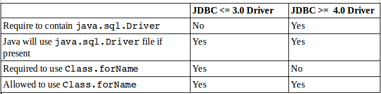

# Obtaining a Statement
In order to run SQL, you need to tell a Statement about it. Getting a Statement from a Connection is easy:

```
Statement stmt = conn.createStatement();
```

As you will remember, Statement is one of the four core interfaces on the exam. It represents a SQL statement that you want to run using the Connection.
That's the simple signature. There's another one that you need to know before the exam:

```
Statement stat = conn.createStatement(ResultSet.TYPE_FORWARD_ONLY, ResultSet.CONCUR_READ_ONLY);
```
This signature takes two paramenter. The first is the ResultSet type, and the other is the ResultSet concurrency mode. You have to know all of the choices for these parameters and the order in which they are specified. Let's look at the choices for these parameters.

## Choosing a ResultSet Type
Bydefault, a ResultSet is in TYPE_FORWARD_ONLY mode. This is what you need most of the time. You can go through the data once in the order in which it was retrieved. The two other types are TYPE_SCROLL_INSENSITIVE and TYPE_SCROLL_SENSITIVE. Both allow you go through the data in any order. You can go forward and backward. You can even go to a specific spot in the data. Think of these like scrolling in a browser. You can scroll up and down. You can go to a specific spot in the result.
The difference between this scroll types is what happens when data changes in the actual database while you are busy scrolling. With TYPE_SCROLL_INSENSITIVE, you have a static view of what the resultSet looked like when you did the query. If the data changed in the table, you will see it as it was when you did the query. With TYPE_SCROLL_SENSITIVE, you would see the latest data when scrolling through the ResultSet. 

Note that you have to know forward only and scroll insensitive in detail for the exam. For scroll sentive, you only have to know the name and that it isn't well supported. You don't need to read or write code with it.

We say "would" because most databases and database drivers don't actually support the TYPE_SCROLL_SENSITIVE mode. That's right. You have to learn something for the exam that you are almost guaranteed never to use in practice.

If the type you request isn't available, the driver can "helpfully" downgrade to one that is. This means that if you ask for TYPE_SCROLL_SENSITIVE, you will likely get a Statement that is TYPE_SCROLL_INSENSITIVE. Isn't that great? 

Table below sumps up what you need to know about the ResultSet types.

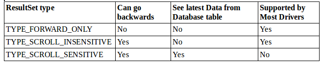


## Choosing a ResultSet Concurrency Mode
By default, a ResultSet is in CONCUR_READ_ONLY mode. This is what you need most of the time. It means that you can't update the result set. Most of the time, you will use INSERT, UPDATE or DELETE SQL statements to change the database rather than a ResultSet.

There is one other mode that you can request when creating a Statement. Unsurprisingly, it lets you modify the database through the ResultSet. It is called CONCUR_UPDATABLE.

Note that you have to know read only mode in detail for the exam. For updatable, you only have to know the name and that it is not universally supported.

Databases and JDBC drivers are not required to support CONCUR_UPDATABLE. Unlike TYPE_SCROLL_SENSITIVE, an updatable result set is at least used on rare occasions. Most of the time, it is the wrong choice for your program, though.
Again, if the mode you request isn't available, the driver can downgrade you. This means that if you ask for CONCUR_UPDATABLE, you will likely get a statement that is CONCUR_READ_ONLY.

The table below sums up what you need to know about the result set concurrency modes:

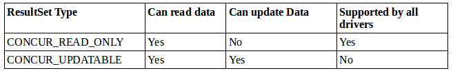

# Executing a Statement
Now that we have a Statement, we can run a SQL statement. The way you run SQL varies depending on what kind of SQL it is. Remember that you arent expected to be able to read SQL, but you do need to know what the first keyword means.
Let's start out with statements that change the data in a table. That would be SQL statements that begin with DELETE, INSERT, or UPDATE. They typically use a method called executeUpdate(). The name is a little tricky because SQL UPDATE statement is not the only statement that uses this method. The method takes the SQL statetement to run as a parameter. It returns the number of rows that were inserted, deleted, or changed. Here's an example ofall three update types:

```java
Statement stat = conn.createStatement();
int result = stat.executeUpdate(
  "insert into species values(10,'Deer',3)");
System.out.println(result);   // 1

result = stat.executeUpdate(
  "update species set name = '' where name = 'None'");
System.out.println(result);   // 0

result = stat.executeUpdate(
  "delete from species where id = 10");
System.out.println(result);   // 1
```

For the exam, you dont need to read SQL. The question will tell you how many rows are affected if you need to know. Second line runs an statement to insert one row. Therefore the results returns 1 because one row was affected. Line 6 checks the whole table, but no records match therefore returns 0. Line 10 deletes the row created on line 2. Again one row is affected, so the result is 1.

Next, let's look at a SQL statement that begins with SELECT. This time, we use the **executeQuery()** method as opposed to before where we used the **executeUpdate()**:

```java
ResultSet rs = stat.executeQuery("select * from species");
```

Since we are running query to get a result, the return type is ResultSet. In the next section, we will show you how to process the ResultSet. There is a thrird method called **execute()** that can run either a query or an update. It returns a boolean so that we know whether thre is a result set. That way, we can call the proper method to get more detail. The pattern looks like ths:

```java
boolean isResultSet = stat.execute(sql);
if(isResultSet){
  ResultSet rs = stat.getResultSet();
  System.out.println("ran a query");
}else{
  int result = stat.getUpdateCount();
  System.out.println("ran an update");
}
```

If sql is a SELECT, the boolean is true and we can get the ResultSet. If it is not a SELECT, we can get the number of rows updated.

**Importance of a PreparedStatement** on the exam, only the Statement is covered. In real life you should not use it directly. You should use the subclass called PreparedStatement. This subclass has three advantages: performance, security, readability.

- Performance: in most programs you run similar queries multiple times. A PreaparedStatement figures out a plan to run the SQL well and remembers it.
- Readability: it is nice not to have to deal with string concatenation in building a query string with lots of variables.
- Security: Suppose you have this method.

  ```
  private static void scaryDelete(Connection conn, String name) throws SQLException{
    Statement stat = conn. createStatement();
    String sql = "delete from animal where name = '" + name + "'";
    System.out.println(sql);
    stat.executeUpdate(sql);
  }
  
  ```

This method appears to delete the row that matches the given name. Imagine that this program lets a user type in the name. If the users string is "Asia Elephant" this works out well and one row get deleted. What happens if the users string is "any or 1 = 1 or name = 'any'" the generated sql is

```
delete from animal where name = 'any' or 1 = 1 or name = 'any'
```

This deletes every row in the table. That is not good. In fact it so bad that it has a name - SQL injections. Upon first glance, the solution is to prevent single quotes in the user's input. It turns out to be more complicated than that because the bad guys know many ways of doing bad things. Luckily, you can just write this:

```java
PreparedStatement ps = conn.preparedStatement("delete from animal where name = ?");
ps.setString(1, name);
ps.execute();
```

The JDBC driver takes care of all the scaping for you. This is convenient.

What do you think happens if we use the wrong method for SQL statement? Let's take a look:
```
Connection conn = DriverManager.getConnection("jdbc:derby:zoo");
Statement stat = conn.createStatement();
int result = stat.executeUpdate("select * from animal");
```

This throws a SQLException similar to the following:
```
A result was returned when none was expected
```

We can't get a compiler error since the SQL is a string. We can get an exception, though, and we do. We also get a SQLException when using executeQuery() with SQL that changes the database:

```
No results were returned by the query
```

Again, we get an exception because the driver can't translate the query into the expected return type. To review make usre that you know the tables below. 

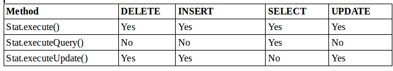

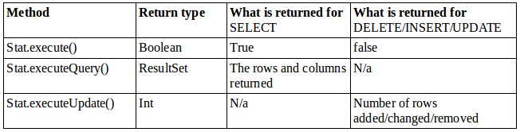

# Getting Data from a ResultSet
By far the most common type of a result set is of type forward-only. We will start by showing you how to get the data from one of these. Then after going through the different methods to get a columns by type, we will show you how to work with a scrollable ResultSet. 

## Reading a ResultSet
When working with a forward-only ResultSet most of the time you will write a loop to look at each row. The code looks like this:

```java
Map<Integer,String> idToNameMap = new HashMap();
ResultSet rs = stat.executeQuery("select id, name from species");
while(rs.next()){
  int id = rs.getInt("id");
  String name = rs.getString("name");
  idToNameMap.put(id, name);
}
System.out.println(idToNameMap);    //{1=African Elephant, 2=Zebra}

```
There are few things to notice here. First, we use the executeQuery() method on line 2, since we want a result set to be returned. On line 3 we looop through the results. Each time through the loop represents one row in the result set. Line 4 and 5 show you the bets way to get the column for a given row. A result set has a cursor, which points to the current location in the data. The cursor advances past the end of the data, The false signifies that there is no data available to get.

There is another way to access the columns. You can use an index instead of a column name. The column name is better because it is clearer what is going on when reading the code. It also allows you to change the SQL to reorder the columns. Rewriting this same example with column numbers looks like the following:

```java
Map<Integer,String> idToNameMap = new HashMap<>();
ResultSet rs = stat.executeQuery("select id, name from especies");
while(rs.next){
  int id = rs.getInt(1);
  String name = rs.getString(2);
  idToNameMap.put(id,name);
}
System.out.println(idToNameMap);   //{1=African Elephant, 2=Zebra}
```
This time, you can see the column positions in lines 4 and 5. Notice how the columns are counted starting with 1 rather than 0. This is really important, so we will repeat it.

Note that JDBC starts counting with one rather than zero.

Sometimes you want to get only one row from the table. Maybe you need only one piece of data. Or maybe the SQL is just returning the number of rows in the table. When you want only one row, you can use if statement rather than a while loop.

```java
ResultSet rs = stat.executeQuery("select count(*) from animal");
if(rs.next()){
  System.out.println(rs.getInt(1));
}
```
It is very imprtant that rs.next() returns true before trying to call a getter on the ResultSet. Than would throw a SQLException, so the if statement checks that it is safe to call. Alternatively, you can use the column name:

```java
ResultSet rs = stat.executeQuery("select count(*) from animal");
if(rs.next()){
  System.out.println(rs.getInt("count"));
}
```

The following code throws a SQLException:

```
int id = rs.getInt(0);    //BAD CODE
```

Attempting to access a column that does not exist throws a SQlException, as does getting data from a resultSet when it isn't pointing at a valid row. You need to be able to recognize such code. Here a few examples to watch out for. Do you see what is wrong here when no rows match?

```java
ResultSet rs = stat.executeQuery(
  "select * from animal where name = 'Not in table'");
rs.next();
rs.getInt(1);     //throws SQLException

```

Calling rs.next() works. It returns false. However calling a getter after does throw a SQLException because the result set cursor does not point to a valid position. If there actually were a macth returned, this code would have worked. Do you see what is wrong with the following?

```java
ResultSet rs = stat.executeQuery("select count(*) from animal");
rs.getInt(1);   //throws SQLException
```

This is not calling rs.next() at all is the problem. The result set cursor is still pointing to a location before the first row, so the getter has nothing to point to. How about this one?

```java
ResultSet rs = stat.executeQuery("select count(*) from animal");
rs.next();
rs.getInt(0);  //throws SQLException

```

Since column indexes begin with 1, there is no column 0 to point to and a SQLException is thrown. One more try, what is wrong with this one?

```java
ResultSet rs = stat.executeQuery("select count(*) from animal");
rs.next();
rs.getInt("badColumn");  //throws SQLException
```

Trying to get a column that isn't in the ResultSet is just as invalid column incex, adn it also throws a SQLException. To sum up this section, it is very important to remember the following:
- Always use an if statement or while loop when calling rs.next();
- column indexes begin with 1

## Getting Data for a Column
There are lost of getsomething() methods on the ResultSet interface. The ones that you need to know for the exam are easy to remeber since they are called get, followed by the name of the type you are getting. Table below shows the get method that you need to know. The first column shows the method name, and the second column shows the type that Java returns. The third column shows the method name, and the secod column shows the type that Java returns. The third column shows the type name that could be in the database. There is some variations by databases, so check your specific database documentation. You need to know only the first two columns for the exam.

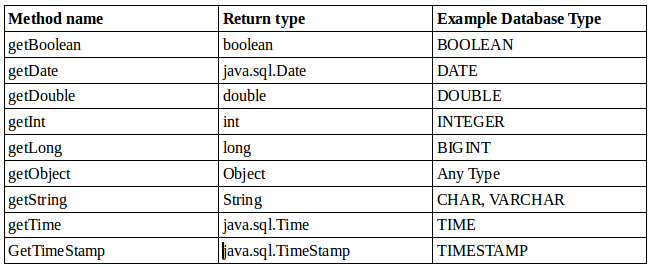

You might have noticed that not all the primitives are in the table. There are getByte and getFloat methods, but you don't need to know about them for the exam. There is no getChar method. Luckily you dont need to remember this. The exam it is not going to trick you with a method name that does not exis for JDBC. That takes care of the primitives. What about the other data types? In the database, we have the data/time of birth of one of our animals as 2001-05-06 02:15. Let's look at the three ways to get pieces of this information. First, we want to know what date Elsa the elephant was born:

```java
ResultSet rs = stat.executeQuery("select date_born from animal where name = 'Elsa'");
if(rs.next()){
  java.sql.Date sqlDate = rs.getDate(1);
  LocalDate localDate = sqlDate.toLocalDate();
  System.out.println(localDate);    //2001-05-06
}
```

When cancelling getDate, JDBC returns just the date part of the value. This is the year, month, and date. It returns a java.sql.Date object. This is an older class, but Java 8 adds a method to convert it to the new LocalDate type.

Now we want to know what time of the day Elsa was born:

```java
ResultSet rs = stat.executeQuery("select date_born from animal where name = 'Elsa'");
if(rs.next()){
  java.sql.Time sqlDate = rs.getTime(1);
  LocalTime localTime = sqlDate.toLocalTime();
  System.out.println(localTime);    //02:15
}
``` 

When calling getTime() JDBC returns just the time part of the value. This is the hours and minutes. It also optionally includes more granular pieces like seconds.Finally, let's suppose that we want to know both the date and time where Elsa was born:

```java
ResultSet rs = stat.executeQuery("select date_born from animal where name = 'Elsa'");
if(rs.next()){
  java.sql.TimeStamp sqlTimeStamp = rs.getTimeStamp(1);
  LocalDateTime localDateTime = sqlTimeStamp.toLocalDateTime();
  System.out.println(sqlTimeStamp);    //2001-05-06T02:15
}
``` 

All three of these values came from the same column in the database. Table below reviews this mapping:

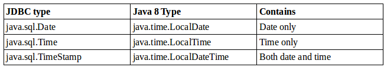

Finally the getObject() method can return any type. For a primitive, it uses the wrapper class. Let's look at an example:

```java
ResultSet rs = stat.executeQuery("select id, name fro species");
while(rs.next()){
  Object idField = rs.getObject("id");
  Object nameField = rs.getObject("name");
  
  if(idField instanceof Integer){
    int id = (Integer) idField;
    System.out.println(id);
  }
  
  if(nameField instanceof String){
    String name = (String) nmaeField;
    System.out.println(name);
  }
 
}

```
The fiest two lines get the column as whatever type of Object is most appropariate. The first if condition show how to confirm that the type is Integer before casting and unboxing it into an int. The second if condition show how to confirm that the type is String and cast it as well. You probably will not use getObject() when writting code for a job, but it is good to know about it for the exam.

## Scrolling ResultSet
A scrollable ResultSet allows you to position the cursor at any row. In this section, we will show you the options for doing so. You have already learnet the next() method. There is also a previous method, which does the opposite. It moves backwards one row and returns true if pointing to a valid row of data. There are also methods to start at the beginning and end of the ResultSet. The first() and last() methods return a boolean for whether they were successful at finding a row. The beforeFirst() and afterLast() methods have a return type of void, since it is always possible to get to a spot that doesn't have data. Figure below show these methods. You can see that beforeFirst() and afterLast() don't point to rows in the ResultSet.

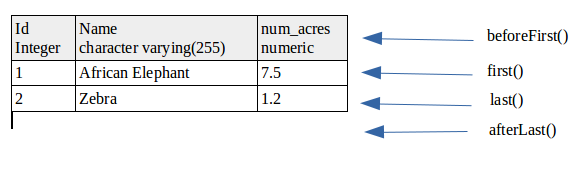

Ready to see methods in action?

```java
Statement stat = conn.createStatement(
  ResultSet.TYPE_SCROLL_INSENSITIVE,
  ResultSet.CONCUR_READ_ONLY);
ResultSet rs = stat.executeQuery("select id from species order by id");
rs.afterLast();
System.out.println(rs.previous());     //true
System.out.println(rs.getInt());       //2
System.out.println(rs.previous());     //true
System.out.println(rs.getInt(1));      //1
System.out.println(rs.last());         //true
System.out.println(rs.getInt(1));      //2
System.out.println(rs.first());        //true
System.out.println(rs.getInt(1));      //1
rs.beforeFirst();
System.out.println(rs.getInt(1));       // throws SQLException

```

The type of statement that we created above was of scrollable type so that we can call these extra methods. Make sure the type is scrollable whenever you see methods other than next(). 

Now look at an example where the query does not return any rows:

```java
Statement stat = conn.createStatement(
  ResultSet.TYPE_SCROLL_INSENSITIVE,
  ResultSet.CONCUR_READ_ONLY);
ResultSet rs = stat.executeQuery("select id from species where id = -99") ;
System.out.println(rs.first());   //false
System.out.println(rs.last());    //false

```

When the cursors moves to the "first" or "last" row, the method returns false. There aren't any rows, which makes it impossible to point to a row of data. Another method that you need to know is absolute(). It takes the row numer to which you want to move the cursor as a parameter. A positive number moves the cursor to that numbered row. Zero moves the cursor to a location immediately before the first row. Figure below shows the row numbers starting from zero.

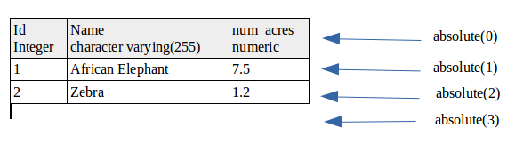

A negative number means to start counting from the end of the result set rather than fro the begining. The fifure below shows negative row numbers.

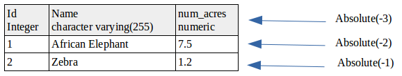

You can see that -1 is the last row. To better understand absolute(), we will use the data in the figure below.


Try to follow along with this code examples:

```java
Statement stat = conn.createStatement(
  ResultSet.TYPE_SCROLL_INSENSITIVE,
  ResultSet.CONCUR_READ_ONLY);
ResultSet rs = stat.executeQuery("select id from animal order by id");
System.out.println(rs.absolute(2));             //true
System.out.println(rs.getString("id"));         //2
System.out.println(rs.absolute(0));             //false
System.out.println(rs.absolute(5));             //true
System.out.println(rs.getString("id"));         //5
System.out.println(rs.absolute(-2));            //true
System.out.println(rs.getString("id"));         //4

```

absolute(0) puts the cursor before the result set, so it resturns false.

Finally there is a relative() method that moves forward or backward the requested number of rows. It returns a boolean if the cursor is pointing to a row with data, Here is an example:

```java
Statement stat = conn.createStatement(
  ResultSet.TYPE_SCROLL_INSENSITIVE,
  ResultSet.CONCUR_READ_ONLY);
ResultSet rs = stat.executeQuery("select id from animal order by id");
System.out.println(rs.next());                  //true
System.out.println(rs.getString("id"));         //1
System.out.println(rs.relative(2));             //true
System.out.println(rs.getString("id"));         //3
System.out.println(rs.relative(-1));            //true
System.out.println(rs.getString("id"));         //2
System.out.println(rs.relative(4));             //false

```

The first relative(2) moves the cursor two rows  and relative(-1) moves the cursor back to row 2. relative(4) tries to move forward 4 lines which will position the cursor by row 6. There is no row 6, so this is just after the last row. Since there are no row 6, the method returns false. 

To review the methods that you can use when traversing a ResultSet are listed in the table below:

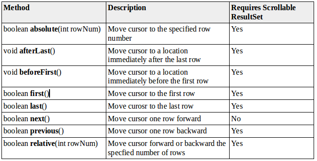

# Closing Database Resources
As you saw in prevoius chaperts 8 and 9 it is important to close resources when you are finished with them. This is true for JDBC as well. JDBC resources, such as a Connection are expensive to create. Not closing them creates a resource leak that will eventually slow down your program.

Repeating the example from earlier in the Chapter, we have the following:

```java
public static void main(Stirng[] args) throws SQLException{
  String url = " jdbc:derby:zoo";
  try(Connection conn = DriverManager.getConnection(url);
      Statement stat = conn.createStatement();
      ResultSet rs = stat.executeQuery("select name from animal")){
      
      while(rs.next()){
        System.out.println(rs.getString(1));
      }
  }
}

```

Notice how this code uses the try-with-resources syntax from chapter 6. Remember that try-with-resources statement closes the resources in the reverse order from which they were opened. This means that the ResultSet is closed first followed by the statement, and then the Connection. This is the standard order to close resources.

**Closing Database resources without try-with-resources statements*** Prior to java 7, you had to write a lot of code to close the JDBC resources properly. It looked like this:

```java
public static void main(String[] args) throws SQLException{
  String url = "jdbc:derby:zoo";
  Connection conn = null;
  Statement stat = null;
  ResultSet rs = null;
  try{
    conn = DriverManager.getConnection(url);
    stat = conn.createStatement();
    rs = stat.executeQuery("select name from animal");
    while(rs.next()){
      System.out.println(rs.getString(1));
    }finally{
      closeResultSet(rs);
      closeStatement(stat);
      closeConnection(conn);
    }
  }
}

private static void closeResultSet(ResultSet rs){
   try{
    if(rs != null){
      rs.close();
    }  
   }catch(SQLException e){}
}

private static void closeStatement(Statement stat){
   try{
    if(stat ! null){
      stat.close();
    }
   }catch(SQLException e){}
}

private static void closeConnection(Connection conn){
   try{
    if(conn != null){
      conn.close();
    }
   }catch(SQLException e){}
}

```

This example closes the three resources in the same order as the Java 7 example. Each of the helper methods have a try catch that ignores any sqlException thrown on closing. This is another reason why the Java 8 example is better. It doesn't lose such exceptions, instead treating them as suppresed exceptions. The helper methods also check if the resource is null in case the variable was never set.

While it is a good habit to close all three resources, it isn't striclty necessary. Closing a JDBC resource should close any resources that it created. In particular, the following are true:
- Closing a Connection also closes the Statement and ResultSet
- Closing a Statement also closes a ResultSet.

There another way to close a result set. **JDBC automatically closes a result set when you run another SQL statement from the same Statement** How many resources are closed in this code?

```java
String url = "jdbc:derby:zoo";
try(Connection conn = DriverManager.getConnection(url);
    Statement stat = conn.createStatement();
    ResultSet rs = stat.executeQuery("select count(*) from animal")){
    
    if(rs.next()) System.out.println(rs.getInt(1));
    
    ResultSet rs2 = stat.executeQuery("selcet count(*) from animal");
    
    int num = stat.executeUpate(update animal set name = 'clear' where name = 'other'");

}

```

The correct answer is 4. On rs2 line, rs is closed because the same statement runs another query. On the last line, rs2 is closed because the same Statement runs another SQL statement. This shows you that both a query and an update cause the previous ResultSet to be closed. Then the try-with-resources statement runs and closes the statement and Connection objects. It is important to close resources iun the right order.

# Dealing with Exceptions
Up until this point in the chapter, we have lived in a perfect world. Sure we mentioned that a checked SQLException might be thrown by any JDBC method - but we never actually caught it. We just declared it and let the caller deal with it. Now let's catch the expection:

```
String url = " jdbc:derby:zoo";
try(Connection conn = DriverManager.getConnection(url);
    Statement stat = conn.createStatement();
    ResultSet rs = stat.executeQuery("select not_a_column from animal")){
    
    while(rs.next()){
      System.out.println(rs.getString(1));
    }

}catch(SQLException e){
  System.out.println(e.getMessage());
  System.out.println(e.getSQLState());
  System.out.println(e.getErrorCode());
 
}

```

The output looks like this:
```
ERROR: column "not_a_column" does not exist
  position: 8
42703
0
```
Each of these methods gives you a different piece of information. The getMessage() method returns a human-readable message as to what went wrong. The getSQLState() method returns a code as to what went wrong. You can Google the name of your database and the SQL state to get more information about the error. By comparison, getErrorCode() is a database-specific code. On this database, it doesn't do anything.

Note that on the exam, either you will be told the names of the columns in a table or you can assume that they are correct. Similarly, you can assume that all SQL is correct.

# Review Questions

Probably the easiest chapter in the book. Took me around 30 min to answer the questions.

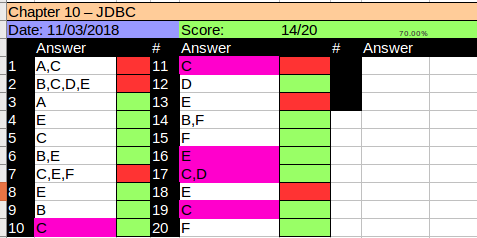

- The Driver, Connection, Statement and ResultSet interfaces are part of the JDK.The concrete DriverManager is also part of the JDK. The implementation of Driver and Statement are part of the Database-specific jars
- The JDBC URL has three parts: jdbc string, the second is the vendor/product name like mysql, oracle… The third part is the database specific, but includes database name. The location such as IP address and port are optional. 
- The JDBC URL the parts are separated by single colon and the first part is always jdbc
- A connection is created using a static method on DriverManager. It does not use a constructor
- When a statement is requested with an unsupported mode, the JDBC driver will downgrade. And no exception is thrown
- The JDBC resources should be closed in the reverse other that were created that is ResultSet, Statement and Connection
- A statement automatically closes the open result set when another sql statement is run.
- ResultSet columns are indexed with 1 not 0.
- Most of the ResultSet methods return a boolean apart from beforeFirst() and afterLast() of which are void
