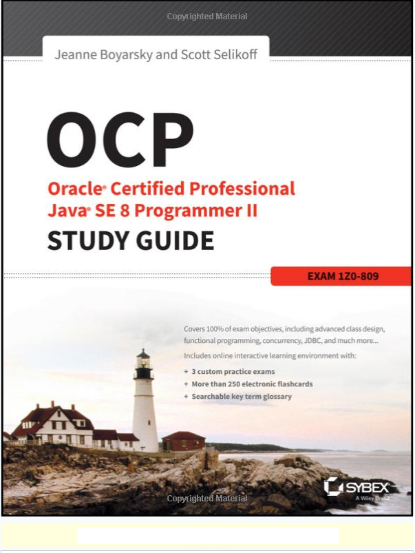

# java8-ocp-study-notes
A repository to keep track of the study guide on the OCP Java 8 book

The book I am going to cover here is the second part of the guide for Java 8 certification. The first guide covers OCA exam (which I already passed) and this guide covers OCP exam (1Z0-809 exam).

# Official Oracle documentation
https://docs.oracle.com/javase/tutorial/essential/concurrency/index.html

# Other Resources
Another guide for preparing Java 8 Programmer II exam
http://ocpj8.javastudyguide.com/

# OCA guide
My experience after reading the OCA study guide is positive and has encourage me to continue with the second part of the certification. It covers 100% of what you need to know to nail the exam but most importantly helps grasping the content in an effective way.  

# This notes
This notes are taken in order to help me learn all the topics covered in the book and to keep them somewhere safe and with a nice formating. There might be code snippets and solutions to arbitrary questions. Please bear in mind the notes are mainly for miself and that there will be typos.   

# Content
Chapter 1 - Advanded Class Design

Chapter 2 - Design Pattern and Principles

Chapter 3 - Generics and Collections

Chapter 4 - Functional Programming

Chapter 5 - Dates, Strings, and Localization

Chapter 6 - Exceptions and Assertions

Chapter 7 - Concurrency

Chapter 8 - IO

Chapter 9 - NIO.2

Chapter 10 - JDBC

# Review Questions

At the end of each chapter I am going to take the test and publish the results. You may notice that the attached pictures show some colour coding:
- Green if I answerd correctly
- Red if I answered wrong
- Pink if I found the question interesting, tricky, worth to refer back.

